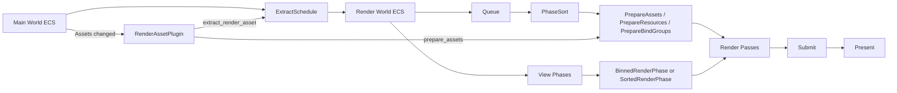

# Bevy 0.19 的 3D 教程草稿

## 执行摘要

本文按“**3D 基础知识 → 具体例子与代码 → 3D 渲染系统**”的顺序，面向**已有 Rust 基础、想系统学习 Bevy 3D 的开发者**，整理一份可以直接发布为技术博客或教学文档的中文教程草稿。全文以 **Bevy 0.19** 为版本基准，优先检索并交叉核对了 **bevy.org** 与 **github.com/bevyengine/bevy** 上的迁移指南、官方示例与核心源码；在讲自定义材质、渲染阶段、资源提取与上传时，也参考了官方 API 文档来确认类型、组件与系统集名称。需要特别提醒的是，0.19 在渲染扩展接口上有一个很大的思路变化：**旧的、面向用户的 `RenderGraph` 节点式扩展 API 已被移除，渲染通道更强调通过系统与调度集来组织；但在内部实现上，渲染子应用仍然保留了一个名为 `renderer::RenderGraph` 的根调度标签，用来驱动每帧的 Begin / Render / Submit / Finish 流程**。这是一处最容易混淆、也最需要按“迁移指南 + 源码”联合理解的地方。

从 API 风格上说，如果你是从较旧版本或旧教程迁移过来，最先碰到的变化通常不是“渲染理论”，而是**实体装配方式**：在 0.19 的官方示例里，3D 网格通常用 `Mesh3d` + `MeshMaterial3d<StandardMaterial>` 直接挂到实体上，相机直接放 `Camera3d`，灯光也直接放 `PointLight` / `SpotLight` / `DirectionalLight` 组件，而不是依赖“老一代 bundle 写法”去包一切；自定义材质则通过 `MaterialPlugin<T>`、`AsBindGroup`、WGSL 与可选的 `specialize` / `shader_defs` 来完成。官方 `3d_scene.rs`、`load_gltf.rs`、`shader_material.rs`、`shader_defs.rs` 与 `automatic_instancing.rs` 已经把这些 0.19 风格展示得非常清楚。

从学习路径上，建议把 Bevy 3D 理解成三层。第一层是通用图形学基本功：坐标系、变换、投影、光照、材质、网格、法线、UV、剔除、LOD 与渲染阶段。第二层是“能跑起来”的应用层代码：先搭一个基础场景，再加载 glTF，再做一个自定义材质，最后开始看自动实例化、可见性范围、遮挡剔除、批处理这类真正会影响中大型场景帧率的手段。第三层才是 Bevy 0.19 的渲染子应用：主世界与渲染世界分离，`ExtractSchedule` 做提取，`RenderSystems` 负责 Queue / PhaseSort / Prepare / Render / Cleanup，`RenderAssetPlugin` 负责把 CPU 侧资产变成 GPU 侧表示，`RenderQueue` 负责把命令异步送给 GPU，而可选的 `PipelinedRenderingPlugin` 则可以把渲染线程和模拟线程并起来。

本文的结论很简单：**如果你的目标是“能写 Bevy 0.19 的 3D 项目”，不要先死磕底层源码；先掌握 Mesh3d / MeshMaterial3d、Camera3d、StandardMaterial、glTF 场景加载、自定义材质、VisibilityRange、OcclusionCulling 这些“表层 API”，再回头读 `bevy_render` 的 `extract_plugin.rs`、`render_asset.rs`、`render_phase/mod.rs`、`renderer/mod.rs`，理解 Bevy 为什么这样设计。**这样学，最快，也最不容易被版本变更打断。

## 教程目标与检索范围

本文默认读者是**有 Rust 基础、想学习 Bevy 3D 的开发者**，并接受你给出的假设：使用最新 stable Rust；未指定操作系统或 GPU，因此示例不绑定任何单一平台。Bevy 官方仓库也明确说明，Bevy 可以在 stable Rust 上正常构建。

在资料优先级上，本文先覆盖了你指定的两个优先站点：**`github.com`** 与 **`bevy.org`**。其中，`bevy.org` 主要用于确认**迁移指南、官方在线示例与面向用户的版本说明**；`github.com/bevyengine/bevy` 主要用于确认**0.19 标签下的官方示例源码与 `bevy_render` / `bevy_pbr` 的真实实现路径**。在这些站点覆盖之后，才少量补充了官方 API 文档页面，用来确认结构体、模块与系统集名称。

下面是**本文实际使用过**的两类优先来源 URL。按你的要求，我把具体 URL 全部列出；由于需要避免正文里直接裸露 URL，这里统一放进代码块中。

### bevy.org 页面

```text
https://bevy.org/learn/migration-guides/introduction/
https://bevy.org/learn/migration-guides/0-18-to-0-19/
https://bevy.org/examples/3d-rendering/visibility-range/
https://bevy.org/examples-webgpu/3d-rendering/generate-custom-mesh/
https://bevy.org/news/
```

这些页面主要用于确认 0.19 迁移要点、官方 3D 示例说明，以及自定义网格与 UV/法线示例的在线说明。

### github.com 页面

```text
https://github.com/bevyengine/bevy/tree/v0.19.0/examples/3d
https://github.com/bevyengine/bevy/blob/v0.19.0/examples/3d/3d_scene.rs
https://github.com/bevyengine/bevy/blob/v0.19.0/examples/3d/lighting.rs
https://github.com/bevyengine/bevy/blob/v0.19.0/examples/3d/pbr.rs
https://github.com/bevyengine/bevy/blob/v0.19.0/examples/gltf/load_gltf.rs
https://github.com/bevyengine/bevy/blob/v0.19.0/examples/3d/visibility_range.rs
https://github.com/bevyengine/bevy/blob/v0.19.0/examples/3d/occlusion_culling.rs
https://github.com/bevyengine/bevy/tree/v0.19.0/examples/shader
https://github.com/bevyengine/bevy/blob/v0.19.0/examples/shader/shader_material.rs
https://github.com/bevyengine/bevy/blob/v0.19.0/examples/shader/shader_defs.rs
https://github.com/bevyengine/bevy/blob/v0.19.0/examples/shader/automatic_instancing.rs
https://github.com/bevyengine/bevy/blob/v0.19.0/assets/shaders/custom_material.wgsl
https://github.com/bevyengine/bevy/tree/v0.19.0/crates/bevy_render/src
https://github.com/bevyengine/bevy/blob/v0.19.0/crates/bevy_render/src/lib.rs
https://github.com/bevyengine/bevy/blob/v0.19.0/crates/bevy_render/src/extract_plugin.rs
https://github.com/bevyengine/bevy/blob/v0.19.0/crates/bevy_render/src/render_asset.rs
https://github.com/bevyengine/bevy/blob/v0.19.0/crates/bevy_render/src/render_phase/mod.rs
https://github.com/bevyengine/bevy/blob/v0.19.0/crates/bevy_render/src/renderer/mod.rs
https://github.com/bevyengine/bevy/blob/v0.19.0/crates/bevy_render/src/pipelined_rendering.rs
https://github.com/bevyengine/bevy/blob/v0.19.0/crates/bevy_render/src/gpu_component_array_buffer.rs
```

这些页面对应本文的四个示例、渲染调度解读与源码路径分析，是全文最重要的第一手依据。

## 从 3D 基础到 Bevy 对应概念

先把“图形学词汇”和“Bevy API 名称”对齐，后面的代码就会顺很多。下表给出一个面向 0.19 的速查版。

| 概念 | 简明定义 | Bevy 0.19 对应概念 / API | 实战提醒 |
|---|---|---|---|
| 坐标系 | Bevy 3D 默认用右手系；常见理解是 **x 向右、y 向上、z 向后**，所以“向前”通常是 **-Z**。 | `Transform`、`Camera3d`、`Transform::looking_at`；官方自定义网格示例直接写明了 camera 空间是 right-handed x-right, y-up, z-back。  | 你写相机绕场景旋转、或者 glTF 模型朝向不对时，十有八九是这里没想清楚。 |
| 变换 | 用平移、旋转、缩放描述物体在局部空间中的姿态。 | `Transform`；层级传播后得到 `GlobalTransform`。Bevy 文档说明插入 `Transform` 时会自动插入 `GlobalTransform`。  | 日常修改时改 `Transform`，不要直接改 `GlobalTransform`。 |
| 变换矩阵 | 把点从一个空间映射到另一个空间的 4×4 矩阵。 | `Transform` / `GlobalTransform` 配合 `Projection`；`Projection` 文档明确说明它本质上定义了把 view space 变到 clip space 的 4×4 矩阵。  | 在 Bevy 里，大多数时候你不手搓矩阵，而是让组件系统和 shader 侧自动处理。 |
| 相机 | 决定从哪个视点、以什么投影方式渲染场景。 | `Camera3d`、`Camera`、`Projection`、`PerspectiveProjection`、`OrthographicProjection`。 `Camera` 文档还强调：要真正渲染，需要关联一个 camera render graph；`Camera3d` 通常会帮你配置。  | 透视相机适合大多数 3D 游戏；正交相机更适合 CAD / 等距视角。 |
| 光照 | 用点光、聚光、方向光、环境光等模型估算表面明暗。 | `PointLight`、`SpotLight`、`DirectionalLight`、`GlobalAmbientLight`、`EnvironmentMapLight`。官方 lighting 与 load_gltf 示例都展示了它们的组合。  | 真实项目里通常至少有一个主方向光，再配少量点光/聚光和环境贴图。 |
| 材质 | 描述表面如何响应光照与纹理。 | `StandardMaterial` 是 Bevy 默认 PBR 材质，含 `base_color`、`metallic`、`perceptual_roughness`、`base_color_texture`、`normal_map_texture`、`cull_mode`、`alpha_mode` 等字段。  | Roughness / Metallic 是最先要会调的两个参数；贴图一般也先围绕这几个通道理解。 |
| 网格 | 由顶点、索引与各种顶点属性构成的几何体。 | `Mesh` 存几何数据，`Mesh3d` 是把网格挂到实体上的 3D 组件；`Mesh3d` 文档说明它通常还需要配合 `MeshMaterial3d` 才会被渲染。  | “看不见模型”时，除了相机和灯光，先检查是不是只有 `Mesh3d` 没有材质。 |
| 法线 | 表示表面朝向，用于光照计算。 | `Mesh::ATTRIBUTE_NORMAL`。官方 custom mesh 示例明确说明法线是正确光照计算所必需的。  | 导入模型发黑、亮面错位、法线贴图异常，先查法线。 |
| UV | 把 2D 纹理坐标映射到 3D 表面。 | `Mesh::ATTRIBUTE_UV_0`；官方 custom mesh 示例演示了如何手写 UV，并在运行时修改 UV。  | 同一位置的顶点若 UV 或法线不同，通常需要拆点，而不是共用一个顶点。 |
| 剔除 | 避免渲染看不见的对象。 | 层次可见性与视锥逻辑由 `ViewVisibility` 等组件驱动，`bevy::camera::visibility` 模块还提供禁用自动 AABB / 禁用内建视锥剔除的能力；GPU 遮挡剔除则在 0.19 中使用 `bevy::render::occlusion_culling::OcclusionCulling`，官方示例里通常还会与 `DepthPrepass` 一起启用。  | 自定义顶点动画如果会把物体“推到 AABB 外面”，默认剔除很容易误杀。 |
| LOD / HLOD | 根据距离切换不同复杂度模型，以节省算力与 draw call。 | `VisibilityRange`；文档明确说它就是 HLOD，并支持通过 margin 做平滑过渡。对每个实体单独放置，不会自动传播到子节点；其可见性表按位记录视图状态，并受 32 个视图上限约束。  | 近景高模、远景低模或远景合并网格，是最典型用法。 |
| 渲染阶段 | 把“提取数据、排队、排序、准备 GPU 资源、真正绘制、提交命令”拆成几个固定步骤。 | `ExtractSchedule`、`RenderSystems::{Queue, PhaseSort, Prepare, Render, Cleanup...}`、`RenderQueue`、`TrackedRenderPass`、`BinnedRenderPhase` / `SortedRenderPhase`。  | 读源码时不要把这些步骤混成一个“大黑箱”；逐段看最容易建立直觉。 |
| glTF 场景 | 一次性导入场景、网格、材质、纹理、层级。 | `GltfAssetLabel::Scene(0).from_asset(...)`，官方 `load_gltf.rs` 就是这样加载整个 glTF Scene。  | 做原型最快；复杂项目里可再深入到节点、动画、材质句柄级别。 |

把这张表记住之后，可以得到一个很实用的理解框架：**实体层**负责 `Transform` / `Mesh3d` / `MeshMaterial3d` / `Camera3d` / 灯光组件；**资产层**负责 `Mesh`、`Image`、`StandardMaterial`、glTF 与 shader 文件；**渲染层**再把这些抽成“可提取数据、可排序 phase item、可上传 GPU 资源、可提交绘制命令”。Bevy 0.19 的源码组织，基本就是围绕这三层展开的。

## 具体例子与代码

这一部分给出四个**完整可运行**的 Bevy 0.19 示例。它们并不是“炫技版 demo”，而是尽量贴近教学场景：先提供一个最小正确版本，再解释关键步骤、常见错误与调试方法。所有示例都遵循官方 0.19 的组件式写法，重点使用 `Mesh3d`、`MeshMaterial3d`、`Camera3d`、灯光组件与 `MaterialPlugin` 等 API。

### 示例一

这个例子的目标是建立最小 3D 心智模型：**地面 + 一个立方体 + 一盏灯 + 一台相机**。官方 `3d_scene.rs` 就是这个方向，但那里用了 BSN 风格；下面我改写成更适合中文教程的“普通 ECS 写法”，本质 API 仍然是 0.19 官方推荐的那套。

#### Cargo.toml

```toml
[package]
name = "bevy019_basic_scene"
version = "0.1.0"
edition = "2021"

[dependencies]
bevy = { version = "0.19", default-features = false, features = ["3d"] }
```

#### src/main.rs

```rust
use bevy::prelude::*;

fn main() {
    App::new()
        .add_plugins(DefaultPlugins)
        .add_systems(Startup, setup)
        .run();
}

fn setup(
    mut commands: Commands,
    mut meshes: ResMut<Assets<Mesh>>,
    mut materials: ResMut<Assets<StandardMaterial>>,
) {
    // 0.19 相关：不再强依赖旧的 PbrBundle / Camera3dBundle / PointLightBundle；
    // 官方示例已经转向“直接给实体插组件”的写法。

    // 地面
    commands.spawn((
        Mesh3d(meshes.add(Plane3d::default().mesh().size(8.0, 8.0))),
        MeshMaterial3d(materials.add(StandardMaterial {
            base_color: Color::srgb(0.2, 0.35, 0.25),
            perceptual_roughness: 0.9,
            ..default()
        })),
        Transform::default(),
        Name::new("Ground"),
    ));

    // 立方体
    commands.spawn((
        Mesh3d(meshes.add(Cuboid::new(1.0, 1.0, 1.0))),
        MeshMaterial3d(materials.add(StandardMaterial {
            base_color: Color::srgb_u8(124, 144, 255),
            metallic: 0.05,
            perceptual_roughness: 0.35,
            ..default()
        })),
        Transform::from_xyz(0.0, 0.5, 0.0),
        Name::new("Cube"),
    ));

    // 点光源
    commands.spawn((
        PointLight {
            intensity: 80_000.0,
            shadow_maps_enabled: true,
            range: 20.0,
            ..default()
        },
        Transform::from_xyz(4.0, 8.0, 4.0),
        Name::new("MainLight"),
    ));

    // 相机
    commands.spawn((
        Camera3d::default(),
        Transform::from_xyz(-2.5, 3.5, 6.0).looking_at(Vec3::ZERO, Vec3::Y),
        Name::new("MainCamera"),
    ));
}
```

这个例子里最重要的不是代码量，而是**你能在脑中把每个组件的职责分出来**：`Mesh3d` 负责几何体句柄，`MeshMaterial3d<StandardMaterial>` 负责表面，`Transform` 负责姿态，`PointLight` 负责照明，`Camera3d` 负责视角。官方 `3d_scene.rs` 与 `lighting.rs` 都采用了这种 0.19 风格。

关键步骤很少。先有网格，再有材质，再把它们和 `Transform` 拼到实体上。然后给场景至少一台 `Camera3d`。最后加灯光。需要注意的是，`Camera` 文档明确指出，相机要有 render graph 才能真正渲染；通常你加 `Camera3d` 时，这部分基础配置已经帮你处理好了。

常见错误通常有三类。第一，**只放了 `Mesh3d` 没放 `MeshMaterial3d`**，结果什么都看不见。第二，**相机朝向不对**，尤其是忘了 Bevy 里常把“前方”理解成 `-Z`。第三，**灯光太弱或根本没有灯**，而材质又不是 `unlit`。调试时最简单的办法是先把相机开到离原点更远、更高的位置，再给点光强度一个非常保守但明显的值，比如上面这样几十万以内的量级，确认“能看到东西”，再逐步做视觉调优。

### 示例二

这个例子的目标是：**加载并显示一个 glTF 模型，然后在模型加载后批量调整它的材质参数与纹理表现**。官方 `load_gltf.rs` 演示了 0.19 的整体 glTF Scene 加载方式，并配了方向光和环境贴图。下面我保留它的加载思路，但把“加载后微调材质”这一步显式写出来，让它更像日常项目代码。

#### Cargo.toml

```toml
[package]
name = "bevy019_gltf_scene"
version = "0.1.0"
edition = "2021"

[dependencies]
bevy = "0.19"
```

#### 目录结构

```text
assets/
└── models/
    └── FlightHelmet/
        ├── FlightHelmet.gltf
        ├── FlightHelmet.bin
        └── textures/...
```

上面的 `FlightHelmet` 资源可直接从 Bevy 官方仓库示例资源中取用；官方 `load_gltf.rs` 使用的也是这组资源。

#### src/main.rs

```rust
use bevy::prelude::*;
use std::f32::consts::PI;

fn main() {
    App::new()
        .add_plugins(DefaultPlugins)
        .add_systems(Startup, setup)
        .add_systems(Update, (tweak_loaded_materials, rotate_light))
        .run();
}

#[derive(Component)]
struct RotatingSun;

fn setup(mut commands: Commands, asset_server: Res<AssetServer>) {
    // 主相机
    commands.spawn((
        Camera3d::default(),
        Transform::from_xyz(0.7, 0.8, 1.6).looking_at(Vec3::new(0.0, 0.3, 0.0), Vec3::Y),
        Name::new("MainCamera"),
    ));

    // 方向光
    commands.spawn((
        DirectionalLight {
            illuminance: 18_000.0,
            shadow_maps_enabled: true,
            ..default()
        },
        Transform {
            translation: Vec3::new(0.0, 2.0, 0.0),
            rotation: Quat::from_rotation_x(-PI / 4.0),
            ..default()
        },
        RotatingSun,
        Name::new("Sun"),
    ));

    // 0.19 相关：官方 load_gltf.rs 通过 GltfAssetLabel::Scene(0) 加载整个 glTF Scene
    commands.spawn((
        WorldAssetRoot(asset_server.load(
            GltfAssetLabel::Scene(0).from_asset("models/FlightHelmet/FlightHelmet.gltf"),
        )),
        Name::new("HelmetScene"),
    ));
}

// 当 glTF 场景中的网格实体真正生成后，它们会带着 MeshMaterial3d<StandardMaterial> 出现。
// 我们可以在这里统一微调材质参数。
fn tweak_loaded_materials(
    mut materials: ResMut<Assets<StandardMaterial>>,
    query: Query<&MeshMaterial3d<StandardMaterial>, Added<MeshMaterial3d<StandardMaterial>>>,
) {
    for material_handle in &query {
        if let Some(material) = materials.get_mut(&material_handle.0) {
            // 更稳一点的粗糙度，便于教学时看清高光
            material.perceptual_roughness = material.perceptual_roughness.clamp(0.2, 1.0);

            // 演示：如果你的模型某些薄片网格朝向异常，
            // 可以临时关掉背面剔除做排查。
            // 真正项目里要根据美术资源决定是否保留。
            material.cull_mode = None;
        }
    }
}

fn rotate_light(time: Res<Time>, mut query: Query<&mut Transform, With<RotatingSun>>) {
    for mut transform in &mut query {
        transform.rotate_y(0.25 * time.delta_secs());
    }
}
```

这个例子的关键是理解三件事。第一，**glTF 场景不是一个“单网格实体”**，而是一组带层级关系的实体树；你加载的是 `Scene(0)`，运行时真正生成的网格实体会陆续出现。第二，**glTF 自带材质与纹理通常会自动进 `StandardMaterial`**，所以你经常不需要自己手动给 `base_color_texture` 赋值。第三，**如果你想统一修正 glTF 材质表现，最实用的切入点往往是查询 `Added<MeshMaterial3d<StandardMaterial>>`**。

最常见的错误有：资源路径不对、只拷了 `.gltf` 没拷 `.bin` 和纹理、相机离模型过近或过远、场景明明加载成功但因为光照或背面剔除导致“看起来像没加载”。这时可以先把 `cull_mode = None` 打开排查，再临时把方向光调强，或者让灯光缓慢旋转，看高光是否扫过模型表面。如果模型完全不出现，再回去检查 `assets/` 目录与相对路径。官方 `load_gltf.rs` 也展示了通过旋转方向光来观察材质表现的办法。

### 示例三

这个例子的目标是：**写一个最小但真实可用的自定义材质与 WGSL 片元着色器**。官方 `shader_material.rs` 演示了自定义 `Material` 的基本骨架，`shader_defs.rs` 则展示了如何在 `specialize` 里注入 shader defs。下面我先给出一个更容易复制的 WGSL 版：不用额外纹理，只基于 `uv` 做条纹；然后再解释怎么升级到 ShaderDefs 方案。

#### Cargo.toml

```toml
[package]
name = "bevy019_custom_material"
version = "0.1.0"
edition = "2021"

[dependencies]
bevy = "0.19"
```

#### 目录结构

```text
assets/
└── shaders/
    └── uv_stripes.wgsl
```

#### src/main.rs

```rust
use bevy::{
    prelude::*,
    reflect::TypePath,
    render::render_resource::AsBindGroup,
    shader::ShaderRef,
};

fn main() {
    App::new()
        .add_plugins((DefaultPlugins, MaterialPlugin::<CustomMaterial>::default()))
        .add_systems(Startup, setup)
        .run();
}

#[derive(Asset, TypePath, AsBindGroup, Debug, Clone)]
struct CustomMaterial {
    #[uniform(0)]
    color: LinearRgba,
}

impl Material for CustomMaterial {
    fn fragment_shader() -> ShaderRef {
        "shaders/uv_stripes.wgsl".into()
    }
}

fn setup(
    mut commands: Commands,
    mut meshes: ResMut<Assets<Mesh>>,
    mut materials: ResMut<Assets<CustomMaterial>>,
) {
    // 0.19 相关：自定义材质依旧通过 MaterialPlugin + Material trait 工作，
    // 但相关底层基础设施在 0.19 中抽离到了 bevy_material crate。
    // 在应用层通常仍可从 bevy 的常用重导出入口使用它们。

    commands.spawn((
        Mesh3d(meshes.add(Cuboid::new(1.5, 1.5, 1.5))),
        MeshMaterial3d(materials.add(CustomMaterial {
            color: LinearRgba::new(0.2, 0.7, 1.0, 1.0),
        })),
        Transform::from_xyz(0.0, 0.9, 0.0),
        Name::new("StripedCube"),
    ));

    commands.spawn((
        Mesh3d(meshes.add(Plane3d::default().mesh().size(6.0, 6.0))),
        MeshMaterial3d(materials.add(CustomMaterial {
            color: LinearRgba::new(0.9, 0.9, 0.95, 1.0),
        })),
        Transform::default(),
        Name::new("StripedFloor"),
    ));

    commands.spawn((
        PointLight {
            intensity: 80_000.0,
            shadow_maps_enabled: true,
            ..default()
        },
        Transform::from_xyz(4.0, 6.0, 4.0),
    ));

    commands.spawn((
        Camera3d::default(),
        Transform::from_xyz(-3.0, 2.5, 6.0).looking_at(Vec3::new(0.0, 0.8, 0.0), Vec3::Y),
    ));
}
```

#### assets/shaders/uv_stripes.wgsl

```wgsl
#import bevy_pbr::forward_io::VertexOutput

@group(#{MATERIAL_BIND_GROUP}) @binding(0)
var<uniform> material_color: vec4<f32>;

@fragment
fn fragment(mesh: VertexOutput) -> @location(0) vec4<f32> {
    let stripe = select(0.35, 1.0, fract(mesh.uv.x * 8.0) > 0.5);
    return vec4(material_color.rgb * stripe, material_color.a);
}
```

这个例子最值得你记住的，不是 WGSL 语法细节，而是**Bevy 自定义材质的结构分工**：Rust 侧 `CustomMaterial` 通过 `AsBindGroup` 把字段映射到 GPU 绑定资源；`MaterialPlugin::<CustomMaterial>` 把它接入材质渲染流程；`Material` trait 则告诉 Bevy 你要用哪一个 shader。官方 `shader_material.rs` 与它所使用的 `custom_material.wgsl` 正是这个套路。

如果你要进一步做“编译期分支”或“管线特化”，就升级到 `shader_defs.rs` 的模式：给材质加一个轻量级 key，在 `specialize` 里向 `RenderPipelineDescriptor` 的 fragment 部分注入 `shader_defs`。官方例子中通过布尔键 `is_red` 把 `"IS_RED"` 推入 `fragment.shader_defs`，这就是 Bevy 0.19 里最典型的 `ShaderDefs` 用法。

常见错误主要有三种。第一，WGSL 绑定号与 Rust 里的 `#[uniform(...)]` 不一致。第二，shader 路径放错位置，`assets/shaders/uv_stripes.wgsl` 没有在运行目录下找到。第三，写了自定义材质但没加 `MaterialPlugin::<CustomMaterial>`，导致材质类型根本没有注册到渲染流程里。排查时，先从最小版本开始：只保留一个 uniform 颜色，再确认 shader 能否工作，最后再逐步加贴图、额外参数或 `specialize` 逻辑。

### 示例四

这个例子的目标是把几个“性能词汇”放在同一个可运行样例里：**自动实例化 / 合批、遮挡剔除、LOD（这里用 `VisibilityRange` 做 HLOD 切换）**。官方 `automatic_instancing.rs` 明确说明：**多个相同立方体实例会被自动实例化成一次 draw call**；官方 `visibility_range.rs` 演示了 HLOD；而 `occlusion_culling.rs` 则展示了相机侧启用 `OcclusionCulling` 与 `DepthPrepass` 的方式。下面我把三者揉成一个更贴近“场景优化”教学的例子。

#### Cargo.toml

```toml
[package]
name = "bevy019_perf_demo"
version = "0.1.0"
edition = "2021"

[dependencies]
bevy = "0.19"
```

#### src/main.rs

```rust
use bevy::camera::visibility::VisibilityRange;
use bevy::core_pipeline::prepass::DepthPrepass;
use bevy::prelude::*;
use bevy::render::occlusion_culling::OcclusionCulling;

fn main() {
    App::new()
        .add_plugins(DefaultPlugins)
        .add_systems(Startup, setup)
        .add_systems(Update, orbit_camera)
        .run();
}

#[derive(Component)]
struct OrbitCamera {
    angle: f32,
    radius: f32,
    height: f32,
}

fn setup(
    mut commands: Commands,
    mut meshes: ResMut<Assets<Mesh>>,
    mut materials: ResMut<Assets<StandardMaterial>>,
) {
    // 地面
    commands.spawn((
        Mesh3d(meshes.add(Plane3d::default().mesh().size(120.0, 120.0))),
        MeshMaterial3d(materials.add(StandardMaterial {
            base_color: Color::srgb(0.18, 0.20, 0.22).into(),
            perceptual_roughness: 0.95,
            ..default()
        })),
        Transform::default(),
    ));

    // 一个大挡板，用来制造“被遮挡”的区域，便于观察 GPU occlusion culling 的效果
    commands.spawn((
        Mesh3d(meshes.add(Cuboid::new(40.0, 12.0, 1.0))),
        MeshMaterial3d(materials.add(StandardMaterial {
            base_color: Color::srgb(0.35, 0.35, 0.40).into(),
            ..default()
        })),
        Transform::from_xyz(0.0, 6.0, 0.0),
        Name::new("OccluderWall"),
    ));

    let high_mesh = meshes.add(Sphere::new(0.22).mesh().uv(32, 18));
    let low_mesh = meshes.add(Sphere::new(0.22).mesh().uv(8, 6));

    // 关键点：同一批实体重复使用“同一个 mesh handle + 同一个 material handle”，
    // 才更容易触发自动实例化 / 批处理。
    let high_material = materials.add(StandardMaterial {
        base_color: Color::srgb(0.2, 0.8, 1.0).into(),
        metallic: 0.1,
        perceptual_roughness: 0.25,
        ..default()
    });

    let low_material = materials.add(StandardMaterial {
        base_color: Color::srgb(0.2, 0.5, 0.9).into(),
        metallic: 0.0,
        perceptual_roughness: 0.8,
        ..default()
    });

    // 在挡板后方放很多球体：
    // - 近处显示高细节球
    // - 远处切到低细节球
    // - 相机侧开启遮挡剔除与深度预通道
    for x in -25..=25 {
        for z in 2..=55 {
            let pos = Vec3::new(x as f32 * 0.8, 0.22, z as f32 * 0.8);

            commands.spawn((
                Mesh3d(high_mesh.clone()),
                MeshMaterial3d(high_material.clone()),
                Transform::from_translation(pos),
                VisibilityRange {
                    start_margin: 0.0..0.0,
                    end_margin: 18.0..24.0,
                    use_aabb: false,
                },
            ));

            commands.spawn((
                Mesh3d(low_mesh.clone()),
                MeshMaterial3d(low_material.clone()),
                Transform::from_translation(pos),
                VisibilityRange {
                    start_margin: 18.0..24.0,
                    end_margin: 80.0..90.0,
                    use_aabb: false,
                },
            ));
        }
    }

    commands.spawn((
        DirectionalLight {
            illuminance: 25_000.0,
            shadow_maps_enabled: true,
            ..default()
        },
        Transform::from_xyz(0.0, 20.0, 0.0).looking_at(Vec3::new(-1.0, -2.0, 1.0), Vec3::Y),
    ));

    commands.spawn((
        Camera3d::default(),
        // 0.19 相关：旧 experimental::occlusion_culling 路径已经迁移。
        DepthPrepass,
        OcclusionCulling,
        OrbitCamera {
            angle: 0.0,
            radius: 34.0,
            height: 18.0,
        },
        Transform::from_xyz(0.0, 18.0, -34.0).looking_at(Vec3::new(0.0, 2.0, 16.0), Vec3::Y),
        Name::new("OrbitCamera"),
    ));
}

fn orbit_camera(time: Res<Time>, mut query: Query<(&mut OrbitCamera, &mut Transform)>) {
    for (mut orbit, mut transform) in &mut query {
        orbit.angle += 0.2 * time.delta_secs();
        let x = orbit.radius * orbit.angle.cos();
        let z = orbit.radius * orbit.angle.sin();
        *transform = Transform::from_xyz(x, orbit.height, z)
            .looking_at(Vec3::new(0.0, 2.0, 16.0), Vec3::Y);
    }
}
```

这个示例背后的设计意图很明确。**自动实例化 / 合批**依赖“同网格句柄 + 同材质句柄 + 可兼容的同一管线状态”；官方 `automatic_instancing.rs` 直接说明，多实例会被自动实例化成一次 draw call。**LOD / HLOD** 这里用两层 `VisibilityRange` 来做：近处高细节，远处低细节。**遮挡剔除** 则是在相机上加 `DepthPrepass` 与 `OcclusionCulling`，让挡板后面被完全遮住的对象尽量不要进入真正绘制。

你应该重点盯住四个观察点。第一，如果你故意把每个球的材质都 `materials.add(...)` 一次，而不是复用同一个 handle，批处理效果会明显变差。第二，如果你把 `VisibilityRange` 去掉，远处会一直画高细节球。第三，如果你去掉挡板，遮挡剔除的收益会下降，因为场景里没什么“被完全遮住”的对象。第四，如果你关闭 `DepthPrepass` 和 `OcclusionCulling`，挡板后面那一大片对象更可能进入后续绘制流程。

调试这类优化不要只看“感觉更顺”。更可靠的做法是配合图形分析器看 draw call、pass、可见对象数量与 GPU 时间；至少也要在代码层先确认自己有没有犯最基本的“破坏合批”错误，例如材质句柄不复用、每个对象都带不同的渲染状态，或者自定义 shader 让对象落入不同 pipeline 变体中。Bevy 的渲染阶段实现本身也说明了：对于像 `Opaque3d` 这类排序要求没那么高的 phase，`BinnedRenderPhase` 比 `SortedRenderPhase` 更快，而它正是 batching / multidraw 优化的核心载体之一。

## Bevy 0.19 的 3D 渲染系统

先说结论：**Bevy 0.19 的 3D 渲染不是“主世界里几行系统直接画到屏幕上”，而是主世界和渲染世界分离，然后按照提取、排队、排序、准备 GPU 资源、渲染、提交命令的固定流程推进。**如果你把这句话吃透，读 `bevy_render` 源码就不再可怕。官方源码在 `RenderPlugin` 中创建 `RenderApp` 这个渲染子应用，初始化渲染资源、注册调度，再通过 `ExtractSchedule` 和 `RenderSystems` 驱动每一帧。

这里有一个 **0.19 最容易混淆** 的地方，需要明确说清。迁移指南写得很直白：**旧的 `RenderGraph` API 已被移除，render passes 现在以系统的形式运行在 `Core3d` 或 `Core2d` 调度中**。但与此同时，`crates/bevy_render/src/renderer/mod.rs` 里又确实存在一个叫 `RenderGraph` 的类型。我的理解是：**这不是“旧节点式用户 API 还在”，而是内部实现层仍保留了一个名为 `RenderGraph` 的根调度标签，用来驱动整帧渲染过程。**这一定义来自迁移指南与源码的交叉推断，我建议你把它理解成“用户扩展接口变了，底层每帧驱动器仍叫这个名字”。

### 渲染数据流



上图对应的是 Bevy 0.19 的真实数据流。`extract_plugin.rs` 说明，`ExtractSchedule` 在渲染世界上运行，但可以临时访问主世界；它的目标是把当前帧渲染所需 ECS 数据尽快复制进渲染世界，而且这一阶段要尽量短，以提高后续管线化并行的潜力。源码还特别说明：**extract schedule 产生的 commands 并不是立刻应用，而是在后续渲染调度中再应用，以便在启用 pipelined rendering 时和主应用并行。**

`RenderAssetPlugin` 则负责资产通路。`render_asset.rs` 显示，它会在 `ExtractSchedule` 中注册 `extract_render_asset::<A>`，并在 `RenderSystems::PrepareAssets` 中注册 `prepare_assets::<A>`；渲染世界里会维护 `ExtractedAssets<A>` 和 `RenderAssets<A>` 这两类资源，前者暂存“本帧提取出的 CPU 资产变化”，后者保存“已经转换好的 GPU 侧表示”。这就是 Bevy 为 Mesh、Image 等可渲染资产建立的标准桥梁。

再往后是**渲染阶段系统集**。官方 `RenderSystems` 文档给出了很清楚的分层：`Queue` 负责把对象排进 render phases，`PhaseSort` 负责排序 phase，`Prepare` 则继续拆成 `PrepareResources`、`PrepareBindGroups` 等子集，最后才进入 `Render` 与 `Cleanup`。而 `render_phase/mod.rs` 的模块文档进一步解释了 render phase 的职责：每个 view——也就是相机、阴影视图等——都可能有多个 render phases；对象要被画出来，必须先在 `RenderSystems::Queue` 中为该 view 加入对应的 `PhaseItem`，随后在 `PhaseSort` 中排序，最后在 `RenderSystems::Render` 中通过 `TrackedRenderPass` 执行真正的 draw function 或组合式 render commands。

### render phases 与 pipelines

如果你只写应用层代码，render phase 看起来很抽象；但一旦你做“为什么这个对象没被批处理”“为什么透明物体顺序不对”这类问题，它就立刻变得具体。`render_phase/mod.rs` 说明，`BinnedRenderPhase` 适合像 `Opaque3d` 这样**对顺序要求没那么极端**的阶段，因此通常比 `SortedRenderPhase` 更快。相同 mesh / material / pipeline 状态的对象，会更容易被放进能批处理或 multdraw 的 bins；而顺序敏感的内容，例如透明对象，则更依赖排序逻辑。

自定义材质与 pipeline specialization 正好落在这层。官方 `shader_defs.rs` 明确展示了 `Material::specialize` 的用法：Bevy 会给材质准备一套 `MaterialPipeline`，而你可以依据一个轻量 key，在 `RenderPipelineDescriptor` 上注入 `fragment.shader_defs`，从而得到不同的管线变体。0.19 的迁移指南还指出，材料相关的底层机制已经抽到了新的 `bevy_material` crate。对应用开发者来说，这意味着你应把“自定义材质”理解成**围绕 pipeline specialization 与 bind group 建模**，而不是“简单替换一段 shader 源码”这么朴素。

### 提取、准备、提交与 GPU 资源

在 GPU 资源这一层，Bevy 0.19 的思路非常清楚：**CPU ECS 数据先提取，再在渲染世界里组织成适合 GPU 的线性缓冲 / 纹理 / bind group，然后统一写入。** `gpu_component_array_buffer.rs` 给了一个很直观的最小模式：插件在 `RenderSystems::PrepareResources` 中运行 `prepare_gpu_component_array_buffers::<C>`，它会遍历组件，把数据推入 `GpuArrayBuffer<C>`，再通过 `gpu_array_buffer.write_buffer(&render_device, &render_queue)` 写到 GPU，并把生成的索引回填给实体。你可以把它看成“把逐实体 ECS 组件变成 GPU-friendly 索引表”的范式。

`renderer/mod.rs` 则负责最后的“驱动整帧提交”。源码中 `RenderGraph::base_schedule()` 把根调度拆成 `Begin`、`Render`、`Submit`、`Finish` 四段；`render_system` 会运行这个根调度，然后创建命令编码器，提交截图命令、GPU readback 命令，再通过 `RenderQueue` 提交命令缓冲，并在需要时对窗口表面做 `present`。源码里对 `RenderQueue` 的注释也写得很直白：**它是用来把任务异步排给 GPU 执行的队列。**

### 多线程与异步上传

如果你继续往下看 `pipelined_rendering.rs`，会发现 Bevy 0.19 已经把“渲染和模拟并行推进”表达得很明确。`PipelinedRenderingPlugin` 的文档直接说，它会把渲染放到另一个线程里，让**第 N 帧渲染和第 N+1 帧模拟同时进行**；源码还给出了文本时间线，说明在主线程进行同步与提取后，渲染线程可以继续执行渲染调度，而主应用调度也能更早开始。再结合 `ExtractSchedule` 中“commands 延后应用以提高并行潜力”的设计，就能看出 Bevy 的整体方向：**把渲染世界当成一个能和主世界并行推进的子应用。**

### 值得优先读的源码文件路径

如果你准备读源码，我建议按下面的顺序来，而不是一口气啃完整个 `bevy_render`：

`crates/bevy_render/src/lib.rs`：看 `RenderPlugin` 怎么创建 `RenderApp`、注册调度与资源。  
`crates/bevy_render/src/extract_plugin.rs`：理解双世界与 `ExtractSchedule`。  
`crates/bevy_render/src/render_asset.rs`：理解 Mesh / Image 这类资产如何被提取与准备。  
`crates/bevy_render/src/render_phase/mod.rs`：理解 phase、queue、sort、batched draw。  
`crates/bevy_render/src/renderer/mod.rs`：看整帧如何被驱动、提交与 present。  
`crates/bevy_render/src/pipelined_rendering.rs`：看渲染线程与模拟线程如何并行。  
`crates/bevy_render/src/gpu_component_array_buffer.rs`：看组件到 GPU 数组缓冲的一个标准模式。

## 常见问题、性能调优与调试

### 常见问题

**为什么我从旧教程抄来的 `PbrBundle` / `Camera3dBundle` 示例和 0.19 官方示例风格差很多？**  
因为 0.19 的官方示例已经明显偏向“直接给实体插组件”的写法，例如 `Mesh3d`、`MeshMaterial3d`、`Camera3d`、`PointLight` 直接上实体。与其纠结“旧 bundle 还支不支持”，不如直接对齐官方 0.19 示例风格，这样后面读 glTF、自定义材质和渲染系统代码会更顺。

**为什么模型明明加载了，但材质发黑或看起来“不对”？**  
先检查灯光与环境，再检查法线与剔除。`StandardMaterial` 是 PBR 材质，没有合适的光照时看起来会很灰；法线错误会导致光照方向异常；背面剔除在薄片模型上也会造成“看起来缺面”。官方 `lighting.rs`、`pbr.rs`、`generate_custom_mesh` 都从不同角度说明了这些问题的来源。

**为什么我的优化没有效果？**  
最常见原因不是“Bevy 不优化”，而是你破坏了优化前提。自动实例化要求复用相同的 mesh 与 material 句柄；LOD 要有合理的距离带；遮挡剔除要有真正的遮挡体，而且相机侧要按官方示例那样配合 `DepthPrepass`；如果你自定义 shader 或材质键太多，pipeline 变体暴涨，批处理收益也会下降。

### 性能调优清单

下面这份清单更适合当“项目检查表”，而不是死记硬背的理论题：

- **优先复用 mesh handle 与 material handle**。这是自动实例化 / 批处理最容易见效的第一步。
- **对远景对象使用 `VisibilityRange` 做 HLOD**。近处高模、远处低模，或远处合并网格，都是标准做法。`VisibilityRange` 文档也强调了它的 HLOD 用途。
- **让遮挡剔除场景“有遮挡体”**。没有大块遮挡体时，`OcclusionCulling` 的收益通常有限。官方示例也把它放在“大物体遮住许多小物体”的场景里展示。
- **控制 pipeline 变体数量**。`shader_defs`、材质键、透明模式、双面开关等都会影响 pipeline specialization。
- **理解 phase 类型**。不透明几何更容易进入 `BinnedRenderPhase` 的高效路径；透明物体排序成本更高。
- **在需要时才深入自定义 render path**。先用官方材质、官方 phase 和官方优化路径；真的不够时，再读 `bevy_render` 源码做扩展。

### 测试与调试工具

实际调试时，我建议把工具链分成三层。第一层是**Bevy / wgpu 运行时信息**：Bevy 的 render 文档明确列出了有用环境变量，例如 `WGPU_DEBUG=1` 可以开启 debug labels，`WGPU_VALIDATION=0` 可以关闭验证层——后者只适合你已经非常清楚自己在做什么的时候用，平时更推荐保留验证。第二层是**GPU 抓帧工具**，例如 RenderDoc 这类工具，很适合看 pass、draw call、资源绑定与 overdraw。第三层是**源码路径定位**：对渲染阶段问题，直接去 `render_phase/mod.rs`、`renderer/mod.rs`、`render_asset.rs` 里查系统集和资源流向，往往比盲猜更快。

### 兼容性与已知限制

就 0.19 而言，最需要记住的限制不是“某个 API 不存在”，而是**某些机制有明确边界条件**。例如 `VisibilityRange` 的可见性表是按位掩码存的，文档明确写了它受 **32 个视图** 上限约束；而且 `VisibilityRange` 不会自动传播到子节点，所以做 HLOD 时要按实体显式挂上去。

另一个容易踩坑的地方是版本迁移资料的“时间差”。你在旧博客、旧问答里很可能还会看到 `bevy::render::experimental::occlusion_culling` 这样的路径；但 0.19 的迁移指南已经明确说明：**遮挡剔除不再是 experimental，模块路径改成了 `bevy::render::occlusion_culling`**。如果你照着老资料抄，很容易在 import 层就报错。

## 主要参考来源

本文以官方与第一手源码为主。对中文读者最重要的阅读顺序，我建议是这样的：

先读 `bevy.org` 上的 **0.18 → 0.19 迁移指南**，把“旧接口不该再怎么写”这件事理清。再读官方示例里的 `3d_scene.rs`、`load_gltf.rs`、`shader_material.rs`、`shader_defs.rs`、`automatic_instancing.rs`、`visibility_range.rs`、`occlusion_culling.rs`，建立应用层直觉。随后再打开 `crates/bevy_render/src/lib.rs`、`extract_plugin.rs`、`render_asset.rs`、`render_phase/mod.rs`、`renderer/mod.rs`、`pipelined_rendering.rs`，把你的应用层直觉和渲染子应用的内部调度对应起来。若遇到类型或字段层面的“我记不清名字了”，再回到官方 API 文档核对 `Mesh3d`、`Camera` / `Projection`、`StandardMaterial`、`VisibilityRange`、`RenderSystems` 这些核心类型。

如果你只想保留一条“最短学习路线”，那就是：**先把本文的四个示例跑通，再读 `render_phase/mod.rs` 与 `renderer/mod.rs`。**等你能把“我的一个物体，是怎么从 `Mesh3d` / `StandardMaterial` 走进 phase，再走到 GPU command buffer”的流程讲清楚时，你就已经越过了 Bevy 3D 学习中最难的那道门槛。
