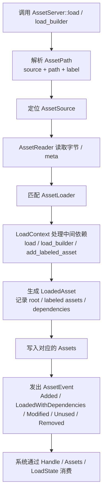

# Bevy 0.19 Asset 系统深度教程

## Executive Summary

Bevy 0.19 的 Asset 系统已经非常接近一个“可组合的虚拟资源管线”：`AssetServer` 负责发起与协调加载，`Handle` 负责生命周期与共享所有权，`Assets<T>` 负责按类型存活与查表，`AssetLoader` 负责把字节流变成运行时对象，`AssetReader` / `AssetWriter` / `AssetSource` 负责把“磁盘、内存、嵌入资源、网络、处理后缓存”等来源统一抽象成虚拟文件系统；再配合 `AssetPath`、`AssetEvent`、递归依赖状态、`AssetMode::Processed` 与热重载，你可以把“资源 I/O、导入、缓存、依赖、卸载、重载”作为一个完整系统来设计，而不是把 `asset_server.load()` 当成简单文件读取。Bevy 官方文档与示例也明确表明：0.19 的重点不是增加更多孤立 API，而是把复杂加载统一收敛到 `load_builder()` 这条主线。

对中高级 Rust/Bevy 开发者来说，真正重要的结论有四个。第一，**Bevy 的资源加载默认是异步、非阻塞的**，所谓“同步加载”通常不是堵塞主线程，而是通过状态机、递归依赖检查、`LoadedWithDependencies` 事件或 `with_guard` 屏障，把游戏流程“同步到资源就绪”。第二，**生命周期的核心不是 `Assets<T>`，而是 `Handle::Strong`**：最后一个强引用被释放后，资源才会进入“Unused / removed”的回收路径。第三，**0.19 的旧资料误区非常多**：社区里常说的 `AssetIo`、`AssetServerSettings`，在 0.19 官方 API 里已经不再是你应该优先抓住的入口，实际更应理解 `AssetReader` / `AssetWriter` / `AssetSource` / `AssetPlugin`。第四，**0.18→0.19 的迁移点集中在 builder pattern、Reader/seekable、SavedAsset 生命周期以及 feature flags**；如果你在最小特性集、热重载、自定义 loader/saver、GLTF 最小化依赖上踩坑，十有八九与这些变化有关。

## Asset 系统核心概念

`Asset` 是“可被 `AssetServer` 管理、可存放进 `Assets<T>`、通常体积较大/加载昂贵/由外部内容驱动”的运行时值。它的 trait 约束要求类型同时实现 `VisitAssetDependencies + TypePath + Send + Sync + 'static`；其中 `VisitAssetDependencies` 用于依赖追踪，而当你为类型 `#[derive(Asset)]` 时，这部分依赖访问逻辑会被自动生成。这一点很关键：**Handle 字段不是普通字段，它们会进入依赖图**。`LoadedAsset` 还会区分“普通依赖”和“loader 期间直接读取值的 loader dependencies”，这就是为什么复杂 loader 能既声明依赖、又在导入阶段立即读取其他资源值。

`AssetServer` 是“调度中心”，而不是“资源存储本体”。它负责根据 `AssetPath` 找到 `AssetSource`，用 `AssetReader` 读入字节，调用匹配的 `AssetLoader` 构造运行时资源，再把结果放入对应的 `Assets<T>`。官方文档明确说明：同一路径的资源若已加载，再次 `load()` 会返回已有 handle，不会重复启动工作；同时你可以通过 `AssetEvent`、`load_state` 或直接查 `Assets<T>` 来判断资源是否已进入可用态。对于包含多个外部文件的资源，单个 root asset “已加载”并不总等于所有依赖都已准备好，因此实际项目中应优先用 `is_loaded_with_dependencies()` 或 `get_recursive_dependency_load_state()`。

`Handle` 则是生命周期管理的中枢。`Handle::Strong` 会保活资源，克隆强句柄会延长资源寿命；`Handle::Uuid` 只是一种稳定标识，不保证指向当前仍存活的对象，也**不会**阻止资源被释放。与它对应，`AssetId` 是便宜、可复制、可脱离资源存活期存在的运行时 id；默认情况下，`Assets<T>` 会把 `AssetId::Index` 放入密集 vec-like 存储，而显式 UUID 资源则走 hashmap。一个很容易忽视的陷阱是：**把大量 handle 长期塞进全局 manifest/resource，会让内存“稳定地高”，而不是自动变低**。Bevy 官方文档直接把这种模式列为常见高内存来源。

`Assets<T>` 是按类型分桶的运行时存储。它不仅存值，也会发出 `AssetEvent`。在 0.19 中，常见事件包括 `Added`、`Modified`、`Removed`、`Unused` 和 `LoadedWithDependencies`；其中 `Unused` 会在最后一个 `Handle::Strong` 被释放时触发，`LoadedWithDependencies` 则意味着 root asset 及其递归依赖都已完成。官方 `bevy::asset` 模块也明确写到：当引用计数归零后，资源会从 `Assets` 集合中移除。对调试和卸载来说，这两个事件非常实用。

`AssetPath` 是虚拟路径，不是裸文件系统路径。它由三部分组成：可选 asset source、相对该 source 根的虚拟路径、可选 label。比如 `"models/scene.gltf#Scene0"` 中的 `#Scene0` 就是子资源 label；`"remote://my_scene.scn"` 则显式指定了 source。另一个经典陷阱是文件名本身带 `#`：这时要用 `Path` 或手动构造 `AssetPath`，否则 `#` 会被当成 label 分隔符。还有一点经常被旧教程误导：`AssetPath` 的 “full path” 依旧是相对 source 根，而不是绝对文件系统路径。

`AssetLoader`/`AssetReader`/`AssetWriter`/`AssetSource` 的职责边界在 0.19 已经很清晰。`AssetLoader` 负责“字节流 → 运行时对象”，其 `Settings` 必须实现 `Default + Serialize + Deserialize`；`AssetReader` 和 `AssetWriter` 则提供虚拟文件系统读写；`AssetSource` / `AssetSourceBuilder` 负责把 reader / writer / watcher 组合成一个命名资源源。也正因为此，**旧文常说的 `AssetIo` 在 0.19 不再是应优先掌握的官方入口**：我在 0.19 官方 API 中检索到的是 `AssetReader` / `AssetWriter` / `AssetSource`，而独立的 `AssetServerSettings` 也没有出现在 0.19 官方 API 页面中；相对地，当前配置项集中在 `AssetPlugin` 的 `file_path`、`processed_file_path`、`watch_for_changes_override`、`mode`、`meta_check`、`unapproved_path_mode` 等字段上。旧版文档中确实存在 `AssetServerSettings`。如果你看的是老中文博客或早期 cheatbook，这一处最容易把概念学错。

`AssetPlugin` 基本就是 0.19 中“AssetServerSettings 的现实替身”。它控制默认资源目录、processed 目录、是否监视变化、是否启用 asset processor、是 `Processed` 还是 `Unprocessed` 模式、如何检查 `.meta`、以及如何处理未批准路径。尤其要注意：`watch_for_changes_override` 默认不会自动打开，桌面热重载通常应通过 cargo feature `file_watcher` 打开；而 `AssetMode::Processed` 则会把资源读入处理管线，由 processor 输出到 processed source，官方文档还专门提醒 web 构建中预处理可能因缺乏文件系统访问而带来问题。

## 加载流程与策略选择

Bevy 0.19 真正的主线 API 只有两条：`AssetServer::load()` 与 `AssetServer::load_builder()`。迁移指南明确说明，0.18 时代那些 `load_untyped`、`load_acquire_with_settings_override`、`load_with_settings` 之类的高级变体，在 0.19 都被 builder pattern 统一了；`load()` 只是便捷包装，复杂场景都应转到 `load_builder()`。同一组变更还把 `NestedLoader` 改成了 `NestedLoadBuilder`，并把 `LoadContext::loader()` 改成 `LoadContext::load_builder()`。这意味着：**如果你在写中大型 loader、工具链、mod/plugin 系统，builder 化思维已经不是“新写法”，而是 0.19 的正式抽象**。



上面的流程图有几个决策点值得你记住。其一，**“资源可用”并不等于“路径已解析成功”**；真正可用通常要到 `Assets<T>` 中存在对象，或者递归依赖状态全部为 loaded。其二，**label/subasset 是一等公民**，特别是 GLTF：`Scene(0)`、`Primitive { mesh, primitive }` 这种访问方式，本质上就是在加载 base asset 的 labeled subasset。其三，**loader 可以在导入阶段同步读取别的已解析资源值**，例如 `load_context.load_builder().load_value::<Text>(...)`，这恰好是 0.19 自定义 importer 最值得利用的能力之一。

下面这张表更适合作为实际项目中的“选型速查”。

| 策略 / API | 典型用途 | 优点 | 缺点与陷阱 |
|---|---|---|---|
| `asset_server.load(path)` | 最常见的 typed 加载 | 简单、非阻塞、按路径去重；重复加载同一路径会返回已有 handle，不重复启动工作。  | 只适合基础场景；当你需要设置、guard、untyped、override 时很快不够用。  |
| `asset_server.load_builder().with_settings(...).load(path)` | 按次覆盖 loader settings | 比 `.meta` 更灵活；不必填写全部字段。  | 如果同一路径第一次已加载，再次以不同 settings 加载通常会被忽略；官方示例明确提醒这一点。  |
| `asset_server.load_folder(path)` | 场景预热、关卡预载 | 文件夹下资产并行加载，`LoadedFolder` 可作为“文件夹全部就绪”的依赖根。  | 想让它们持续存活，必须保留返回的 `Handle<LoadedFolder>`。  |
| `load_builder().with_guard(guard)` | 多资源同步屏障 / 加载界面 | 可以把大量加载统一计数或异步等待，适合 loading screen。  | guard 只保证对应 asset load 完成或失败；若 loader 内还有额外文件 / 子依赖，仍应结合递归依赖状态检查。  |
| `is_loaded_with_dependencies` / `get_recursive_dependency_load_state` | 关卡切换、进度条、错误聚合 | 最符合“真正可用”的定义，官方 loading screen 示例就是这么做的。  | 你需要维护 pending 集合或状态机；否则逻辑会散在各系统里。 |
| `load_builder().load_untyped()` / `.load_untyped_async()` | 类型未知的工具、编辑器、mod 框架 | 适合运行时决定类型的场景。  | 存在 `LoadedUntypedAsset` 这一层间接对象；类型已知时没必要用。  |
| `Assets::add` / `asset_server.add` / `add_async` / `reserve_handle + insert` | 运行时生成资源 | 适合程序化材质、网格、贴图、导入后生成对象。官方示例同时展示了同步添加、异步生成以及 reserve/insert。  | 它们不是“文件加载”，不会自动落盘；若要导出还要额外实现 saver / writer。  |
| `AssetMode::Processed` | 大项目导入、格式转换、预处理优化 | 能把 artist-authored 资源预处理到更适合运行时的格式，启动更稳定。  | Web 构建要特别谨慎；处理后目录、meta、watcher 组合也更复杂。  |

一个常被问到的问题是：“Bevy 到底有没有同步加载？”严格说，`AssetServer` 主路径是异步非阻塞；真正的“同步”更多是**同步到流程**，而不是同步到线程。比如 loading screen 示例会等到 `loading_assets` 为空且渲染 pipelines 已全部 ready 才切状态；`with_guard` 则把大量加载统一收口成一个 barrier。反过来，真正的同步创建更像 `Assets::add`、`Assets::insert`、`reserve_handle + insert` 这种“你已经有了内存对象，只是把它登记进资源系统”的过程。

## 综合实践示例

下面这份示例把你要求的几个核心点放进一个可运行项目里：图片、TextureAtlas、音频、GLTF、**自定义资产类型**、预加载、进度反馈、错误处理、缓存去重，以及“丢弃缓存资源以触发后续卸载”的策略。它采用 Bevy 0.19 idiomatic 风格：`States` 管理流程，`AssetLoader` 管理自定义格式，`get_recursive_dependency_load_state` 做进度与失败检测，`Sprite::from_atlas_image` 展示 atlas，`AudioPlayer` 播放音频，`WorldAssetRoot` 挂接 GLTF 场景。对应的 API 与模式，均可在官方示例和文档中找到同源设计。

**`Cargo.toml`**

```toml
[package]
name = "bevy_asset_tutorial"
version = "0.1.0"
edition = "2021"

[dependencies]
bevy = { version = "0.19", features = ["file_watcher"] }
serde = { version = "1", features = ["derive"] }
ron = "0.8"
thiserror = "2"
```

> 说明：这里直接使用 `bevy = "0.19"` 并额外打开 `file_watcher` 便于桌面热重载。若你关闭默认特性改走最小特性集，0.19 里音频已不再被 `2d/3d/ui` 自动隐式带上，UI 也不再被 `2d/3d` 自动隐式带上，因此需要显式补回相关 feature。

**`src/main.rs`**

```rust
use bevy::{
    asset::{io::Reader, AssetEvent, AssetLoader, LoadContext, RecursiveDependencyLoadState, UntypedHandle},
    prelude::*,
};
use serde::Deserialize;
use thiserror::Error;

/// 示例资产目录，使用 crate 路径避免运行目录影响 AssetServer。
const ASSET_FILE_PATH: &str = concat!(env!("CARGO_MANIFEST_DIR"), "/assets");

fn main() {
    App::new()
        .add_plugins(DefaultPlugins.set(AssetPlugin {
            file_path: ASSET_FILE_PATH.to_string(),
            ..default()
        }))
        .insert_state(AppState::Loading)
        .init_asset::<GameConfig>()
        .init_asset_loader::<GameConfigLoader>()
        .add_systems(Startup, setup_loading)
        .add_systems(
            Update,
            (
                update_loading_progress.run_if(in_state(AppState::Loading)),
                animate_atlas.run_if(in_state(AppState::Ready)),
                unload_demo_on_key,
                log_config_events,
            ),
        )
        .add_systems(OnEnter(AppState::Ready), spawn_demo_scene)
        .add_systems(OnEnter(AppState::Error), show_error_text)
        .run();
}

#[derive(States, Debug, Clone, Copy, Eq, PartialEq, Hash, Default)]
enum AppState {
    #[default]
    Loading,
    Ready,
    Error,
}

#[derive(Resource)]
struct DemoAssets {
    icon: Handle<Image>,
    atlas_image: Handle<Image>,
    atlas_layout: Handle<TextureAtlasLayout>,
    music: Handle<AudioSource>,
    scene: Handle<WorldAsset>,
    config: Handle<GameConfig>,
}

#[derive(Resource)]
struct LoadTracker {
    total: usize,
    pending: Vec<UntypedHandle>,
    failures: Vec<String>,
}

#[derive(Component)]
struct LoadingText;

#[derive(Component)]
struct DemoEntity;

#[derive(Component, Deref, DerefMut)]
struct AtlasTimer(Timer);

#[derive(Asset, TypePath, Debug, Clone, Deserialize)]
struct GameConfig {
    player_name: String,
    spawn: [f32; 3],
    music_volume: f32,
}

impl GameConfig {
    fn spawn_vec3(&self) -> Vec3 {
        Vec3::from_array(self.spawn)
    }
}

#[derive(Default, TypePath)]
struct GameConfigLoader;

#[derive(Debug, Error)]
enum GameConfigLoaderError {
    #[error("I/O error: {0}")]
    Io(#[from] std::io::Error),
    #[error("RON parse error: {0}")]
    Ron(#[from] ron::error::SpannedError),
}

impl AssetLoader for GameConfigLoader {
    type Asset = GameConfig;
    type Settings = ();
    type Error = GameConfigLoaderError;

    async fn load(
        &self,
        reader: &mut dyn Reader,
        _settings: &Self::Settings,
        _load_context: &mut LoadContext<'_>,
    ) -> Result<Self::Asset, Self::Error> {
        let mut bytes = Vec::new();
        reader.read_to_end(&mut bytes).await?;
        Ok(ron::de::from_bytes::<GameConfig>(&bytes)?)
    }

    fn extensions(&self) -> &[&str] {
        &["game.ron"]
    }
}

fn setup_loading(
    mut commands: Commands,
    asset_server: Res<AssetServer>,
    mut atlas_layouts: ResMut<Assets<TextureAtlasLayout>>,
) {
    // 2D overlay camera
    commands.spawn((Camera2d, Camera { order: 1, ..default() }));

    // 3D world camera
    commands.spawn((
        Camera3d::default(),
        Transform::from_xyz(1.8, 1.2, 2.5).looking_at(Vec3::ZERO, Vec3::Y),
        DemoEntity,
    ));

    let icon: Handle<Image> = asset_server.load("textures/icon.png");
    let icon_again: Handle<Image> = asset_server.load("textures/icon.png"); // 演示去重缓存
    assert_eq!(icon.id(), icon_again.id());

    let atlas_image: Handle<Image> = asset_server.load("textures/gabe-idle-run.png");
    let atlas_layout = atlas_layouts.add(TextureAtlasLayout::from_grid(
        UVec2::splat(24),
        7,
        1,
        None,
        None,
    ));
    let music: Handle<AudioSource> = asset_server.load("audio/bgm.flac");
    let scene: Handle<WorldAsset> =
        asset_server.load(GltfAssetLabel::Scene(0).from_asset("models/FlightHelmet/FlightHelmet.gltf"));
    let config: Handle<GameConfig> = asset_server.load("data/config.game.ron");

    let pending: Vec<UntypedHandle> = vec![
        icon.clone().into(),
        atlas_image.clone().into(),
        music.clone().into(),
        scene.clone().into(),
        config.clone().into(),
    ];

    commands.insert_resource(DemoAssets {
        icon,
        atlas_image,
        atlas_layout,
        music,
        scene,
        config,
    });

    commands.insert_resource(LoadTracker {
        total: pending.len(),
        pending,
        failures: Vec::new(),
    });

    commands.spawn((
        Text::new("Loading... 0%"),
        Node {
            position_type: PositionType::Absolute,
            left: px(16.0),
            top: px(16.0),
            ..default()
        },
        LoadingText,
    ));
}

fn update_loading_progress(
    asset_server: Res<AssetServer>,
    tracker: Option<ResMut<LoadTracker>>,
    mut loading_text: Single<&mut Text, With<LoadingText>>,
    mut next_state: ResMut<NextState<AppState>>,
) {
    let Some(mut tracker) = tracker else {
        return;
    };

    let mut failures = Vec::new();
    tracker.pending.retain(|handle| {
        match asset_server.get_recursive_dependency_load_state(handle) {
            Some(RecursiveDependencyLoadState::Loaded) => false,
            Some(RecursiveDependencyLoadState::Failed(err)) => {
                failures.push(err.to_string());
                false
            }
            _ => true,
        }
    });
    tracker.failures.extend(failures);

    let done = tracker.total.saturating_sub(tracker.pending.len());
    let percent = if tracker.total == 0 {
        100.0
    } else {
        (done as f32 / tracker.total as f32) * 100.0
    };

    loading_text.0 = if tracker.failures.is_empty() {
        format!("Loading... {percent:.0}% ({done}/{})", tracker.total)
    } else {
        format!("Loading failed: {}", tracker.failures.join(" | "))
    };

    if !tracker.failures.is_empty() {
        next_state.set(AppState::Error);
    } else if tracker.pending.is_empty() {
        next_state.set(AppState::Ready);
    }
}

fn spawn_demo_scene(
    mut commands: Commands,
    demo: Res<DemoAssets>,
    configs: Res<Assets<GameConfig>>,
) {
    let Some(cfg) = configs.get(&demo.config) else {
        warn!("资源进入 Ready 状态后仍未找到 GameConfig，跳过场景生成");
        return;
    };

    info!(
        "Loaded config for player={} volume={}",
        cfg.player_name, cfg.music_volume
    );

    commands.spawn((
        Sprite::from_image(demo.icon.clone()),
        Transform::from_xyz(-220.0, -80.0, 0.0),
        DemoEntity,
    ));

    commands.spawn((
        Sprite::from_atlas_image(
            demo.atlas_image.clone(),
            TextureAtlas {
                layout: demo.atlas_layout.clone(),
                index: 1,
            },
        ),
        Transform::from_xyz(220.0, -80.0, 0.0).with_scale(Vec3::splat(6.0)),
        AtlasTimer(Timer::from_seconds(0.12, TimerMode::Repeating)),
        DemoEntity,
    ));

    commands.spawn((
        AudioPlayer::new(demo.music.clone()),
        Name::new("BGM"),
        DemoEntity,
    ));

    commands.spawn((
        DirectionalLight {
            illuminance: 12000.0,
            shadow_maps_enabled: true,
            ..default()
        },
        Transform::from_xyz(3.0, 6.0, 3.0).looking_at(Vec3::ZERO, Vec3::Y),
        DemoEntity,
    ));

    commands.spawn((
        WorldAssetRoot(demo.scene.clone()),
        Transform::from_translation(cfg.spawn_vec3()),
        DemoEntity,
    ));
}

fn animate_atlas(
    time: Res<Time>,
    mut query: Query<(&mut AtlasTimer, &mut Sprite), With<DemoEntity>>,
) {
    for (mut timer, mut sprite) in &mut query {
        timer.tick(time.delta());
        if timer.just_finished() && let Some(atlas) = &mut sprite.texture_atlas {
            atlas.index = if atlas.index >= 6 { 1 } else { atlas.index + 1 };
        }
    }
}

fn unload_demo_on_key(
    keyboard: Res<ButtonInput<KeyCode>>,
    query: Query<Entity, With<DemoEntity>>,
    mut commands: Commands,
) {
    if keyboard.just_pressed(KeyCode::KeyU) {
        for entity in &query {
            commands.entity(entity).despawn();
        }
        commands.remove_resource::<DemoAssets>();
        info!("Dropped DemoAssets resource and despawned demo entities.");
    }
}

fn log_config_events(mut events: MessageReader<AssetEvent<GameConfig>>) {
    for event in events.read() {
        match event {
            AssetEvent::Added { id } => info!("GameConfig added: {id:?}"),
            AssetEvent::LoadedWithDependencies { id } => {
                info!("GameConfig fully loaded (with deps): {id:?}")
            }
            AssetEvent::Modified { id } => info!("GameConfig modified: {id:?}"),
            AssetEvent::Unused { id } => info!("GameConfig unused: {id:?}"),
            AssetEvent::Removed { id } => info!("GameConfig removed: {id:?}"),
        }
    }
}

fn show_error_text(mut loading_text: Single<&mut Text, With<LoadingText>>) {
    loading_text.0.push_str("\nPress Esc to inspect logs; fix the missing file and rerun.");
}
```

**需要准备的占位资源文件**

```text
assets/
├─ textures/
│  ├─ icon.png
│  └─ gabe-idle-run.png
├─ audio/
│  └─ bgm.flac
├─ models/
│  └─ FlightHelmet/
│     └─ FlightHelmet.gltf
└─ data/
   └─ config.game.ron
```

**`assets/data/config.game.ron` 示例**

```ron
(
    player_name: "mdrs",
    spawn: (0.0, 0.0, 0.0),
    music_volume: 0.8,
)
```

这份示例体现了几个 0.19 的关键实践。首先，GLTF 场景是通过 `GltfAssetLabel::Scene(0).from_asset(...)` 访问 labeled subasset；其次，`textures/icon.png` 被加载两次但 `id` 相同，说明 `AssetServer` 按路径去重；再次，加载进度不是看 `Assets<T>::get()`，而是统一使用 `get_recursive_dependency_load_state()` 聚合异步状态；最后，按 `U` 时丢弃缓存资源并销毁持有这些 handles 的实体，资源便会进入正常的“Unused / remove”生命周期。

若你更偏爱“先预热、后进入关卡”的做法，可以把上面的显式 pending 列表换成 `load_folder()` 或 `with_guard()` 策略。官方文档指出，`LoadedFolder` 的所有子句柄都作为它的依赖存在，因此可直接等待 `LoadedWithDependencies`；而 `multi_asset_sync` 示例则展示了 builder + guard 的 barrier 模式，它既支持同步计数，也支持异步等待。实战里我的建议是：**需要进度条时用 pending + recursive state；需要批量原子切场时用 folder 或 barrier；需要自定义每次加载参数时用 builder；需要工具化时再上 untyped**。

## 读取、存储与扩展 AssetSource

从磁盘读取是默认路径，但 Bevy 0.19 的设计远不止磁盘。除了默认 source，你可以注册额外的命名 source，并通过 `AssetPath::with_source(...)` 或 `"name://path"` 语法从不同来源读取；也可以用 `embedded_asset!` 把资源字节嵌进程序，再用 `load_embedded_asset!` 走普通 `AssetServer` 加载流程；还可以通过 `WebAssetPlugin` 用 `https` source 直接从网络 URL 读取。换句话说，**“资产路径”与“文件系统路径”已经分离**：`AssetPath` 面向虚拟资源地址，而 reader/source 决定它最终落到哪里。

**嵌入资源读取最小示例**

```toml
[dependencies]
bevy = "0.19"
```

```rust
use bevy::{
    asset::{embedded_asset, load_embedded_asset},
    prelude::*,
};

fn main() {
    App::new()
        .add_plugins(DefaultPlugins)
        .add_plugins(MyEmbeddedPlugin)
        .add_systems(Startup, setup)
        .run();
}

struct MyEmbeddedPlugin;

impl Plugin for MyEmbeddedPlugin {
    fn build(&self, app: &mut App) {
        // 第三个参数是相对当前 Rust 文件的真实文件路径。
        embedded_asset!(app, "src/", "../assets/textures/icon.png");
        embedded_asset!(app, "src/", "../assets/audio/bgm.flac");
    }
}

fn setup(mut commands: Commands, asset_server: Res<AssetServer>) {
    commands.spawn(Camera2d);

    // 和 embedded_asset! 使用同一个路径字面量，宏会自动指向 embedded source。
    let icon: Handle<Image> = load_embedded_asset!(&*asset_server, "../assets/textures/icon.png");
    commands.spawn((
        Sprite::from_image(icon),
        Transform::from_xyz(128.0, 0.0, 0.0),
    ));

    let music: Handle<AudioSource> =
        load_embedded_asset!(&*asset_server, "../assets/audio/bgm.flac");
    commands.spawn((AudioPlayer::new(music), PlaybackSettings::LOOP));
}
```

这里有两个路径概念必须分清。

`embedded_asset!(app, "src/", "../assets/textures/icon.png")` 的第三个参数首先是给 `include_bytes!` 用的真实文件路径，因此它相对**调用这个宏的 Rust 源文件**。在当前 `crates/asset/src/main.rs` 中，`../assets/textures/icon.png` 指向的就是 `crates/asset/assets/textures/icon.png`。这个文件会在编译期嵌进二进制，并注册到 Bevy 的 `embedded` asset source 中。

第二个参数 `"src/"` 不是资产目录，也不是读取根目录；它是生成 embedded `AssetPath` 时要寻找并裁掉的源码前缀。Bevy 会根据当前 crate 名、`file!()` 返回的源文件路径、这个源码前缀和第三个参数一起计算最终 embedded 路径。默认写法 `embedded_asset!(app, "foo.wgsl")` 等价于使用 `"src"` 作为源码前缀，适合资源就在 `src` 附近的 crate 内部资源；当前示例把资源放在 `src` 外面的 `assets` 目录，因此显式保留 `"src/"` 并用 `../assets/...` 指回真实文件。

读取同一模块中注册的嵌入资源时，优先用 `load_embedded_asset!(&*asset_server, "../assets/textures/icon.png")`，并让它和 `embedded_asset!` 使用同一个路径字面量。这个宏会复用完全相同的 embedded 路径计算逻辑，再自动把 source 设置为 `embedded`，最后调用 `AssetServer::load` 返回正常的 `Handle<T>`。因此它比手写 `AssetPath::from_path(...).with_source("embedded")` 更不容易和注册路径脱节。只有当你要把 embedded 资源作为公开路径暴露给其他模块或用户时，才更适合手写或文档化 `"embedded://..."` 形式；这时可以用 `embedded_path!` 辅助确认最终路径。

嵌入资源并不会绕过 Asset 系统：`png` 仍然由图片 loader 解析，`flac` 仍然由音频 loader 解析，返回值仍然是强类型 `Handle<Image>` / `Handle<AudioSource>`，生命周期、缓存和事件也仍然由 `AssetServer` 管理。它只是把底层字节来源从磁盘 source 换成了 `embedded` source。若需要网络资源，则再额外启用 `https` feature 并配置 `WebAssetPlugin`，然后直接加载 `https://...` 路径即可；这和嵌入资源是两条不同的 source 路线。

上面的设计是 0.19 里理解 `AssetPath` 最直接的方式：source 名称进入路径语义本身，而不是散落在“另一个全局配置对象”里。官方 `extra_source` 示例还特意强调：额外 source 的注册必须发生在 `DefaultPlugins` 之前，因为 `AssetPlugin` 会在构建时完成资源系统初始化。

如果你需要扩展底层 I/O，0.19 里应实现的是 `AssetReader` / `AssetWriter` / `AssetSourceBuilder`，而不是继续沿用旧资料中的 `AssetIo` 心智。下面这个最小 reader 例子会包装平台默认 reader，并在读取时打印日志；它几乎就是官方 `custom_asset_reader.rs` 的等价缩写。注意 `Reader` 在 0.19 迁移中也有变化：自定义实现者现在必须实现 `Reader::seekable` 相关约束，迁移指南把它列为显式兼容项。

**自定义 reader / source 最小示例**

```rust
use bevy::{
    asset::io::{
        AssetReader, AssetReaderError, AssetSource, AssetSourceBuilder, AssetSourceId,
        ErasedAssetReader, PathStream, Reader,
    },
    prelude::*,
};
use std::path::Path;

struct LoggingReader(Box<dyn ErasedAssetReader>);

impl AssetReader for LoggingReader {
    async fn read<'a>(&'a self, path: &'a Path) -> Result<impl Reader + 'a, AssetReaderError> {
        info!("read asset: {}", path.display());
        self.0.read(path).await
    }

    async fn read_meta<'a>(&'a self, path: &'a Path) -> Result<impl Reader + 'a, AssetReaderError> {
        self.0.read_meta(path).await
    }

    async fn read_directory<'a>(
        &'a self,
        path: &'a Path,
    ) -> Result<Box<PathStream>, AssetReaderError> {
        self.0.read_directory(path).await
    }

    async fn is_directory<'a>(&'a self, path: &'a Path) -> Result<bool, AssetReaderError> {
        self.0.is_directory(path).await
    }
}

struct LoggingReaderPlugin;

impl Plugin for LoggingReaderPlugin {
    fn build(&self, app: &mut App) {
        app.register_asset_source(
            AssetSourceId::Default,
            AssetSourceBuilder::new(|| {
                Box::new(LoggingReader(
                    AssetSource::get_default_reader("assets".to_string())(),
                ))
            }),
        );
    }
}
```

保存与导出方面，0.19 的官方方向已经很明确：自定义读取用 `AssetLoader`，自定义保存用 `AssetSaver`，两者分别与 `AssetReader` / `AssetWriter` 对应。官方保存示例使用 `save_using_saver(...)` 在 `IoTaskPool` 里异步写出，而带子资源的示例进一步展示了 `SavedAssetBuilder`、`SavedAsset` 与 labeled subasset 的保存方式。对大多数项目而言，一个最现实的经验法则是：**导入器尽量纯，导出器尽量显式；需要落盘时不要阻塞主线程**。

**为上面的 `GameConfig` 增加导出功能**

```rust
use bevy::{
    asset::{
        io::Writer,
        saver::{save_using_saver, AssetSaver, SavedAsset},
        AssetPath, AsyncWriteExt,
    },
    prelude::*,
    tasks::IoTaskPool,
};

#[derive(TypePath)]
struct GameConfigSaver;

impl AssetSaver for GameConfigSaver {
    type Asset = GameConfig;
    type Settings = ();
    type OutputLoader = GameConfigLoader;
    type Error = BevyError;

    async fn save(
        &self,
        writer: &mut Writer,
        asset: SavedAsset<'_, '_, Self::Asset>,
        _settings: &Self::Settings,
        _asset_path: AssetPath<'_>,
    ) -> Result<(), Self::Error> {
        let ron_text = ron::to_string(asset.get())?;
        writer.write_all(ron_text.as_bytes()).await?;
        Ok(())
    }
}

fn export_config_once(
    keyboard: Res<ButtonInput<KeyCode>>,
    asset_server: Res<AssetServer>,
    demo: Option<Res<DemoAssets>>,
    configs: Res<Assets<GameConfig>>,
) {
    if !keyboard.just_pressed(KeyCode::F5) {
        return;
    }
    let Some(demo) = demo else { return; };
    let Some(cfg) = configs.get(&demo.config) else { return; };

    let cfg = cfg.clone();
    let asset_server = asset_server.clone();

    IoTaskPool::get()
        .spawn(async move {
            let result = save_using_saver(
                asset_server,
                &GameConfigSaver,
                &"export/config_out.game.ron".into(),
                SavedAsset::from_asset(&cfg),
                &(),
            )
            .await;

            match result {
                Ok(()) => info!("saved export/config_out.game.ron"),
                Err(err) => error!("save failed: {err}"),
            }
        })
        .detach();
}
```

对更复杂的格式，推荐直接参考官方 `asset_saving_with_subassets` 思路：外部可读的序列化结构与运行时 asset 结构分离；保存时把 handle 指向的 subasset 还原成可序列化对象；加载时通过 `load_context.add_labeled_asset(...)` 再组回运行时句柄。这种“导入/导出格式”和“运行时格式”分离的写法，比直接序列化 `Handle<T>` 要健壮得多。

## 调试、性能与热重载

调试 Asset 系统时，最先要确认的是**你在看哪一层状态**。`Assets<T>::get(&handle)` 只回答“当前这个类型桶里是否已有值”，但不能告诉你递归依赖是否完成；`AssetEvent::LoadedWithDependencies` 和 `AssetServer::is_loaded_with_dependencies()` 更接近“可以安全切场 / 使用”的语义；而 `RecursiveDependencyLoadState::Failed(err)` 则是聚合错误的最好入口。官方 loading screen 与文档都把递归依赖检查作为正式方案，而不是“高级技巧”。

热重载方面，桌面平台的基本条件是启用 `file_watcher` cargo feature；若同时使用 `AssetMode::Processed` 和 `asset_processor`，官方示例说明还可以在源资产变更后自动重新处理并热重载，`.meta` 文件也会成为重要的配置入口。另一个很实用的点是 `AssetServer::reload(path)`：它只会重载**当前已经加载过**的路径，因此在编辑器工具中做定点刷新时非常直观。

性能上，最值得记住的不是“少 load 多缓存”这么空泛，而是以下几件非常具体的事。第一，**同一路径重复调用 `load()` 不会重复 I/O**，所以“按需多处 load 同一路径”通常没你想象得贵；真正贵的是把大量不再需要的 strong handles 长期保留。第二，`load_folder()` 与显式 pending 列表都能实现预加载，但后者更容易做进度与错误归因，前者更适合“整个目录就是一个资源组”。第三，运行时生成资源时，`Assets::add`、`asset_server.add_async(...)`、`reserve_handle + insert` 各有定位：前两者适合立即或异步产出对象，最后一种最适合“先发句柄，再晚点填值”的系统化管线。第四，若你修改 asset 值做运行时热编辑，注意 0.19 对 `Assets::get_mut` 返回 `AssetMut` 的设计，是为了避免不必要的 `AssetEvent::Modified`。

一些常见陷阱值得单列出来。其一，`with_settings` 与 `.meta` 都是“第一次加载优先生效”的语义；你不能指望同一路径靠第二次 `load_builder().with_settings(...)` 改变已缓存对象。其二，`Handle::Uuid` 与 `AssetId` 不会保活资源，做长期缓存时不要误把“能定位”当成“能保活”。其三，GLTF、场景、文件夹加载这些“看起来像单文件”的东西经常带有多层依赖，所以 loading screen 切场前请永远优先检查递归依赖。其四，`AssetPath` 是虚拟路径，尤其在 source/label/path 组合时，不要把它误当做原生绝对路径。

跨平台路径与打包方面，0.19 的心智模型建议这样记。桌面默认文件 reader 的基路径通常是**可执行文件所在目录的父目录 / 可执行文件相邻布局**，你可以通过 `AssetPlugin::file_path` 或自定义 source/reader 改写这一点；这意味着发布版最稳妥的方式，仍然是把 assets 布局与二进制部署一起验证，而不是只在 `cargo run` 下自信“本地能跑”。Web/WASM 则要保证静态服务器真的把资源目录暴露出来；官方 examples 仓库在 Linux/macOS 上用 symlink 处理 wasm 资源目录，而 Windows 需要手动复制，这对你自己做网页 demo 或 CI 构建很有参考价值。macOS `.app` 打包历史上也曾有资产读取问题报告，因此若你发布 `.app`，务必在最终 bundle 结构下做一次真实验证。

## 迁移差异与参考来源

从 0.18 到 0.19，Asset 系统最重要的迁移点我建议按下面这条优先级来处理。首先，**把高级 `AssetServer` 加载变体迁移到 builder pattern**：`load_with_settings_override`、`load_untyped`、`load_acquire...` 之类都应改为 `load_builder()` 链式写法；若你写自定义 loader，还要把旧的 `NestedLoader` / `LoadContext::loader()` 迁到 `NestedLoadBuilder` / `LoadContext::load_builder()`。其次，**检查你有没有自定义 reader**，因为迁移指南明确指出 `Reader` 实现现在必须满足 `seekable` 相关要求。再次，**如果你做保存/导出**，要注意 `SavedAsset` 现在包含两个生命周期，而且 `AssetSaver` 现在会接收 `AssetPath`。最后，**检查你的 cargo feature 集合**：在 0.19 里，`audio` 不再由 `3d/2d/ui` 自动隐式启用，`ui` 也不再由 `3d/2d` 自动隐式启用；而 `bevy_gltf` 与 `bevy_pbr` 的依赖关系也被反转了，所以极简构建、无渲染工具和专用 importer 项目会更明显感受到变化。

关于 `AssetServerSettings` 与 `AssetIo`，我这次基于 0.19 官方文档、迁移页、示例和源码页面做检索，没有在 0.19 官方 API 页面里找到独立的 `AssetServerSettings` 入口；相对应的正式配置位于 `AssetPlugin`。而面向 I/O 后端扩展时，0.19 官方展示的是 `AssetReader` / `AssetWriter` / `AssetSourceBuilder` 路线。若你手头教程还在围绕 `AssetServerSettings` 或 `AssetIo` 讲 0.19，请把它视为**历史资料**而不是当前主教程。

**开放问题与局限**

这份教程基于 Bevy 0.19 官方文档、示例、迁移指南和仓库页面整理，优先覆盖了 `github.com`、`bevy.org` 与 `docs.rs` 的一手资料。没有逐项展开所有内建 loader 的 `.meta` schema，也没有覆盖 Android/iOS 专门打包细节；若你的项目要做移动端、浏览器 CDN 缓存、二进制 patch/热更新平台层整合，建议你在此文的 `AssetSource`/`AssetReader` 心智基础上，再分别查阅对应平台的发布链路。

**主要官方 / 原始来源**

- Bevy 0.19 官方 `bevy::asset` 文档与 `AssetServer` / `AssetPlugin` / `AssetPath` / `AssetEvent` / `AssetLoader` / `AssetReader` / `AssetMode` / `Asset` / `LoadedAsset` 条目。 
- Bevy 官方示例：`asset_loading`、`multi_asset_sync`、`custom_asset`、`custom_asset_reader`、`extra_source`、`embedded_asset`、`web_asset`、`asset_saving`、`asset_saving_with_subassets`、`generated_assets`、`asset_settings`、`hot_asset_reloading`、`loading_screen`、`sprite_sheet`、`load_gltf`。 
- Bevy 官方迁移指南 `0.18 to 0.19`。 
- Bevy 官方仓库 examples README 中关于 WASM 资源目录与 Windows 复制注意事项。
