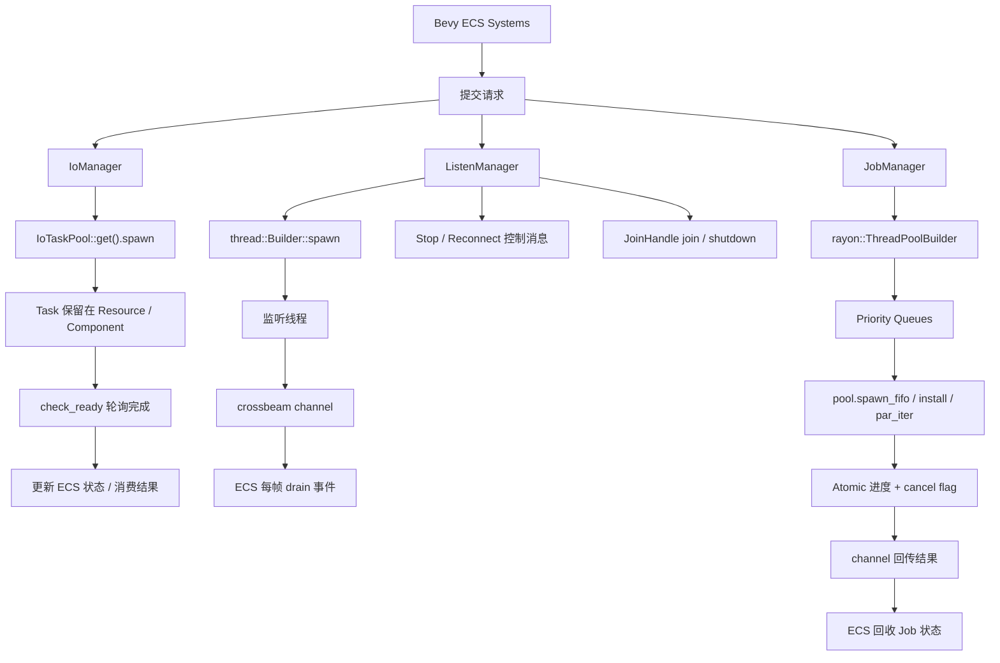
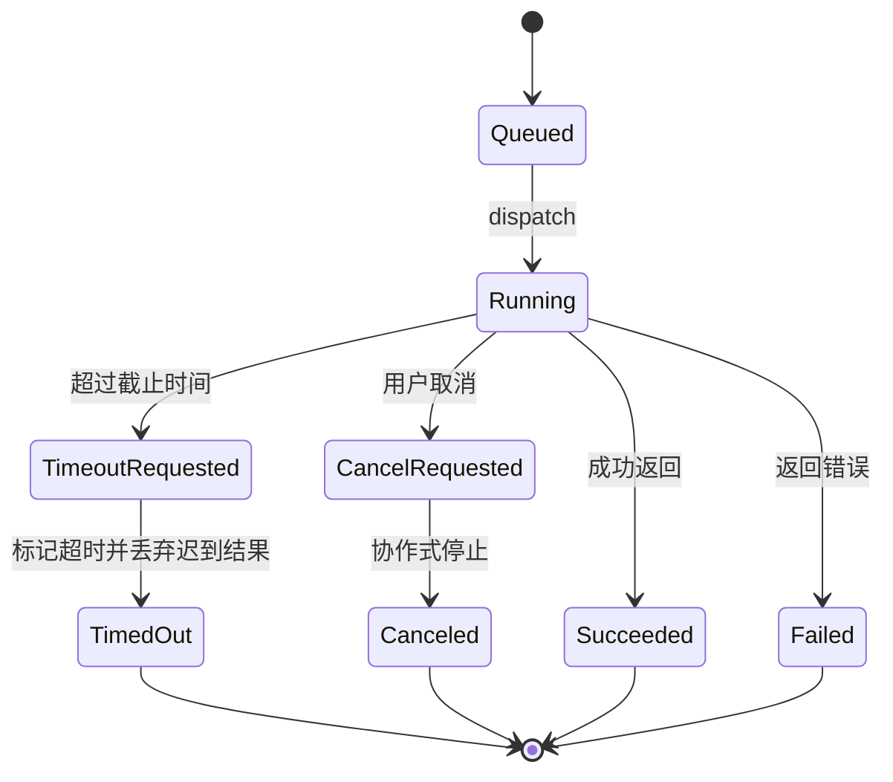

# 基于 Bevy 0.19 的三类并发任务管理方案研究报告

## 执行摘要

基于 Bevy 0.19 的官方任务文档与官方示例，可以把游戏或桌面应用里的后台工作，按“短时 I/O”“长寿命监听”“计算密集型”三种性质拆开治理：短时 I/O 交给 `IoTaskPool`，但必须**保留任务句柄并纳入 ECS 状态机**，而不是像官方某些最小示例那样直接 `detach()`；长时间、近似无限生命周期的监听逻辑，更适合放到 `std::thread::spawn` 创建的独立线程中，并通过 `ListenManager` 在 ECS 世界里管理线程句柄、控制通道、事件接收与停止流程；纯 CPU 重负载任务，则更适合用 Rayon 的自定义线程池和并行迭代器，由 `JobManager` 负责提交、优先级排队、取消标志、进度汇报与结果回收。Bevy 官方把 `IoTaskPool`定义为 I/O 密集型、应尽快完成的任务池；`Task<T>` 默认在被丢弃时取消，而 `detach()` 会让任务继续后台运行；官方异步计算示例则展示了“把 `Task<T>` 挂在 ECS 上并轮询完成”的模式，这正是本报告在短时 I/O 部分沿用和强化的基础。

三种方案的核心差异不在“能不能并发”，而在**生命周期管理和背压策略**。`IoTaskPool` 适合毫秒级到短秒级、可以被状态机追踪的离散请求；独立线程适合持续监听 socket、文件描述符或外部设备这类“常驻”任务；Rayon 适合结构化拆分的大量 CPU 工作，并允许通过 `ThreadPoolBuilder` 单独控制线程数、线程名与 panic 处理逻辑。Rust 标准库明确说明：`JoinHandle` 一旦被丢弃，线程就会被隐式 detach，后续无法再 `join`；Rayon 则提供了自定义线程池、`install()`、`scope()`、`spawn_fifo()` 等 API，但其公开文档并没有提供类似 Bevy `Task::cancel()` 的取消句柄，因此计算任务的取消应设计成**协作式**。

本报告的结论是：如果目标平台是桌面、本地文件系统可用、网络示例采用 TCP，那么推荐默认组合是“`IoTaskPool + ECS Job 状态机`、`std::thread + crossbeam channel + ListenManager`、`rayon::ThreadPool + JobManager + 协作式取消`”。这样做的收益是职责边界清晰、故障域隔离、可测试性高，并且可以把资源占用、取消语义和结果消费都显式收敛到 ECS 资源/组件层，而不是让后台任务“自己跑完再说”。

## 方案对比总览

下表是三种方案在工程维度上的压缩比较。表格中的“适用场景”与“生命周期”依据 Bevy、Rust 标准库和 Rayon 官方文档；“复杂度”“资源占用”“推荐默认值”等为结合官方语义后给出的工程化综合判断。

| 方案 | 适用场景 | 典型生命周期 | 主要优点 | 主要缺点 | 资源占用 | 可取消性 | ECS 复杂度 |
|---|---|---|---|---|---|---|---|
| `IoTaskPool` + 任务状态机 | 本地文件读写、短时网络请求、短时资产序列化；Bevy 官方将 `IoTaskPool` 定义为 I/O 密集且应尽快完成的任务。 | 短时、离散、可轮询完成 | 与 Bevy 调度自然衔接；`Task<T>` 可保留句柄、检查完成、默认 drop 即取消。 | 如果底层使用阻塞文件 API，超时/取消通常只能做到协作式，不是硬中断；Bevy 任务库也明确不保证公平性与顺序。 | 低到中，主要取决于并发请求数 | 中等，可通过保留 `Task<T>`、取消标志、超时状态机实现；`Task::cancel()` 支持“取消并等待停止”。 | 中等 |
| `std::thread::spawn` + `ListenManager` | 持续 socket 监听、外设采集、日志 tail、无限循环外部源；Bevy 官方线程示例也用“外部线程 + channel + ECS 消费”。 | 长时、常驻、可能无限 | 与阻塞 I/O 模型最匹配；线程异常隔离清晰；可通过 `JoinHandle` 与控制通道实现优雅停止。 | 系统线程成本高于任务；如果丢失 `JoinHandle`，线程会 detach；需要自行设计重连、背压和停机协议。 | 中到高，按线程数线性增长 | 高，但本质上是“控制消息 + 轮询超时 + join”式协作停止。 | 中到高 |
| `rayon::ThreadPool` + `JobManager` | 纯 CPU、可拆分的耗时循环、批量数据处理、规则计算；Rayon 官方强调高层并行迭代器和自定义线程池适合数据并行。 | 中到长，通常跨多帧 | 吞吐高；`ThreadPoolBuilder` 可设置线程数、线程名、panic handler；切片和范围都能并行拆分。 | 官方公开 API 没有 Bevy `Task::cancel()` 那样的取消句柄，应采用协作式取消；优先级需要在 ECS 队列层实现。 | 中到高，取决于线程池大小和工作集 | 中等，推荐“原子取消标志 + 小块拆分 + 及时检查” | 高 |

## 总体架构与关键 API

三类后台工作不应混在一个“万能后台执行器”里。更稳妥的做法是让 ECS 世界只负责**提交、状态、消费、停止**，而真正的执行后端分别落到 Bevy I/O 任务池、独立 OS 线程和 Rayon 专用线程池。Bevy 官方文档已经把 `IoTaskPool`、`AsyncComputeTaskPool`、`ComputeTaskPool`按工作性质区分开；Rayon 官方文档则鼓励使用 `ThreadPoolBuilder` 建立自定义池；Rust 标准库把 `JoinHandle` 定义为“拥有 join 权限的唯一句柄”，这意味着 ECS 资源层应该显式保管这些句柄，而不是任其逃逸。



### 关键 API 与类型

| API / 类型 | 推荐用途 | 关键用法 | 设计备注 |
|---|---|---|---|
| `bevy::tasks::IoTaskPool` | 短时 I/O | `IoTaskPool::get().spawn(async move { ... })` | Bevy 官方将其定义为 I/O 密集、应迅速完成的任务池。 |
| `bevy::tasks::Task<T>` | 保留异步任务句柄 | `drop(task)` 默认取消；`detach()` 让任务继续后台运行；`cancel().await` 可优雅取消；`is_finished()` 可查询完成。 | 本报告的短时 I/O 方案**不推荐直接 detach**。 |
| `bevy::tasks::futures::check_ready` | 在 ECS 系统中非阻塞轮询 | `if let Some(out) = check_ready(&mut task) { ... }` | Bevy 官方异步计算示例明确建议在任务跟踪场景下使用 `check_ready`，而不是每帧 `block_on(poll_once)`。 |
| `std::thread::Builder::spawn` | 启动可命名、可恢复错误的后台线程 | 设置线程名、栈大小，返回 `io::Result<JoinHandle<T>>`。 | 比裸 `thread::spawn` 更适合基础设施线程。 |
| `std::thread::JoinHandle<T>` | 管理线程生命周期 | `join()` 等待结束，`is_finished()` 支持非阻塞收尾；drop 会 detach。 | 长寿命线程必须由 ECS 资源持有。 |
| `crossbeam_channel::{bounded, Sender, Receiver}` | 线程间通信与背压 | `bounded(cap)`、`try_recv()`、`recv_timeout()` | `Receiver` 是 `Sync`；而 `std::sync::mpsc::Receiver` 是 `!Sync`，这正是官方 Bevy 外部线程示例选择 crossbeam 的原因。 |
| `tokio::sync::mpsc` | 如果项目本身已有 Tokio 运行时 | `channel(buffer)` 提供有界背压；模块文档说明其是 runtime agnostic。 | 本报告不把 Tokio 设为默认依赖，但可作为已有 Tokio 工程的替代。 |
| `std::net::{TcpStream, TcpListener, Shutdown}` | TCP 网络监听 / 连接 | `connect_timeout()`、`set_read_timeout()`、`shutdown(Shutdown::Both)`、`accept()`。 | 长监听推荐设置非零读取超时，否则阻塞停止会很难做。 |
| `rayon::ThreadPoolBuilder` / `rayon::ThreadPool` | 计算密集任务池 | `num_threads()`、`panic_handler()`、`build()`、`install()`、`spawn_fifo()`。 | 适合把 CPU 工作与 Bevy 自身任务池隔离。 |
| `rayon::prelude::*`、`ParallelSlice::par_chunks()`、`IndexedParallelIterator::with_max_len()` | 数据并行拆分 | 切片工作优先用 `par_chunks`；范围型工作可用 `with_min_len` / `with_max_len` 控制拆分粒度。 | 对取消延迟和吞吐的平衡很关键。 |

如果你参考官方 Bevy 仓库示例，务必使用与 `bevy = "0.19"` 相匹配的版本标签或 `latest` 发布标签。官方示例页明确提醒：`git main` 与 crates.io 发布版之间经常存在不兼容 API 差异。

## 短时间 I/O 任务方案

### 设计原则

Bevy 官方把 `IoTaskPool`定义为“I/O 密集型、被唤醒后工作很少、应快速完成”的任务池；官方示例也明确演示过“为了避免在 system 中直接调用阻塞式文件系统 API，可以把文件写入放进 `IoTaskPool`”。但官方最小示例里常见的 `detach()` 只是为了简化演示流程，官方 `Task<T>` 文档同时说明：`Task` 被丢弃时会取消，`detach()` 会让任务继续在后台运行，而 `cancel().await` 能更干净地等待任务停下。因此，一旦业务要求**状态管理、超时、错误回收、取消**，就不应该“直接 detach 然后不管”。

I/O 示例如果使用 Rust 标准库的 `std::fs`，要注意两个实现细节。其一，`read_to_string()` 是“整文件读入字符串”的便捷 API，适合示例和小文件。其二，`File` 的 `Drop` 会自动关闭文件，但**关闭时发现的错误会被忽略**，如果你希望把写入错误和持久化错误真正暴露出来，应在写完后调用 `sync_all()`。另外，`File` 本身不带缓冲，如果有大量小块读写，应考虑 `BufReader` / `BufWriter`。

在文件 I/O 上，不要把“先 `exists()` 检查，再 `open()`”当作健壮路径。Rust 标准库文档专门提醒了文件系统中的 TOCTOU 风险：检查与使用之间的状态可能已经变化。工程上更稳妥的做法是**直接打开/创建并处理 `Result`**。

### ECS 资源与生命周期设计

推荐把短时 I/O 做成一个小型任务管理器，而不是把 `Task<T>` 直接散落在各个系统局部变量里。一个可落地的资源结构如下。



| 类型 | 建议放置位置 | 作用 |
|---|---|---|
| `IoManager` | `Resource` | 持有队列、运行中任务表、并发上限、ID 分配器 |
| `IoRequest` | 普通 Rust 类型 | 读文件 / 写文件请求描述 |
| `IoJobEntry` | `Resource` 内部 `HashMap` | 每个任务的 `Task<T>`、状态、deadline、取消标志 |
| `IoJobState` | 枚举 | `Queued / Running / Succeeded / Failed / TimedOut / Canceled` |
| `Arc<AtomicBool>` | `IoJobEntry` 字段 | 协作式取消 / 超时标志；Rust 标准库建议原子量通常放进 `Arc` 共享。 |

### 核心代码片段

下面的代码片段展示了一个**不 detach、保留句柄、支持超时/取消/错误状态**的最小骨架。示例为“写文件”和“读文件”。

```rust
use bevy::prelude::*;
use bevy::tasks::{futures::check_ready, IoTaskPool, Task};
use std::{
    collections::{HashMap, VecDeque},
    fs,
    io::Write,
    path::PathBuf,
    sync::{
        atomic::{AtomicBool, Ordering},
        Arc,
    },
    time::{Duration, Instant},
};

#[derive(Clone, Debug)]
pub enum IoRequest {
    ReadText(PathBuf),
    WriteText { path: PathBuf, text: String },
}

#[derive(Debug, Clone)]
pub enum IoValue {
    Text(String),
    BytesWritten(usize),
}

#[derive(Debug, Clone)]
pub enum IoJobState {
    Queued,
    Running { started: Instant },
    Succeeded { finished: Instant, value: IoValue },
    Failed { finished: Instant, error: String },
    TimedOut { finished: Instant },
    Canceled { finished: Instant },
}

type IoTaskResult = Result<IoValue, String>;

pub struct IoJobEntry {
    request: IoRequest,
    deadline: Instant,
    cancel: Arc<AtomicBool>,
    task: Option<Task<IoTaskResult>>,
    state: IoJobState,
    discard_late_result: bool,
}

#[derive(Resource)]
pub struct IoManager {
    next_id: u64,
    max_in_flight: usize,
    queued: VecDeque<u64>,
    jobs: HashMap<u64, IoJobEntry>,
}

impl Default for IoManager {
    fn default() -> Self {
        Self {
            next_id: 1,
            max_in_flight: 4,
            queued: VecDeque::new(),
            jobs: HashMap::new(),
        }
    }
}

pub fn submit_io(manager: &mut IoManager, request: IoRequest, timeout: Duration) -> u64 {
    let id = manager.next_id;
    manager.next_id += 1;

    manager.jobs.insert(
        id,
        IoJobEntry {
            request,
            deadline: Instant::now() + timeout,
            cancel: Arc::new(AtomicBool::new(false)),
            task: None,
            state: IoJobState::Queued,
            discard_late_result: false,
        },
    );
    manager.queued.push_back(id);
    id
}

pub fn cancel_io(manager: &mut IoManager, id: u64) {
    if let Some(job) = manager.jobs.get_mut(&id) {
        job.cancel.store(true, Ordering::Relaxed);
        job.state = IoJobState::Canceled {
            finished: Instant::now(),
        };
        // 这里不立刻 drop task，而是保留到 poll 阶段做最终清理。
    }
}

fn dispatch_io_jobs(mut manager: ResMut<IoManager>) {
    let running = manager.jobs.values().filter(|j| j.task.is_some()).count();
    let slots = manager.max_in_flight.saturating_sub(running);

    for _ in 0..slots {
        let Some(id) = manager.queued.pop_front() else { break; };
        let Some(job) = manager.jobs.get_mut(&id) else { continue; };

        let request = job.request.clone();
        let cancel = job.cancel.clone();

        let task = IoTaskPool::get().spawn(async move {
            if cancel.load(Ordering::Relaxed) {
                return Err("canceled before start".to_string());
            }

            match request {
                IoRequest::ReadText(path) => {
                    let text = fs::read_to_string(&path).map_err(|e| e.to_string())?;
                    if cancel.load(Ordering::Relaxed) {
                        Err("canceled after read".to_string())
                    } else {
                        Ok(IoValue::Text(text))
                    }
                }
                IoRequest::WriteText { path, text } => {
                    let mut file = fs::File::create(&path).map_err(|e| e.to_string())?;
                    file.write_all(text.as_bytes()).map_err(|e| e.to_string())?;
                    file.sync_all().map_err(|e| e.to_string())?;
                    if cancel.load(Ordering::Relaxed) {
                        Err("canceled after write".to_string())
                    } else {
                        Ok(IoValue::BytesWritten(text.len()))
                    }
                }
            }
        });

        job.task = Some(task);
        job.state = IoJobState::Running {
            started: Instant::now(),
        };
    }
}

fn poll_io_jobs(mut manager: ResMut<IoManager>) {
    let now = Instant::now();

    for job in manager.jobs.values_mut() {
        if job.task.is_none() {
            continue;
        }

        if now > job.deadline && !job.discard_late_result {
            job.cancel.store(true, Ordering::Relaxed);
            job.discard_late_result = true;
            job.state = IoJobState::TimedOut { finished: now };
        }

        let mut finished_result = None;
        if let Some(task) = job.task.as_mut() {
            finished_result = check_ready(task);
        }

        if let Some(result) = finished_result {
            // 统一在主线程收尾
            job.task = None;

            if job.discard_late_result {
                // 状态保持 TimedOut；这里只做清理，不再覆盖状态
                continue;
            }

            match result {
                Ok(value) => {
                    job.state = IoJobState::Succeeded {
                        finished: Instant::now(),
                        value,
                    };
                }
                Err(error) if error.starts_with("canceled") => {
                    job.state = IoJobState::Canceled {
                        finished: Instant::now(),
                    };
                }
                Err(error) => {
                    job.state = IoJobState::Failed {
                        finished: Instant::now(),
                        error,
                    };
                }
            }
        }
    }
}
```

这个骨架有三个关键点。其一，Bevy 官方示例已经证明“把阻塞文件系统 API 移出 system、放进 `IoTaskPool`”是合理做法，但本设计明确把 `Task<T>` 留在 ECS 里，而不是 `detach()`。其二，轮询阶段使用 `check_ready()`，这与 Bevy 官方异步计算示例里的建议一致，比每帧 `block_on(poll_once)` 更适合作为 ECS 轮询方式。其三，超时只是把任务**标记为超时并请求协作停止**，而不是声称“硬中断了底层文件系统调用”；这一点符合 Bevy `Task` 的取消语义——drop/`cancel()` 都要等 future 在可调度边界上停止，而示例里使用的本地文件 API 本质上是阻塞式。

### 错误处理、取消与超时策略

错误处理建议分三层做。第一层是**系统级状态**：`Failed`、`TimedOut`、`Canceled` 必须是不同状态，不能都挤进一个字符串。第二层是**业务级恢复**：例如“文件不存在”“权限不足”“磁盘已满”可能都属于 `Failed`，但是否重试、是否提示用户、是否降级为默认值，应由上层系统决定。第三层是**迟到结果处理**：一旦任务已经被定性为超时，后续即使底层操作晚到，也应仅做清理，不覆盖主状态。

取消与超时建议采用“**协作式取消 + 状态机超时**”而不是追求“强杀”。原因有二：一是 Bevy `Task<T>` 的官方语义是 drop 默认取消、`cancel()` 负责等待停止，但都建立在 future 能回到调度点的前提上；二是文件 API 示例使用的就是阻塞式 `std::fs` / `std::fs::File`。因此，对短时 I/O，工程上更可信的目标是“在**开始前**或**下一段 I/O 之前**尽快停下”，而不是“立即打断正在执行的系统调用”。如果你确实需要在 ECS 中继续等待取消完成，Bevy 官方 `Task::cancel()` 是可用的；如果你需要把“可能拿到部分结果 / 也可能没有结果”的路径显式化，`Task::fallible()` 也是可选高级手段。

### 测试用例与并发限制

短时 I/O 方案至少应覆盖四类测试：

- **回归测试**：写入文本后再读取，状态最终应为 `Succeeded`，内容与字节数一致。
- **错误测试**：读取不存在文件应进入 `Failed`，不能 panic。
- **超时测试**：人为在任务开始前插入延迟或使用大文件/慢盘环境，验证状态先变 `TimedOut`，后续迟到结果不覆盖状态。
- **并发限制测试**：提交大量请求，验证同时在飞任务数不超过 `max_in_flight`。

在并发上限上，推荐不要无限制地往 `IoTaskPool` 塞任务。Bevy 任务文档明确说它不保证公平性与顺序；Rust `available_parallelism()` 也提醒返回值只是一个简化近似，不应被当作绝对、精确的资源事实。因此 `max_in_flight` 更适合作为**工程参数**：比如从 `4`、`8` 或“与逻辑核数量同量级”的保守值开始，用真实工作负载压测后再调。不要把 `available_parallelism()` 放到热路径中反复查询。

## 长时间后台监听方案

### 设计原则

Bevy 官方提供了一个非常重要的参考示例：`external_source_external_thread.rs`。这个示例用一个**外部线程**执行无限循环任务，再通过 channel 把结果送回 ECS；示例源码还直接说明，之所以使用 `crossbeam_channel` 而不是 `std` 的 mpsc，是因为 `std::sync::mpsc::Receiver` 是 `!Sync`。这正好对应长时间监听类任务的本质：它们往往不是一个“会在几帧内完成”的 `Task<T>`，而是一个常驻线程或常驻 I/O 循环。

Rust 标准库对这种模型的边界也说得很清楚：`thread::spawn` 返回 `JoinHandle`；如果 `JoinHandle` 被丢弃，线程就会 detach；`join()` 才能等待线程结束，而 `is_finished()` 适合做非阻塞回收。换句话说，后台监听线程如果要支持**优雅停止**，就必须把 `JoinHandle` 放到 ECS 资源里统一管理。

对 socket 监听而言，TCP 标准库 API 也提供了足够的停止与恢复钩子：`TcpStream::connect_timeout()` 可用于可控重连，`set_read_timeout()` 能让阻塞读取定期返回并检查停止信号，`shutdown(Shutdown::Both)` 会让相关 I/O 尽快返回。若你实现的是服务端监听，则可改用 `TcpListener::bind()` 与 `accept()`。

### ListenManager 设计

推荐的 `ListenManager` 资源结构如下。

| 字段 | 说明 |
|---|---|
| `listeners: HashMap<ListenerId, ListenerHandle>` | 统一保存所有后台监听线程 |
| `ListenerHandle::join: Option<JoinHandle<()>>` | 停机时 `join()`；运行中可用 `is_finished()` 非阻塞探测。 |
| `ListenerHandle::ctrl_tx: Sender<ListenCommand>` | ECS 向线程下发 `Stop` / `ReconnectNow` 等控制命令 |
| `ListenerHandle::evt_rx: Receiver<ListenEvent>` | 线程向 ECS 回传连接状态、数据块、错误 |
| `ListenerHandle::stop: Arc<AtomicBool>` | 共享停止标志；Rust 标准库建议原子量通常用 `Arc` 共享。 |
| `ListenConfig` | 地址、连接超时、读超时、退避策略、每帧最多消费事件数 |

设计上建议采用**双通道**：一个控制通道，一个事件通道。事件通道优先用 `crossbeam_channel::bounded(cap)`，这样当 ECS 主线程消费不及时，监听线程会遭遇明确背压，而不是无限堆内存。Crossbeam 文档明确说明 `bounded` 是有限容量通道；官方 Bevy 线程示例也用的是 `bounded(1)`。

### 核心代码片段

下面的代码片段给出一个 TCP 客户端式监听线程：它持续连接远端、读取数据、断开后指数退避重连，并允许 ECS 主线程发出 `Stop` 或 `ReconnectNow`。

```rust
use bevy::prelude::*;
use crossbeam_channel::{bounded, Receiver, Sender};
use std::{
    collections::HashMap,
    io::Read,
    net::{Shutdown, SocketAddr, TcpStream},
    sync::{
        atomic::{AtomicBool, Ordering},
        Arc,
    },
    thread::{self, JoinHandle},
    time::Duration,
};

pub type ListenerId = u64;

#[derive(Clone)]
pub struct ListenConfig {
    pub addr: SocketAddr,
    pub connect_timeout: Duration,
    pub read_timeout: Duration,
    pub backoff_initial: Duration,
    pub backoff_max: Duration,
    pub event_channel_cap: usize,
}

#[derive(Debug, Clone)]
pub enum ListenCommand {
    Stop,
    ReconnectNow,
}

#[derive(Debug, Clone)]
pub enum ListenEvent {
    Connected(SocketAddr),
    Data(Vec<u8>),
    Disconnected(String),
    Error(String),
    Stopped,
}

#[derive(Debug, Clone)]
pub enum ListenState {
    Starting,
    Running,
    Reconnecting,
    Stopping,
    Stopped,
    Failed(String),
}

pub struct ListenerHandle {
    pub cfg: ListenConfig,
    pub ctrl_tx: Sender<ListenCommand>,
    pub evt_rx: Receiver<ListenEvent>,
    pub stop: Arc<AtomicBool>,
    pub join: Option<JoinHandle<()>>,
    pub state: ListenState,
}

#[derive(Resource, Default)]
pub struct ListenManager {
    next_id: ListenerId,
    max_events_per_frame: usize,
    listeners: HashMap<ListenerId, ListenerHandle>,
}

pub fn start_listener(
    manager: &mut ListenManager,
    cfg: ListenConfig,
) -> std::io::Result<ListenerId> {
    let id = manager.next_id;
    manager.next_id += 1;

    let (ctrl_tx, ctrl_rx) = bounded::<ListenCommand>(8);
    let (evt_tx, evt_rx) = bounded::<ListenEvent>(cfg.event_channel_cap);
    let stop = Arc::new(AtomicBool::new(false));
    let stop2 = stop.clone();
    let cfg2 = cfg.clone();

    let join = thread::Builder::new()
        .name(format!("socket-listener-{id}"))
        .spawn(move || {
            let mut backoff = cfg2.backoff_initial;

            loop {
                if stop2.load(Ordering::Relaxed) {
                    let _ = evt_tx.send(ListenEvent::Stopped);
                    break;
                }

                match TcpStream::connect_timeout(&cfg2.addr, cfg2.connect_timeout) {
                    Ok(mut stream) => {
                        let _ = stream.set_read_timeout(Some(cfg2.read_timeout));
                        let _ = evt_tx.send(ListenEvent::Connected(cfg2.addr));
                        backoff = cfg2.backoff_initial;

                        let mut buf = [0u8; 4096];

                        loop {
                            if stop2.load(Ordering::Relaxed) {
                                let _ = stream.shutdown(Shutdown::Both);
                                let _ = evt_tx.send(ListenEvent::Stopped);
                                return;
                            }

                            if let Ok(cmd) = ctrl_rx.try_recv() {
                                match cmd {
                                    ListenCommand::Stop => {
                                        stop2.store(true, Ordering::Relaxed);
                                        let _ = stream.shutdown(Shutdown::Both);
                                        let _ = evt_tx.send(ListenEvent::Stopped);
                                        return;
                                    }
                                    ListenCommand::ReconnectNow => {
                                        let _ = stream.shutdown(Shutdown::Both);
                                        break;
                                    }
                                }
                            }

                            match stream.read(&mut buf) {
                                Ok(0) => {
                                    let _ = evt_tx.send(ListenEvent::Disconnected(
                                        "peer closed".to_string(),
                                    ));
                                    break;
                                }
                                Ok(n) => {
                                    let _ = evt_tx.send(ListenEvent::Data(buf[..n].to_vec()));
                                }
                                Err(e)
                                    if matches!(
                                        e.kind(),
                                        std::io::ErrorKind::WouldBlock
                                            | std::io::ErrorKind::TimedOut
                                    ) =>
                                {
                                    // 周期性醒来，继续检查 stop / ctrl_tx
                                    continue;
                                }
                                Err(e) => {
                                    let _ = evt_tx.send(ListenEvent::Error(e.to_string()));
                                    break;
                                }
                            }
                        }
                    }
                    Err(e) => {
                        let _ = evt_tx.send(ListenEvent::Error(e.to_string()));
                    }
                }

                thread::sleep(backoff);
                backoff = (backoff * 2).min(cfg2.backoff_max);
            }
        })?;

    manager.listeners.insert(
        id,
        ListenerHandle {
            cfg,
            ctrl_tx,
            evt_rx,
            stop,
            join: Some(join),
            state: ListenState::Starting,
        },
    );

    Ok(id)
}

pub fn request_stop(manager: &mut ListenManager, id: ListenerId) {
    if let Some(listener) = manager.listeners.get_mut(&id) {
        listener.state = ListenState::Stopping;
        listener.stop.store(true, Ordering::Relaxed);
        let _ = listener.ctrl_tx.send(ListenCommand::Stop);
    }
}

pub fn pump_listener_events(manager: &mut ListenManager) -> Vec<(ListenerId, ListenEvent)> {
    let mut out = Vec::new();

    for (id, handle) in &mut manager.listeners {
        for event in handle.evt_rx.try_iter().take(manager.max_events_per_frame) {
            match &event {
                ListenEvent::Connected(_) => handle.state = ListenState::Running,
                ListenEvent::Disconnected(_) => handle.state = ListenState::Reconnecting,
                ListenEvent::Error(e) => handle.state = ListenState::Failed(e.clone()),
                ListenEvent::Stopped => handle.state = ListenState::Stopped,
                ListenEvent::Data(_) => {}
            }
            out.push((*id, event));
        }
    }

    out
}

pub fn collect_finished_listeners(manager: &mut ListenManager) {
    for handle in manager.listeners.values_mut() {
        if let Some(join) = handle.join.take() {
            if join.is_finished() {
                let _ = join.join();
            } else {
                handle.join = Some(join);
            }
        }
    }
}
```

这套骨架的关键点有四个。其一，线程启动用 `thread::Builder::spawn()` 而不是裸 `thread::spawn()`，因为标准库文档说明前者可以命名线程并以 `io::Result` 返回启动错误，更适合基础设施线程。其二，停止协议不依赖“主线程阻塞等待读取返回”，而是通过 `set_read_timeout()` 把读取变成周期性可中断轮询。其三，真正的优雅停止由“设置停止标志 + 发送 `Stop` 控制消息 + `shutdown(Shutdown::Both)` + 最终 `join()`”构成。其四，事件通道使用有界容量，以防主线程消费停滞时无界涨内存。

### 线程安全通信、重连与优雅停止

通信通道的选择上，若监听线程的结果需要以 `Resource` 挂到 Bevy ECS 里，优先考虑 `crossbeam_channel::Receiver`，因为标准库 `std::sync::mpsc::Receiver` 文档明确标注为 `!Sync`，而 crossbeam 的 `Receiver` 是 `Sync`。这不仅是理论差异，Bevy 官方外部线程示例也直接写了注释说明这一点。

重连策略上，推荐使用**指数退避 + 成功后重置**。`TcpStream::connect_timeout()` 官方语义是“带超时地建立连接”；配合一个上限受控的 `sleep(backoff)`，可以避免远端长期不可达时形成忙等。对于读取环节，要给 `set_read_timeout()` 一个非零值，否则读操作可能无期限阻塞，停机延迟就不可控。标准库还提醒：不同平台上读超时返回的错误码可能不同，Unix 常见 `WouldBlock`，Windows 可能是 `TimedOut`，因此匹配逻辑要兼容两种。

优雅停止时，不要简单丢掉线程句柄。标准库明确说 `JoinHandle` drop 会 detach；而 `join()` 在关联线程已结束时会立刻返回，在 `is_finished()` 返回 `true` 后也应能很快返回。因此推荐做法是：每帧非阻塞检查 `is_finished()`，应用退出或场景卸载时再集中 `join()`。

### 测试与性能注意事项

监听方案至少要有三类测试：

- **基本连通性测试**：用本地 `TcpListener` 绑定 `127.0.0.1:0`，让后台监听线程连接，服务端写入一个数据块，验证 ECS 最终收到 `Connected` 与 `Data`。
- **重连测试**：服务端先接受一次连接后主动关闭，再重新启动监听，验证客户端能按退避策略重新连接并继续接收。
- **停止测试**：ECS 发送 `Stop` 后，线程在一个读超时周期内退出，并在回收阶段被 `join()`。

性能上，长时监听的主要风险不是 CPU，而是**事件积压和背压位置**。如果 `evt_rx` 不及时 drain，有界通道会阻塞发送方，这会把背压传回 socket 读取线程；这是可控且通常比无界堆积更安全的行为。如果业务允许丢包或只关心最新值，可以把线程内收到的数据进一步做降采样、合并或“最新值覆盖”，再进入 channel。Crossbeam 文档说明 `bounded` 与 `unbounded` 的语义差异非常明确，因此这里不建议“默认无界”。

## 计算密集型任务方案

### 设计原则

Bevy 官方任务文档把自身任务执行器描述为“面向 Bevy 的简单线程池”和“在特定 use case 下比 Rayon 更轻量的替代”；与此同时，Rayon 官方文档把高层并行迭代器、`join()`、`scope()` 和 `ThreadPoolBuilder` 作为它的主路线。对于本需求里“耗时循环、任务分割、进度报告、优先级/并发控制”的组合，独立 Rayon 池更合适，因为它允许你把 CPU 任务和 Bevy 自身的任务池隔离开，并单独配置线程数、线程名和 panic 处理。

Rayon 的公开 API 非常适合“结构化并行”。官方文档建议：并行迭代器适合把顺序容器转成数据并行，`join()` 适合把一个任务拆成两个部分，`scope()` 可创建一组并行子任务，`ThreadPoolBuilder` 则用来创建自定义池或配置全局池。此外，`par_chunks()` / `par_chunks_mut()` 很适合切片类工作，而 `with_min_len()` / `with_max_len()` 可以调整每个 rayon job 的拆分粒度。

需要强调的一点是：Rayon 官方公开文档没有给出类似 Bevy `Task::cancel()` 的取消句柄 API。它提供的是线程池、scope、spawn、parallel iterators 和 FIFO 相对顺序控制。因此本报告建议把**取消与优先级都做在 ECS 管理层**：取消通过 `Arc<AtomicBool>` 协作检查实现，优先级通过 `JobManager` 的多队列排队实现；Runtime 层只负责执行。这个结论来自 Rayon 公开 API 的能力边界，是工程推断，不是 Rayon 官方直接声称“无取消”。

### JobManager 设计

推荐的 `JobManager` 资源结构如下。

| 类型 | 作用 |
|---|---|
| `JobManager` | 保存 `Arc<rayon::ThreadPool>`、多优先级队列、运行中任务、`max_running` |
| `JobSpec` | 任务总工作量、块大小、优先级、任务参数 |
| `RunningJob` | 原子进度、取消标志、开始时间、结果接收端、最终状态 |
| `JobState` | `Queued / Running / Succeeded / Failed / Canceled` |
| `JobFinished` | 由工作线程回传的最终结果 |

优先级控制建议采用“三层队列”：`high`、`normal`、`low`。调度系统每帧只在 `running.len() < max_running` 时出队；同优先级内部可使用 `spawn_fifo()` 维持同一线程提交顺序的相对 FIFO。Rayon 文档明确说 `spawn_fifo()` 只保证**同一线程发起的相对 FIFO 优先级**，它不是通用的全局优先级系统，因此真正的优先级仍应在 ECS 队列层实现。

### 核心代码片段

下面的代码片段给出一个基于“耗时循环”的 Rayon 任务管理骨架。它包含任务分割、进度汇报、优先级队列、并发上限与协作式取消。

```rust
use bevy::prelude::*;
use crossbeam_channel::{bounded, Receiver};
use rayon::{prelude::*, ThreadPool, ThreadPoolBuilder};
use std::{
    cmp::min,
    collections::{HashMap, VecDeque},
    sync::{
        atomic::{AtomicBool, AtomicU64, Ordering},
        Arc,
    },
    time::Instant,
};

pub type JobId = u64;

#[derive(Clone, Copy, Debug, Eq, PartialEq)]
pub enum JobPriority {
    High,
    Normal,
    Low,
}

#[derive(Clone, Debug)]
pub struct JobSpec {
    pub id: JobId,
    pub priority: JobPriority,
    pub total_iters: u64,
    pub chunk_size: u64,
}

#[derive(Debug, Clone)]
pub enum JobState {
    Queued,
    Running,
    Succeeded { value: u64, finished_at: Instant },
    Canceled { finished_at: Instant },
    Failed { error: String, finished_at: Instant },
}

pub struct RunningJob {
    pub total_iters: u64,
    pub progress: Arc<AtomicU64>,
    pub cancel: Arc<AtomicBool>,
    pub result_rx: Receiver<JobFinished>,
    pub started_at: Instant,
    pub state: JobState,
}

#[derive(Debug)]
pub struct JobFinished {
    pub id: JobId,
    pub value: Option<u64>,
    pub canceled: bool,
    pub error: Option<String>,
    pub finished_at: Instant,
}

#[derive(Resource)]
pub struct JobManager {
    pub next_id: JobId,
    pub pool: Arc<ThreadPool>,
    pub max_running: usize,
    pub high: VecDeque<JobSpec>,
    pub normal: VecDeque<JobSpec>,
    pub low: VecDeque<JobSpec>,
    pub running: HashMap<JobId, RunningJob>,
}

impl JobManager {
    pub fn new(num_threads: usize, max_running: usize) -> Self {
        let pool = ThreadPoolBuilder::new()
            .num_threads(num_threads)
            .thread_name(|i| format!("rayon-job-{i}"))
            .panic_handler(|panic| {
                eprintln!("rayon panic: {panic:?}");
            })
            .build()
            .expect("failed to build rayon pool");

        Self {
            next_id: 1,
            pool: Arc::new(pool),
            max_running,
            high: VecDeque::new(),
            normal: VecDeque::new(),
            low: VecDeque::new(),
            running: HashMap::new(),
        }
    }

    pub fn submit(&mut self, priority: JobPriority, total_iters: u64, chunk_size: u64) -> JobId {
        let id = self.next_id;
        self.next_id += 1;

        let spec = JobSpec {
            id,
            priority,
            total_iters,
            chunk_size: chunk_size.max(1),
        };

        match priority {
            JobPriority::High => self.high.push_back(spec),
            JobPriority::Normal => self.normal.push_back(spec),
            JobPriority::Low => self.low.push_back(spec),
        }

        id
    }

    fn pop_next(&mut self) -> Option<JobSpec> {
        self.high
            .pop_front()
            .or_else(|| self.normal.pop_front())
            .or_else(|| self.low.pop_front())
    }
}

pub fn request_cancel(manager: &mut JobManager, id: JobId) {
    if let Some(job) = manager.running.get(&id) {
        job.cancel.store(true, Ordering::Relaxed);
    }
}

pub fn schedule_jobs(mut manager: ResMut<JobManager>) {
    while manager.running.len() < manager.max_running {
        let Some(spec) = manager.pop_next() else { break; };

        let progress = Arc::new(AtomicU64::new(0));
        let cancel = Arc::new(AtomicBool::new(false));
        let progress2 = progress.clone();
        let cancel2 = cancel.clone();

        let (tx, rx) = bounded::<JobFinished>(1);

        manager.pool.spawn_fifo(move || {
            let finished_at = Instant::now();

            let chunks = spec.total_iters.div_ceil(spec.chunk_size);
            let sum: u64 = (0..chunks)
                .into_par_iter()
                .with_max_len(4)
                .map(|chunk_idx| {
                    if cancel2.load(Ordering::Relaxed) {
                        return 0;
                    }

                    let start = chunk_idx * spec.chunk_size;
                    let end = min(start + spec.chunk_size, spec.total_iters);

                    let mut local = 0u64;
                    for i in start..end {
                        if cancel2.load(Ordering::Relaxed) {
                            break;
                        }

                        // 耗时循环示例：做一点不可轻易被优化掉的算术
                        local = local
                            .wrapping_add(i.wrapping_mul(31).rotate_left((i % 31) as u32));
                    }

                    progress2.fetch_add(end - start, Ordering::Relaxed);
                    local
                })
                .sum();

            let canceled = cancel2.load(Ordering::Relaxed);
            let _ = tx.send(JobFinished {
                id: spec.id,
                value: (!canceled).then_some(sum),
                canceled,
                error: None,
                finished_at,
            });
        });

        manager.running.insert(
            spec.id,
            RunningJob {
                total_iters: spec.total_iters,
                progress,
                cancel,
                result_rx: rx,
                started_at: Instant::now(),
                state: JobState::Running,
            },
        );
    }
}

pub fn collect_job_results(mut manager: ResMut<JobManager>) {
    let ids: Vec<JobId> = manager.running.keys().copied().collect();

    for id in ids {
        let Some(job) = manager.running.get_mut(&id) else { continue; };

        match job.result_rx.try_recv() {
            Ok(done) => {
                job.state = if let Some(error) = done.error {
                    JobState::Failed {
                        error,
                        finished_at: done.finished_at,
                    }
                } else if done.canceled {
                    JobState::Canceled {
                        finished_at: done.finished_at,
                    }
                } else {
                    JobState::Succeeded {
                        value: done.value.unwrap_or_default(),
                        finished_at: done.finished_at,
                    }
                };
            }
            Err(crossbeam_channel::TryRecvError::Empty) => {}
            Err(crossbeam_channel::TryRecvError::Disconnected) => {
                job.state = JobState::Failed {
                    error: "worker disconnected".to_string(),
                    finished_at: Instant::now(),
                };
            }
        }
    }
}

pub fn progress_of(manager: &JobManager, id: JobId) -> Option<f32> {
    let job = manager.running.get(&id)?;
    let done = job.progress.load(Ordering::Relaxed);
    Some(done as f32 / job.total_iters.max(1) as f32)
}
```

这个方案里的几个工程要点值得单独说明。第一，线程池是通过 `ThreadPoolBuilder` 单独构造的，因此线程数、线程命名、panic handler 都可独立配置；这比把所有 CPU 任务混在全局池里更适合大型应用。第二，提交与执行分离：ECS 只负责排队和限流，真正的优先级由 ECS 队列控制；Rayon 只负责高效执行。第三，取消靠 `Arc<AtomicBool>` 协作检查，检查粒度由 `chunk_size` 和循环内检查频率决定。第四，进度也是原子量，不需要重锁。

### 任务分割、进度报告与优先级/并发控制

任务分割上，建议优先考虑**块状拆分**。如果任务天然是切片、数组、向量，优先用 `par_chunks()` / `par_chunks_mut()`，因为 Rayon 对切片并行拆分的表达最直接，且不会产生块之间重叠。若任务是“从 `0..N` 迭代”的纯数值循环，则像上面的实现一样显式定义 `chunk_size`，再用范围并行迭代；必要时再用 `with_min_len()` / `with_max_len()` 调整 rayon job 的最大/最小粒度。官方文档说明 `with_max_len()` 会强制创建更多并行任务，而 `with_min_len()` 则会提升每个任务的顺序处理粒度。

进度报告建议使用“**原子已完成工作量 / 总工作量**”模式，而不是每次把详细中间结果都发回主线程。原因很简单：进度是高频事件，结果是低频事件。若把大量中间结果经 channel 发回 ECS，通道和分配器开销会很快超过收益。Rust 标准库原子文档指出原子变量适合跨线程共享，常见模式是放在 `Arc` 中。

优先级与并发控制建议分两层做。**第一层在 ECS**：高/中/低三队列，严格限制 `max_running`，确保不会把 CPU 全部喂给后台计算而挤压渲染和主线程调度。**第二层在 Rayon**：如果同一帧内多个同优先级任务持续提交，可以用 `spawn_fifo()` 保持相对提交顺序。需要强调的是，Rayon 文档只承诺同线程发起的 FIFO 相对优先，并不把它定义成全局优先级调度器。

### 测试与性能基准建议

计算任务方案至少应覆盖以下测试：

- **正确性测试**：给定固定参数，验证并行计算结果与单线程基线一致。
- **取消测试**：在任务运行中设置取消标志，验证最终进入 `Canceled`，并确认取消后仍能正常提交后续新任务。
- **进度测试**：验证进度单调不减，终点不超过 `1.0`，取消后不再继续大幅增长。
- **调度测试**：在 `max_running = 1` 和多优先级队列下，验证高优先级任务先启动。

基准建议使用 `Instant::now()` 记录 wall-clock 时间，并在 `--release` 模式下运行。Bevy 官方示例页面明确建议性能相关的 stress tests 采用 `cargo run --release --example ...`；`Instant` 文档则说明它适合测量耗时，虽然不保证“steady”，但不会倒退。实际基准时，至少要扫四个参数：`num_threads`、`max_running`、`chunk_size`、数据规模；同时记录吞吐、取消延迟和主线程帧时间抖动。

如果你不显式设定 `num_threads()`，Rayon 文档说明线程数会自动选择，目前依据是 `RAYON_NUM_THREADS` 环境变量或逻辑 CPU 数；但对实时应用而言，后台计算池通常不应“默认吃满全部逻辑核”，更合理的做法是先用保守值再压测。必要时可以通过 `ThreadPool::current_num_threads()` 或池构建参数，把后台计算与主线程负载分开。

## 落地建议与实施边界

如果把这三类方案真正落地到一个 Bevy 0.19 工程，我建议按插件拆分：`IoJobsPlugin`、`ListenPlugin`、`ComputeJobsPlugin`。前者只暴露“提交读写任务 / 查询状态 / 取消任务”；中者只暴露“启动监听 / 请求停止 / 消费网络事件”；后者只暴露“提交计算 / 查询进度 / 取消 / 取结果”。这样既符合 ECS 的资源边界，也能让测试更容易局部化。Bevy 官方示例把 channel、`Task<T>` 组件、外部线程都写成独立演示，这种“单职责示例”的组织方式是值得沿用的。

选择标准可以压缩为一句话：**离散、短命、I/O 型任务走 `IoTaskPool`；常驻、阻塞、外部源监听走独立线程；可拆分、吞吐导向、CPU 型任务走 Rayon。** 这不是风格偏好，而是对官方 API 语义的顺势使用：Bevy 已经为 I/O 和跨帧 CPU 任务区分了任务池；Rust 标准库已经把线程的启动、停止与 join 语义说明清楚；Rayon 已经把数据并行与自定义池做成一等公民。把三者勉强揉成“一个后台系统”通常只会让取消语义、背压位置和故障隔离变得混乱。

最后还有两个实践提醒。其一，桌面平台假设意味着本报告的文件和 socket 方案是成立的；Bevy 官方示例也明确指出某些文件系统操作在 Wasm 上不可用，因此如果后续有 Web 版本规划，需要把 I/O 层抽象出来。其二，复制官方示例思路时要对齐版本标签，不要直接把 `main` 分支示例当作 0.19 发布版 API 使用。

## 补充方案：使用统一的后台任务管理器

除了分别为短时间 I/O、长时间监听任务和计算密集型任务设计独立的管理器之外，也可以进一步抽象出一个统一的后台任务管理器，用于在 ECS 世界中集中管理不同类型后台工作的生命周期。

这个统一管理器的核心思想是：**统一管理层语义，而不是强行统一底层执行器**。

也就是说，短时间 I/O、长时间监听线程和计算密集型任务仍然使用各自最合适的执行机制：

* 短时间 I/O 任务继续使用 Bevy 的 `IoTaskPool`；
* 长时间后台监听任务继续使用 `std::thread::spawn`；
* 计算密集型任务继续使用 Rayon 线程池；

但在 ECS 世界中，它们都通过同一个 `BackgroundTaskManager` 暴露统一的任务 ID、状态、取消接口和结果分发机制。

---

### 统一管理器的目标

统一管理器主要负责以下内容：

1. 为每个后台任务分配统一的任务 ID；
2. 记录任务类型，例如 I/O、监听、计算；
3. 维护任务状态，例如 Running、StopRequested、Finished、Failed、Cancelled；
4. 提供统一的启动、停止和查询接口；
5. 将不同后台任务产生的结果统一投递回 ECS 世界；
6. 避免任务被直接 `detach` 后完全失去管理。

这种设计可以让 ECS 层不需要关心底层任务到底运行在 Bevy `IoTaskPool`、系统线程，还是 Rayon 线程池中。ECS 只需要和统一的任务管理资源交互。

---

### 统一结构示意

```rust
#[derive(Debug, Clone, Copy, PartialEq, Eq, Hash)]
pub struct ManagedTaskId(u64);

#[derive(Debug, Clone, Copy, PartialEq, Eq)]
pub enum ManagedTaskKind {
    Io,
    Listener,
    Compute,
}

#[derive(Debug, Clone, Copy, PartialEq, Eq)]
pub enum ManagedTaskStatus {
    Running,
    StopRequested,
    Finished,
    Failed,
    Cancelled,
}

#[derive(Debug)]
pub enum ManagedTaskOutput {
    FileLoaded {
        path: String,
        content: String,
    },
    FileSaved {
        path: String,
    },
    SocketMessage {
        data: Vec<u8>,
    },
    ComputeFinished {
        value: u64,
    },
    Stopped,
    Error(String),
}
```

统一管理器内部可以使用一个枚举保存不同类型任务的具体执行后端：

```rust
enum ManagedTaskBackend {
    Io {
        task: Task<ManagedTaskOutput>,
    },
    Listener {
        stop: Arc<AtomicBool>,
        handle: Option<JoinHandle<()>>,
    },
    Compute {
        stop: Arc<AtomicBool>,
    },
}
```

外部 ECS 系统只需要看到统一接口，例如：

```rust
manager.start_file_read(path);
manager.start_file_write(path, content);
manager.start_socket_listener(addr);
manager.start_heavy_compute(limit);

manager.request_stop(task_id);
manager.status(task_id);
manager.take_completed();
```

---

## 示例一：用统一 Manager 读取文件

假设游戏启动后需要异步读取一个配置文件，可以在普通 ECS system 中这样调用：

```rust
fn start_load_config(mut manager: ResMut<BackgroundTaskManager>) {
    let task_id = manager.start_file_read("assets/config/game_config.ron".to_string());

    println!("start loading config file, task id = {:?}", task_id);
}
```

底层虽然使用的是 Bevy 的 `IoTaskPool`，但业务层不需要直接接触 `IoTaskPool`，也不需要手动 `detach`。

统一管理器内部可以这样实现：

```rust
impl BackgroundTaskManager {
    pub fn start_file_read(&mut self, path: String) -> ManagedTaskId {
        let id = self.alloc_id();

        let task = IoTaskPool::get().spawn({
            let path = path.clone();

            async move {
                match std::fs::read_to_string(&path) {
                    Ok(content) => ManagedTaskOutput::FileLoaded {
                        path,
                        content,
                    },
                    Err(err) => ManagedTaskOutput::Error(err.to_string()),
                }
            }
        });

        self.tasks.insert(
            id,
            ManagedTaskEntry {
                id,
                kind: ManagedTaskKind::Io,
                status: ManagedTaskStatus::Running,
                backend: ManagedTaskBackend::Io { task },
            },
        );

        id
    }
}
```

每帧由统一管理器轮询 I/O 任务：

```rust
fn update_background_tasks(mut manager: ResMut<BackgroundTaskManager>) {
    let mut finished = Vec::new();

    for (id, entry) in manager.tasks.iter_mut() {
        if let ManagedTaskBackend::Io { task } = &mut entry.backend {
            if let Some(output) = futures_lite::future::block_on(poll_once(task)) {
                finished.push((*id, output));
            }
        }
    }

    for (id, output) in finished {
        manager.completed.push(ManagedTaskResult { id, output });

        if let Some(entry) = manager.tasks.get_mut(&id) {
            entry.status = ManagedTaskStatus::Finished;
        }
    }
}
```

业务系统只需要监听统一结果：

```rust
fn handle_task_result(mut reader: MessageReader<ManagedTaskCompleted>) {
    for message in reader.read() {
        match &message.output {
            ManagedTaskOutput::FileLoaded { path, content } => {
                println!("file loaded: {}", path);
                println!("content: {}", content);
            }
            ManagedTaskOutput::Error(err) => {
                println!("background task failed: {}", err);
            }
            _ => {}
        }
    }
}
```

这样，文件读取任务就拥有了统一的 ID、状态和结果回传机制。

---

## 示例二：用统一 Manager 写入文件

保存游戏设置、存档、日志等内容时，也可以通过同一个管理器启动 I/O 写入任务：

```rust
fn save_game_settings(mut manager: ResMut<BackgroundTaskManager>) {
    let content = r#"
        fullscreen = true
        volume = 0.8
    "#;

    let task_id = manager.start_file_write(
        "save/settings.ron".to_string(),
        content.to_string(),
    );

    println!("start saving settings, task id = {:?}", task_id);
}
```

统一管理器内部实现：

```rust
impl BackgroundTaskManager {
    pub fn start_file_write(
        &mut self,
        path: String,
        content: String,
    ) -> ManagedTaskId {
        let id = self.alloc_id();

        let task = IoTaskPool::get().spawn({
            let path = path.clone();

            async move {
                match std::fs::write(&path, content) {
                    Ok(_) => ManagedTaskOutput::FileSaved { path },
                    Err(err) => ManagedTaskOutput::Error(err.to_string()),
                }
            }
        });

        self.tasks.insert(
            id,
            ManagedTaskEntry {
                id,
                kind: ManagedTaskKind::Io,
                status: ManagedTaskStatus::Running,
                backend: ManagedTaskBackend::Io { task },
            },
        );

        id
    }
}
```

业务系统消费结果：

```rust
fn handle_save_result(mut reader: MessageReader<ManagedTaskCompleted>) {
    for message in reader.read() {
        match &message.output {
            ManagedTaskOutput::FileSaved { path } => {
                println!("file saved: {}", path);
            }
            ManagedTaskOutput::Error(err) => {
                println!("save failed: {}", err);
            }
            _ => {}
        }
    }
}
```

从 ECS 层看，读取文件和写入文件都只是统一后台任务的一种。

---

## 示例三：用统一 Manager 启动 socket 监听任务

对于长时间运行的后台监听任务，例如监听 socket 数据，不适合放到 Bevy 的短任务池中，也不适合每帧阻塞等待。

这类任务可以使用 `std::thread::spawn` 启动一个独立线程，但仍然由 `BackgroundTaskManager` 管理：

```rust
fn start_socket_listener(mut manager: ResMut<BackgroundTaskManager>) {
    let task_id = manager.start_socket_listener("127.0.0.1:9000".to_string());

    println!("socket listener started, task id = {:?}", task_id);
}
```

统一管理器内部实现：

```rust
impl BackgroundTaskManager {
    pub fn start_socket_listener(&mut self, addr: String) -> ManagedTaskId {
        let id = self.alloc_id();
        let stop = Arc::new(AtomicBool::new(false));

        let thread_stop = stop.clone();
        let tx = self.result_tx.clone();

        let handle = std::thread::spawn(move || {
            let listener = match std::net::TcpListener::bind(&addr) {
                Ok(listener) => listener,
                Err(err) => {
                    let _ = tx.send(ManagedTaskResult {
                        id,
                        output: ManagedTaskOutput::Error(err.to_string()),
                    });
                    return;
                }
            };

            listener
                .set_nonblocking(true)
                .expect("failed to set socket listener nonblocking");

            while !thread_stop.load(Ordering::Relaxed) {
                match listener.accept() {
                    Ok((mut stream, _addr)) => {
                        let mut buffer = [0_u8; 1024];

                        match stream.read(&mut buffer) {
                            Ok(size) if size > 0 => {
                                let data = buffer[..size].to_vec();

                                let _ = tx.send(ManagedTaskResult {
                                    id,
                                    output: ManagedTaskOutput::SocketMessage { data },
                                });
                            }
                            Ok(_) => {}
                            Err(err) => {
                                let _ = tx.send(ManagedTaskResult {
                                    id,
                                    output: ManagedTaskOutput::Error(err.to_string()),
                                });
                            }
                        }
                    }
                    Err(err) if err.kind() == std::io::ErrorKind::WouldBlock => {
                        std::thread::sleep(Duration::from_millis(10));
                    }
                    Err(err) => {
                        let _ = tx.send(ManagedTaskResult {
                            id,
                            output: ManagedTaskOutput::Error(err.to_string()),
                        });
                    }
                }
            }

            let _ = tx.send(ManagedTaskResult {
                id,
                output: ManagedTaskOutput::Stopped,
            });
        });

        self.tasks.insert(
            id,
            ManagedTaskEntry {
                id,
                kind: ManagedTaskKind::Listener,
                status: ManagedTaskStatus::Running,
                backend: ManagedTaskBackend::Listener {
                    stop,
                    handle: Some(handle),
                },
            },
        );

        id
    }
}
```

ECS 层消费 socket 数据：

```rust
fn handle_socket_messages(mut reader: MessageReader<ManagedTaskCompleted>) {
    for message in reader.read() {
        if let ManagedTaskOutput::SocketMessage { data } = &message.output {
            println!("received socket data: {:?}", data);
        }
    }
}
```

停止监听任务时，也通过统一接口：

```rust
fn stop_listener(
    keyboard: Res<ButtonInput<KeyCode>>,
    mut manager: ResMut<BackgroundTaskManager>,
) {
    if keyboard.just_pressed(KeyCode::Escape) {
        for id in manager.task_ids_by_kind(ManagedTaskKind::Listener) {
            manager.request_stop(id);
        }
    }
}
```

统一停止逻辑：

```rust
impl BackgroundTaskManager {
    pub fn request_stop(&mut self, id: ManagedTaskId) {
        let Some(entry) = self.tasks.get_mut(&id) else {
            return;
        };

        entry.status = ManagedTaskStatus::StopRequested;

        match &mut entry.backend {
            ManagedTaskBackend::Io { .. } => {
                // I/O 任务通常较短，可以选择等待完成，也可以在 update 中 drop handle 取消。
            }
            ManagedTaskBackend::Listener { stop, .. } => {
                stop.store(true, Ordering::Relaxed);
            }
            ManagedTaskBackend::Compute { stop } => {
                stop.store(true, Ordering::Relaxed);
            }
        }
    }
}
```

这样，监听线程虽然是独立线程，但不会变成完全脱离 ECS 生命周期的“野线程”。

---

## 示例四：用统一 Manager 启动计算密集型任务

对于耗时计算，例如路径搜索、批量数据处理、复杂 AI 计算等，可以通过 Rayon 线程池执行。

业务系统中这样启动：

```rust
fn start_heavy_compute(mut manager: ResMut<BackgroundTaskManager>) {
    let task_id = manager.start_heavy_compute(5_000_000_000);

    println!("heavy compute started, task id = {:?}", task_id);
}
```

统一管理器内部实现：

```rust
impl BackgroundTaskManager {
    pub fn start_heavy_compute(&mut self, limit: u64) -> ManagedTaskId {
        let id = self.alloc_id();
        let stop = Arc::new(AtomicBool::new(false));

        let job_stop = stop.clone();
        let tx = self.result_tx.clone();

        self.rayon_pool.spawn(move || {
            let mut value = 0_u64;

            for i in 0..limit {
                if job_stop.load(Ordering::Relaxed) {
                    let _ = tx.send(ManagedTaskResult {
                        id,
                        output: ManagedTaskOutput::Stopped,
                    });
                    return;
                }

                value = value.wrapping_add(i.wrapping_mul(i));
            }

            let _ = tx.send(ManagedTaskResult {
                id,
                output: ManagedTaskOutput::ComputeFinished { value },
            });
        });

        self.tasks.insert(
            id,
            ManagedTaskEntry {
                id,
                kind: ManagedTaskKind::Compute,
                status: ManagedTaskStatus::Running,
                backend: ManagedTaskBackend::Compute { stop },
            },
        );

        id
    }
}
```

消费计算结果：

```rust
fn handle_compute_result(mut reader: MessageReader<ManagedTaskCompleted>) {
    for message in reader.read() {
        match &message.output {
            ManagedTaskOutput::ComputeFinished { value } => {
                println!("compute finished, value = {}", value);
            }
            ManagedTaskOutput::Stopped => {
                println!("task stopped: {:?}", message.id);
            }
            _ => {}
        }
    }
}
```

这样，计算任务也和 I/O、监听任务一样，拥有统一的状态管理和结果回传路径。

---

## 示例五：统一插件注册

最终可以将统一后台任务管理器封装成一个 Bevy Plugin：

```rust
pub struct BackgroundTaskPlugin;

impl Plugin for BackgroundTaskPlugin {
    fn build(&self, app: &mut App) {
        app.insert_resource(BackgroundTaskManager::new())
            .add_message::<ManagedTaskCompleted>()
            .add_systems(
                Update,
                (
                    update_background_tasks,
                    emit_background_task_results.after(update_background_tasks),
                ),
            );
    }
}
```

在主程序中使用：

```rust
fn main() {
    App::new()
        .add_plugins(DefaultPlugins)
        .add_plugins(BackgroundTaskPlugin)
        .add_systems(Startup, (
            start_load_config,
            save_game_settings,
            start_socket_listener,
            start_heavy_compute,
        ))
        .add_systems(Update, (
            handle_task_result,
            handle_save_result,
            handle_socket_messages,
            handle_compute_result,
            stop_listener,
        ))
        .run();
}
```

这样，三类后台任务都可以通过同一个 ECS Resource 管理。

---

## 统一架构总结

最终推荐采用一个统一的 `BackgroundTaskManager`，而不是分别暴露 `IoManager`、`ListenManager` 和 `JobManager`。

三类任务仍然使用不同的底层执行器，但统一管理以下内容：

* 任务 ID；
* 任务类型；
* 任务状态；
* 停止请求；
* 错误处理；
* 结果回传；
* ECS 消息分发。

整体结构可以理解为：

```text
ECS World
  |
  |-- BackgroundTaskManager Resource
        |
        |-- Io task backend
        |     |
        |     |-- Bevy IoTaskPool
        |     |-- Task<ManagedTaskOutput>
        |
        |-- Listener task backend
        |     |
        |     |-- std::thread::spawn
        |     |-- Arc<AtomicBool> stop flag
        |     |-- channel result sender
        |
        |-- Compute task backend
              |
              |-- Rayon ThreadPool
              |-- Arc<AtomicBool> stop flag
              |-- channel result sender
```

这种方案的重点不是把所有任务都塞进同一个线程池，而是让 ECS 层拥有统一的任务生命周期模型。

也就是说：

```text
统一的是：
- start
- stop
- status
- result
- error
- task id

不统一的是：
- 具体执行器
- 具体线程模型
- 具体任务调度方式
```

因此，更合理的架构不是“三个 Manager 分别管理三类任务”，而是：

```text
BackgroundTaskManager
├── Io backend       -> Bevy IoTaskPool
├── Listener backend -> std::thread::spawn
└── Compute backend  -> Rayon ThreadPool
```

这样未来如果继续增加新的后台任务类型，例如资源导入、网络请求、路径搜索、存档写入、遥测上传等，也可以继续接入同一个统一管理器，而不需要为每种后台工作单独设计一套 ECS 管理逻辑。
