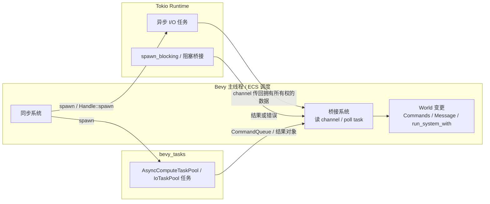

# Bevy 0.19 中后台线程与 Tokio 异步的安全集成教程

## 执行摘要

这份教程的结论可以先说在前面：**在 Bevy 0.19 里，后台线程或 Tokio 任务不应该直接持有并跨 `await` 操作 ECS `World`、`Commands`、`ResMut<T>`、`Query` 等系统借用；正确做法是让异步侧只处理“拥有所有权的数据”和 I/O，然后通过 `channel`、`Message`、`CommandQueue`、`run_system_with` 之类的桥接手段，把结果交回主线程中的 Bevy 系统去落地到 ECS 世界。**这正是 Bevy 官方异步示例所展示的主线：外部线程 + channel、异步任务 + channel、以及 `AsyncComputeTaskPool` + `Task<CommandQueue>` + `check_ready`。

从资料选择上，我按你的要求**先覆盖 `github.com` 与 `bevy.org`**：先看了 Bevy 官方仓库、GitHub 示例、bevy.org 的 `Learn / Examples / News`，再交叉核对 Bevy 0.19 的 API 文档、0.19 发布说明、Tokio 官方教程/文档，以及 Rust 官方异步指南。需要特别注意的是，Bevy 官方仓库自己也提醒：**`main` 分支示例可能与当前 release API 不一致，阅读 release 版代码时应使用 `latest` 或具体 tag**；因此本教程对关键模式都尽量和 bevy.org 当前示例页、Bevy 0.19 rustdoc 一起交叉验证。

另一个重要结论是：**Bevy 0.19 官方路径并不是“直接写 `async fn system`”**。在我检索到的官方资料里，异步工作主要通过 `bevy::tasks`、消息、观察者和命令队列完成；社区里确实有 `bevy_async_task`、`bevy_async_ecs`、`bevy_async_system` 这类生态，但至少公开写明兼容矩阵的前两个，在文档中仍主要标到 Bevy 0.18，而不是 0.19，因此在 0.19 项目里不应直接假定它们“开箱即用”。所以本教程把“async system（bevy_async 或 bevy_tasks 相关）”落实为**Bevy 0.19 官方可行的 `bevy_tasks` 风格：同步系统负责 spawn / poll，真正的异步体在后台 future 中执行**。

## 前提假设与资料边界

按你的要求，未明确指定的项我都保留为“未指定”；但为了让示例真的能跑，我同时给出“实现时默认值”。此外，本次检索中能找到的高质量中文原始资料，**Tokio 侧相对充足**，而 **Bevy 侧仍主要是 `bevy.org`、GitHub 与 `docs.rs` 原文**，因此中文部分我优先使用 Tokio 中文镜像，其余以英文/原始资料为补充。

| 项目 | 设定 | 说明 |
|---|---|---|
| Rust 版本 | 未指定 | 用户要求标为未指定。补充说明：Bevy 主仓当前开发清单使用 `edition = "2024"` 且 `rust-version = "1.87.0"`；如果你参考 GitHub 主分支示例，最好让 toolchain 保持较新，并优先切到 release tag。 |
| Bevy 版本 | 0.19 | 本教程全部以 Bevy 0.19 API 为目标，关键说明同时参考了 Bevy 0.19 发布说明与 0.19 rustdoc。 |
| Tokio 版本 | 未指定 | 用户要求标为未指定。示例代码采用 `tokio = "1"`，因为 Tokio 当前稳定主线仍是 1.x，官方教程与文档也都围绕 Tokio 1 展开。 |
| 操作系统 | 未指定 | 示例默认面向原生桌面环境。对于 WebAssembly，Bevy 的 task pool API 虽保持一致，但执行会退化为单线程；Tokio 的 `spawn_local` / `LocalRuntime` 则适用于 `!Send` 或单线程语境。 |
| 多线程限制 | 未指定 | 示例一、二默认假设“可创建原生线程 + 可运行 Tokio 多线程 runtime”。若目标是 wasm，`std::thread::spawn` 和 Tokio 多线程 runtime 设计通常不能直接照搬。 |
| 第三方 async system crate | 不作为默认前提 | `bevy_async_task`、`bevy_async_ecs` 的公开兼容表目前主要写到 Bevy 0.18；因此本教程不把它们当作 0.19 的默认方案。 |

如果你是**原生桌面、稳定 Rust、Bevy 0.19、Tokio 1.x**，下面三份示例可以直接复制粘贴编译。若你要跑到 WebAssembly、移动端或纯 headless 服务器，则需要额外处理线程模型差异。Bevy 官方 `bevy::tasks` 文档明确写到：这些 task pool 在单线程环境下 API 不变，但执行会被限制为单线程，这一点对 wasm 尤其关键。

## 背景与动机

在 Bevy 应用里引入后台线程或 Tokio，最常见的动机并不是“把 ECS 变成 async”，而是把**不适合阻塞主帧调度**的工作拆出去：例如网络请求、长时间 I/O、数据库访问、遥测上报、AI 推理排队、后台文件处理，或者与外部系统的持续数据流对接。Bevy 官方 async 示例本身就分别展示了三种典型需求：外部线程持续产出数据流、后台异步任务完成后通知主线程、以及把后台计算结果打包为 `CommandQueue` 再回到 ECS。

Tokio 的定位也决定了它适合做“异步 I/O 编排器”，而不是直接取代 Bevy 自己的帧调度。Tokio 官方文档强调，它通过在少量线程上反复切换 task 来并发运行很多 future；但这种切换只能发生在 `.await` 处，因此**长时间不 `await` 的代码会阻塞其他 Tokio task 的推进**。Tokio 还区分了 core threads 与 blocking threads，并明确建议对阻塞工作使用 `spawn_blocking`，对真正 CPU-bound 的大块计算考虑单独线程池。

Rust 官方书也提醒，异步和线程是两种不同层次的并发工具：单核上它们都可能只是“并发而非并行”，多核上才可能进一步并行。因此，在 Bevy 里最务实的做法通常是：**ECS 继续负责主线程上的数据一致性与帧时序，Tokio 负责网络/I/O future，Bevy task pools 负责和 ECS 更靠近的后台任务**。这也是官方资料最一致的设计方向。

下面这张示意图概括了推荐数据流：



这个图里最关键的一条边是：**异步侧回来的永远是“数据”或“延迟命令”，不是活着的 ECS 借用**。这正是后面所有模式的共同安全基础。

## 设计原则与安全模型

### 线程安全与 Send Sync

Rust 并发的底层护栏仍然是 `Send` / `Sync`。Rust 官方书强调：由 `Send`、`Sync` 组成的类型通常会自动取得这些标记，而手工实现它们属于 `unsafe` 级别的责任；类型系统和借用检查器用这些规则来阻止数据竞争。

这条规则在 Bevy 0.19 里直接体现到消息系统上：`Message` trait 明确要求 `Send + Sync + 'static`。也就是说，你想把后台结果桥接回 ECS，如果选择 `MessageWriter` / `MessageReader` 路线，那么消息类型本身必须是线程安全、静态生命周期、可独立拥有的数据。

Tokio 侧也是同样原则。`tokio::spawn` 的官方文档写得很直接：被 spawn 的 future 必须是 `Send + 'static`，输出也必须是 `Send + 'static`；如果你需要跑 `!Send` future，就要用 `spawn_local`，而它只能在 `LocalSet` 或 `LocalRuntime` 里使用。

### ECS 借用规则与为什么不能把系统参数带进异步任务

Bevy 的系统参数，例如 `Commands`、`ResMut<T>`、`Query<...>`、`MessageWriter<T>`，本质上都依赖于当次系统执行期内的借用上下文。它们适用于“这一帧、这次调度、这个系统调用”，**不适合被 move 到后台 future 里跨越 `.await`**。官方 `Commands` 文档给出的正确扩展方式是：在系统里**排队命令**、注册系统回调，或者把后台结果打包到 `CommandQueue`。

Bevy 0.19 的 `Messages<M>` 与 `Observer` 也把两类桥接路径分得很清楚：`Message` 是**pull-based / 缓冲式 / 固定调度点处理**；`Observer` 则是**push-based / 对 Event 触发立即响应**。如果你的后台结果是“可以下一帧批量处理的数据”，`Message` 更自然；如果你要的是“触发行为”，就更接近 `Event + Observer`。

### 命令缓冲与延迟落地

`CommandQueue` 在 Bevy 里是非常关键的桥接容器。官方文档把它描述为一个**高效存储异构 `Command` 的命令队列**；而 `Commands::append` 则可以把后台 future 返回的命令队列，安全地并入主线程的 world queue，稍后统一执行。官方 `async_compute` 示例正是用这一路径：后台任务计算完后不直接改世界，而是返回 `CommandQueue`；主线程系统用 `check_ready` 询问任务是否完成，完成后 `append` 进去。

Bevy 0.19 发布说明里还特别强调了 **Delayed Commands**：你现在可以更直接地把命令安排到未来执行。这虽然不是“异步线程访问 ECS”，但对“后台结果到了以后，需要延后 1 秒再落地”的场景非常实用。

### 锁、通道与异步环境中的常见误区

Rust Async Book 建议：在异步环境里，**优先考虑消息传递**，而不是长时间共享锁。它还特别提醒，异步 `Mutex` 可以跨 `await` 持有，因此比 `std::Mutex` 更昂贵，也更容易因 guard 持有过久而形成“看起来没卡死、实际上局部饥饿/死锁”的问题。

Tokio 中文教程也明确指出：`std::sync::mpsc`、`crossbeam::channel` 这类“阻塞线程”的 channel 不适合在 async task 内部直接阻塞等待；但把它们用于**async 侧向同步 ECS 侧回传结果**却非常自然，因为接收方本来就是同步系统。Bevy 官方外部线程示例更进一步直接说明了：它使用 `crossbeam_channel`，其中一个原因是 std 的 `Receiver` 并不适合作为 Bevy 资源的那个模式。

### Bevy 0.19 新变化对本主题的影响

Bevy 0.19 有三条与你的主题相关的变化值得记住。第一，**Resources as Components** 让资源在内部模型上更接近 singleton entity 上的组件，这统一了很多内部机制；但这并不改变系统借用必须经由 `Res/ResMut` 或 `World` 访问的事实，更不意味着你能在后台任务里直接拿着资源引用跑。第二，**Cancellable Web Tasks** 修复了 Web 端任务取消语义的历史问题。第三，**Delayed Commands** 使“异步结果先回来，再延后落地”更顺手。

## 常见交互模式与选型

下表不是 benchmark，而是基于 Bevy 官方异步示例、`Message` / `Observer` / `Commands` 文档、Tokio runtime/channel 文档做的**架构级比较**；“延迟”列表示的是通常的落地路径，而不是精确测量值。

| 模式 | 与 ECS 的交互方式 | 优点 | 缺点与风险 | 典型延迟 | 适用场景 | 示例复杂度 |
|---|---|---|---|---|---|---|
| `channels` | 主线程系统 `try_iter()` / `try_recv()` 后再写入 `Commands` 或 `MessageWriter` | 最直观；适合外部线程或 Tokio runtime 持续推送数据 | 容易积压；无界通道会涨内存；bounded 通道可能产生背压 | 通常 1 帧内，取决于主线程 drain 频率 | 网络消息、传感器数据流、后台日志、持续推送 | 低 |
| `Commands` / `CommandQueue` | 后台任务返回延迟命令；主线程 `append()` | 能把多步世界修改打包成一个原子批次；官方示例支持最好 | 需要显式轮询任务；命令里若引用失效实体要自己防守 | 通常 1 帧到数帧，取决于任务完成与轮询点 | 一次性结果、批量生成/插入组件、复杂 ECS 落地 | 中 |
| 资源克隆 | spawn 前把 `Res<T>` 克隆成拥有所有权的数据 | 非常安全；最符合 Rust 借用模型 | 资源过大会有拷贝成本；可能读取到“旧快照” | 无固定值，取决于你如何回传结果 | 配置快照、资产句柄、只读参数、不可变输入 | 低 |
| 系统回调 `register_system + run_system_with` | 主线程把异步结果作为 typed input 交给注册系统 | 类型安全、解耦、适合复用落地逻辑 | 官方文档说明它是独占、单线程执行；慢系统会成为瓶颈 | 通常 1 帧内 | typed apply、一次性操作、UI 触发回调、任务完成回调 | 中 |
| `bevy_tasks` | 同步系统 spawn/poll `Task`；后台 future 完成后返回值或 `CommandQueue` | 与 Bevy 调度天然兼容；官方示例多；wasm API 一致 | 不是 Tokio；要自己区分 `AsyncComputeTaskPool` / `IoTaskPool`；仍需桥接到 World | 取决于轮询频率；通常 1 帧到数帧 | CPU 预处理、资源准备、与 ECS 紧耦合的后台任务 | 中到高 |

如果你只想记住一个决策树，可以这样判断：**外部持续流数据用 channel；一次性任务结果且需要批量写 ECS 用 `CommandQueue`；想要“结果到了就走一段 typed ECS 逻辑”用 `run_system_with`；需要 Bevy 官方、跨平台、贴近帧调度的后台 future，则优先 `bevy_tasks`。**对于真正的网络 I/O 或复杂 async 生态，则让 Tokio 负责任务执行，把消息/结果交还 Bevy。

## 详细示例代码

下面的三个示例都尽量保持**完整可编译、可直接复制粘贴**。为了聚焦并发模型，我没有引入真正的 HTTP 客户端，而是用 `tokio::time::sleep` 模拟 I/O。这样依赖更轻、行为更稳定，也更能突出 ECS 交互边界。对于真实项目，把“模拟 I/O”替换成 `reqwest`、数据库驱动或 socket 逻辑即可。相关的运行时组织方式完全一样。

### 示例一

这个示例展示**在后台线程中启动 Tokio runtime**，让它持续运行异步 task，然后通过 `crossbeam_channel` 把结果送回主线程；主线程系统把 channel 数据桥接成 Bevy `Message`，再由另一个系统消费。它对应的是“外部数据源 / 持续流 / 后台 daemon”的典型模式，也非常接近 Bevy 官方 `external_source_external_thread` 示例。官方示例还特地说明：它使用 `crossbeam_channel`，而不是 `std::sync::mpsc::Receiver`。

#### Cargo.toml

```toml
[package]
name = "bevy_tokio_thread_channel"
version = "0.1.0"
edition = "2024"

[dependencies]
bevy = "0.19"
tokio = { version = "1", features = ["rt-multi-thread", "time"] }
crossbeam-channel = "0.5"
```

#### src/main.rs

```rust
use bevy::prelude::*;
use crossbeam_channel::{bounded, Receiver};
use std::time::Duration;

fn main() {
    App::new()
        .add_plugins(DefaultPlugins)
        .add_message::<BackendTick>()
        .init_resource::<SeenTicks>()
        .add_systems(Startup, setup_background_runtime)
        .add_systems(Update, (bridge_channel_to_messages, consume_backend_ticks))
        .run();
}

#[derive(Debug, Clone)]
struct TickPayload {
    seq: u64,
    text: String,
}

#[derive(Resource, Deref)]
struct BackendRx(Receiver<TickPayload>);

#[derive(Message, Debug, Clone)]
struct BackendTick(TickPayload);

#[derive(Resource, Default)]
struct SeenTicks(u64);

fn setup_background_runtime(mut commands: Commands) {
    // bounded channel：避免主线程处理不过来时无限积压。
    let (tx, rx) = bounded::<TickPayload>(256);

    std::thread::spawn(move || {
        let runtime = tokio::runtime::Builder::new_multi_thread()
            .worker_threads(2)
            .enable_time()
            .build()
            .expect("failed to build Tokio runtime");

        runtime.block_on(async move {
            let mut seq = 0_u64;
            let mut ticker = tokio::time::interval(Duration::from_millis(500));

            loop {
                ticker.tick().await;

                let payload = TickPayload {
                    seq,
                    text: format!("来自 Tokio 后台线程的 tick #{seq}"),
                };

                // 主线程退出时，接收端会被 drop；send 失败后退出后台循环。
                if tx.send(payload).is_err() {
                    break;
                }

                seq += 1;
            }
        });
    });

    commands.insert_resource(BackendRx(rx));
}

fn bridge_channel_to_messages(
    rx: Res<BackendRx>,
    mut writer: MessageWriter<BackendTick>,
) {
    // try_iter() 不阻塞主线程。
    for payload in rx.try_iter() {
        writer.write(BackendTick(payload));
    }
}

fn consume_backend_ticks(
    mut reader: MessageReader<BackendTick>,
    mut seen: ResMut<SeenTicks>,
) {
    for BackendTick(payload) in reader.read() {
        seen.0 += 1;
        info!(
            "主线程收到后台消息: seq={}, text={}, total_seen={}",
            payload.seq,
            payload.text,
            seen.0
        );
    }
}
```

#### 运行说明

直接运行 `cargo run` 即可。程序会打开一个 Bevy 窗口，并在控制台持续输出后台 Tokio task 产出的 tick 日志。

#### 为什么这个例子是安全的

安全点只有一个核心：**后台侧从不接触 `World`，它只拥有 `Sender<TickPayload>`；ECS 侧的写入只发生在 Bevy 系统里**。消息类型 `BackendTick` 需要满足 `Send + Sync + 'static`，而 `Message` trait 本身就要求这一点；`MessageWriter` / `MessageReader` 会在受调度控制的系统里进行固定点处理。

#### 何时使用

当你的后台逻辑是“持续运行、持续产出结果”，例如网络 listener、传感器、日志采集、远端控制通道、数据库变更订阅，或者你就是想照着 Tokio 官方“同步主程序 + 另起 runtime 线程”的桥接思路来组织 GUI / 游戏主循环时，这个模式很合适。Tokio 官方 bridging 指南就把“主线程同步、旁边另起一个 runtime”当作推荐姿势之一。

#### 替代方案

如果结果不是“持续流”，而是“一次性返回”，你可以直接把后台结果送进 `CommandQueue`；如果你不需要 Tokio，只是要在 Bevy 内部跑后台 future，则官方更偏向 `AsyncComputeTaskPool` 或 `IoTaskPool`。如果你要的是“触发某类行为”而不是“缓冲数据”，也可以用 `Event + Observer` 风格。

#### 潜在风险与调优建议

最常见的问题是**通道积压**。无界通道简单，但在主线程掉帧时容易涨内存；本例用有界通道是为了让背压尽早显性化。另一个风险是误把阻塞接收放进系统里；Bevy 官方示例使用 `try_iter()`，Tokio 中文教程也强调同步阻塞 channel 不应在异步 task 内部直接阻塞等待。主线程 drain 最好一帧做一次，若消息很多，可以分批处理，避免一帧内清空所有 backlog 造成尖峰。

### 示例二

这个示例展示**在 Bevy 系统里发起 Tokio 任务**，但不把 ECS 借用带进异步体中。相反，系统先把只读配置克隆出来，再用 Tokio runtime `Handle` spawn 一个任务；任务完成后把结果写进 channel；主线程再用 `commands.run_system_with` 把结果交给一个已注册的 ECS 回调系统落地。这同时覆盖了你要求的几个关键点：**系统内 spawn Tokio 任务、资源复制快照、调度回调、安全修改 ECS**。Bevy 官方文档明确说明 `register_system` / `run_system_with` 可以用于这种 push-based 的系统调用，而 `run_system_with` 是独占、单线程的，因此适合“结果已到，执行一段短小 ECS 收尾逻辑”的场景。

#### Cargo.toml

```toml
[package]
name = "bevy_tokio_spawn_and_callback"
version = "0.1.0"
edition = "2024"

[dependencies]
bevy = "0.19"
tokio = { version = "1", features = ["rt-multi-thread", "time"] }
crossbeam-channel = "0.5"
```

#### src/main.rs

```rust
use bevy::ecs::system::SystemId;
use bevy::prelude::*;
use crossbeam_channel::{unbounded, Receiver, Sender};
use std::sync::Arc;
use std::time::{Duration, Instant};

fn main() {
    App::new()
        .add_plugins(DefaultPlugins)
        .add_systems(Startup, setup)
        .add_systems(Update, (spawn_request_once, drain_results))
        .run();
}

#[derive(Resource, Clone)]
struct TokioRuntime(Arc<tokio::runtime::Runtime>);

#[derive(Resource, Clone)]
struct AppConfig {
    greeting_prefix: String,
}

#[derive(Resource)]
struct ResultChannel {
    tx: Sender<JobResult>,
    rx: Receiver<JobResult>,
}

#[derive(Resource)]
struct ApplyJobSystem(SystemId<In<JobResult>, ()>);

#[derive(Resource)]
struct TargetEntity(Entity);

#[derive(Resource, Default)]
struct Stats {
    completed: usize,
}

#[derive(Component)]
struct PendingGreeting;

#[derive(Component, Debug)]
struct GreetingText(String);

#[derive(Debug, Clone)]
struct JobResult {
    entity: Entity,
    text: String,
    latency_ms: u128,
}

fn setup(mut commands: Commands) {
    let runtime = tokio::runtime::Builder::new_multi_thread()
        .enable_time()
        .build()
        .expect("failed to build Tokio runtime");

    let (tx, rx) = unbounded();

    let entity = commands
        .spawn((Name::new("greeting-target"), PendingGreeting))
        .id();

    // 把应用结果的逻辑注册成一个“可被命令触发”的系统。
    let apply_system = commands.register_system(apply_job_result);

    commands.insert_resource(TokioRuntime(Arc::new(runtime)));
    commands.insert_resource(AppConfig {
        greeting_prefix: "你好".to_string(),
    });
    commands.insert_resource(ResultChannel { tx, rx });
    commands.insert_resource(ApplyJobSystem(apply_system));
    commands.insert_resource(TargetEntity(entity));
    commands.init_resource::<Stats>();
}

fn spawn_request_once(
    runtime: Res<TokioRuntime>,
    config: Res<AppConfig>,
    channel: Res<ResultChannel>,
    target: Res<TargetEntity>,
    mut fired: Local<bool>,
) {
    if *fired {
        return;
    }
    *fired = true;

    // 关键点：把 ECS 资源中的只读数据“复制/克隆”为拥有所有权的快照，
    // 再 move 进 Tokio future。不要把 Res / ResMut / Query 直接带进去。
    let greeting_prefix = config.greeting_prefix.clone();
    let tx = channel.tx.clone();
    let entity = target.0;
    let handle = runtime.0.handle().clone();

    handle.spawn(async move {
        let started = Instant::now();

        // 这里用 sleep 模拟一次真实的异步 I/O。
        tokio::time::sleep(Duration::from_secs(1)).await;

        let result = JobResult {
            entity,
            text: format!("{greeting_prefix}，Bevy ECS！"),
            latency_ms: started.elapsed().as_millis(),
        };

        // 背景侧只发送拥有所有权的数据，不直接操作 World。
        let _ = tx.send(result);
    });
}

fn drain_results(
    mut commands: Commands,
    channel: Res<ResultChannel>,
    apply_system: Res<ApplyJobSystem>,
) {
    for result in channel.rx.try_iter() {
        // 把“如何应用结果”的逻辑延迟给一个已注册系统执行。
        commands.run_system_with(apply_system.0, result);
    }
}

fn apply_job_result(
    In(result): In<JobResult>,
    mut commands: Commands,
    mut stats: ResMut<Stats>,
    pending_query: Query<(), With<PendingGreeting>>,
) {
    // 这里做一个保守检查：如果目标实体已经不再处于 Pending 状态，就跳过。
    if pending_query.get(result.entity).is_ok() {
        commands
            .entity(result.entity)
            .insert(GreetingText(result.text.clone()))
            .remove::<PendingGreeting>();
    }

    stats.completed += 1;
    info!(
        "回调系统已应用结果: entity={:?}, text={}, latency={}ms, completed={}",
        result.entity,
        result.text,
        result.latency_ms,
        stats.completed
    );
}
```

#### 运行说明

直接执行 `cargo run`。程序启动后会在第一次 `Update` 时发起一次后台请求；大约 1 秒后，结果会回到主线程，由回调系统写入 ECS，并打印日志。

#### 为什么这个例子是安全的

这个例子的安全性来自三个层面的隔离。第一，Tokio 任务只持有**克隆出来的配置快照、`Entity` id 和 `Sender`**，不会持有任何活着的系统借用。第二，真正的 ECS 变更发生在主线程系统 `apply_job_result` 中。第三，`run_system_with` 的语义是通过命令在世界里运行已注册系统，官方文档明确指出它是**独占且单线程**的，因此不会把这个回调和别的可冲突可变借用并发执行。

#### 何时使用

当你想把“异步工作”和“应用到 ECS 的逻辑”明确拆开时，这个模式特别好用。它适合请求-响应型任务：例如一次 HTTP 拉取、一次数据库查询、一次认证、一次 matchmaking、一次后台脚本执行。好处是**返回值是强类型的**，落地逻辑也被包成明确的系统，后续测试和重用都很方便。

#### 替代方案

如果你的“应用结果”很简单，也可以不走 `run_system_with`，而是在 `drain_results` 里直接 `commands.entity(...).insert(...)`。如果你更偏向“数据总线”，则可把 `JobResult` 转写成 `MessageWriter<JobFinished>`。如果异步量很大，而且你不一定需要 Tokio 生态，也可以直接退回 `bevy_tasks + channel`。

下面是一段把 `drain_results` 改成 `MessageWriter` 的极简变体：

```rust
#[derive(Message, Debug, Clone)]
struct JobFinished(JobResult);

fn drain_results_as_messages(
    channel: Res<ResultChannel>,
    mut writer: MessageWriter<JobFinished>,
) {
    for result in channel.rx.try_iter() {
        writer.write(JobFinished(result));
    }
}
```

#### 潜在风险与调优建议

最大的风险不是“线程安全”，而是**逻辑时序**。官方 `Messages<M>` 文档提醒：消息写入与读取如果没有良好排序，可能会出现“这帧还是下帧读到”的差异；而 `run_system_with` 又是独占执行，因此如果回调系统写得很重，就会拖慢主线程。因此，**把大工作留在后台，把小而确定的 ECS 收尾留在回调系统**，是最好的分工。

### 示例三

先说解释：如果你把“async system”理解成“直接写 `async fn my_system(...)` 并丢给 Bevy 0.19 官方调度器运行”，那**并不是官方主路径**。官方示例与文档里更常见的做法是：**同步系统负责启动和轮询后台 future**，真正的异步体在 `bevy_tasks` 或其他 executor 上执行。社区确有第三方 crate 提供更像“async system”的抽象，但公开兼容表目前主要还停留在 0.18。所以下面的示例采用 Bevy 0.19 官方可靠做法：**用 `AsyncComputeTaskPool` 启动一个 Bevy task，在该 task 中再 mix 一个 Tokio task，最终返回 `CommandQueue` 给主线程 poll / append**。这既满足了“bevy_tasks 相关”，也保持了 0.19 API 兼容。

#### Cargo.toml

```toml
[package]
name = "bevy_tasks_mixed_with_tokio"
version = "0.1.0"
edition = "2024"

[dependencies]
bevy = "0.19"
tokio = { version = "1", features = ["rt-multi-thread", "time"] }
```

#### src/main.rs

```rust
use bevy::{
    ecs::world::CommandQueue,
    prelude::*,
    tasks::{futures::check_ready, AsyncComputeTaskPool, Task},
};
use std::sync::Arc;
use std::time::Duration;

fn main() {
    App::new()
        .add_plugins(DefaultPlugins)
        .init_resource::<PendingMixedTasks>()
        .add_systems(Startup, setup_runtime)
        .add_systems(Update, (kick_mixed_tasks_once, poll_mixed_tasks, report_new_results))
        .run();
}

#[derive(Resource, Clone)]
struct TokioRuntime(Arc<tokio::runtime::Runtime>);

#[derive(Resource, Default)]
struct PendingMixedTasks(Vec<Task<CommandQueue>>);

#[derive(Component, Debug)]
struct FinalValue(u32);

fn setup_runtime(mut commands: Commands) {
    let runtime = tokio::runtime::Builder::new_multi_thread()
        .enable_time()
        .build()
        .expect("failed to build Tokio runtime");

    commands.insert_resource(TokioRuntime(Arc::new(runtime)));
}

fn kick_mixed_tasks_once(
    runtime: Res<TokioRuntime>,
    mut pending: ResMut<PendingMixedTasks>,
    mut fired: Local<bool>,
) {
    if *fired {
        return;
    }
    *fired = true;

    let pool = AsyncComputeTaskPool::get();

    for job_index in 0_u32..3 {
        let handle = runtime.0.handle().clone();

        let task = pool.spawn(async move {
            // Stage A: 在 bevy_tasks future 里做一点 CPU 侧预处理。
            let preprocessed = cheap_cpu_prep(job_index);

            // Stage B: 混入一个 Tokio task，模拟网络 / 文件 / 数据库 I/O。
            let tokio_value = handle
                .spawn(async move {
                    tokio::time::sleep(Duration::from_millis(300 + 200 * job_index as u64)).await;
                    preprocessed + 7
                })
                .await
                .expect("Tokio task panicked");

            // Stage C: 不直接改 ECS，而是返回一个 CommandQueue。
            let mut queue = CommandQueue::default();
            queue.push(move |world: &mut World| {
                world.spawn((
                    Name::new(format!("job-{job_index}")),
                    FinalValue(tokio_value),
                ));
            });

            queue
        });

        pending.0.push(task);
    }
}

fn poll_mixed_tasks(
    mut commands: Commands,
    mut pending: ResMut<PendingMixedTasks>,
) {
    // retain_mut: 未完成任务保留；完成任务就把它们的 CommandQueue append 到主线程命令队列。
    pending.0.retain_mut(|task| {
        if let Some(mut queue) = check_ready(task) {
            commands.append(&mut queue);
            false
        } else {
            true
        }
    });
}

fn report_new_results(
    query: Query<(&Name, &FinalValue), Added<FinalValue>>,
) {
    for (name, value) in &query {
        info!("新的 ECS 结果实体: {}, value={}", name.as_str(), value.0);
    }
}

fn cheap_cpu_prep(seed: u32) -> u32 {
    let mut x = seed
        .wrapping_mul(1_664_525)
        .wrapping_add(1_013_904_223);
    x ^= x >> 16;
    x % 10_000
}
```

#### 运行说明

执行 `cargo run`。程序启动后会一次性创建三个混合任务：前半段在 `AsyncComputeTaskPool` future 中做准备，后半段通过 Tokio handle spawn I/O 风格任务；完成后，它们各自返回一个 `CommandQueue`，在主线程被 `append` 到 ECS。

#### 为什么这个例子是安全的

它几乎就是官方 `async_compute` 的思想扩展版：**后台 future 只生产结果和命令，不直接借用 `World`；主线程只用 `check_ready` 轮询完成状态，并在完成后 `append` 命令队列。**这里额外混入 Tokio 的地方也依然安全，因为 `Handle::spawn` 会返回一个 `JoinHandle`，而这个 handle 可以从 runtime 克隆到其他线程使用；真正的 World 修改仍晚于 Tokio 结果产生、且发生在主线程命令应用阶段。

#### 何时使用

当你的工作具有“**一部分贴近 ECS 的后台准备 + 一部分 Tokio 异步 I/O + 最后要批量落回 ECS**”的结构时，这个模式特别顺手。例如：先从 ECS 里抽一份查询参数快照，再走网络获取数据，再把结果批量生成实体；或者先做轻量计算，随后访问远端服务，最后把结果打成命令队列。

#### 替代方案

如果你的任务主要是 I/O，Bevy 自己也提供 `IoTaskPool`；如果主要是 CPU 且必须在下帧前完成，则官方建议考虑 `ComputeTaskPool`。而 Tokio 官方文档也提醒：大块 CPU-bound 任务不适合永远堆在 Tokio core threads 上，真正重计算要考虑专门线程池。

#### 潜在风险与调优建议

这个模式最容易踩的坑是**在每帧里重复 spawn 新任务**。如果没有状态门控，很容易一秒钟就积累成千上万未完成 task。另一个风险是把 `check_ready` 误写成阻塞等待；官方示例明确建议用 `check_ready`，而不要用昂贵、可能阻塞主线程的轮询方式。还有一点：如果你在 `CommandQueue` 里要操作现有实体，就要自己处理实体生命周期，因为 `Entity` 只是 id，对应实体稍后可能已经不存在了。

## 生命周期、错误处理、取消、性能与调试

### 生命周期管理

Tokio runtime 与 Bevy app 的生命周期，最好明确约束为“**runtime 作为资源存在，任务通过 handle spawn，应用退出时统一停止**”。Tokio 官方文档说明，`Runtime::handle()` 返回的 `Handle` 可以克隆并带到其他线程使用；而 `tokio::spawn` 本身必须在 runtime 上下文中调用，或者通过 `Handle::spawn` 完成。

另一方面，`Entity` 只是一个 id，不保证在异步结果落地时目标实体还存在。官方 `Entity` 文档明确指出，一个 `Entity` id 可能指向已不存在的实体。因此，后台任务若要“回写到某实体”，**要么在主线程应用前做存在性/状态检查，要么改为生成新实体、写资源、或发消息给一个更高层的协调系统**。

### 错误与取消

Tokio 的取消模型和 Bevy task 的取消模型并不完全一样。Tokio 侧，`JoinHandle` 被 drop 后**任务会继续在后台运行，相当于 detach**；想显式终止，应使用 `JoinHandle::abort()` 或 `AbortHandle::abort()`。而 Bevy `Task` 则不同：文档说明它在一般情况下**drop 会取消任务**，只有 `detach()` 后才继续跑；同时，Bevy 0.19 发布说明还提到 Web 端的 task 取消语义在这一版得到了修正。

如果你要做“优雅取消”，Tokio 官方 graceful shutdown 建议使用 `CancellationToken`。它适合把“停止请求”广播给一组后台 task。下面是一个可直接嵌入项目的最小模式：

```rust
use tokio_util::sync::CancellationToken;

#[derive(Clone)]
struct SharedCancel(CancellationToken);

async fn cancellable_job(token: CancellationToken) -> Result<(), &'static str> {
    tokio::select! {
        _ = token.cancelled() => Err("cancelled"),
        _ = tokio::time::sleep(std::time::Duration::from_secs(5)) => Ok(()),
    }
}
```

当你要停机时，只需对原 token 调用 `cancel()`，监听它的任务就会收到取消信号。

需要再多记一条：`spawn_blocking` 一旦真正开始运行，**`abort` 往往并不能中断它**；Tokio 文档对此有明确警告。所以，阻塞任务要尽量做成可分段、可检查取消，或者确保它本身很短。

### 性能选择

性能上，一个很好记的经验法则是：

- **网络 / socket / 大量 async I/O：优先 Tokio**
- **与 ECS 紧耦合、按帧轮询结果：优先 `bevy_tasks`**
- **真正大块 CPU 计算：不要让 Tokio core threads 长时间背锅**

这不是拍脑袋，而是同时来自 Bevy 与 Tokio 的官方建议：Bevy task pool 文档区分了 `AsyncComputeTaskPool`、`ComputeTaskPool` 与 `IoTaskPool`；Tokio 文档则强调长时间不 `await` 的代码会阻塞其他 task，对 CPU-bound 重活还建议考虑专门线程池。

因此在具体实现里，我建议这样调优：

首先，**尽量传快照，不传共享锁**。如果后台任务需要的只是一些配置、句柄、数字或路径，把它们 clone 出来 move 进去，比把 `Arc<Mutex<_>>` 到处传要简单也更稳定。Rust Async Book 对“锁跨 await 的风险”讲得很明确。

其次，**优先 bounded channel**。它能让背压更早暴露，而不是把问题推迟到内存飙涨。Tokio channel 教程与 Bevy channel 示例都在强调“消息传递是核心同步模式”，但“怎么设置容量”要由你按游戏主循环吞吐来定。

再次，**批量落地 ECS**。如果一个后台任务会带来多次实体修改，就优先返回 `CommandQueue`，而非每条结果都即时跑一遍独占系统。`CommandQueue` 的价值，正是让你把一批异构命令一起交回主线程。

### 调试技巧

Tokio 官方推荐使用 `tracing` 做异步任务的可观测性。这样你可以给每个 job 带上 task id、实体 id、请求 id，把后台链路和主线程应用链路串起来。

Bevy 这边，可以先从最简单的日志和 diagnostics 开始。bevy.org 官方示例里有现成的 diagnostics / FPS overlay / log diagnostics；Bevy 0.19 发布说明也提到了 diagnostics overlay。对于并发问题，这种主线程级帧诊断很有价值，因为它能帮助你判断问题是“后台没返回”，还是“主线程 drain/落地太慢”。

最后给一个实践上的总原则：**先保证“数据只在一个边界流动”，再谈优化。**在 Bevy 0.19 里，这个边界通常就是下面这几种之一：`channel -> main-thread system`、`Task<CommandQueue> -> check_ready -> append`、`result -> run_system_with`、`message -> reader`。只要你的设计始终围绕这些边界展开，线程安全、借用规则和可维护性通常都会一起变好。
