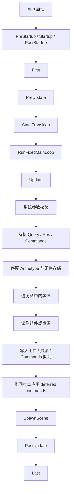
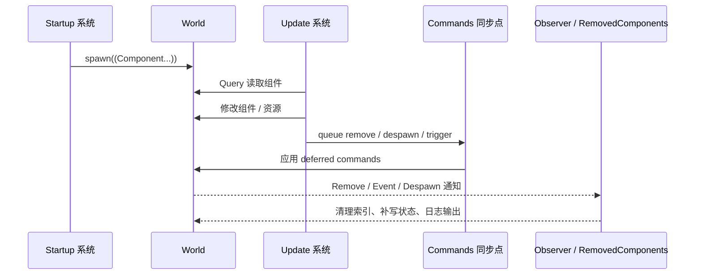

# 基于 Bevy 0.19 的 ECS 教程

## 执行摘要

Bevy 0.19 已于 2026 年 6 月 19 日正式发布到 crates.io；因此，本文按 `bevy = "0.19"` 这一稳定线来讲解，而不是按 `main` 分支或 RC 版本推导。Bevy 官方同时强调，学习时应优先看与当前发行版匹配的官方示例与迁移指南，因为 GitHub `main` 分支的示例可能与 crates.io 发布版存在不兼容差异。本文因此先以 bevy.org 的 Learn / Examples 页面和 `bevyengine/bevy` 的 `v0.19.0` 示例源码为主，再补充 docs.rs API 文档与较新的中文资料。

面向有 Rust 基础、但对 Bevy 不熟的读者，最重要的认知转变是：Bevy 的核心不是“对象 + 继承”，而是“数据 + 查询 + 调度”。组件是普通 Rust 类型；实体是组件的集合；系统是接受 `Query`、`Res`、`Commands` 等参数的普通函数；调度器根据访问冲突自动决定哪些系统可并行执行。Bevy 官方将这种模式概括为数据驱动、松耦合、并行友好与缓存友好。

在 Bevy 0.19 中，ECS 初学者最需要注意的 API 变化有三类。第一，`Resource` 现在是 `Component` 的子 trait，`#[derive(Resource)]` 会同时实现 `Component`，这让资源在内部模型上“像组件一样被管理”，但也带来了更广义查询与资源访问之间的冲突风险。第二，缓冲式系统通信的推荐 API 是 `Message` / `MessageReader` / `MessageWriter`，而立即触发型的观察者机制使用 `Event` / `EntityEvent` / `Observer`；很多旧教程里的 `EventReader` / `EventWriter` 已经不再代表 0.19 的最佳实践。第三，调度自定义执行器的方式从旧式 `ExecutorKind` 转向 `Schedule::set_executor(...)`。

如果你只想先跑起来，最短路径是：安装最新 stable Rust，创建普通 Rust 可执行项目，在 `Cargo.toml` 里写 `bevy = "0.19"`，然后先做一个只有窗口、相机和清屏色的最小程序。官方 Quick Start 明确说明，Bevy 的 MSRV 策略就是“始终跟随最新稳定版 Rust”；官方 Setup 页也给出了调试期推荐的 `opt-level` 配置以及 `dynamic_linking` 的快速编译方案。

接下来这份教程会把 ECS 讲成两条线并行推进：一条是概念线，解释实体、组件、系统、资源、查询、调度、消息与观察者事件；另一条是实战线，逐步完成最小窗口、实体增删查、系统调度、资源与事件通信、变更检测与性能、以及 `World` / 反射 / 动态组件的进阶主题。所有示例都以 0.19 语法编写，并在适当处指出常见错误和迁移坑位。

## 学习路径与资料优先级

本文遵循“官方网页优先、官方仓库次之、API 文档补细节、中文资料作辅助”的顺序。Bevy 官网 Learn 页面把 Quick Start、Migration Guides、API Docs、Examples、Errors 和 FAQ 都集中在一个入口；官方还明确推荐“Examples”是学习功能与用法的最好方式之一。与此同时，GitHub 仓库中的 `examples/` 目录覆盖了 ECS、调度、查询、观察者、资源、窗口、反射等主题，并且官方 README 明确把这些示例列为最值得挖掘的学习材料。

这里需要特别提醒一个经常踩坑的点：官方 GitHub 示例页面自己就写明了，`main` 分支和 crates.io 最新发布版之间“常常存在很大差异和不兼容 API 变化”，因此如果你使用的是发布版 Bevy，就应该查看正确的版本标签或 `latest` 发布分支。本文引用示例时尽量落到 `v0.19.0` 标签，以避免“文档写的是今天、代码却是明天”的错配。

中文资料方面，较新的《Bevy 之书》已经包含 Query、Storage、Schedule 等章节，并且在组件存储策略、查询类型系统与主循环调度顺序上提供了比官方 Quick Start 更长篇的中文解释；不过它本质上仍属于社区资料，所以遇到具体签名、feature 或迁移细节时，仍应以 bevy.org 与 docs.rs 为准。

## ECS 核心概念与数据模型

Bevy 官方 ECS 指南把几个关键名词定义得非常清楚：组件是“普通 Rust 数据类型”；实体是“带唯一 ID 的组件集合”；资源是“共享全局数据”；系统是“作用于实体、组件与资源的逻辑”。这四者刚好构成了你日常写 Bevy 游戏逻辑的最小语言。换句话说，Bevy 并不会要求你学习一套陌生的脚本式 DSL；你写的仍然是普通 Rust 函数和结构体，只是由调度器负责在合适的时间把数据“注入”进去。

对初学者最有帮助的理解方式，是把 ECS 想成“数据库 + 查询引擎 + 批处理任务”。实体像主键，组件像列，资源像全局配置表，`Query` 像筛选和投影，系统像批处理逻辑，调度器像执行计划。Bevy 官方主页把这种方式归纳为“查询、全局资源、局部资源、变更检测和无锁并行调度器”；而官方 ECS 示例则强调它的数据导向、松耦合和高性能特征。

查询是系统访问 ECS 数据的主要入口。官方 Query 模块文档显示，Bevy 0.19 的查询生态很丰富：你可以取 `&T`、`&mut T`、`Entity`、`Option<&T>`、`AnyOf<...>`、`Has<T>`、`Ref<T>`，也可以用 `With<T>`、`Without<T>`、`Added<T>`、`Changed<T>`、`Or<...>` 等过滤器控制匹配范围。与此同时，`Single<D, F>` 作为系统参数可以要求“恰好只有一个匹配实体”，不满足时系统验证会失败并被跳过。

需要额外区分的，是 Bevy 0.19 中“消息”和“观察者事件”这两种通信风格。`Message` 是缓冲式、按调度固定同步点处理的系统间通信；`Event` / `EntityEvent` 则服务于 observers，是推送式、可立即触发的响应机制。官方文档明确写到：消息更适合批量处理和可预测的调度；观察者事件则更适合“某件事刚发生，就立刻响应”。因此，教程里如果你看到“事件系统”这个老说法，在 0.19 语境里最好先问一句：这里说的是 queued message，还是 observer event。

下表按官方 storage/query 文档与较新的中文《Bevy 之书》整理，帮助你把“组件如何存”和“查询怎么取”这两件事对齐起来。

| 主题     | 选项                      | 适合场景                              | 关键特点                                            |
| -------- | ------------------------- | ------------------------------------- | --------------------------------------------------- |
| 组件存储 | `Table`                   | 频繁遍历、很少增删的组件              | 连续列式存储，顺序遍历更快，默认选择                |
| 组件存储 | `SparseSet`               | 频繁 `insert/remove` 的标签或状态组件 | 随机访问与增删更友好，但遍历通常不如 Table          |
| 查询取数 | `&T`                      | 只读访问                              | 有利于并行调度                                      |
| 查询取数 | `&mut T`                  | 修改组件                              | 与其它对同组件的访问容易形成冲突                    |
| 查询取数 | `Entity`                  | 需要实体 ID                           | 常配合 `Commands::entity(...)` 使用                 |
| 查询取数 | `Option<&T>`              | 组件可有可无                          | 适合“软依赖”数据                                    |
| 查询取数 | `AnyOf<(A, B, ...)>`      | 多选一读取                            | 用于“任意一种组件即可”的场景                        |
| 查询取数 | `Ref<T>`                  | 想保留全部结果，同时检查变更          | 可用 `is_changed()` / `is_added()`                  |
| 查询过滤 | `With<T>` / `Without<T>`  | 收窄匹配集合                          | 也是解决 B0001 冲突的常见办法                       |
| 查询过滤 | `Added<T>` / `Changed<T>` | 初始化或增量处理                      | 语义直观，但不是 archetype filter，超大查询上要谨慎 |
| 查询过滤 | `RemovedComponents<T>`    | 响应组件移除                          | 读的是移除消息，而不是直接再取到被删组件            |

如果你对“为什么 ECS 适合并行”还不够直观，可以记住这一条：调度器并不是“猜”系统会不会冲突，而是根据系统参数的只读 / 可写访问集合去推断安全并行的上界。也因此，参数签名本身就是 Bevy 程序设计的一部分。官方错误页 B0001、B0002 本质上都在提醒你：一旦参数签名表达出可能违反 Rust 借用规则的访问模式，系统就会报错或 panic。

## 安装与项目设置

官方 Setup 页面给出的前提条件很直接：使用最新稳定版 Rust；Windows 安装 MSVC 与 Windows SDK；macOS 安装 Xcode Command Line Tools；Linux 按官方依赖说明准备系统包。Quick Start 还明确建议使用支持 `rust-analyzer` 的编辑器。对本文读者而言，这意味着无论你在 Windows、macOS 还是 Linux，只要先具备一套标准 Rust 开发环境，就能直接开始。

最简单的项目创建方式如下。官方示例就是先 `cargo new`，再添加 `bevy` 依赖。官方 Setup 页给出的手工写法已经更新到 0.19，因此直接照抄即可。

```toml
[package]
name = "my_bevy_game"
version = "0.1.0"
edition = "2024"

[dependencies]
bevy = "0.19"
```

如果你只是学习 ECS，而不是立刻做完整 2D/3D 游戏，那么默认 feature 够用，但你最好知道 Bevy 0.19 的 feature 组织方式已经比旧版本更细。`default` 目前由 `2d`、`3d`、`ui`、`audio` 四个 profile 组成；`dev` 集合会启用调试工具和热重载相关能力；`default_platform` 集合里包含窗口、输入、多线程、WebGL2、`x11`、`wayland` 等平台能力。特别要注意的是，0.19 迁移指南明确指出：`audio` 不再被 `2d` / `3d` / `ui` 自动隐式开启；`ui` 也不再被 `2d` / `3d` 自动隐式开启，所以精简 feature 时要显式声明你需要的能力。

一个比较实用的“精简但不至于太窄”的桌面配置可以写成下面这样。它尤其适合你只做 2D、UI 和基础音频、又想缩小编译负担的时候。

```toml
[package]
name = "my_bevy_game"
version = "0.1.0"
edition = "2024"

[dependencies]
bevy = { version = "0.19", default-features = false, features = [
    "2d",
    "ui",
    "audio",
    "x11",
    "wayland",
] }
```

调试阶段的编译与运行性能，官方给了两层建议。第一层是给 dev profile 一点优化，同时给依赖更高的 `opt-level`，这样调试构建不会慢得离谱；第二层是开发期可选开启 `bevy/dynamic_linking` 以明显缩短迭代编译时间。官方示例配置如下。

```toml
[profile.dev]
opt-level = 1

[profile.dev.package."*"]
opt-level = 3
```

开发期如果你更在意“改一行、快点重编”，可以这样运行：

```bash
cargo run --features bevy/dynamic_linking
```

如果你是首次构建 Bevy，官方也提前打了预防针：第一次编译会比较久，因为你等于是把一整个引擎从头编出来；后续增量编译会快很多。这个预期管理非常重要，免得你还没开始学 ECS，就先被首编时间吓退。

## 逐步实战示例

### 最小可运行示例

官方 `clear_color.rs` 示例非常适合作为第一个 Bevy 程序：插入 `ClearColor` 资源、添加 `DefaultPlugins`、启动时生成一个 `Camera2d`。官方示例还说明了清屏色的意义：它就是每帧绘制前用来填充窗口的背景色。

```rust
use bevy::prelude::*;

/// 这是最小可运行的 Bevy 0.19 程序：
/// - 创建 App
/// - 设置窗口清屏色
/// - 加载默认插件
/// - 在启动阶段创建一个 2D 相机
fn main() {
    App::new()
        // ClearColor 是一个全局资源，控制窗口背景色。
        .insert_resource(ClearColor(Color::srgb(0.08, 0.09, 0.12)))
        // DefaultPlugins 会带上窗口、输入、时间、日志、渲染等常用功能。
        .add_plugins(DefaultPlugins)
        // Startup 调度只在启动时运行一次，适合做初始化。
        .add_systems(Startup, setup)
        .run();
}

/// 初始化系统：生成一个 2D 相机。
fn setup(mut commands: Commands) {
    commands.spawn(Camera2d);
}
```

这段代码的运行预期非常明确：程序弹出一个窗口，背景是深色纯色，没有其它实体可见，但程序已经完成了一个标准 Bevy App 的最小生命周期：App 构建、插件加载、Startup 初始化、进入主循环。官方主调度文档显示，`Startup` 在首次运行时执行一次，随后每帧进入 `First → PreUpdate → ... → Update → PostUpdate → Last`。

最常见的错误有两个。一个是忘了生成相机，然后你会看到窗口但什么逻辑都不直观；另一个是把旧教程里的 `.add_startup_system(setup)` 原样抄到 0.19 里。那种写法在更早版本里很常见，但从调度 API 统一之后，当前正确写法是 `.add_systems(Startup, setup)`。

调试建议很简单：先保证窗口能出来，再逐步加实体和系统；如果不确定 App 是否真的跑进去了，在 `setup()` 里加一条 `info!("setup done")`，或者直接用 `println!` 断言启动阶段确实执行。官方日志示例与 Quick Start 都推荐先用最短路径确认工程没问题，再进入更复杂的 ECS 结构。

### 实体与组件创建删除查询示例

这一段重点不是“画东西”，而是练熟 ECS 的三板斧：`spawn`、`despawn`、`Query`。官方实体文档指出，实体本质上只是 `World` 中的唯一 ID；你可以用 `Commands::spawn`、`spawn_empty` 创建它们，用 `Commands::entity(...)` 继续插入组件，用查询把它们找回来。官方还强调：即便你没保存实体 ID，也依然可以靠 Query 再次找到它。

```rust
use bevy::prelude::*;

#[derive(Component, Debug)]
struct Player {
    name: String,
}

#[derive(Component, Debug)]
struct Health(i32);

#[derive(Component, Debug, Default)]
struct Velocity(Vec2);

#[derive(Resource, Default)]
struct DemoState {
    player: Option<Entity>,
    help_printed: bool,
}

fn main() {
    App::new()
        .add_plugins(DefaultPlugins)
        .init_resource::<DemoState>()
        .add_systems(Startup, setup)
        .add_systems(Update, keyboard_demo)
        .run();
}

fn setup(mut commands: Commands) {
    // 生成相机，保持和其它示例一致。
    commands.spawn(Camera2d);

    info!("按 S 创建玩家，按 Q 查询玩家，按 D 删除玩家。");
}

fn keyboard_demo(
    mut commands: Commands,
    keys: Res<ButtonInput<KeyCode>>,
    mut state: ResMut<DemoState>,
    mut players: Query<(Entity, &Player, &Health, &mut Velocity)>,
) {
    if !state.help_printed {
        state.help_printed = true;
        info!("示例开始：S=spawn, Q=query, D=despawn");
    }

    // 创建实体：只在还没有玩家时创建。
    if keys.just_pressed(KeyCode::KeyS) && state.player.is_none() {
        let entity = commands
            .spawn((
                Player {
                    name: "Alice".to_string(),
                },
                Health(100),
                Velocity(Vec2::new(1.0, 0.0)),
            ))
            .id();

        state.player = Some(entity);
        info!("已创建玩家实体: {:?}", entity);
    }

    // 查询实体：遍历所有匹配 Player + Health + Velocity 的实体。
    if keys.just_pressed(KeyCode::KeyQ) {
        for (entity, player, health, mut velocity) in &mut players {
            // 这里演示可以在查询时修改组件。
            velocity.0.x += 0.5;

            info!(
                "查询到实体 {:?}: name={}, hp={}, vel=({}, {})",
                entity,
                player.name,
                health.0,
                velocity.0.x,
                velocity.0.y
            );
        }
    }

    // 删除实体：如果保存过 Entity ID，就可以直接按 ID 删除。
    if keys.just_pressed(KeyCode::KeyD) {
        if let Some(entity) = state.player.take() {
            commands.entity(entity).despawn();
            info!("已删除玩家实体: {:?}", entity);
        } else {
            info!("当前没有玩家实体可删除。");
        }
    }
}
```

这段程序的运行预期是：按下 `S` 后生成一个带 `Player + Health + Velocity` 的实体；按下 `Q` 会在日志里打印查询结果，并把 `Velocity.x` 每次加 0.5；按下 `D` 后实体被删除，再按 `Q` 就查不到它了。这里最重要的教学点是：组件只是数据，实体只是 ID，真正驱动行为的是“系统通过 Query 访问组件”。

初学者最容易犯的错误，是把已经 `despawn` 的 `Entity` 当成“仍然有效的对象引用”。官方实体文档明确提醒：Entity 只是 ID，实体本身可能已经不存在；一旦实体被删除，旧 ID 还可能残留在你的资源或局部状态里。另一个常见错误则是忘记 `#[derive(Component)]`，导致类型不能挂到实体上。

调试时，如果你怀疑“为什么我刚 `spawn`，同一个系统里却查不到”，要想到 `Commands` 是延迟应用的。官方 `Commands` 文档写得很明确：命令会先进“命令队列”，等到后续同步点由 `ApplyDeferred` 应用后才真正改动 `World`。所以，创建实体后立刻想在同一系统用普通 `Query` 看到它，通常不会成功。

### 系统编写与调度示例

Bevy 的系统本质是普通 Rust 函数，但“普通”不代表“随便”。官方 Main schedule 文档给出了主循环顺序；官方 `SystemSet` 文档则强调，SystemSet 是一种标签式分组手段，可把多个系统归到抽象阶段里，并共享顺序约束或运行条件。对实际项目来说，这比散落的 `.before()` / `.after()` 更容易维护。

```rust
use bevy::prelude::*;

#[derive(SystemSet, Debug, Hash, PartialEq, Eq, Clone)]
enum GameSet {
    Input,
    Simulate,
    Present,
}

#[derive(Resource, Default)]
struct Paused(bool);

#[derive(Resource, Default)]
struct XCounter(u32);

#[derive(Resource, Default)]
struct YCounter(u32);

fn main() {
    App::new()
        .add_plugins(DefaultPlugins)
        .init_resource::<Paused>()
        .init_resource::<XCounter>()
        .init_resource::<YCounter>()
        // 给三个阶段建立顺序：Input -> Simulate -> Present
        .configure_sets(
            Update,
            (GameSet::Input, GameSet::Simulate, GameSet::Present).chain(),
        )
        .add_systems(Update, toggle_pause.in_set(GameSet::Input))
        // 这两个系统访问不同资源，因此调度器可以把它们并发执行。
        .add_systems(
            Update,
            (increase_x, increase_y)
                .in_set(GameSet::Simulate)
                .run_if(not_paused),
        )
        .add_systems(Update, report.in_set(GameSet::Present))
        .run();
}

fn toggle_pause(keys: Res<ButtonInput<KeyCode>>, mut paused: ResMut<Paused>) {
    if keys.just_pressed(KeyCode::KeyP) {
        paused.0 = !paused.0;
        info!("暂停状态切换为: {}", paused.0);
    }
}

fn not_paused(paused: Res<Paused>) -> bool {
    !paused.0
}

fn increase_x(mut x: ResMut<XCounter>) {
    x.0 += 1;
}

fn increase_y(mut y: ResMut<YCounter>) {
    y.0 += 2;
}

fn report(x: Res<XCounter>, y: Res<YCounter>, paused: Res<Paused>) {
    info!("paused={}, x={}, y={}", paused.0, x.0, y.0);
}
```

这个示例里，`toggle_pause` 属于输入阶段；`increase_x` 与 `increase_y` 属于模拟阶段；`report` 属于展示阶段。因为两个计数系统分别写不同资源，所以 Bevy 可安全并行调度它们；而 `configure_sets(...).chain()` 保证了大的阶段顺序固定，从而让“输入先于模拟，模拟先于展示”的意图清晰地写在代码里。`run_if` 则让模拟阶段只在未暂停时触发。官方 `run_conditions.rs` 示例也展示了 `resource_exists`、自定义布尔系统、闭包条件和 `and_then` / `or_else` / `not` 等组合器的用法。

如果你需要更高级的调度控制，比如自定义独立 schedule、插入到 `Main` 的 `Update` 或 `PreStartup` 前后，Bevy 0.19 的正式做法是：创建 `Schedule`，用 `set_executor(...)` 配置执行器，然后通过 `MainScheduleOrder` 插入到主调度顺序里。官方 `custom_schedule.rs` 示例正是这么写的，同时迁移指南明确指出：旧的 `ExecutorKind` 已被 `Schedule::set_executor(...)` 取代。

常见错误主要有两种。第一种是“我以为两个系统会按添加顺序执行”，但实际上只要你没显式约束顺序，调度器就可以重排甚至并行执行它们。第二种是运行条件里偷偷用了可变参数；官方 run condition 示例明确要求，运行条件只能使用只读 `SystemParam`，`Local` 是可变参数中的例外。

### 资源与事件使用示例

Bevy 0.19 里，很多初学教程仍然泛称“事件”，但你写代码时最好把两类机制明确分开：缓冲式消息用 `Message`，观察者即时事件用 `Event` / `Observer`。官方 `message.rs` 示例明确写了：消息类型要先 `#[derive(Message)]`，再用 `App::add_message::<T>()` 注册；读写分别靠 `MessageReader<T>` 和 `MessageWriter<T>`。官方观察者文档则说明：`Event` 默认使用 `GlobalTrigger`，`Commands::trigger(...)` 会在下一个同步点触发观察者，而 `World::trigger(...)` 会立即触发。

```rust
use bevy::prelude::*;

#[derive(Resource, Default)]
struct Score(u32);

/// 缓冲式系统通信：更像“消息队列”
#[derive(Message, Debug)]
struct GainScore(u32);

/// 观察者即时事件：更像“触发器”
#[derive(Event, Debug)]
struct ReachedMilestone;

fn main() {
    App::new()
        .add_plugins(DefaultPlugins)
        .init_resource::<Score>()
        // 0.19 中，消息必须显式注册
        .add_message::<GainScore>()
        // 观察者事件不需要 add_event 式注册；直接添加 observer 即可响应 trigger
        .add_observer(on_reached_milestone)
        .add_systems(Startup, setup)
        // 这里 chained 的目的是：先写消息，再读消息
        .add_systems(Update, (send_gain_score, apply_gain_score).chain())
        .run();
}

fn setup(mut commands: Commands) {
    commands.spawn(Camera2d);
    info!("按空格加 10 分；达到 30 分会触发里程碑事件。");
}

fn send_gain_score(keys: Res<ButtonInput<KeyCode>>, mut writer: MessageWriter<GainScore>) {
    if keys.just_pressed(KeyCode::Space) {
        writer.write(GainScore(10));
    }
}

fn apply_gain_score(
    mut reader: MessageReader<GainScore>,
    mut score: ResMut<Score>,
    mut commands: Commands,
) {
    for msg in reader.read() {
        score.0 += msg.0;
        info!("当前分数: {}", score.0);

        if score.0 >= 30 && score.0 % 30 == 0 {
            // 观察者事件在下一个同步点触发。
            commands.trigger(ReachedMilestone);
        }
    }
}

fn on_reached_milestone(_: On<ReachedMilestone>, score: Res<Score>) {
    info!("🎉 达成里程碑分数: {}", score.0);
}
```

运行时，按一次空格会把 `GainScore(10)` 写入消息缓冲，然后在同一条 chain 中由 `apply_gain_score` 读取并修改 `Score` 资源。达到 30、60、90 …… 分时，又会通过 `commands.trigger(...)` 触发一个 observer event。这里最关键的实践经验是“写消息的系统”和“读消息的系统”要么通过 `.chain()`，要么用显式顺序关系约束，否则官方 `Messages<T>` 文档说得很清楚：读写系统之间如果没有顺序，消息相对 `Messages::update` 的先后就会存在竞态，可能出现不可预测的滞后。官方自己的 `message.rs` 示例也专门用 `.chain()` 强调了这一点。

常见错误之一，是把旧教程的 `add_event::<T>() + EventReader<T>` 搬到 0.19 的“缓冲通信”场景里继续使用。那样做并不是完全没有历史背景，但在当前版本里，Bevy 官方已经把 buffered communication 聚焦到 `Message`，把 observers 聚焦到 `Event`。另一类常见错误，则是期望 `Commands::trigger(...)` 像 `World::trigger(...)` 一样“在当前这行代码立刻执行”；官方 observer 文档明确说明，两者的时机并不相同。

### 变更检测与性能提示示例

变更检测是 Bevy ECS 最实用、也最容易被误解的能力之一。官方 `Added<T>` 文档说它适合一次性初始化；`Changed<T>` 文档说它适合避免重复工作；`RemovedComponents<T>` 则让你在组件被移除后，读取对应的“移除消息”。但官方文档同时也强调：`Changed<T>` 不做旧值比较，只要发生可变解引用就算变化；`Added<T>` 和 `Changed<T>` 也都不是 archetype filter，在超大匹配集合上可能扫描很多并未真正变化的实体。

```rust
use bevy::prelude::*;

#[derive(Component, Debug)]
struct Player;

#[derive(Component, Debug)]
struct Enemy;

#[derive(Component, Debug)]
struct Health(i32);

#[derive(Component, Debug)]
struct Selected;

#[derive(Resource, Default)]
struct TrackedEntity(Option<Entity>);

fn main() {
    App::new()
        .add_plugins(DefaultPlugins)
        .init_resource::<TrackedEntity>()
        .add_systems(Startup, setup)
        .add_systems(
            Update,
            (
                input_demo,
                report_selected_added,
                report_health_changed,
                report_selected_removed,
                disjoint_query_demo,
            ),
        )
        .run();
}

fn setup(mut commands: Commands, mut tracked: ResMut<TrackedEntity>) {
    commands.spawn(Camera2d);

    let entity = commands
        .spawn((Player, Health(100)))
        .id();

    tracked.0 = Some(entity);

    info!("A=添加 Selected, H=扣血, R=移除 Selected");
}

fn input_demo(
    keys: Res<ButtonInput<KeyCode>>,
    tracked: Res<TrackedEntity>,
    mut commands: Commands,
    mut health_query: Query<&mut Health>,
) {
    let Some(entity) = tracked.0 else {
        return;
    };

    if keys.just_pressed(KeyCode::KeyA) {
        commands.entity(entity).insert(Selected);
    }

    if keys.just_pressed(KeyCode::KeyH) {
        if let Ok(mut health) = health_query.get_mut(entity) {
            // 注意：哪怕你把值改成“数学上相同”的值，只要发生了可变访问，
            // Changed<Health> 也可能把它视为已变更。
            health.0 -= 10;
        }
    }

    if keys.just_pressed(KeyCode::KeyR) {
        commands.entity(entity).remove::<Selected>();
    }
}

fn report_selected_added(query: Query<Entity, Added<Selected>>) {
    for entity in &query {
        info!("Added<Selected>: {:?}", entity);
    }
}

fn report_health_changed(query: Query<(Entity, &Health), Changed<Health>>) {
    for (entity, health) in &query {
        info!("Changed<Health>: {:?}, hp={}", entity, health.0);
    }
}

fn report_selected_removed(mut removed: RemovedComponents<Selected>) {
    for entity in removed.read() {
        info!("RemovedComponents<Selected>: {:?}", entity);
    }
}

/// 演示性能更友好的“互斥查询”写法：
/// 当你已知 Player 与 Enemy 不会是同一实体时，给 Player 查询加上 Without<Enemy>
/// 可以帮助 Bevy 证明两个查询不重叠。
fn disjoint_query_demo(
    players: Query<Entity, (With<Player>, Without<Enemy>)>,
) {
    for entity in &players {
        let _ = entity;
    }
}
```

运行预期是：按 `A` 之后出现 `Added<Selected>` 日志；按 `H` 之后出现 `Changed<Health>` 日志；按 `R` 之后出现 `RemovedComponents<Selected>` 日志。这个示例还顺手演示了一个很重要的性能与正确性提示：如果你已知两类实体不相交，就应当把这种知识写进查询过滤器里，比如 `Without<Enemy>`。官方错误页 B0001 就专门把它当作首选解决思路之一。

从性能角度看，真正值得记住的有三点。第一，`Added<T>` / `Changed<T>` 的语义很舒服，但在超大查询上并不一定“免费”；官方文档明确提示，它们不是 archetype filter。第二，如果你只是想“保留全部匹配，同时知道有没有变”，往往可以用 `Ref<T>` 搭配 `is_changed()` / `is_added()`。第三，内部并行只有在工作量足够大时才划算；官方并行查询示例就提醒，像“128 个元素上做廉价加法”这种工作，`par_iter` 不一定比普通迭代更快。

### 进阶示例

这一节我把“进阶”拆成四个层次来讲。第一层是直接操作 `World`；第二层是反射；第三层是 `SubApp` 所代表的“子世界 / 子应用”概念；第四层是动态组件。对于大多数游戏项目，前两层已经足够；后两层更适合做引擎扩展、编辑器、热更新或运行时元编程。官方文档显示，`World` 可以直接创建、更新、删除和查询实体与资源；而 Bevy 的渲染默认就是通过一个单独的 `SubApp` 在主世界与渲染世界之间交换数据。至于动态组件，官方 `examples/ecs/dynamic.rs` 明确说明其目标是“运行时创建组件并查询”，同时也明确用了 `unsafe`，因此它并不是入门阶段的默认路径。

下面这个例子不跑完整窗口应用，而是直接把 Bevy 当作 ECS 库来用：先用 `World` 生成和修改实体，再用 `Reflect` 与 `TypeRegistry` 演示运行时类型信息。它非常适合理解“Bevy ECS 本身是引擎核心，但并不强制你总是从 `App` 主循环进入”。

```rust
use bevy::prelude::*;
use bevy::reflect::{Reflect, TypeRegistry};

#[derive(Component, Reflect, Debug, Default)]
struct Stats {
    hp: i32,
    mana: i32,
}

fn main() {
    // ----------------------------
    // Part A: 直接使用 World
    // ----------------------------
    let mut world = World::new();

    let entity = world
        .spawn((
            Name::new("Mage"),
            Stats { hp: 100, mana: 40 },
        ))
        .id();

    {
        let mut query = world.query::<(Entity, &Name, &Stats)>();
        for (e, name, stats) in query.iter(&world) {
            println!("初始状态 => entity={e:?}, name={name:?}, stats={stats:?}");
        }
    }

    // 独占访问 World 时，修改是立即生效的，不像 Commands 那样延迟。
    world
        .entity_mut(entity)
        .insert(Stats { hp: 120, mana: 55 });

    {
        let mut query = world.query::<(&Name, &Stats)>();
        for (name, stats) in query.iter(&world) {
            println!("修改后 => name={name:?}, stats={stats:?}");
        }
    }

    // 删除实体
    world.entity_mut(entity).despawn();
    println!("实体已删除。");

    // ----------------------------
    // Part B: 反射与类型注册
    // ----------------------------
    let mut registry = TypeRegistry::default();
    registry.register::<Stats>();

    let reflected: Box<dyn Reflect> = Box::new(Stats { hp: 150, mana: 80 });

    println!("反射类型路径: {}", reflected.reflect_type_path());

    if let Some(stats) = reflected.downcast_ref::<Stats>() {
        println!(
            "通过反射向下转型读取到 Stats => hp={}, mana={}",
            stats.hp, stats.mana
        );
    }
}
```

这段程序体现了 `World` 与 `Commands` 的关键差别：`World` 需要独占可变访问，但修改立即生效；`Commands` 可以在普通系统里方便地排队改动，不过真正应用要等同步点。官方 `World` 和 `Commands` 文档都明确写了这一点，所以当你做工具、编辑器或一次性离线处理时，直接操作 `World` 很自然；当你在主循环里写普通游戏逻辑时，`Commands` 更顺手。

关于“子世界”，官方 Main schedule 文档写得很明确：默认情况下，渲染并不直接在主调度里跑，而是放在一个单独的 `SubApp` 里；该 `SubApp` 会在主世界和渲染世界之间交换数据。你可以把它理解为“Bevy 官方自带的一种子应用 / 子世界隔离模型”。这也是为什么 ECS 进阶主题里经常会提到主世界、渲染世界、extract 阶段等概念。

至于动态组件，官方 `dynamic.rs` 示例已经证明它是可能的：运行时创建组件、生成带这些组件的实体、再做查询，甚至还能动态注册 observer event。但官方示例同样明确说明，它依赖 `unsafe` 代码来与动态组件系统打交道。对教程读者来说，我的建议很务实：只有在你明确需要“运行时未知类型”时，才去碰动态组件；否则，优先考虑枚举、反射过的静态组件、或配置驱动的普通组件组合。

## 调度流程与查询执行图解

理解 Bevy 调度最稳的方法，不是死记 API，而是记“主循环做了什么”。官方 `Main` 文档给出的主顺序是：首次运行时先经过 `StateTransition`、`PreStartup`、`Startup`、`PostStartup`；之后每帧依次进入 `First`、`PreUpdate`、`StateTransition`、`RunFixedMainLoop`、`Update`、`SpawnScene`、`PostUpdate`、`Last`。官方 `PreUpdate` / `PostUpdate` 文档分别把它们描述为“让 Update 可消费的 API 准备就绪”的前置阶段，以及“对 Update 中发生的事情做引擎 / 插件响应”的后置阶段。中文《Bevy 之书》附录则把这些阶段的典型用途整理得更直观。

下表按官方 Main schedule 文档和中文附录整理，列出 ECS 教学与日常项目里最常用的调度阶段。

| 调度阶段           | 典型用途       | 何时用                               |
| ------------------ | -------------- | ------------------------------------ |
| `PreStartup`       | 启动前准备     | 需要早于普通启动初始化的底层注册     |
| `Startup`          | 一次性初始化   | 生成初始实体、插资源、加载场景入口   |
| `PostStartup`      | 启动后补充处理 | 依赖 `Startup` 结果的二次初始化      |
| `First`            | 帧开头工作     | 较底层的帧起始更新                   |
| `PreUpdate`        | 输入与前置准备 | 输入、窗口事件、为 `Update` 预热 API |
| `RunFixedMainLoop` | 固定步驱动     | 需要按累计时间决定是否执行固定步     |
| `FixedUpdate`      | 固定时间步逻辑 | 物理、网络、规则结算等               |
| `Update`           | 主游戏逻辑     | 绝大多数业务系统都应先放这里         |
| `PostUpdate`       | 后处理         | Transform 传播、可见性、渲染提取等   |
| `Last`             | 帧尾清理       | 帧末汇总、清理、收尾逻辑             |

下面这张流程图，把“调度顺序”和“系统内部如何通过 Query 工作”放在一张图里。它对应的是官方 Main schedule 顺序、Query 访问模型，以及 `Commands` 延迟应用这一事实。



再看实体生命周期。官方实体与命令文档告诉我们：实体创建后只是一个 ID + 组件集合；系统通过 Query 读取和修改组件；删除或移除组件经常通过 `Commands` 排队；而观察者或 `RemovedComponents<T>` 可以在生命周期事件发生后继续做收尾。官方 removal detection 示例也给出了典型模式：系统移除组件，observer 用 `On<Remove, T>` 响应。



这一套图解最终服务的是一个很实用的判断标准：如果你的逻辑依赖“立刻可见”，优先考虑独占 `World` 或明确的顺序约束；如果你的逻辑适合“排队后统一生效”，`Commands`、`Message` 和固定同步点会让结构更清晰。官方 observer 文档甚至特别提醒：同一事件的多个 observer 之间，当前并没有稳定顺序保证，因此不应该写出依赖“某个 observer 先于另一个 observer”的业务规则。

## Bevy 0.19 变更与迁移注意事项

对 ECS 教程最重要的 0.19 迁移变化，第一条就是“资源现在也是组件”。迁移指南写得非常直接：在 0.19 中，`Resource` 成为 `Component` 的子 trait，因此 `#[derive(Resource)]` 会同时实现 `Resource` 与 `Component`；同一个类型不能再有意义地同时作为“普通组件”和“资源”双重身份来使用。紧跟着的副作用是：`Query<()>`、`Query<Entity>`、`Query<EntityRef>`、`Query<Option<&T>>` 这类“广义查询”如今可能与资源访问形成冲突，因为资源在内部模型上也被视作一种组件存储。

第二条是“feature 推导关系变了”。0.19 迁移指南明确指出，`audio` 不再被 `2d`、`3d`、`ui` 自动隐式启用；同一份迁移指南也指出，`ui` 不再被 `2d` / `3d` 自动隐式启用。这对老项目最直接的影响是：你之前裁掉默认 feature 后还能工作的配置，在 0.19 里可能会突然“没声音”或“没 UI”，原因不在你的 ECS 代码，而在特性集合。

第三条是调度配置 API 的变化。官方迁移指南明确写道，`ExecutorKind` 已被移除，新的方式是直接给 `Schedule` 传执行器实例：`Schedule::set_executor(...)`。官方 `custom_schedule.rs` 的 0.19 正式示例也采用了这套写法。因此，如果你在更早版本的文章里看到基于 `ExecutorKind` 的代码，那不是你抄错了，而是 API 已经迁移。

第四条是生命周期钩子的命名变化。迁移指南写到：`Replace` 被重命名为 `Discard`，`ComponentHooks::on_replace` 改为 `ComponentHooks::on_discard`，对应 derive 属性也从 `#[component(on_replace = ...)]` 变成 `#[component(on_discard = ...)]`。如果你在做高级 ECS 扩展、组件钩子或底层生命周期监控，这一条需要立刻处理。

第五条是场景相关 crate 名称变化。迁移指南指出，旧的 `bevy_scene` 在 0.19 语义上已经变为 `bevy_world_serialization`。这跟本文主线的 ECS 教学没有直接冲突，但它会影响你在“反射 / 动态场景 / 世界序列化”方向继续深入时如何读旧资料、找旧依赖。

第六条不是 0.19 新引入，但对“查旧教程”非常关键：更早版本里常见的 `.add_system(...)`、`.add_startup_system(...)`，如今已经统一为 `.add_systems(ScheduleLabel, systems)`；同样地，更老的“缓冲事件”教程常说 `EventReader<EventType>` / `EventWriter<EventType>`，而现在应当优先理解为 `MessageReader<MessageType>` / `MessageWriter<MessageType>` 与 observer `Event` 的分工。前者是 0.11 左右的调度 API 统一，后者则是 0.17 之后事件模型的重构余波，在 0.19 学习中仍然非常重要。

如果把迁移注意事项压缩成一句话，那就是：**0.19 不只是“多了几个新类型”，而是把资源、消息、观察者和调度这些概念之间的边界划得更清楚了。** 只要你在项目里明确区分“全局唯一状态”“缓冲式系统通信”“即时观察者响应”“普通逐帧逻辑”和“固定步逻辑”，迁移成本通常比看上去小得多。

## 常见问题与解决方案

下面这张 FAQ 表，把初学 Bevy 0.19 ECS 时最常见的十类问题集中到一处。问题本身来自官方 Errors、Examples、Quick Start 与 API 文档中反复出现的典型场景。

| 常见问题                                           | 原因                                              | 解决方案                                                                   |
| -------------------------------------------------- | ------------------------------------------------- | -------------------------------------------------------------------------- |
| 窗口出来了，但一片空白                             | 没有相机，或只是没有可见实体                      | 先 `spawn(Camera2d)` 或 `Camera3d`；最小程序先验证窗口与清屏色             |
| 系统里两个 `Query` 冲突并触发 B0001                | 同一组件同时存在可变与不可变访问                  | 用 `Without<T>` 证明两组实体不重叠，或用 `ParamSet` 包裹冲突查询           |
| `Res<T>` 与 `ResMut<T>` 在同一系统冲突并触发 B0002 | 对同一资源的借用模式不合法                        | 合并访问方式，或拆成两个系统                                               |
| 我刚 `spawn` 的实体为什么同系统 `Query` 不到       | `Commands` 是延迟应用的                           | 通过系统顺序 + 同步点读取，或在独占 `World` 中立即修改                     |
| 保存的 `Entity` 之后突然失效                       | `Entity` 只是 ID，不保证实体仍存在                | 在重新使用前考虑实体可能已被 `despawn`                                     |
| 消息有时下一帧才读到                               | Writer / Reader 无顺序，存在竞态                  | 用 `.chain()`、`.before()` / `.after()` 保证写后读                         |
| `Changed<T>` 为什么“明明值没变也触发”              | Bevy 不做旧值比较，只要发生可变解引用就算变更     | 只在必要时做可变借用；若想精细判断，自行比较旧值                           |
| `Added<T>` / `Changed<T>` 在大查询上为什么不够快   | 它们不是 archetype filter                         | 缩小查询范围，或用 `Ref<T>` 在业务层二次判断                               |
| 裁掉默认 feature 后为什么没声音或没 UI             | 0.19 起 `audio`、`ui` 不再被 `2d` / `3d` 隐式带上 | 在 `Cargo.toml` 显式补上 `audio`、`ui`                                     |
| 下一步最值得学什么                                 | API 面很多，容易乱看                              | 优先学官方 Examples；官方 Quick Start 结束页也把 Examples 列为最佳后续路径 |

这些 FAQ 里的几个错误码值得你特别认识一下。B0001 讲的是组件查询冲突，官方还专门展示了 `Without` 与 `ParamSet` 两种修复方式；B0002 讲的是同一资源的读写冲突；B0003 则提醒你：由于命令延迟执行，某个系统排队操作的实体到真正执行时可能已经不存在。理解了这三个错误码，ECS 初学阶段至少一半的“为什么会 panic”都能解释清楚。

如果你想继续深挖，官方给出的学习路线其实已经很明确了：Quick Start 打基础，Examples 学模式，Migration Guides 查版本坑，API Docs 看签名与行为，Errors 查具体报错。对中文读者来说，可以把较新的《Bevy 之书》当作“概念展开器”，但一旦涉及版本变更或精确签名，请立刻回到 bevy.org 和 docs.rs。
