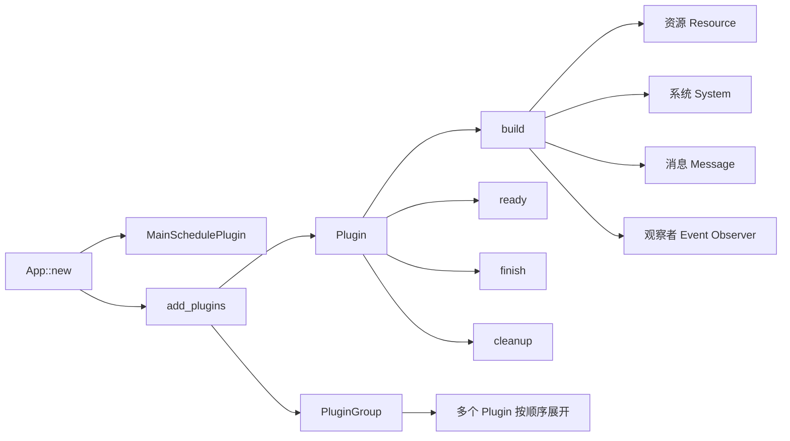
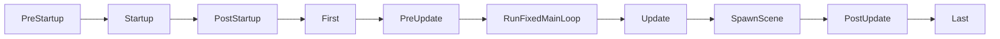
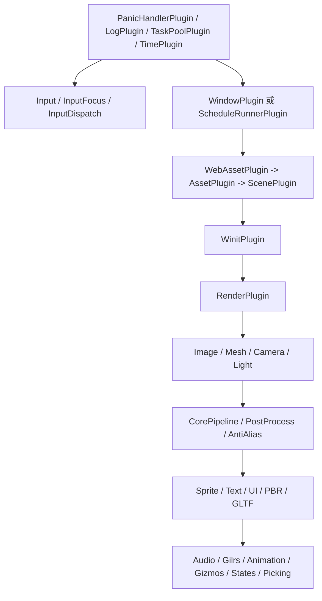

# Bevy 0.19 Plugin 系统教程

## 执行摘要

本文基于 **Bevy 0.19** 官方发布信息、`v0.19.0` 标签源码、官方示例页与 API 文档撰写，面向“有 Rust 基础、初学 Bevy”的读者。Bevy 0.19 中，`Plugin` 仍然是组织引擎功能与业务模块的核心抽象，但围绕它的实际理解方式，已经越来越明确地依托于三件事：**`App` 负责组装与生命周期管理、`Schedule` 负责系统执行时机、`Message / Event` 负责两种不同风格的通信模型**。其中，`App::new()` 会自动装入 `MainSchedulePlugin`，在 `First` 安排消息更新系统，并默认注册 `AppExit` 消息；而 `Plugin` 则支持 `build`、`ready`、`finish`、`cleanup`、`name`、`is_unique` 等生命周期与元信息接口。

从工程实践角度看，Bevy 0.19 的插件系统值得先抓住三条主线。第一，**内置插件并不是“黑箱”**：`DefaultPlugins` 本质是一个按固定顺序构建的 `PluginGroup`，而且严格受 Cargo feature 控制；官方源码还明确写出了若干关键顺序依赖，例如 `WebAssetPlugin` 必须在 `AssetPlugin` 之前，`WinitPlugin` 必须在 `AssetPlugin` 之后，`ImagePlugin` 应在 `RenderPlugin` 之后。第二，**日志插件 `LogPlugin` 是理解“Bevy 如何接入 tracing”的最佳入口**：它默认级别为 `INFO`，支持 `filter`、`custom_layer`、`fmt_layer`，并会把默认过滤器与 `RUST_LOG` 中的 `EnvFilter` 指令合并。第三，**自定义插件最好从“小而专一”开始**：先让一个插件只负责自己的资源、系统和消息/事件，再用 `PluginGroup` 做组合，而不要一上来写成“大而全总插件”。

如果你只想先记住最重要的升级点，那么有三条最容易影响日常代码。其一，**`UiWidgetsPlugins` 和 `InputDispatchPlugin` 已经并入 `DefaultPlugins`**，如果你从 0.18 升到 0.19，保留旧写法很容易造成重复添加。其二，**现代 Bevy 的“阶段”思维应该转成“调度表 / Schedule”思维**：历史上的内置 stage 体系早已被 schedule 与 system set 取代，而 0.19 中主流程的默认顺序已经清晰固定。其三，**如果你还把帧间通信都想成旧式 EventReader / EventWriter，那你会越来越别扭**：在 0.19 里，官方顶层 `App` API 已经显式提供 `add_message`；`Event` 依然存在，但它更偏向 Observer / trigger 的“立即触发”模型。

本文示例按 **Rust stable / Rust 1.96.0** 编写。Bevy 官方一贯把 MSRV 政策写成“**最新稳定版 Rust**”，而在本文写作时点，Rust 官方发布页显示当前稳定版为 1.96.0。

## 背景与核心概念

先给出本文所依据的 **Bevy 0.19 官方入口与源码位置**。按你的要求，我优先从 `github.com` 与 `bevy.org` 整理，再补充 API 文档入口。下面这些链接都对应本文后续反复引用的位置。

```text
官方发布与迁移
https://bevy.org/news/bevy-0-19/
https://bevy.org/learn/migration-guides/0-18-to-0-19/

官方示例页
https://bevy.org/examples/application/plugin/
https://bevy.org/examples/application/plugin-group/
https://bevy.org/examples/application/logs/
https://bevy.org/examples/diagnostics/log-diagnostics/
https://bevy.org/examples/ecs-entity-component-system/observers/

官方 API 文档入口
https://docs.rs/bevy/0.19.0/bevy/
https://docs.rs/bevy/0.19.0/bevy/struct.DefaultPlugins.html
https://docs.rs/bevy/0.19.0/bevy/app/trait.PluginGroup.html
https://docs.rs/bevy/0.19.0/bevy/app/struct.App.html

官方源码位置
https://github.com/bevyengine/bevy/blob/v0.19.0/crates/bevy_app/src/plugin.rs
https://github.com/bevyengine/bevy/blob/v0.19.0/crates/bevy_app/src/app.rs
https://github.com/bevyengine/bevy/blob/v0.19.0/crates/bevy_app/src/plugin_group.rs
https://github.com/bevyengine/bevy/blob/v0.19.0/crates/bevy_app/src/main_schedule.rs
https://github.com/bevyengine/bevy/blob/v0.19.0/crates/bevy_internal/src/default_plugins.rs
https://github.com/bevyengine/bevy/blob/v0.19.0/crates/bevy_log/src/lib.rs

官方示例源码位置
https://github.com/bevyengine/bevy/blob/v0.19.0/examples/app/plugin.rs
https://github.com/bevyengine/bevy/blob/v0.19.0/examples/app/plugin_group.rs
https://github.com/bevyengine/bevy/blob/v0.19.0/examples/app/logs.rs
https://github.com/bevyengine/bevy/blob/v0.19.0/examples/app/log_layers.rs
```

### App 与 Plugin 的关系

在 0.19 里，`App` 不是单纯的“程序入口对象”，而是整个 ECS 运行时的**装配器**。`App::default()` 会设置主 `SubApp` 的更新调度为 `Main`，添加 `MainSchedulePlugin`，在 `First` 安排 `message_update_system`，在 `Last` 安排清理未使用注册系统的逻辑，并注册 `AppExit` 消息；`App::new()` 只是 `App::default()` 的别名。换句话说，哪怕你什么插件都不加，`App` 本身也已经带着“最小可运行骨架”。

`Plugin` 则是这套骨架上最常用的功能注入点。官方 `Plugin` trait 在 0.19 中提供 `build`、`ready`、`finish`、`cleanup`、`name`、`is_unique` 这些接口：`build` 用来注册资源、系统、消息或子插件；`ready` 允许插件表达“我是否完成异步初始化”；`finish` 用于所有插件就绪后的补完阶段；`cleanup` 在所有插件 build/finish 完成后、主调度真正运行前执行；`is_unique` 默认为 `true`，意味着同类型插件默认不能重复加入同一个 `App`。



这张图不是额外机制，而是对官方 API 的直接总结：`App::add_plugins` 接受单个 `Plugin`、`PluginGroup` 或它们的元组；`PluginGroup` 会在内部调用 `build().finish(app)` 展开；而 `Plugin` 的生命周期则由 `App` 在统一流程里管理。并且，`App::add_plugins` 明确禁止在 `App::finish()` 或 `App::cleanup()` 之后再添加插件，重复添加“唯一插件”会 panic。

### System、Stage、Schedule、Resource、Event

在 Bevy 0.19 的语境下，**`System` 是被调度执行的函数**，系统参数通过 `SystemParam` 自动从 `World` 中取值；多个系统默认会并行、机会性执行，只有在数据冲突或显式 `.before()` / `.after()` / `configure_sets` 约束下才会形成顺序。

**`Stage` 这个词在现代 Bevy 更适合当“历史概念”来理解。** 官方迁移文档在 0.9→0.10 时就写明：旧的 built-in stages 已被 schedule / system set 体系取代。到了 0.19，真正应该掌握的是 `ScheduleLabel` 与默认调度顺序，而不是再按旧教程去记“某个 stage 末尾自动 flush commands”的老模型。

0.19 的主调度默认顺序由 `MainScheduleOrder` 资源定义：启动阶段一次性运行 `PreStartup -> Startup -> PostStartup`，随后每帧主流程运行 `First -> PreUpdate -> RunFixedMainLoop -> Update -> SpawnScene -> PostUpdate -> Last`。这也是为什么多数业务系统会挂在 `Startup` 或 `Update`，而引擎准备型逻辑更适合 `PreUpdate`，收尾同步逻辑更适合 `PostUpdate` 或 `Last`。



**`Resource`** 是存储在 `World` 里的单例数据。它适合放全局配置、运行时状态、缓存、插件私有状态等；系统通常通过 `Res<T>` 共享读取、通过 `ResMut<T>` 独占修改。官方文档直接把它定义为“singleton-like data types”。

**`Event` 与 `Message` 在 0.19 必须分开理解。** `Event` 是“在某个时刻发生的事”，通过 `World::trigger` 或 `Commands::trigger` 触发，匹配的 observer 会立即响应；而 `Message` 是带缓冲、面向 schedule 固定时点处理的“帧间通信”，`App::add_message` 会在 `First` 注册消息更新系统，`MessageWriter` / `MessageReader` 则提供 pull-based 的写入与读取。对初学者最实用的心法是：**Observer 用 Event，常规系统间通信优先考虑 Message。**

## 内置 Plugin 总览

### DefaultPlugins 与 MinimalPlugins 的定位

`DefaultPlugins` 是 Bevy 默认“全套体验”的插件组，官方 API 文档把它定义为“构建带窗口与展示组件的 Bevy 应用时通常需要的全部插件”；`MinimalPlugins` 则是“绝对最小、bare-bones 的 Bevy application”，只提供任务池、帧计数、时间与调度循环等核心骨架。

两者最关键的区别不是“一个大、一个小”这么简单，而是**它们的 runner 与依赖假设不同**。`MinimalPlugins` 明确包含 `ScheduleRunnerPlugin`，用于 headless / CLI / server 场景的主循环；`DefaultPlugins` 则在有 `bevy_window` feature 时走 `WindowPlugin` / `WinitPlugin` 路线，无窗口 feature 时才回退到 `ScheduleRunnerPlugin`。如果你在做命令行工具、自动化测试、服务器或只想快速讲清插件系统，用 `MinimalPlugins` 常常更合适。

| 方案 | 适用场景 | 典型内容 | 代价与特征 |
|---|---|---|---|
| `DefaultPlugins` | 常规 2D/3D/UI 应用与游戏 | 日志、时间、输入、窗口、资产、渲染、UI、音频、动画、状态等完整能力 | 最省心，但编译依赖更多；受 Cargo feature 控制。 |
| `MinimalPlugins` | headless、CLI、server、教学最小示例 | `TaskPoolPlugin`、`FrameCountPlugin`、`TimePlugin`、`ScheduleRunnerPlugin` 等最小骨架 | 控制力最高，但你要自己补日志、窗口、渲染等。 |
| 自定义 `PluginGroup` | 中大型项目分层组织 | 由你决定插件顺序、替换、禁用、插入 | 最适合业务架构，但需要你清楚依赖关系。 |

### DefaultPlugins 的顺序、职责与依赖

下面这张表按 **官方 `v0.19.0` 源码顺序** 重新整理。插件名单与 feature 条件来自 `DefaultPlugins` 官方 API 文档和源码；显式依赖关系来自源码中的注释。功能列是基于官方插件名称、所属 crate 及对应 API 的归纳，目的是帮助你建立“脑内地图”。

| 顺序 | 插件 | 主要职责 | 关键顺序 / 依赖说明 |
|---|---|---|---|
| 前置 | `PanicHandlerPlugin` | 安装平台相关 panic 处理逻辑 | `DefaultPlugins` 开头，保证基础错误处理尽早生效。 |
| 前置 | `LogPlugin` | 初始化日志、`tracing` subscriber 与过滤层 | 只在 `bevy_log` feature 存在；不应在同一进程重复初始化。 |
| 前置 | `TaskPoolPlugin` | 创建默认任务池 | 为后续并行系统和后台任务提供执行环境。 |
| 前置 | `FrameCountPlugin` | 帧计数诊断 | 常与时间、诊断一起使用。 |
| 前置 | `TimePlugin` | 时间资源与时间推进 | 后续很多系统依赖时间。 |
| 基础 | `TransformPlugin` | 变换体系 | 通常是空间逻辑基础。 |
| 基础 | `DiagnosticsPlugin` | 诊断框架基础设施 | `LogDiagnosticsPlugin` 等都依赖诊断系统。 |
| 基础 | `InputPlugin` | 输入收集基础 | 后续输入焦点、分发与交互能力建立其上。 |
| 基础 | `InputFocusPlugin` | 输入焦点 | 仅在 `bevy_input_focus` feature。 |
| 基础 | `InputDispatchPlugin` | 输入分发 | 0.19 起已并入 `DefaultPlugins`。 |
| 运行器 | `ScheduleRunnerPlugin` | 无窗口主循环 runner | 仅在 **没有** `bevy_window` 时走这条路径。 |
| 窗口 | `WindowPlugin` | 窗口能力 | 有 `bevy_window` feature 时启用。 |
| 窗口 | `AccessibilityPlugin` | 可访问性支持 | 跟随窗口能力启用。 |
| 平台 | `TerminalCtrlCHandlerPlugin` | 桌面终端 Ctrl+C 退出处理 | `std` 且桌面平台时启用。 |
| 资产 | `WebAssetPlugin` | 注册 Web/HTTP 资产源 | **必须在 `AssetPlugin` 之前**；源码有明确注释。 |
| 资产 | `AssetPlugin` | 资产加载与处理 | 资产系统核心。 |
| 资产 | `WorldSerializationPlugin` | World 序列化 | 仅在对应 feature。 |
| 场景 | `ScenePlugin` | 场景加载与生成 | 常与资产系统联动。 |
| 平台 | `WinitPlugin` | 桌面窗口事件循环整合 | **必须在 `AssetPlugin` 之后**，因为自定义光标。 |
| 渲染前置 | `DlssInitPlugin` | DLSS 初始化 | 条件启用。 |
| 渲染核心 | `RenderPlugin` | 渲染世界与渲染核心 | 后续图像、网格、相机、灯光等都围绕它展开。 |
| 渲染资源 | `ImagePlugin` | 图像资源 | **应在 `RenderPlugin` 之后**，源码写明这样才能知道支持的压缩纹理格式。 |
| 渲染资源 | `MeshPlugin` | 网格资源 | 渲染资产组成部分。 |
| 渲染资源 | `CameraPlugin` | 相机体系 | 负责视图与投影相关能力。 |
| 渲染资源 | `LightPlugin` | 灯光体系 | 负责灯光组件 / 系统。 |
| 渲染执行 | `PipelinedRenderingPlugin` | 多线程流水线渲染 | 仅在非 wasm 且 `multi_threaded` 下启用。 |
| 渲染执行 | `CorePipelinePlugin` | 核心渲染管线 | 后续后处理、抗锯齿等的基础。 |
| 渲染执行 | `PostProcessPlugin` | 后处理 | 依附渲染管线。 |
| 渲染执行 | `AntiAliasPlugin` | 抗锯齿 | 在后处理 / 渲染能力之后。 |
| 2D | `SpritePlugin` | Sprite 基础能力 | 2D 渲染资源层。 |
| 2D | `SpriteRenderPlugin` | Sprite 渲染实现 | 位于 `SpritePlugin` 之后。 |
| 工具 | `ClipboardPlugin` | 剪贴板支持 | 条件启用。 |
| 文本/UI | `TextPlugin` | 文本系统 | UI、文本渲染基础。 |
| 文本/UI | `UiPlugin` | UI 逻辑层 | UI 组件与布局。 |
| 文本/UI | `UiRenderPlugin` | UI 渲染层 | 位于 `UiPlugin` 之后。 |
| 资产格式 | `GltfPlugin` | glTF 资产支持 | 场景/资产扩展格式。 |
| 3D | `PbrPlugin` | PBR 渲染 | 3D 材质与光照主力。 |
| 音频 | `AudioPlugin` | 音频播放 | 音频子系统。 |
| 输入设备 | `GilrsPlugin` | 手柄支持 | gamepad 输入整合。 |
| 动画 | `AnimationPlugin` | 动画 | 条件启用。 |
| 调试绘制 | `GizmoPlugin` | Gizmo 逻辑层 | 调试绘制基础。 |
| 调试绘制 | `GizmoRenderPlugin` | Gizmo 渲染层 | 位于 `GizmoPlugin` 之后。 |
| 状态 | `StatesPlugin` | 状态机调度整合 | 负责把 `StateTransition` 插入主调度。 |
| 测试/开发 | `CiTestingPlugin` | CI 测试支持 | 条件启用。 |
| 测试/开发 | `RenderDebugOverlayPlugin` | 渲染调试覆盖层 | 条件启用。 |
| 测试/开发 | `HotPatchPlugin` | 热补丁 | 条件启用。 |
| UI 扩展 | `UiWidgetsPlugins` | UI Widgets 插件组 | 0.19 起并入 `DefaultPlugins`。 |
| 交互扩展 | `DefaultPickingPlugins` | Picking 插件组 | 条件启用，位于尾部。 |
| 内部 | `IgnoreAmbiguitiesPlugin` | 处理部分调度歧义豁免 | `doc(hidden)`，不面向一般业务代码。 |

### 一个更实用的依赖心智图

你不需要死背每个插件，但最好形成“从平台骨架到资产，再到渲染，再到上层玩法”的链式理解。下面这张依赖关系图，强调的是**阅读顺序和常见思考顺序**，不是严格的一一依赖 DAG。其关键依据来自 `DefaultPlugins` 的源码顺序和源码注释。



## 日志 Plugin 专章

### LogPlugin 的职责与默认行为

在 Bevy 0.19 中，`LogPlugin` 是整个日志体系的中心入口。源码里它暴露了四个核心配置项：`filter`、`level`、`custom_layer`、`fmt_layer`。默认实现里，`level` 是 `INFO`，`filter` 来自 `DEFAULT_FILTER` 常量；`custom_layer` 默认不额外添加 layer，`fmt_layer` 默认不覆盖格式化层。

更关键的是，它不是一个“普通本地插件”，而是**进程级全局日志初始化器**。官方源码明确写着：这个插件不应在同一进程里被多次添加，因为它会为**所有 App** 设置全局日志配置，重复初始化会导致 panic；而在构建阶段，如果全局 logger 或 tracing subscriber 已经被设置，源码也会输出“Consider disabling LogPlugin”之类的错误提示。

`LogPlugin` 的过滤逻辑也值得理解。源码中的 `build_filter_layer` 会先把默认 `level + filter` 拼成基础过滤器，再读取 `EnvFilter::DEFAULT_ENV`，也就是大家熟悉的 `RUST_LOG`，并把其中的 directive 逐个叠加进去；如果环境变量书写不合法，则退回默认过滤器，并通过 `eprintln!` 报错。也就是说，**Bevy 默认就已经吃 `RUST_LOG`，你不需要额外装一套 env-filter 机制。**

### 最基础的日志配置

官方 `logs.rs` 示例已经给出了最常见的写法：在 `DefaultPlugins` 上用 `.set(LogPlugin { ... })` 覆盖默认日志配置，然后在系统中使用 `trace! / debug! / info! / warn! / error!` 这些宏。官方示例同时说明：默认情况下 `trace` 和 `debug` 会被忽略，而 `RUST_LOG=trace`、`RUST_LOG=info,bevy_ecs=warn` 这类写法可直接生效。

```rust
use bevy::prelude::*;

fn main() {
    App::new()
        .add_plugins(DefaultPlugins.set(bevy::log::LogPlugin {
            level: bevy::log::Level::INFO,
            filter: "wgpu=error,naga=warn,my_game=debug".to_string(),
            ..default()
        }))
        .add_systems(Update, hello_logs)
        .run();
}

fn hello_logs() {
    trace!("trace: 最细粒度");
    debug!("debug: 调试信息");
    info!("info: 默认就会看到");
    warn!("warn: 非致命异常");
    error!("error: 严重错误");
}
```

如果你不想把过滤规则写死在代码里，更推荐把 `level` 留在默认值或只做小范围覆盖，再通过环境变量切换。例如在 shell 中运行：

```bash
RUST_LOG=trace cargo run
RUST_LOG=info,bevy_ecs=warn,my_game=debug cargo run
```

这类写法与官方示例和 `LogPlugin` 内部的 `EnvFilter` 叠加逻辑是一致的。

### tracing 集成与格式化层

Bevy 0.19 的“高级日志玩法”不是接 `env_logger`，而是直接走 **`tracing_subscriber` layer**。源码对 `custom_layer` 与 `fmt_layer` 的职责分工写得很清楚：`custom_layer` 用于**添加额外 layer**，而 `fmt_layer` 用于**覆盖默认的格式化 layer**；如果你想去掉时间戳、改字段格式、改输出 writer，应该优先使用 `fmt_layer`。官方还在源码文档里直接把 `examples/app/log_layers.rs` 指为完整示例。

```rust
use bevy::log::{
    BoxedFmtLayer, BoxedLayer,
    tracing_subscriber::{Layer, field::MakeExt},
};
use bevy::prelude::*;

fn custom_layer(_app: &mut App) -> Option<BoxedLayer> {
    Some(Box::new(vec![
        bevy::log::tracing_subscriber::fmt::layer()
            .with_file(true)
            .boxed(),
    ]))
}

fn fmt_layer(_app: &mut App) -> Option<BoxedFmtLayer> {
    Some(Box::new(
        bevy::log::tracing_subscriber::fmt::Layer::default()
            .without_time()
            .map_fmt_fields(MakeExt::debug_alt)
            .with_writer(std::io::stderr),
    ))
}

fn main() {
    App::new()
        .add_plugins(DefaultPlugins.set(bevy::log::LogPlugin {
            custom_layer,
            fmt_layer,
            ..default()
        }))
        .add_systems(Update, || {
            let secret = "Bevy";
            info!(?secret, "自定义 tracing layer 已启用");
        })
        .run();
}
```

这段配置的效果与官方 `log_layers.rs` 示例一致：一方面额外加了一个 `fmt` layer 并带文件位置信息，另一方面用 `fmt_layer` 替换默认格式层，关掉时间戳，并把 debug-sigil 的字段格式改成更适合多行阅读的风格。

### env_logger 与 tracing 的边界

你要求讲 `env_logger / tracing` 集成，这里需要给出一个**工程上非常实用的结论**：在 Bevy 0.19 里，**优先把 `LogPlugin` 看作“Bevy 官方 tracing 集成层”**，而不是再另外安装一套 `env_logger`。原因并不神秘：源码显示 `LogPlugin` 会设置全局 logger 和全局 tracing subscriber；如果你的进程里已经有这些东西，再走一遍初始化，就会发生冲突或至少收到“考虑禁用 `LogPlugin`”的错误提示。基于这一点，可以合理推断：**不要在启用 `LogPlugin` 的同时再手动 `env_logger::init()`。**

如果你的项目已经强依赖 `env_logger`，更稳妥的路线通常是：**禁用 Bevy 的 `LogPlugin`，让外部 logger 独占全局初始化**；但如果你只是想要“环境变量控制日志级别”的体验，那么根本没必要引入 `env_logger`，因为 `LogPlugin` 已经原生支持 `RUST_LOG` / `EnvFilter` 语法。

### 日志插件之外的诊断日志

Bevy 里还有一个容易和 `LogPlugin` 混淆的插件：`LogDiagnosticsPlugin`。它不是“替代日志系统”，而是把诊断指标打印到控制台。官方 `log_diagnostics.rs` 示例写得很直接：这些诊断插件要放在 `DefaultPlugins` **之后**，因为它们需要时间插件等基础设施；而 `LogDiagnosticsPlugin` 只是“把诊断输出到控制台”的那一层，真正产生 FPS、实体数、系统信息等指标的，是 `FrameTimeDiagnosticsPlugin`、`EntityCountDiagnosticsPlugin`、`SystemInformationDiagnosticsPlugin` 等。

## 自定义 Plugin 教程

### 最小可用示例

官方 `plugin.rs` 示例几乎就是“参数化自定义插件”的最佳起点。它展示了一个 `PrintMessagePlugin`：配置项放在插件 struct 里，`build` 中把配置转为 `Resource`，再注册到 `Update` 系统里消费。这种写法特别适合初学者，因为它天然把“配置”和“运行时状态”分开了。

下面是按 0.19 风格整理过的最小写法：

```rust
use bevy::prelude::*;
use std::time::Duration;

struct PrintMessagePlugin {
    wait_duration: Duration,
    message: String,
}

#[derive(Resource)]
struct PrintMessageState {
    timer: Timer,
    message: String,
}

impl Plugin for PrintMessagePlugin {
    fn build(&self, app: &mut App) {
        app.insert_resource(PrintMessageState {
            timer: Timer::new(self.wait_duration, TimerMode::Repeating),
            message: self.message.clone(),
        })
        .add_systems(Update, print_message_system);
    }
}

fn print_message_system(mut state: ResMut<PrintMessageState>, time: Res<Time>) {
    if state.timer.tick(time.delta()).just_finished() {
        info!("{}", state.message);
    }
}
```

这个模式有三个优点。第一，**插件配置字段不必是 `Resource`**，因为它们只在装配阶段使用一次；第二，插件本身很容易参数化；第三，运行时状态和外部 API 分离以后，未来要把它升级成更复杂的插件组也很顺手。官方示例本身就是这么组织的。

### 进阶示例

当你的插件开始复杂起来，建议把职责拆成四层：**资源、消息、事件/observer、子插件**。其中，常规系统间通信优先 `Message`，特定瞬时动作或观察者回调用 `Event`；若模块变多，再把它们放进 `PluginGroup`。这也是官方示例组合出来的最自然路线：`plugin.rs` 演示最小插件，`plugin_group.rs` 演示如何把多个插件打包，`observers.rs` 则说明了 0.19 中 `Event + Observer` 的标准写法。

下面给出一个更接近真实项目的 0.19 写法示例。它包含资源、Message、Event、子插件和组装逻辑：

```rust
use bevy::{app::PluginGroupBuilder, prelude::*};

#[derive(Resource, Default)]
struct Score(u32);

#[derive(Message)]
struct ScoreChanged {
    value: u32,
}

#[derive(Event)]
struct ScoreReachedTarget {
    value: u32,
}

struct ScoreCorePlugin {
    target: u32,
}

struct ScoreUiPlugin;

struct ScorePlugins {
    target: u32,
}

impl PluginGroup for ScorePlugins {
    fn build(self) -> PluginGroupBuilder {
        PluginGroupBuilder::start::<Self>()
            .add(ScoreCorePlugin { target: self.target })
            .add(ScoreUiPlugin)
    }
}

impl Plugin for ScoreCorePlugin {
    fn build(&self, app: &mut App) {
        app.init_resource::<Score>()
            .add_message::<ScoreChanged>()
            .add_systems(Update, gain_score_system(self.target))
            .add_observer(on_score_reached_target);
    }
}

impl Plugin for ScoreUiPlugin {
    fn build(&self, app: &mut App) {
        app.add_systems(Update, print_score_changes);
    }
}

fn gain_score_system(target: u32) -> impl FnMut(ResMut<Score>, MessageWriter<ScoreChanged>, Commands) {
    move |mut score: ResMut<Score>, mut writer: MessageWriter<ScoreChanged>, mut commands: Commands| {
        score.0 += 1;
        writer.write(ScoreChanged { value: score.0 });

        if score.0 >= target {
            commands.trigger(ScoreReachedTarget { value: score.0 });
        }
    }
}

fn print_score_changes(mut reader: MessageReader<ScoreChanged>) {
    for msg in reader.read() {
        info!("score changed: {}", msg.value);
    }
}

fn on_score_reached_target(target: On<ScoreReachedTarget>) {
    info!("target reached: {}", target.value);
}
```

这里最值得学的不是“分数系统”本身，而是几条结构性原则。`ScoreCorePlugin` 负责领域状态和领域消息，`ScoreUiPlugin` 负责表现层消费；两者再由 `ScorePlugins` 组装。`Message` 用来让普通系统在固定 schedule 时点消费数据，而 `Event` 则通过 observer 在触发时立即响应。官方 `observers.rs` 示例也正是这种写法：`.add_observer(...)`、`On<T>` 参数、`commands.trigger(...)`。

### 生命周期与卸载

Plugin 生命周期在 0.19 里要分成两个层面来理解。**装配周期**由 `build -> ready -> finish -> cleanup` 组成，这是框架级硬生命周期；**业务启停**则通常由你自己通过状态、资源或运行条件控制，而不是“把插件从 App 里拔掉”。插件 trait 本身只提供这几个生命周期钩子，`App::add_plugins` 也只定义了“如何加入”和“何时禁止继续加入”，并没有对应的公开“remove_plugin”流程。结合官方 API，可以合理得出结论：**Bevy 0.19 的“卸载插件”通常是设计问题，不是运行时 API 问题。**

因此，所谓“生命周期与卸载”的实战建议通常是：

1. **启动时初始化**：在 `build` 里注册资源、系统、消息、observer。  
2. **异步就绪**：如需等待底层初始化，用 `ready` / `finish`。  
3. **运行时禁用**：用 state、run condition、资源开关、observer 观察范围控制逻辑启停。  
4. **收尾清理**：若有只在构建期临时需要的资源，可在 `cleanup` 移走。  

这个用法与官方对 `finish`、`cleanup` 的说明完全一致：`finish` 适合等待其他插件异步初始化完成后的补完阶段，`cleanup` 适合在所有插件 build/finish 结束后、真正开始运行前，把只在装配期有用的资源移除或转移。

### 参数化 Plugin

参数化插件有两条路线。第一条是最常见的“**带字段的插件 struct**”，就像前面的 `PrintMessagePlugin`、`ScoreCorePlugin { target }`。第二条是“**在 PluginGroup 上做参数化**”，让同一组插件共享一个上层配置，然后在 `build` 时拆给各个子插件。官方 `plugin_group.rs` 虽然示例简单，但它已经把 `PluginGroupBuilder::start::<Self>().add(...)`、`add_before(...)`、`disable::<T>()` 这些关键能力展示出来了。

如果你的项目规模已经过了“一个插件一个文件”的阶段，我建议默认使用下面这个思路：

- `FooPlugin`：只做某个具体子领域。  
- `FooUiPlugin` / `FooNetPlugin` / `FooDebugPlugin`：围绕同一领域拆分子能力。  
- `FooPlugins`：`PluginGroup`，负责顺序、禁用、替换与面向应用层的统一参数。  

这会比单纯在 `main.rs` 里堆很多 `.add_plugins(...)` 更容易阅读和迁移。

### 错误处理

插件系统里最常见的错误，其实不是“业务逻辑错”，而是**装配期冲突**。官方源码给了三类非常明确的约束：同类型唯一插件重复加入会报 `DuplicatePlugin` 并 panic；在 `App::finish()` 或 `App::cleanup()` 之后继续加插件会 panic；替换 `PluginGroupBuilder` 中原本启用的插件时，还会产生一条 warning，提醒你正在替换一个未禁用的插件。

因此，写自定义插件时的错误处理建议是：

- 对“可重复添加”的插件，显式重写 `is_unique()` 返回 `false`。  
- 对“必须只存在一个”的全局型插件，坚持默认唯一。  
- 组合插件组时，优先用 `.disable::<T>()`、`.set(T { ... })`、`.add_before::<Target>(...)` 做受控替换。  
- 需要读现有插件配置时，可用 `App::get_added_plugins` 风格接口先做检查；官方源码明确说明它能按插入顺序返回同类型插件实例。

## 实战 Demo

下面这个 demo 专门为“学习插件系统”设计，而不是为展示图形特效设计。它采用 **headless + `MinimalPlugins` + `LogPlugin` + 自定义 `PluginGroup`** 的方式，避免窗口与渲染噪音，让你把注意力集中在 **资源、消息、事件、observer、插件组与参数化** 上。整个例子按 **Rust 1.96.0 / stable** 与 `bevy = "0.19"` 编写。Bevy 官方文档将 MSRV 说明为“最新稳定版 Rust”，因此这样标注是符合 0.19 官方政策的。

### Cargo.toml

为了确保“复制即可编译”，这里故意使用最保守、最不容易踩 feature 坑的配置：

```toml
[package]
name = "bevy_plugin_tutorial_demo"
version = "0.1.0"
edition = "2024"

[dependencies]
bevy = "0.19"
```

如果你后续想优化编译时间，再去裁剪 feature 会更安全。官方文档确认 `DefaultPlugins` 及相关能力受 Cargo feature 控制，而 `bevy` 容器 crate 也明确支持按需启用功能。

### 完整代码

```rust
use std::{thread, time::Duration as StdDuration};

use bevy::{
    app::PluginGroupBuilder,
    log::{Level, LogPlugin},
    prelude::*,
};

fn main() {
    let mut app = App::new();

    app.add_plugins((
        MinimalPlugins,
        LogPlugin {
            level: Level::INFO,
            filter: "wgpu=error,naga=warn".to_string(),
            ..default()
        },
        TutorialPlugins { max_ticks: 5 },
    ));

    // 手动驱动 update，便于把注意力集中在插件系统本身。
    loop {
        app.update();

        let done = app.world().resource::<CounterState>().done;
        if done {
            info!("main: demo 已结束，退出更新循环。");
            break;
        }

        thread::sleep(StdDuration::from_millis(300));
    }
}

/// 对外暴露的插件组：聚合多个子插件。
pub struct TutorialPlugins {
    pub max_ticks: u32,
}

impl PluginGroup for TutorialPlugins {
    fn build(self) -> PluginGroupBuilder {
        PluginGroupBuilder::start::<Self>()
            .add(CounterPlugin {
                max_ticks: self.max_ticks,
            })
            .add(ReportPlugin)
    }
}

/// 运行时状态：由插件在 build 阶段插入。
#[derive(Resource)]
struct CounterState {
    timer: Timer,
    ticks: u32,
    max_ticks: u32,
    done: bool,
}

impl Default for CounterState {
    fn default() -> Self {
        Self {
            timer: Timer::from_seconds(0.5, TimerMode::Repeating),
            ticks: 0,
            max_ticks: 5,
            done: false,
        }
    }
}

/// 帧间通信：更适合普通系统消费。
#[derive(Message)]
struct TickMessage {
    value: u32,
}

/// 观察者通信：表示“达到目标值”这个瞬时事件。
#[derive(Event)]
struct ThresholdReached {
    value: u32,
}

/// 子插件一：负责核心计数逻辑。
struct CounterPlugin {
    max_ticks: u32,
}

impl Plugin for CounterPlugin {
    fn build(&self, app: &mut App) {
        app.insert_resource(CounterState {
            max_ticks: self.max_ticks,
            ..default()
        })
        .add_message::<TickMessage>()
        .add_systems(Startup, startup_log)
        .add_systems(Update, tick_system);
    }
}

/// 子插件二：负责消息消费与事件观察。
struct ReportPlugin;

impl Plugin for ReportPlugin {
    fn build(&self, app: &mut App) {
        app.add_systems(Update, consume_tick_messages)
            .add_observer(on_threshold_reached);
    }
}

fn startup_log(state: Res<CounterState>) {
    info!(
        "startup: 计数 demo 启动，max_ticks = {}，每 0.5 秒递增一次。",
        state.max_ticks
    );
}

fn tick_system(
    time: Res<Time>,
    mut state: ResMut<CounterState>,
    mut writer: MessageWriter<TickMessage>,
    mut commands: Commands,
) {
    if state.done {
        return;
    }

    if state.timer.tick(time.delta()).just_finished() {
        state.ticks += 1;

        info!("tick_system: 当前 tick = {}", state.ticks);
        writer.write(TickMessage { value: state.ticks });

        if state.ticks >= state.max_ticks {
            commands.trigger(ThresholdReached { value: state.ticks });
        }
    }
}

fn consume_tick_messages(mut reader: MessageReader<TickMessage>) {
    for msg in reader.read() {
        info!("consume_tick_messages: 收到 TickMessage(value = {})", msg.value);
    }
}

fn on_threshold_reached(event: On<ThresholdReached>, mut state: ResMut<CounterState>) {
    info!(
        "on_threshold_reached: 达到阈值 value = {}，准备结束 demo。",
        event.value
    );
    state.done = true;
}
```

这段代码综合运用了几种 0.19 推荐姿势。`TutorialPlugins` 演示 `PluginGroup`；`CounterPlugin` 演示“参数化插件 + Resource + Message”；`ReportPlugin` 演示“子插件 + observer”；`ThresholdReached` 则体现了 0.19 中 `Event` 与 observer 的触发模型。其结构直接对应官方 `plugin.rs`、`plugin_group.rs`、`observers.rs` 的思路，只是我把它们整理成了一个更适合教学的综合版。

### 运行步骤

运行方式很简单：

```bash
cargo run
```

如果你想看更详细的内部日志，可以在运行时加上环境变量：

```bash
RUST_LOG=info,bevy_ecs=warn cargo run
RUST_LOG=trace cargo run
```

这是因为 `LogPlugin` 会把默认过滤器与 `RUST_LOG` 合并；官方 `logs.rs` 示例和 `bevy_log` 源码都明确说明了这一点。

### 预期输出

输出不一定和下面逐字一致，但结构应当类似：

```text
INFO startup: 计数 demo 启动，max_ticks = 5，每 0.5 秒递增一次。
INFO tick_system: 当前 tick = 1
INFO consume_tick_messages: 收到 TickMessage(value = 1)
INFO tick_system: 当前 tick = 2
INFO consume_tick_messages: 收到 TickMessage(value = 2)
INFO tick_system: 当前 tick = 3
INFO consume_tick_messages: 收到 TickMessage(value = 3)
INFO tick_system: 当前 tick = 4
INFO consume_tick_messages: 收到 TickMessage(value = 4)
INFO tick_system: 当前 tick = 5
INFO consume_tick_messages: 收到 TickMessage(value = 5)
INFO on_threshold_reached: 达到阈值 value = 5，准备结束 demo。
INFO main: demo 已结束，退出更新循环。
```

如果你能看懂这份输出，就已经掌握了本教程最核心的四个点：**插件装配资源、系统按 schedule 反复执行、Message 供普通系统消费、Event 供 observer 响应。** 这些恰好对应了官方 0.19 文档中对 `Plugin`、`Message`、`Event`、observer 的定位。

## 常见陷阱、调试技巧与迁移注意

### 常见陷阱与调试技巧

初学者最容易踩的坑，是把插件当成“普通函数集合”来看，而忽略它的**唯一性与装配时机**。官方源码明确写着：如果插件类型默认唯一，重复添加会报 `DuplicatePlugin`；而一旦 `App::finish()` 或 `App::cleanup()` 已执行，再尝试添加插件会直接 panic。因此，碰到“明明代码很短却一启动就炸”的情况，第一时间应检查：是不是重复加了插件，或者是不是在 app 生命周期太晚的时候继续改装配。

第二个常见误区是“我能不能在运行时卸载插件”。从本文检索到的 0.19 官方 `Plugin` / `App` API 来看，公开生命周期钩子是 `build / ready / finish / cleanup`，没有对应的通用运行时反注册接口；因此项目里所谓“关闭某插件”，通常应靠状态、资源开关、run condition、observer 范围或 schedule 组织来实现，而不是期待一个现成的 `remove_plugin`。这不是功能缺失，而是 Bevy 当前插件模型本来就偏**装配期声明**而非**运行时热插拔**。

第三个坑与日志有关。`LogPlugin` 是全局初始化器，不适合多次添加，也不适合和另一套全局 logger/subscriber 初始化并存。如果你项目里已经手动初始化了外部日志系统，那么看到官方源码里“Consider disabling LogPlugin”这一类提示时，不要怀疑人生；这通常说明你正在做两次全局初始化。此时调试策略很简单：要么让 Bevy 接管日志，要么禁用 Bevy 的 `LogPlugin` 让外部方案独占。

第四个坑是“旧教程里的 Stage 名称怎么没了”。这不是你记错了，而是文档年代不同。官方迁移指南早就说明：旧 built-in stages 已迁移到 schedule / set 模型。实战里，如果你发现某篇文章还在大量讲 `CoreStage`、`StartupStage` 之类的旧名词，最好把它当成概念资料，而不要直接照抄 API。对 0.19 来说，更重要的是掌握 `PreStartup / Startup / PostStartup` 与 `First / PreUpdate / Update / PostUpdate / Last` 这些调度标签。

调试插件系统时，我最推荐两个方向。第一个方向是**借助诊断插件把运行时信息显式打印出来**，例如 `LogDiagnosticsPlugin`、`FrameTimeDiagnosticsPlugin`；官方示例还特别提醒这些插件要放在 `DefaultPlugins` 后面，因为需要时间等基础插件。第二个方向是**优先查官方示例源码而不是二手博客**：`plugin.rs`、`plugin_group.rs`、`logs.rs`、`log_layers.rs`、`observers.rs` 这几份文件几乎覆盖了插件系统的核心用法。

### 从 0.18 到 0.19 的迁移注意

针对“插件系统”本身，0.18→0.19 最值得注意的变更不是语法爆炸，而是**默认组合变化与 feature 变化**。下面这张表只列对插件教程最有实际影响的点。

| 变更点 | 0.18 写法 / 习惯 | 0.19 注意事项 |
|---|---|---|
| `UiWidgetsPlugins` 并入 `DefaultPlugins` | 常见写法是 `add_plugins((DefaultPlugins, UiWidgetsPlugins))` | 0.19 中若你已用 `DefaultPlugins`，就应删除单独的 `UiWidgetsPlugins`。 |
| `InputDispatchPlugin` 并入 `DefaultPlugins` | 一些项目会显式再加一次 | 0.19 中单独再加会产生重复装配风险。 |
| `bevy_transform` feature 与日志耦合变化 | 0.18 有 `bevy_log` feature 习惯 | 0.19 中 `bevy_transform` 不再依赖 `bevy_log`，追踪能力改由 `trace` feature 控制。 |
| `validate_parent_has_component` | 旧式 insert hook | 0.19 建议用 `ValidateParentHasComponentPlugin`。这也是“能力插件化”趋势的一个例子。 |
| 一些 `App` 非发送资源 API | `insert_non_send_resource` / `init_non_send_resource` | 0.19 源码已标记为 deprecated，推荐改用 `insert_non_send` / `init_non_send`。 |

如果你在 0.18 项目里写过“自选 feature 的轻量 Bevy 配置”，还要注意一点：0.19 对 feature collection 的组织继续演进，`default_app` 不再隐含某些窗口与输入焦点相关 feature。如果你依赖这些低层 feature，又关闭了默认特性，需要重新核对 `Cargo.toml`。

### 示例仓库对比表

按你的要求，这里给出一个适合学习与查源码的“示例仓库对比表”。我优先放官方仓库与官方示例；最后补一条高质量社区工具仓库，帮助做插件调试。

| Repo URL | 用途 | 关键文件 |
|---|---|---|
| `https://github.com/bevyengine/bevy` | 官方主仓库，最权威的一手源码与示例来源 | `crates/bevy_app/src/plugin.rs` |
| `https://github.com/bevyengine/bevy` | 查看 `App` 如何装配主调度、消息更新与默认骨架 | `crates/bevy_app/src/app.rs` |
| `https://github.com/bevyengine/bevy` | 查看 `PluginGroupBuilder` 的 `set / add_before / disable / finish` 语义 | `crates/bevy_app/src/plugin_group.rs` |
| `https://github.com/bevyengine/bevy` | 查看 `DefaultPlugins` 的真实顺序、feature 条件与显式依赖注释 | `crates/bevy_internal/src/default_plugins.rs` |
| `https://github.com/bevyengine/bevy` | 查看 `LogPlugin` 的字段、默认过滤器、`RUST_LOG` 合并与 layer 接口 | `crates/bevy_log/src/lib.rs` |
| `https://github.com/bevyengine/bevy` | 最小自定义插件示例 | `examples/app/plugin.rs` |
| `https://github.com/bevyengine/bevy` | 自定义插件组示例 | `examples/app/plugin_group.rs` |
| `https://github.com/bevyengine/bevy` | 日志级别、`once!` 宏、`RUST_LOG` 示例 | `examples/app/logs.rs` |
| `https://github.com/bevyengine/bevy` | tracing layer / 自定义格式化示例 | `examples/app/log_layers.rs` |
| `https://github.com/jakobhellermann/bevy-inspector-egui` | 社区中非常常用的运行时检查器插件，适合调自定义资源与组件 | `README.md` |

最后补一句非常务实的建议：**中文资料可以帮助你快速建立概念，但只要题目涉及 0.19 精确 API，最终仍应回到 GitHub 源码、bevy.org 官方示例和 docs.rs。** 比如中文《Bevy 之书》关于 App / Plugin 的概念讲解是有帮助的，但它的定位更适合作概念补充，不适合在 0.19 版本细节上当作唯一依据。
