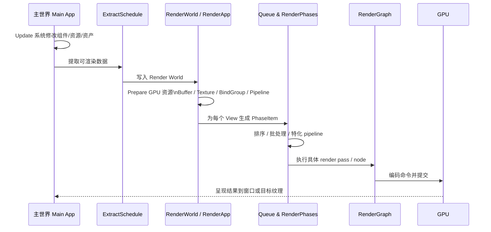
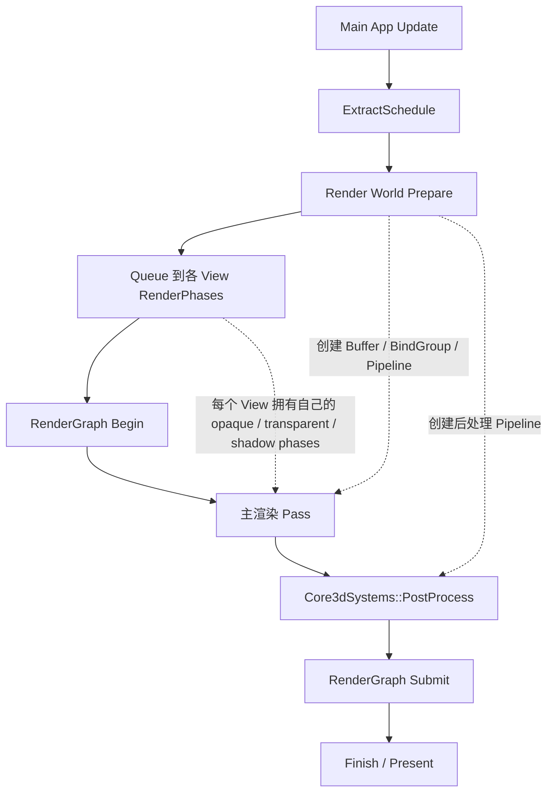

# Bevy 0.19 中的渲染管线与自定义 Shader 教程

## 执行摘要

本文以 **Bevy 0.19.0** 为唯一版本边界，先核对 **GitHub 上 `bevyengine/bevy` 的 `v0.19.0` 标签源码**，再覆盖 **bevy.org 官方示例、迁移指南与官方站点说明**，最后用 **docs.rs 的 0.19.0 API 文档**补足类型签名与 trait 约束；因此，文中的 API 名称、模块路径与实现方式都以 0.19 为准，而不是较旧教程常见的 0.8/0.10/0.11 风格。Bevy 0.19 的核心渲染模型仍然是“**主世界 ECS → 提取到 RenderApp 的渲染世界 → Prepare/Queue → RenderGraph 执行 → GPU 提交与呈现**”，其中高层自定义最适合用 `Material` / `Material2d`，中层自定义最适合用 `SpecializedMeshPipeline`，而低层自定义全屏后处理/自定义 pass 则通常直接接入 `RenderApp`、`PipelineCache`、`ViewTarget` 与核心 3D/2D 管线的调度点。

如果你只想“在场景里跑自己写的 WGSL 顶点/片元 shader”，**首选 `Material2d` / `Material`**。它们已经替你处理了材质资产、绑定组生成、提取、排队与大部分 render phase 接入，唯一通常需要手写的是 `vertex_shader()`、`fragment_shader()`，以及在顶点输入布局与默认布局不一致时重写 `specialize()`。如果你的需求是“**完全控制 render pipeline descriptor、render command、批处理/排序策略**”，就进入 `SpecializedMeshPipeline` 路线；如果你的需求是“**拿到某个视图已经渲染好的颜色纹理，再做一个后处理 pass**”，则应走 `RenderApp + PipelineCache + ViewTarget::post_process_write()` 的方案。

关于着色器格式，Bevy 0.19 的默认与最稳妥路径仍然是 **WGSL**。顶层 `bevy` crate 在 0.19 暴露了 `shader_format_spirv`、`shader_format_glsl`、`shader_format_wesl` 等 feature，而 `bevy_render` 则提供 `shader_format_spirv` 和 `spirv_shader_passthrough`。同时，`ShaderSource` 在 Rust API 中支持 `Wgsl`、`SpirV` 与 `Naga` 变体，`RenderDevice::create_shader_module` 也能从 WGSL 或 SPIR-V 建模块；但 docs 明确指出 **WebGPU 规范只接受 WGSL 字符串**，因此面向 Web 或需要最大可移植性时，应优先使用 WGSL。

本文给出两个完整示例。第一个示例使用 **`Material2d` + 自定义 WGSL 顶点/片元 shader**，展示如何在 Bevy 0.19 中通过插件完成 pipeline 注册、通过 `AsBindGroup` 绑定资源、通过材质资产驱动渲染，并解释其与 ECS 的交互。第二个示例基于 **官方 0.19 `custom_post_processing` 思路**，展示如何在 `RenderApp` 中初始化自定义 render pipeline、如何把主世界组件自动同步到渲染世界、如何选取核心 3D 管线中的后处理插入点，以及为什么有些 bind group 必须在 pass 执行阶段而不是 Queue 阶段创建。

## 研究范围与版本边界

本文的“版本真相来源”按你的优先级顺序组织：

其一，**GitHub 官方源码**。我优先使用 `bevyengine/bevy` 的 `v0.19.0` 标签源码，包括 `examples/`、`assets/shaders/` 与 `crates/bevy_render`、`crates/bevy_sprite_render` 等目录，因为这能避免 `main` 分支继续演进导致的 API 漂移。其二，**bevy.org 官方站点**，主要用于示例导航、渲染图景说明与迁移背景。其三，**docs.rs 0.19.0 API 文档**，用于核对 trait 方法、类型约束与字段含义。docs.rs 的版本页显示 `0.19.0` 发布于 **2026-06-19**，并且当前“latest successful build”也是 `0.19.0`，因此本文将 docs.rs 的 `latest` 页面视为 `0.19.0` 页面使用，但凡涉及实现细节，仍以 GitHub `v0.19.0` tag 为准。

这一定义非常重要，因为 Bevy 渲染 API 的教程极易“**版本错档**”。例如，0.8 的 renderer 重点在 camera-driven rendering，0.10 把内建 stages 迁移成 system sets，0.11 强化了 shader imports，0.12 引入 Material Extensions，0.18 再增加 Fullscreen Materials；如果把这些版本的示例混用，很容易出现模块路径、插件注册位置、schedule 名称和 shader import 习惯都不一致的问题。

因此，本文采取两个硬规则。第一，**只采用 0.19 的 API 名称与示例写法**。第二，若某个概念在旧版本中有显著不同，我会明确指出“旧版这样做，而 0.19 不建议这样做”，并给出迁移建议。对于示例代码，我尽量直接贴近官方 0.19 示例的结构，以减少你复制时踩到“旧教程 API”坑的概率。

## 渲染架构总览

Bevy 官方站点把 2D/3D 渲染都描述为“**built on top of Bevy’s Render Graph**”，并强调 Render Graph 的特点是 **graph structure、可组合、可复用、可并行执行、后端无关**。在 0.19 的实现里，这不是抽象口号，而是真正体现在 `RenderApp` 与 `RenderGraph` 调度上的：渲染并不是在主世界里临时塞几个系统，而是有一个独立的 **render sub-app** 与 **render world**，由提取、准备、排队与图执行共同驱动。`App` 能包含多个 `SubApp`，而 `bevy_render` 会为渲染安装默认的提取函数；`RenderApp` 正是这个渲染子应用的标签。

从 0.19 源码看，根级的 `RenderGraph` 实际上是一个 schedule label，它的 base schedule 顺序是 **`RenderGraphSystems::Begin -> Render -> Submit -> Finish`**；`render_system` 每帧调用 `world.run_schedule(RenderGraph)` 来驱动整个图执行，随后做截图/GPU readback 的最终提交，并对需要 present 的 swap chain 执行呈现。也就是说，在“图”这个概念之外，Bevy 0.19 还把根级图执行包裹在一个明确的 schedule 生命周期里。

与此同时，render phases 负责“**哪些东西、以什么顺序、进入哪个 pass**”。官方 `render_phase` 文档明确写道：**每个 view（相机、投影光等）会对应一个或多个 render phases**，例如 opaque、transparent、shadow 等；它们的存在是因为不同阶段需要不同的排序与批处理策略，例如 opaque 往往前到后，transparent 往往后到前。`PhaseItem` 文档进一步给出了更精确的数据流：渲染实体所需数据在 `ExtractSchedule` 从主世界提取到渲染世界，在 `RenderSystems::Queue` 中把对应的 phase item 放入 phase，之后在 `PhaseSort` 和 `Render` 阶段被排序并真正渲染。

从资源视角看，Bevy 的“render resources”至少包含这些东西：GPU buffer、texture、sampler、bind group、bind group layout、render pipeline descriptor、cached pipeline id，以及与这些对象相关的缓存与上传逻辑。`AsBindGroup` 的职责就是把一个 Rust 值转换成 shader 可消费的 `BindGroup`；它通常应由 derive 自动生成，而且文档说明 `as_bind_group` 的结果应被缓存，如果纹理尚未加载，可以返回 `RetryNextUpdate`，让系统稍后再重试。

下面这张示意图把“高层材质 API”和“低层 render pass / graph”之间的关系串起来。它不是源码中的原图，而是根据 0.19 的 `RenderGraph`、`Material2d`、`SpecializedMeshPipeline` 与 `custom_post_processing` 示例整理出的结构图。

<svg width="760" height="250" viewBox="0 0 760 250" xmlns="http://www.w3.org/2000/svg" role="img" aria-label="Bevy render pipeline and render node relation">
  <rect x="20" y="20" width="180" height="60" rx="10" fill="#eef5ff" stroke="#4a76a8"/>
  <text x="110" y="45" text-anchor="middle" font-size="16" font-family="sans-serif">Main App ECS</text>
  <text x="110" y="65" text-anchor="middle" font-size="13" font-family="sans-serif">系统 / 组件 / 资源 / 资产</text>
  <rect x="290" y="20" width="180" height="60" rx="10" fill="#eefaf0" stroke="#4f8a5b"/>
  <text x="380" y="45" text-anchor="middle" font-size="16" font-family="sans-serif">RenderApp</text>
  <text x="380" y="65" text-anchor="middle" font-size="13" font-family="sans-serif">Extract / Prepare / Queue</text>
  <rect x="560" y="20" width="180" height="60" rx="10" fill="#fff5ea" stroke="#b8792e"/>
  <text x="650" y="45" text-anchor="middle" font-size="16" font-family="sans-serif">RenderGraph</text>
  <text x="650" y="65" text-anchor="middle" font-size="13" font-family="sans-serif">Nodes / Passes / Submit</text>
  <rect x="70" y="140" width="200" height="70" rx="10" fill="#f8f8ff" stroke="#6666aa"/>
  <text x="170" y="165" text-anchor="middle" font-size="15" font-family="sans-serif">高层路径</text>
  <text x="170" y="187" text-anchor="middle" font-size="13" font-family="sans-serif">Material / Material2d</text>
  <text x="170" y="205" text-anchor="middle" font-size="13" font-family="sans-serif">AsBindGroup + ShaderRef</text>
  <rect x="300" y="140" width="200" height="70" rx="10" fill="#fffdf5" stroke="#9a8b3a"/>
  <text x="400" y="165" text-anchor="middle" font-size="15" font-family="sans-serif">中层路径</text>
  <text x="400" y="187" text-anchor="middle" font-size="13" font-family="sans-serif">SpecializedMeshPipeline</text>
  <text x="400" y="205" text-anchor="middle" font-size="13" font-family="sans-serif">自定义布局 / key / draw</text>
  <rect x="530" y="140" width="200" height="70" rx="10" fill="#fff7f7" stroke="#aa6666"/>
  <text x="630" y="165" text-anchor="middle" font-size="15" font-family="sans-serif">低层路径</text>
  <text x="630" y="187" text-anchor="middle" font-size="13" font-family="sans-serif">自定义 pass / 后处理</text>
  <text x="630" y="205" text-anchor="middle" font-size="13" font-family="sans-serif">ViewTarget + PipelineCache</text>
  <line x1="200" y1="50" x2="290" y2="50" stroke="#555" stroke-width="2"/>
  <polygon points="290,50 280,45 280,55" fill="#555"/>
  <line x1="470" y1="50" x2="560" y2="50" stroke="#555" stroke-width="2"/>
  <polygon points="560,50 550,45 550,55" fill="#555"/>
  <line x1="170" y1="140" x2="340" y2="80" stroke="#666" stroke-width="2" stroke-dasharray="6,4"/>
  <line x1="400" y1="140" x2="380" y2="80" stroke="#666" stroke-width="2" stroke-dasharray="6,4"/>
  <line x1="630" y1="140" x2="620" y2="80" stroke="#666" stroke-width="2" stroke-dasharray="6,4"/>
  <text x="380" y="235" text-anchor="middle" font-size="12" font-family="sans-serif">图中虚线表示“常见接入层级”，不是唯一可能路径</text>
</svg>

在实践中，可以把 Bevy 0.19 的自定义渲染拆成三层理解。**高层**是 `Material`/`Material2d`：你主要描述“材质参数如何绑定、shader 用哪一份、是否需要自定义顶点布局”。**中层**是 `SpecializedMeshPipeline`：你自己决定 pipeline variants 的 key、vertex buffer layout，甚至结合自定义 render command 参与更细颗粒度的 phase/item 排队。**低层**是自定义 pass / node：你直接在 `RenderApp` 里创建 pipeline、bind group、render pass，并选一个核心管线插入点或自己接入 render graph。高层最省心，低层最灵活。

下面这张图用时序方式展示一帧中的典型数据流。它依据 `PhaseItem` 文档、`ExtractResource` / `ExtractComponent` 文档、`RenderGraph` 根 schedule 源码与官方后处理示例整理。



## 关键类型与 API

为了避免“只背概念，不知道该用哪个类型”，下表把 0.19 中最关键的一组渲染 API 放到同一张表里。表中的分类与说明综合自 `RenderGraph`、`render_phase`、`Material2d`、`Material`、`AsBindGroup`、`Extract*`、`UniformComponentPlugin` 与官方示例源码。

| 类型 / API | 位置 | 在 0.19 中的角色 | 何时优先使用 |
|---|---|---|---|
| `RenderApp` | `bevy::render` | 渲染子应用标签；你通过 `app.get_sub_app_mut(RenderApp)` 向渲染世界加系统/资源 | 需要操作渲染世界、低层自定义 pass |
| `RenderGraph` | `bevy::render::render_graph` | 根图执行入口；根 schedule 顺序是 Begin/Render/Submit/Finish | 讨论图执行顺序、接入低层 pass |
| `PhaseItem` / render phases | `bevy::render::render_phase` | 每个 view 的队列项；决定对象进入哪个 phase、怎么排序/批处理 | 自定义 mesh rendering、理解 Queue/Render |
| `Material` / `Material2d` | `bevy::prelude` / `bevy::sprite_render` | 高层材质接口；自带 shader 钩子和 pipeline specialize 钩子 | 最常见的自定义 shader 入口 |
| `Material2dPlugin` | `bevy::sprite_render` | 为某种 `Material2d` 自动注册 ECS 资源和 render logic | 2D 材质渲染几乎必用 |
| `AsBindGroup` | `bevy::render::render_resource` | 把 Rust 数据生成 shader 可绑定的 bind group | 材质/参数绑定标准入口 |
| `ExtractComponentPlugin` | `bevy::render::extract_component` | 把组件从主世界提取到渲染世界 | 相机设置、每视图参数、低层 pass 参数 |
| `ExtractResourcePlugin` | `bevy::render::extract_resource` | 把资源从主世界提取到渲染世界 | 全局后处理参数、GPU 共享配置 |
| `UniformComponentPlugin` | `bevy::render::extract_component` | 自动把组件准备成 GPU uniform 并插入 `DynamicUniformIndex` | 每实体/每相机 uniform 上传 |
| `SpecializedMeshPipeline` | `bevy::render::render_resource` | 按 key 生成 render pipeline variant | 需要自己控制 pipeline 变体 |
| `PipelineCache` | `bevy::render::render_resource` | 异步缓存并查询 GPU pipeline | 低层 pass、自定义 pipeline |
| `ShaderRef` / `ShaderSource` | `bevy::shader` / `render_resource` | 指向 shader 资产或默认 shader；源格式可为 WGSL / SPIR-V / Naga | 指定 shader 文件或内嵌 shader |
| `ViewTarget` | `bevy::render::view` | 当前视图目标纹理；后处理时可取得 source/destination 双缓冲 | 全屏后处理、自定义 render pass |

有几个 API 关系尤其需要记住。

`Material2d` 与 `Material` **不是**“shader 文件本身”，而是“**如何把一个资产类型接入 Bevy 渲染系统**”的桥。它们要求实现 `AsBindGroup + Asset + Clone`，并通过 `vertex_shader()`、`fragment_shader()`、`specialize()` 等方法把材质与实际 render pipeline 对接。文档也明确说了：`Material2d` 需要与 `Material2dPlugin`、`Mesh2d` 和 `MeshMaterial2d` 一起使用。

`AsBindGroup` 则是几乎所有高层材质管线的“绑定入口”。它把你的 Rust struct 变成 `BindGroup`，可以自动处理 uniform、texture、sampler 等绑定；文档特别提醒了两点：一是它一般应该用 derive 自动生成，二是 bind group 的生成结果会被缓存，如果依赖的贴图还没加载，可以返回 `RetryNextUpdate`，下个更新周期重试。换句话说，很多“我的材质刚开始不显示，过一帧又好了”的现象，本质上是资源准备生命周期的一部分。

`SpecializedMeshPipeline` 是中层 API 的关键。它要求你定义一个 `Key`，并实现 `specialize(&self, key, layout) -> RenderPipelineDescriptor` 或相近形式的逻辑，用 key 与顶点布局共同决定“当前这个变体”的 render pipeline descriptor。官方对这个 trait 的定义非常明确：**key 决定每个 pipeline variant**，而返回值的 vertex buffer 通常应由传入的 `layout` 派生。

在低层自定义中，`PipelineCache` 与 `CachedRenderPipelineId` 会反复出现。官方后处理示例的标准写法是：先在初始化阶段把 `RenderPipelineDescriptor` 丢给 `pipeline_cache.queue_render_pipeline(...)` 获取 `CachedRenderPipelineId`，再在执行时通过 `pipeline_cache.get_render_pipeline(...)` 看它是否已经可用。如果缓存尚未完成，就提前返回，而不是强行渲染。这个模式非常典型，也很值得照抄。

最后说 shader 格式。Bevy 0.19 的上层 cargo feature 暴露了 `shader_format_glsl`、`shader_format_spirv` 与 `shader_format_wesl`；`ShaderSource` 在 Rust API 中支持 `Wgsl`、`SpirV` 和 `Naga`；`RenderDevice::create_shader_module` 也说明了可以从 WGSL 或 SPIR-V 创建模块。但 docs 同时明确提示：在 **WebGPU 规范层面，Web 端只接受 WGSL**。因此，本教程所有示例都用 WGSL；对于 SPIR-V，我只在“支持与边界”层面说明，不把它作为默认教程路径。

## 数据流、生命周期与 ECS 交互

理解 Bevy 渲染最实用的方法，不是死记模块名，而是记住“**谁活在主世界，谁活在渲染世界，什么时候会被复制/上传/排队**”。

主世界里的系统更新你的组件、资源与资产；到渲染周期开始时，`ExtractSchedule` 把需要渲染的数据从主世界拷贝或转换到渲染世界。资源级同步可以用 `ExtractResource` / `ExtractResourcePlugin`；组件级同步可以用 `ExtractComponent` / `ExtractComponentPlugin`。这些 API 的文档都直接写明了：它们的职责就是把指定资源或组件在 **ExtractSchedule** 中传递到 **render world**。

随后进入 Prepare/Queue 一侧。这里通常做两类事：一类是把 CPU 侧数据转成 GPU 侧对象，例如 uniform buffer、bind group、sampler、texture 等；另一类是把“要画什么”转成每个 view 的 phase items，放入 render phases 中等待排序与渲染。`UniformComponentPlugin` 代表的是第一类的“自动化入口”——它会把组件转成 uniform，写进 `ComponentUniforms`，并给每个实体/视图插入 `DynamicUniformIndex`；这在多相机场景中特别重要，因为你最终要把正确的 dynamic offset 传给 bind group。

这套生命周期与 ECS 的交互点，最典型地体现在官方后处理示例上：`PostProcessSettings` 是一个**主世界中的相机组件**，但插件会用 `ExtractComponentPlugin::<PostProcessSettings>` 自动把它提取到渲染世界，再用 `UniformComponentPlugin::<PostProcessSettings>` 自动生成 GPU uniform。于是，你在普通 ECS `Update` 系统里改 `PostProcessSettings`，渲染侧就会在下一帧自动看到新值。对使用者来说这是“ECS 改组件”；对 renderer 来说则是“下一帧 extract + uniform upload”。

高层材质路径的生命周期也类似，只是绑定资源来自 **材质资产**。`Material2d` 文档明确指出，材质与 `Mesh2d`、`MeshMaterial2d` 一起出现时，能够以高层方式渲染 2D mesh；而 `AsBindGroup` 又决定了材质字段如何变成 shader 绑定。于是，ECS 侧经常只存一个 `MeshMaterial2d<YourMaterial>` 句柄组件，真正的 shader 参数则存放在 `Assets<YourMaterial>` 资源里。这也是为什么“修改材质颜色”通常不是改 entity 上的普通字段，而是去 `Assets<YourMaterial>` 里修改对应 asset 的内容。

如果把这条链条压缩成一句话，那就是：**ECS 负责表达“场景和参数是什么”，渲染世界负责表达“这些数据被整理成了哪些 GPU 资源和 phase items”，RenderGraph 负责表达“这些 phase items 与 pass 最终如何被执行”**。这也是 Bevy 0.19 自定义渲染的根本心智模型。

下面这张 mermaid 流程图把根级执行顺序、per-view phases 与后处理插入点放在一起看，更接近你写低层代码时真正要思考的问题。图中的 `Core3dSystems::PostProcess` 插入点来自官方 0.19 后处理示例。



## 示例一

这个示例选择 **2D 自定义材质** 路线：用 `Material2d` 注册材质类型与渲染逻辑，用 `AsBindGroup` 定义一个 uniform 资源，用一份 **同时包含顶点与片元入口** 的 WGSL 文件把矩形网格扭成波浪面片。它对应 0.19 的高层用法：不会手动操作 `PipelineCache`，但会展示 shader 入口、顶点布局特化、材质资产、绑定资源和场景使用方式。`Material2d` 的接口形状、`Material2dPlugin` 的职责、以及“官方 0.19 示例里同时提供 `vertex_shader()` 和 `fragment_shader()` 并通过 `specialize()` 重写顶点布局”的做法，都有直接依据。

### 项目结构

```text
bevy_019_wave_material/
├─ Cargo.toml
├─ src/
│  └─ main.rs
└─ assets/
   └─ shaders/
      └─ wave_material_2d.wgsl
```

### Cargo.toml

```toml
[package]
name = "bevy_019_wave_material"
version = "0.1.0"
edition = "2024"

[dependencies]
bevy = "0.19"
```

### src/main.rs

```rust
use bevy::{
    mesh::MeshVertexBufferLayoutRef,
    prelude::*,
    reflect::TypePath,
    render::render_resource::{
        AsBindGroup, RenderPipelineDescriptor, ShaderType, SpecializedMeshPipelineError,
    },
    shader::ShaderRef,
    sprite_render::{Material2d, Material2dKey, Material2dPlugin, MeshMaterial2d},
};

const SHADER_ASSET_PATH: &str = "shaders/wave_material_2d.wgsl";

fn main() {
    App::new()
        .add_plugins(DefaultPlugins)
        .add_plugins(Material2dPlugin::<WaveMaterial>::default())
        .add_systems(Startup, setup)
        .add_systems(Update, animate_tint)
        .run();
}

#[derive(Clone, Copy, Debug, ShaderType)]
struct WaveParams {
    tint: LinearRgba,
    // x = amplitude, y = frequency, z = speed, w = reserved
    wave: Vec4,
}

#[derive(Asset, TypePath, Debug, Clone, AsBindGroup)]
struct WaveMaterial {
    #[uniform(0)]
    params: WaveParams,
}

impl Material2d for WaveMaterial {
    fn vertex_shader() -> ShaderRef {
        SHADER_ASSET_PATH.into()
    }

    fn fragment_shader() -> ShaderRef {
        SHADER_ASSET_PATH.into()
    }

    fn specialize(
        descriptor: &mut RenderPipelineDescriptor,
        layout: &MeshVertexBufferLayoutRef,
        _key: Material2dKey<Self>,
    ) -> Result<(), SpecializedMeshPipelineError> {
        // 这一步把 Mesh 顶点属性映射到我们在 WGSL 中声明的 location
        let vertex_layout = layout.0.get_layout(&[
            Mesh::ATTRIBUTE_POSITION.at_shader_location(0),
            Mesh::ATTRIBUTE_UV_0.at_shader_location(1),
        ])?;

        descriptor.vertex.buffers = vec![vertex_layout];
        Ok(())
    }
}

fn setup(
    mut commands: Commands,
    mut meshes: ResMut<Assets<Mesh>>,
    mut materials: ResMut<Assets<WaveMaterial>>,
) {
    commands.spawn(Camera2d);

    let material = materials.add(WaveMaterial {
        params: WaveParams {
            tint: LinearRgba::from(Color::srgb(0.25, 0.75, 1.0)),
            wave: Vec4::new(0.10, 10.0, 1.5, 0.0),
        },
    });

    commands.spawn((
        Mesh2d(meshes.add(Rectangle::new(500.0, 300.0))),
        MeshMaterial2d(material),
        Transform::default(),
        Name::new("Wave Quad"),
    ));
}

fn animate_tint(time: Res<Time>, mut materials: ResMut<Assets<WaveMaterial>>) {
    let t = time.elapsed_secs();
    for (_, material) in materials.iter_mut() {
        let r = 0.35 + 0.25 * (t * 0.8).sin();
        let g = 0.65 + 0.20 * (t * 1.1).cos();
        let b = 0.90;
        material.params.tint = LinearRgba::new(r, g, b, 1.0);
    }
}
```

### assets/shaders/wave_material_2d.wgsl

```wgsl
#import bevy_sprite::{
    mesh2d_view_bindings::globals,
    mesh2d_functions::{get_world_from_local, mesh2d_position_local_to_clip},
}

struct WaveMaterial {
    tint: vec4<f32>,
    wave: vec4<f32>,
};

@group(#{MATERIAL_BIND_GROUP}) @binding(0)
var<uniform> material: WaveMaterial;

struct Vertex {
    @builtin(instance_index) instance_index: u32,
    @location(0) position: vec3<f32>,
    @location(1) uv: vec2<f32>,
};

struct VertexOutput {
    @builtin(position) clip_position: vec4<f32>,
    @location(0) uv: vec2<f32>,
};

@vertex
fn vertex(vertex: Vertex) -> VertexOutput {
    var out: VertexOutput;

    let world_from_local = get_world_from_local(vertex.instance_index);

    var local_position = vec4<f32>(vertex.position, 1.0);
    let amplitude = material.wave.x;
    let frequency = material.wave.y;
    let speed = material.wave.z;

    local_position.y += sin((vertex.uv.x + globals.time * speed) * frequency) * amplitude * 120.0;

    out.clip_position = mesh2d_position_local_to_clip(world_from_local, local_position);
    out.uv = vertex.uv;
    return out;
}

@fragment
fn fragment(in: VertexOutput) -> @location(0) vec4<f32> {
    let pulse = 0.85 + 0.15 * sin(globals.time * material.wave.z * 2.0);
    let feather_x = smoothstep(0.0, 0.08, in.uv.x) * (1.0 - smoothstep(0.92, 1.0, in.uv.x));
    let feather_y = smoothstep(0.0, 0.08, in.uv.y) * (1.0 - smoothstep(0.92, 1.0, in.uv.y));
    let alpha = feather_x * feather_y;

    return vec4<f32>(material.tint.rgb * pulse, alpha);
}
```

### 关键代码逐模块解释

`Material2dPlugin::<WaveMaterial>::default()` 是整个高层方案的入口。根据 `Material2dPlugin` 文档，它会为给定 `Material2d` 类型安装“**必要的 ECS 资源与 render logic**”。这意味着你并不需要自己手写“把材质塞进 phase、何时创建 bind group、何时排队绘制”的基础设施；高层材质 API 已经替你接进 2D mesh 渲染路径。

`WaveMaterial` 上的 `#[derive(Asset, TypePath, AsBindGroup)]` 是第二个关键点。这里的 `Asset` 让它进入 `Assets<WaveMaterial>`，`TypePath` 让反射/资产系统能识别这个类型，而 `AsBindGroup` 则负责把 `params` 变成一个 GPU uniform bind group。`Material2d` 文档明确要求材质实现 `AsBindGroup`，而 `AsBindGroup` 文档又说明这种转换通常应 derive 自动生成。

`vertex_shader()` 与 `fragment_shader()` 同时返回同一个 WGSL 文件，是 0.19 完全正常、而且官方示例已经使用过的模式。`custom_gltf_vertex_attribute.rs` 在 `Material2d` 实现里就同时覆盖了这两个方法，并在同一份 shader 中声明顶点与片元入口。因此，这里不是“魔法写法”，而是对官方 0.19 方案的最小化改写。

`specialize()` 的作用是让 Rust 侧顶点布局与 WGSL 里的 `@location` 对齐。若你不写它，Bevy 会走默认 2D material pipeline 的默认布局；但一旦你在 WGSL 中自己声明 `struct Vertex { @location(0) position, @location(1) uv }`，就最好在 `specialize()` 里显式写出 `Mesh::ATTRIBUTE_POSITION.at_shader_location(0)` 与 `Mesh::ATTRIBUTE_UV_0.at_shader_location(1)`。这与官方 0.19 示例通过 `specialize()` 指定 `POSITION/COLOR/BARYCENTRIC` 的思路完全一致。

WGSL 顶点 shader 里导入 `bevy_sprite::mesh2d_functions::{get_world_from_local, mesh2d_position_local_to_clip}`，以及 `mesh2d_view_bindings::globals`，这是 0.19 `bevy_sprite_render` 自带 shader 模块的标准用法。`custom_gltf_2d.wgsl` 证明了 2D 自定义顶点 shader 可以直接从 `bevy_sprite` 导入这些函数；`mesh2d_functions.wgsl` 进一步给出了这些函数的真实实现，其中 `get_world_from_local` 读取 per-object mesh uniform，而 `mesh2d_position_local_to_clip` 完成 local → world → clip 的转换。

`globals.time` 的使用也不是“随手猜的全局变量”。官方 `custom_gltf_2d.wgsl` 与 `animate_shader.wgsl` 都通过 view bindings 里的 `globals` 读取时间，用于动画效果。因此，在高层 `Material2d` 路线下，如果你的动画是“每个 view 统一推进”的效果，直接在 shader 中用 `globals.time` 往往比你每帧回写材质资产更自然，也更省 CPU。这里我依然保留了 `animate_tint` 系统，只是为了演示主世界 ECS 如何通过修改材质资产影响渲染结果。

### 常见错误、调试技巧与性能注意事项

最常见的错误是 **忘记注册 `Material2dPlugin::<YourMaterial>`**。如果少了这一句，entity 上虽然有 `Mesh2d` 和 `MeshMaterial2d`，但对应材质类型不会被正确接入渲染逻辑，结果往往是“场景里什么都没有”或“材质根本没生效”。这个错误在高层路径里极其典型。

第二类常见错误是 **WGSL 的 `@location` 与 `specialize()` 里的顶点布局不一致**。比如 shader 把 UV 写在 `@location(1)`，Rust 却给了 `ATTRIBUTE_COLOR`；或者你根本没有 `specialize()`，却在 shader 里假设了自定义布局。这会表现为几何体完全不显示、UV 乱飞，或者出现验证层报错。官方的 `custom_gltf_vertex_attribute` 之所以显式写 `specialize()`，就是为了避免这种错位。

调试上，Bevy `render` 文档列出了几个很实用的环境变量，其中 `WGPU_DEBUG=1` 可以打开 debug labels，`WGPU_VALIDATION=0` 可以关闭验证层。实际开发时，建议先保留验证层、只打开 debug labels；只有在验证信息过于噪声时才临时关闭。对于材质路径，debug label 与验证层能非常快地告诉你“binding index 不匹配”“pipeline layout 不一致”“shader entry point 不存在”等问题。

性能上，这一路线的核心建议有三条。第一，**不要每帧新增材质资产**，而是修改已有 `Assets<WaveMaterial>` 内容；因为 `AsBindGroup` 结果会被缓存，频繁创建新资产会放大资源重建成本。第二，**尽量减少不必要的 pipeline 变体**，只有在顶点布局、alpha 模式或真正影响 pipeline descriptor 的项目变动时才去 `specialize()`。第三，**把所有“只是随时间变化、但对所有对象都一样”的参数放进共享 view/global binding，比把它们写入每个材质更划算**。

## 示例二

第二个示例走 **低层自定义后处理 pass** 路线。它基本遵循 Bevy 0.19 官方 `custom_post_processing.rs` 的结构：在主世界相机上挂一个 `PostProcessSettings` 组件，用 `ExtractComponentPlugin` 和 `UniformComponentPlugin` 把它同步到渲染世界与 GPU；在 `RenderStartup` 初始化一个 fullscreen render pipeline；再把真正的后处理系统挂到 `RenderApp` 的 `Core3d` 调度里，并放进 `Core3dSystems::PostProcess` 集合。这样做的关键价值在于：你不需要重建整个 3D graph，但仍能拿到主渲染结果纹理做后处理。

### 项目结构

```text
bevy_019_post_process/
├─ Cargo.toml
├─ src/
│  └─ main.rs
└─ assets/
   └─ shaders/
      └─ post_processing.wgsl
```

### Cargo.toml

```toml
[package]
name = "bevy_019_post_process"
version = "0.1.0"
edition = "2024"

[dependencies]
bevy = "0.19"
```

### src/main.rs

```rust
use bevy::{
    core_pipeline::{
        core_3d::{Core3d, Core3dSystems},
        fullscreen_vertex_shader::FullscreenShader,
    },
    prelude::*,
    render::{
        extract_component::{
            ComponentUniforms, DynamicUniformIndex, ExtractComponent, ExtractComponentPlugin,
            UniformComponentPlugin,
        },
        render_resource::{
            binding_types::{sampler, texture_2d, uniform_buffer},
            *,
        },
        renderer::{RenderContext, RenderDevice, ViewQuery},
        view::ViewTarget,
        RenderApp, RenderStartup,
    },
};

const SHADER_ASSET_PATH: &str = "shaders/post_processing.wgsl";

fn main() {
    App::new()
        .add_plugins((DefaultPlugins, PostProcessPlugin))
        .add_systems(Startup, setup)
        .add_systems(Update, (rotate_cube, animate_settings))
        .run();
}

struct PostProcessPlugin;

impl Plugin for PostProcessPlugin {
    fn build(&self, app: &mut App) {
        app.add_plugins((
            ExtractComponentPlugin::<PostProcessSettings>::default(),
            UniformComponentPlugin::<PostProcessSettings>::default(),
        ));

        let Some(render_app) = app.get_sub_app_mut(RenderApp) else {
            return;
        };

        render_app.add_systems(RenderStartup, init_post_process_pipeline);
        render_app.add_systems(
            Core3d,
            post_process_system.in_set(Core3dSystems::PostProcess),
        );
    }
}

#[derive(Component, Default, Clone, Copy, ExtractComponent, ShaderType)]
struct PostProcessSettings {
    intensity: f32,

    #[cfg(feature = "webgl2")]
    _webgl2_padding: Vec3,
}

#[derive(Resource)]
struct PostProcessPipeline {
    layout: BindGroupLayoutDescriptor,
    sampler: Sampler,
    pipeline_id: CachedRenderPipelineId,
}

#[derive(Default)]
struct PostProcessBindGroupCache {
    cached: Option<(TextureViewId, BindGroup)>,
}

fn init_post_process_pipeline(
    mut commands: Commands,
    render_device: Res<RenderDevice>,
    asset_server: Res<AssetServer>,
    fullscreen_shader: Res<FullscreenShader>,
    pipeline_cache: Res<PipelineCache>,
) {
    let layout = BindGroupLayoutDescriptor::new(
        "post_process_bind_group_layout",
        &BindGroupLayoutEntries::sequential(
            ShaderStages::FRAGMENT,
            (
                texture_2d(TextureSampleType::Float { filterable: true }),
                sampler(SamplerBindingType::Filtering),
                uniform_buffer::<PostProcessSettings>(true),
            ),
        ),
    );

    let sampler = render_device.create_sampler(&SamplerDescriptor::default());
    let shader = asset_server.load(SHADER_ASSET_PATH);
    let vertex_state = fullscreen_shader.to_vertex_state();

    let pipeline_id = pipeline_cache.queue_render_pipeline(RenderPipelineDescriptor {
        label: Some("post_process_pipeline".into()),
        layout: vec![layout.clone()],
        vertex: vertex_state,
        fragment: Some(FragmentState {
            shader,
            targets: vec![Some(ColorTargetState {
                format: TextureFormat::Rgba8UnormSrgb,
                blend: None,
                write_mask: ColorWrites::ALL,
            })],
            ..default()
        }),
        ..default()
    });

    commands.insert_resource(PostProcessPipeline {
        layout,
        sampler,
        pipeline_id,
    });
}

fn post_process_system(
    view: ViewQuery<(
        &ViewTarget,
        &PostProcessSettings,
        &DynamicUniformIndex<PostProcessSettings>,
    )>,
    post_process_pipeline: Option<Res<PostProcessPipeline>>,
    pipeline_cache: Res<PipelineCache>,
    settings_uniforms: Res<ComponentUniforms<PostProcessSettings>>,
    mut cache: Local<PostProcessBindGroupCache>,
    mut ctx: RenderContext,
) {
    let Some(post_process_pipeline) = post_process_pipeline else {
        return;
    };

    let (view_target, _settings, settings_index) = view.into_inner();

    let Some(pipeline) = pipeline_cache.get_render_pipeline(post_process_pipeline.pipeline_id) else {
        return;
    };

    let Some(settings_binding) = settings_uniforms.uniforms().binding() else {
        return;
    };

    let post_process = view_target.post_process_write();

    let bind_group = match &mut cache.cached {
        Some((texture_id, bind_group)) if post_process.source.id() == *texture_id => bind_group,
        cached => {
            let bind_group = ctx.render_device().create_bind_group(
                "post_process_bind_group",
                &pipeline_cache.get_bind_group_layout(&post_process_pipeline.layout),
                &BindGroupEntries::sequential((
                    post_process.source,
                    &post_process_pipeline.sampler,
                    settings_binding.clone(),
                )),
            );

            let (_, bind_group) = cached.insert((post_process.source.id(), bind_group));
            bind_group
        }
    };

    let mut render_pass = ctx.command_encoder().begin_render_pass(&RenderPassDescriptor {
        label: Some("post_process_pass"),
        color_attachments: &[Some(RenderPassColorAttachment {
            view: post_process.destination,
            depth_slice: None,
            resolve_target: None,
            ops: Operations::default(),
        })],
        depth_stencil_attachment: None,
        timestamp_writes: None,
        occlusion_query_set: None,
        multiview_mask: None,
    });

    render_pass.set_pipeline(pipeline);
    render_pass.set_bind_group(0, bind_group, &[settings_index.index()]);
    render_pass.draw(0..3, 0..1);
}

#[derive(Component)]
struct Rotates;

fn setup(
    mut commands: Commands,
    mut meshes: ResMut<Assets<Mesh>>,
    mut materials: ResMut<Assets<StandardMaterial>>,
) {
    commands.spawn((
        Camera3d::default(),
        Transform::from_xyz(0.0, 0.0, 5.0).looking_at(Vec3::ZERO, Vec3::Y),
        Camera {
            clear_color: Color::WHITE.into(),
            ..default()
        },
        PostProcessSettings {
            intensity: 0.02,
            ..default()
        },
    ));

    commands.spawn((
        Mesh3d(meshes.add(Cuboid::default())),
        MeshMaterial3d(materials.add(Color::srgb(0.8, 0.7, 0.6))),
        Transform::from_xyz(0.0, 0.5, 0.0),
        Rotates,
    ));

    commands.spawn(DirectionalLight {
        illuminance: 1000.0,
        ..default()
    });
}

fn rotate_cube(time: Res<Time>, mut query: Query<&mut Transform, With<Rotates>>) {
    for mut transform in &mut query {
        transform.rotate_x(0.55 * time.delta_secs());
        transform.rotate_z(0.15 * time.delta_secs());
    }
}

fn animate_settings(time: Res<Time>, mut query: Query<&mut PostProcessSettings>) {
    for mut settings in &mut query {
        let intensity = ((time.elapsed_secs().sin()).sin() * 0.5 + 0.5) * 0.015;
        settings.intensity = intensity;
    }
}
```

### assets/shaders/post_processing.wgsl

```wgsl
#import bevy_core_pipeline::fullscreen_vertex_shader::FullscreenVertexOutput

@group(0) @binding(0)
var screen_texture: texture_2d<f32>;

@group(0) @binding(1)
var texture_sampler: sampler;

struct PostProcessSettings {
    intensity: f32,

    #ifdef SIXTEEN_BYTE_ALIGNMENT
    _webgl2_padding: vec3<f32>,
    #endif
};

@group(0) @binding(2)
var<uniform> settings: PostProcessSettings;

@fragment
fn fragment(in: FullscreenVertexOutput) -> @location(0) vec4<f32> {
    let offset_strength = settings.intensity;

    return vec4<f32>(
        textureSample(screen_texture, texture_sampler, in.uv + vec2<f32>( offset_strength, -offset_strength)).r,
        textureSample(screen_texture, texture_sampler, in.uv + vec2<f32>(-offset_strength,  0.0)).g,
        textureSample(screen_texture, texture_sampler, in.uv + vec2<f32>( 0.0,              offset_strength)).b,
        1.0
    );
}
```

### 关键代码逐模块解释

这一例子的核心不是 shader，而是 **渲染生命周期的接入方式**。`PostProcessPlugin::build()` 里第一步加的不是 render pipeline，而是 `ExtractComponentPlugin::<PostProcessSettings>` 与 `UniformComponentPlugin::<PostProcessSettings>`。官方示例的注释已经写得很直接：前者负责把主世界中的设置组件抽到渲染世界，后者负责把它准备成 GPU uniform，并每帧写入 buffer。你可以把这一步理解成“把普通 ECS 相机组件变成 render-time uniform”的桥。

接着，`app.get_sub_app_mut(RenderApp)` 把你带入真正的渲染子应用。这里的两个系统注册动作具有明确分工：`RenderStartup` 里的 `init_post_process_pipeline` **只做一次初始化**，创建 bind group layout、sampler 和 pipeline cache 记录；而 `Core3d` schedule 里的 `post_process_system.in_set(Core3dSystems::PostProcess)` 则是 **每帧执行的后处理 pass**。也就是说，这个例子展示的“render graph 插入点”并不是手工新建 node，而是接入 **核心 3D 管线的后处理系统集合**。这是目前 0.19 官方示例给出的标准后处理入口。

`init_post_process_pipeline()` 有三个关键行。第一，`BindGroupLayoutEntries::sequential(...)` 明确了这个 pass 的 fragment 端绑定布局：输入颜色纹理、其采样器、以及 settings uniform。第二，`fullscreen_shader.to_vertex_state()` 表示顶点阶段不自己写 fullscreen triangle，而是复用核心管线的全屏三角形顶点状态；shader 侧对应地导入 `bevy_core_pipeline::fullscreen_vertex_shader::FullscreenVertexOutput`。第三，`pipeline_cache.queue_render_pipeline(...)` 并不会立刻保证 pipeline 可用，所以执行阶段必须再用 `get_render_pipeline(...)` 检查。

`post_process_system()` 则展示了 Bevy 0.19 低层 pass 最重要的一个细节：**`ViewTarget::post_process_write()` 会给你一对 source/destination 纹理视图，并在内部翻转当前主纹理**。官方示例特别强调，拿到这对视图后，你必须写入 `destination`；如果没写，当前主纹理信息会丢失。这也是为何很多“我只是采样当前屏幕纹理再写回去”的直觉代码会失败。

另一个非常关键的细节，是 **bind group 为什么要在 pass 执行时而不是 Queue 阶段创建**。官方示例说明得很清楚：`post_process_write()` 每次会在 source/destination 之间翻转，导致 Queue 阶段你还拿不到最终正确的 source view。所以，这个例子选择在 `post_process_system()` 内部根据 `post_process.source.id()` 做本地缓存：纹理没变时复用 bind group，纹理变了时重建。这个模式非常像“延迟到最后一刻绑定视图资源”，是后处理 pass 常见技巧。

`DynamicUniformIndex<PostProcessSettings>` 的存在是为了多 view / 多 camera 正确寻址。官方注释写得很明白：把 `settings_index.index()` 传给 `set_bind_group`，可确保在多相机时使用当前 view 对应的 uniform 偏移，而不是误用另一个相机的设置。这是 0.19 渲染世界与 ECS 组件同步的一个非常典型的小细节。

### 常见错误、调试技巧与性能注意事项

这个例子最容易踩的坑，是 **颜色目标格式与相机输出格式不匹配**。官方示例在相机设置附近明确提醒：如果你启用了 HDR，或通过 Bloom 等功能启用了 HDR 路径，就要把 `ColorTargetState.format` 改成与 view target 一致的格式；否则 pipeline 能创建，但渲染结果可能不对，甚至直接验证失败。示例这里使用 `TextureFormat::Rgba8UnormSrgb`，对应的是默认非 HDR 路径。

第二个坑是 **忘记 `ExtractComponent` derive 或忘记注册对应插件**。一旦这样做，主世界对 `PostProcessSettings` 的修改不会进入渲染世界，shader 中读到的 uniform 不是默认值就是完全没有绑定。官方示例直接把“为使插件正确工作，`PostProcessSettings` 需要 derive `ExtractComponent`”写在注释里。

调试方面，这一路线比材质路径更适合优先看三类信息：第一，`PipelineCache::get_render_pipeline(...)` 是否返回 `None`；第二，bind group layout 与 shader binding 是否一一对应；第三，是否真的写入了 `post_process.destination`。如果你发现 pass 跑了但画面不变，先不要怀疑 shader 公式，多半是 source/destination 搞反了，或者 pass 根本没有接到 `Core3dSystems::PostProcess`。开启 `WGPU_DEBUG=1` 可以帮助你在 GPU 对象层面更清楚地看到 pipeline、encoder 和 pass label。

性能上，这个例子最重要的经验不是“少写几条 WGSL 指令”，而是两点。第一，**稳定资源尽量在初始化阶段创建**，比如 sampler 与 bind group layout；这正是 `init_post_process_pipeline()` 的职责。第二，**view 相关的 bind group 只在 source 纹理变化时重建**，不要无脑每帧重建全部 GPU 对象。官方例子里的 `Local<PostProcessBindGroupCache>` 正是为了避免无谓重建。

## 版本差异与迁移建议

下面这张表并不是“列出所有 breaking changes”，而是只挑出与“渲染管线、自定义 shader、render graph、材质管理”最相关的差异点。表中的“当前基线”都指向 0.19 的写法；对照项则来自 Bevy 0.8、0.10、0.11、0.12、0.18 的官方发布说明或迁移说明。

| 版本 | 与 0.19 相比的关键差异 | 对今天写 shader / pipeline 的影响 | 迁移建议 |
|---|---|---|---|
| 0.8 | 引入 camera-driven rendering；此前同类相机只能有一个 active camera，且多视角常需手工扩展全局 render graph | 旧教程常把多相机/多 target 说得很“底层且手工” | 不要照搬 pre-0.8 的“复制 graph 节点”思路；优先以 view/camera 为中心理解 phases 与 target  |
| 0.10 | 内建 stages 迁移为 system sets / schedules，迁移指南强调用 `RenderSet` 等集合替代旧 stage API | 旧教程常出现 `add_system_to_stage`、`RenderStage` 等过时写法 | 遇到 stage 风格教程时，先把它翻译成 sets/schedules，再看渲染逻辑本身  |
| 0.11 | 官方说明 shader imports 得到强化，同时 WebGPU on web 支持更成熟 | 旧版教程中大量“单大文件 shader”或旧式处理流程不再是最佳实践 | 尽量使用 `#import` 组织 WGSL 模块；Web 侧优先 WGSL，避免默认走 SPIR-V 心智  |
| 0.12 | 引入 Material Extensions，可在不复制整套 PBR shader 的情况下扩展 `StandardMaterial` | 过去想改一点 PBR 逻辑，常常需要 fork 一整套 shader | 如果只是扩展现有 PBR 效果，优先考虑 `ExtendedMaterial` / `MaterialExtension` 思路，而不是完全重写材质体系  |
| 0.18 | 新增 Fullscreen Materials，高层全屏后处理比过去更容易 | 很多过去必须自己写 pass 的简单效果，在高层 API 下更省事 | 简单全屏效果优先评估 Fullscreen Material；只有需要读写 swap source/destination、做更细控制时再走低层 pass  |
| 0.19 | 当前基线：`RenderGraph` 根 schedule 明确为 Begin/Render/Submit/Finish；`Material2d` / `Material`、`Extract*`、`UniformComponentPlugin`、`Core3dSystems::PostProcess` 等路径成熟 | 可以把自定义分层：高层材质、中层 specialized pipeline、低层 pass | 学习路径建议按“材质 → specialized pipeline → custom pass”逐层深入，不要一上来硬接整个 graph  |

如果把迁移建议压缩成一句话，那就是：**Bevy 0.19 的正确学习顺序不是先学“怎么手改 render graph”，而是先学“材质与绑定”、再学“specialization 与 phase”，最后再学“RenderApp 里的低层 pass”**。这是因为 0.19 已经给了很多高层与中层扩展点，直接绕过它们去套旧版 graph 教程，反而更容易把自己带进版本兼容坑。

## 参考链接

以下链接按“**优先官方与 GitHub 源码**”整理，都是本文实际使用的主证据。由于报告内已经逐段标注出处，这里只做集中索引。

**GitHub 源码与官方示例**

- `bevyengine/bevy` `v0.19.0`：`examples/gltf/custom_gltf_vertex_attribute.rs`，展示 `Material2d` 同时覆写 `vertex_shader()` / `fragment_shader()` 并在 `specialize()` 中自定义顶点布局。
- `bevyengine/bevy` `v0.19.0`：`assets/shaders/custom_gltf_2d.wgsl`，展示 2D 自定义顶点/片元 WGSL 的官方导入路径与顶点接口。
- `bevyengine/bevy` `v0.19.0`：`examples/shader_advanced/custom_post_processing.rs`，展示低层后处理 pass、`RenderApp` 接入点、`ViewTarget::post_process_write()` 与 `PipelineCache` 用法。
- `bevyengine/bevy` `v0.19.0`：`assets/shaders/post_processing.wgsl`，展示官方 fullscreen post-processing shader。
- `bevyengine/bevy` `v0.19.0`：`crates/bevy_render/src/renderer/mod.rs`，给出根级 `RenderGraph` schedule 与 `render_system` 执行顺序。
- `bevyengine/bevy` `v0.19.0`：`crates/bevy_sprite_render/src/mesh2d/mesh2d_vertex_output.wgsl` 与 `mesh2d_functions.wgsl`，用于确认 2D 顶点输出与 local/world/clip 转换函数。
- `bevyengine/bevy` `v0.19.0`：`Cargo.toml` 与 `crates/bevy_render/Cargo.toml`，确认 `shader_format_spirv`、`shader_format_glsl`、`spirv_shader_passthrough` 等 feature。

**bevy.org 官方站点**

- Bevy 官方站点特性页：Render Graph 的“Common Core / graph structure / composable / backend agnostic”概述。
- 官方示例页：Shaders / Material。
- 官方示例页：Shaders / Post Processing - Custom Render Pass。
- 官方示例页：Shaders / Specialized Mesh Pipeline。
- 官方新闻 / 发布说明：0.8、0.10、0.11、0.12、0.18，用于版本对比与迁移背景。

**docs.rs 0.19 API 文档**

- `Material2d`、`Material2dPlugin`、`MeshMaterial2d`：高层 2D 材质路径。
- `Material`：3D 材质路径与 `AsBindGroup` 关系。
- `AsBindGroup`：材质/绑定资源转换与缓存语义。
- `RenderGraph`、`render_phase::PhaseItem`：图与 phase 的作用边界。
- `SpecializedMeshPipeline`：中层 pipeline 变体组织方式。
- `ExtractResourcePlugin`、`ExtractResource`、`ExtractComponentPlugin`、`UniformComponentPlugin`：主世界到渲染世界的数据同步。
- `ShaderSource`、`RenderDevice`：WGSL / SPIR-V 支持边界。
