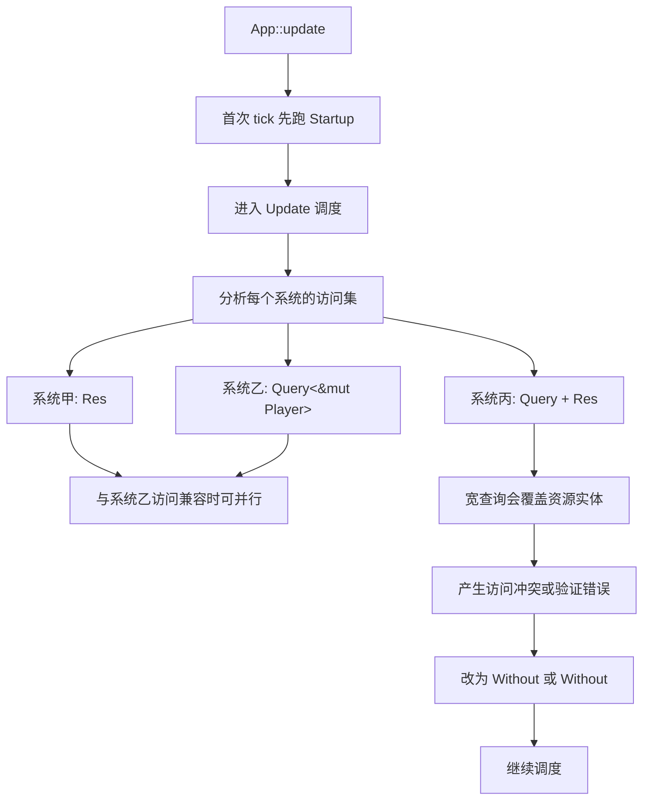

# Bevy 0.19 中 Resource 教程与迁移分析报告

## 执行摘要

对 Bevy 0.19 来说，最重要的变化不是“Resource 被删掉了”，而是“**Resource 的用户态入口基本保留，但其类型系统与底层实现已经并入 Component**”。在 0.19 中，`Resource` 明确成为 `Component` 的子 trait，`#[derive(Resource)]` 会同时实现 `Resource` 与 `Component`；与此同时，`Res<T>`、`ResMut<T>`、`insert_resource`、`init_resource` 等高层 API 依然保留，因此绝大多数“全局单例数据”的业务代码仍然可以按原来的写法组织。真正需要迁移的，是**类型身份、反射、宽查询冲突、泛型可变性约束、以及 non-send API 命名**这些更靠近 ECS 内核的部分。

官方 0.19 发布说明把这次改动描述为“Resources as Components”：资源现在存储为**单例实体上的组件**，从而统一 ECS 内部模型，并让资源获得此前仅组件拥有的能力，例如 hooks、observers、relationships、为资源实体附加额外组件、以及不可变资源标记。官方给出的设计动机并不是“让旧代码失效”，而是减少 Resource 与 Component 之间长期存在的实现分叉与能力落差。

迁移时最容易踩坑的点有五个。第一，**不能再把同一个类型同时当作 `Component` 和 `Resource`**；若你在 0.18 里写过 `#[derive(Component, Resource)]`，在 0.19 应拆成两个类型。第二，**宽查询**现在可能把资源实体扫进去，导致与 `Res<T>`/`ResMut<T>` 访问冲突，典型例子是 `Query<EntityMut>` 与 `Res<MyResource>`。第三，**反射路径**从 `ReflectResource` 语义上转向 `ReflectComponent`。第四，**泛型 `ResMut<R>`** 在 0.19 中常需要额外写出 `R: Resource<Mutability = Mutable>`。第五，历史上的 `!Send resource` API 现在整体更名为 **non-send data**。

从学习材料角度看，截至 2026 年 6 月，公开可检索的中文资料里，官方中文快速入门仍主要解释“传统 Resource 概念”，而近期中文社区内容更多是 0.19 发布综述，**对 Resource→Component 的专项迁移和细节覆盖仍以英文官方资料最完整**。因此这份报告优先以 GitHub、bevy.org、官方迁移指南、官方示例与 API 文档为主，再以中文资料和高质量社区教程作补充。

## 背景与概念演进

在早期 Bevy 的学习材料中，Resource 被定义为 ECS 中的“**全局唯一数据**”：适合承载经过时间、资产集合、渲染器、游戏规则、分数、状态机等不属于某个具体实体、却需要被多个系统共享的数据。官方快速入门把它与 Entity / Component 并列介绍，并强调通过 `Res<T>` 与 `ResMut<T>` 在系统中读写。早期的 Bevy ECS 文档还把 Resource 描述为一种“特殊组件”，但它**不属于任何实体**，而是按类型在 `World` 里唯一标识。

这种设计很实用，但也在长期演进中暴露出结构性问题。Bevy 维护者在更早的设计讨论里就指出：Resource 与 Component 在概念上非常相像，却拥有“相似但不同”的 API 与初始化方式，导致学习负担、能力不对齐和内部实现重复。0.19 的发布说明则把这个问题说得更直接：Resource 与 Component 的**真正差别主要只剩“基数”**——Resource 只是“某种最多只能存在 0 或 1 个实例的组件”。由于两者被实现成两套机制，组件世界里的 hooks、observers、relations 等工具此前无法直接用于资源。

于是，0.19 选择把 Resource 向 Component 统一。发布说明与迁移指南都明确表示：Resource 现在以“**资源实体上的组件**”形式存储，`Resource` 也成为 `Component` 的子 trait。这个方向的直接收益不是语法噱头，而是**统一内部数据模型**：工具链、网络调试、反射、生命周期观察、关系、额外元数据附着，都可以围绕“实体 + 组件”这一套抽象工作。

这里要特别强调一个容易误解的点：**0.19 并没有让你必须改用 Query 才能访问资源**。官方 API 文档仍然把 Resource 定义为“可以插入到 `World` 中的单例”，仍然推荐在系统里通过 `Res<T>` 与 `ResMut<T>` 访问；`insert_resource` 与 `init_resource` 也继续存在。换句话说，0.19 的变化首先是**语义层和内部层统一**，其次才是用户可以利用的新能力。对大多数应用层代码来说，Resource 仍然是“单例数据”的最直接表达。

需要补一个文档层面的现实情况：目前官方不同页面对 Resource 的措辞并不完全一致。迁移指南、0.19 发布说明和 `Resource` trait 文档已经明确采用“Resource 是 Component / 存在于单例实体”的新模型；但部分概览页与 `World` 说明仍保留更偏“概念抽象”的老措辞，例如“资源不属于具体实体”。这份报告在冲突处以**0.19 发布说明、迁移指南与 trait 文档**为准。

## Bevy 0.19 的变化与旧新 API 对照

先给出结论：**外层业务 API 稳定，内层规则发生变化**。如果你的项目只是 `insert_resource` / `ResMut` / `init_resource` 这一类简单单例数据用法，通常不用大改；但如果你写了反射、泛型系统参数、插件基础设施、宽查询、或者“既是组件又是资源”的类型，这次迁移会很实打实。

下面这张表把旧用法和 0.19 的重点差异放在一起。表中“影响”列同时概括了 API 差异、并发/调度影响，以及生命周期与借用规则变化。

| 主题 | 旧版本常见写法 | 0.19 写法或规则 | 影响 | 依据 |
|---|---|---|---|---|
| `Resource` trait 身份 | `Resource` 被当作独立于 `Component` 的概念 | `Resource: Component`，`#[derive(Resource)]` 同时实现两者 | 资源正式进入组件生态，获得 hooks / observers / relations / immutable 等能力 |  |
| 同一类型既当组件又当资源 | `#[derive(Component, Resource)]` 可以出现 | 不再允许；应拆成两个类型 | 这是最重要的迁移点；同一类型的“组件实例”和“资源实例”不再应混用 |  |
| 资源底层存储 | 单独资源通道 | 单例实体上的组件 | 内部统一，调试与工具更容易以“实体 + 组件”统一建模 |  |
| 访问资源 | `Res<T>` / `ResMut<T>` | 仍然用 `Res<T>` / `ResMut<T>` | 高层业务 API 基本不变；已有简单系统通常无需重写 |  |
| 宽查询与资源访问 | 资源与组件访问路径分离，很多宽查询不涉及资源 | 宽查询会把资源实体算进去；`Query<EntityMut>` 之类可能与 `Res<T>` 冲突 | 新的并发/借用冲突来源；需用 `Without<MyResource>` 或 `Without<IsResource>` 缩窄查询 |  |
| 反射 | 常依赖 `ReflectResource` | `#[reflect(Resource)]` 现在也反射 `Component`，应转向 `ReflectComponent` | 反射、远程协议、世界序列化代码要改 |  |
| non-send 资源 | `init_non_send_resource` / `insert_non_send_resource` 等 | 更名为 `init_non_send` / `insert_non_send` 等 | `!Send` 数据在语义上不再与 send resource 绑在一起 |  |
| 访问集 API | `add_resource_read` / `add_component_read` 分离 | 统一到 `add_read` / `add_write` 等 | 调度访问模型统一；底层插件/框架代码要迁移 |  |
| 泛型可变资源 | `R: Resource` 往往足够 | `ResMut<R>` 常需 `R: Resource<Mutability = Mutable>` | 泛型系统、框架库、helper trait 需要补 mutability 约束 |  |
| 资源可变性 | 默认认为资源可变 | 资源可以标记为 immutable | 生命周期/借用规则更严格；可变 API 不再自动适用于所有 Resource |  |
| 存储类型可配置性 | 用户通常不关心资源存储类型 | 官方明确**不打算**暴露“改变资源存储类型”能力 | 这不是可调性能旋钮；性能应从访问模式与调度冲突上测 |  |
| 清理语义 | 世界清理与资源清理规则较旧 | `World::clear_entities` 现在也会清资源，`clear_all` 还会清 non-send data | 资源生命周期与世界整体生命周期绑定更紧，测试与重置逻辑要检查 |  |

下面这个流程图展示的是 0.19 中一次 `App::update()` 里，调度器如何基于系统参数的访问集来安排 Resource / Component 访问。图中的关键不是“Resource 从此必须 Query”，而是“**Resource 现在参与同一套访问分析**”。



如果你只记一个迁移原则，我建议记这句：**“保留 Resource 作为全局单例入口，但不要再把它当作可复用的普通组件类型。”** 0.19 鼓励你把“全局唯一”与“实体实例化”这两种身份在类型层明确拆开。

下面先给出这篇教程后续示例共用的完整 `Cargo.toml`，以及一个**最小可运行**的 `src/main.rs`。如果你只想确认 0.19 中 Resource 的基本用法是否仍成立，先跑这两个文件即可。Bevy 官方示例与测试同样大量使用 `App::update()` 手动推进应用；`Update` 计划每次 `App::update()` 执行一个 tick，这对于教学、无窗口示例与单元测试非常方便。

**`Cargo.toml`**

```toml
[package]
name = "bevy_resource_019_tutorial"
version = "0.1.0"
edition = "2021"

[dependencies]
bevy = "0.19.0"

[dev-dependencies]
criterion = "0.5"

[[bench]]
name = "resource_patterns"
harness = false
```

**最小可运行 `src/main.rs`**

```rust
use bevy::prelude::*;

// 这是一个最简单的资源类型。
// 在 Bevy 0.19 中，#[derive(Resource)] 仍是定义全局单例数据的标准方式。
#[derive(Resource, Default)]
struct Counter(u32);

// 这个系统通过 ResMut 取得 Counter 的可变借用。
fn tick(mut counter: ResMut<Counter>) {
    // 每次 update 都递增一次。
    counter.0 += 1;

    // 打印当前值，便于确认系统已经执行。
    println!("counter = {}", counter.0);
}

fn main() {
    // App 仍然是 Bevy 的应用入口。
    let mut app = App::new();

    // init_resource::<T>() 会在资源不存在时按 Default/FromWorld 初始化。
    app.init_resource::<Counter>();

    // 把系统注册到 Update 日程。
    app.add_systems(Update, tick);

    // 手动推进一个 tick。
    // 对这类无窗口教学示例来说，直接调用 app.update() 比 run() 更直观。
    app.update();
}
```

**运行方法**

```bash
cargo run
```

**预期输出**

```text
counter = 1
```

## 全局单例数据示例

这个场景对应最传统、也最稳定的 Resource 用法：**全局配置、游戏规则、资产句柄集合、跨系统共享但不属于任何实体的数据**。这正是官方快速入门长期定义 Resource 的主要角色，而 0.19 并没有改变这一层抽象。你仍应该优先把“整个 `World` 里只有一份”的数据写成 `Resource`，然后用 `Res<T>` / `ResMut<T>` 访问。

下面的示例使用两个资源：`GameConfig` 保存单例配置，`StartupReport` 保存启动阶段生成的报告。为了让示例在命令行里可重复运行，我们直接手动调用一次 `app.update()`；Bevy 官方测试代码与自定义循环示例也采用这种做法。

**完整 `src/main.rs`**

```rust
use bevy::prelude::*;

// ---------------------------
// 资源定义
// ---------------------------

// 这是全局配置资源。
// 在 0.19 中依然推荐把“整个世界只有一份”的数据写成 Resource。
#[derive(Resource, Debug, Clone)]
struct GameConfig {
    // 应用名称。
    app_name: String,
    // 最大玩家数。
    max_players: usize,
    // 是否启用调试模式。
    debug_mode: bool,
}

// 这个资源用于保存启动系统生成的文本报告。
// 用独立资源承接系统结果，方便在测试里断言。
#[derive(Resource, Default, Debug)]
struct StartupReport(String);

// ---------------------------
// 系统定义
// ---------------------------

// Startup 系统：读取配置，生成报告。
// Res<T> 表示对资源的共享借用。
fn capture_config(config: Res<GameConfig>, mut report: ResMut<StartupReport>) {
    // 把配置格式化成一段文本。
    report.0 = format!(
        "App = {}, max_players = {}, debug = {}",
        config.app_name, config.max_players, config.debug_mode
    );
}

// Update 系统：打印报告。
// 这里再次通过 Res<T> 读取单例资源。
fn print_report(report: Res<StartupReport>) {
    println!("{}", report.0);
}

// ---------------------------
// 应用构建
// ---------------------------

// 把构建逻辑提取成函数，便于 main 与测试复用。
fn build_app() -> App {
    // 创建一个空应用。
    let mut app = App::new();

    // 插入全局配置资源。
    app.insert_resource(GameConfig {
        app_name: "Resource Tutorial".to_string(),
        max_players: 4,
        debug_mode: true,
    });

    // 初始化报告资源。
    app.init_resource::<StartupReport>();

    // 注册系统。
    // 第一次 app.update() 时，Startup 会先执行一次，再执行 Update。
    app.add_systems(Startup, capture_config);
    app.add_systems(Update, print_report);

    // 返回配置好的 App。
    app
}

fn main() {
    // 构造应用。
    let mut app = build_app();

    // 手动推进一帧。
    // 这一帧会触发 Startup 和一次 Update。
    app.update();
}

// ---------------------------
// 测试
// ---------------------------

#[cfg(test)]
mod tests {
    use super::*;

    #[test]
    fn startup_resource_can_be_read_and_written() {
        // 创建测试用 app。
        let mut app = build_app();

        // 执行一次 tick。
        app.update();

        // 读取报告资源并断言。
        let report = app.world().resource::<StartupReport>();
        assert!(report.0.contains("Resource Tutorial"));
        assert!(report.0.contains("max_players = 4"));
        assert!(report.0.contains("debug = true"));
    }
}
```

**逐行说明**

这段代码里最值得注意的不是语法本身，而是角色边界。`GameConfig` 用 `Resource` 是因为它的语义就是“世界级唯一配置”；`StartupReport` 也是资源，因为它承载的是“给整次应用启动共享的一次性输出”。这正符合官方对 Resource 的持续定义。0.19 虽然把 Resource 的内部模型并入了 Component，但最好仍然把“单例语义”作为使用 Resource 的首要理由。

`build_app()` 被抽出来，是为了让教学示例和测试共享完全一致的应用装配过程。Bevy 官方测试同样会先 `App::new()`、插入资源、注册系统，再通过 `app.update()` 推进并在 `app.world()` / `app.world_mut()` 上断言结果。

**运行方法**

```bash
cargo run
```

**测试方法**

```bash
cargo test
```

**常见错误与调试技巧**

最常见的错误是“**资源根本还没初始化**”。`Res<T>` 与 `ResMut<T>` 在资源不存在时会验证失败；如果资源是可选的，应该改成 `Option<Res<T>>` 或 `Option<ResMut<T>>`。这一点在官方 `Res` 文档与社区 0.19 教程里都明确提到。

第二个常见错误是“**把应该是组件的数据写成了资源**”。如果某个值需要按实体拥有多份实例，比如每个玩家都有不同配置或冷却值，它更适合是 `Component`。0.19 里继续滥用 Resource，会让你的系统签名看起来更简单，但会失去 ECS 查询、过滤与并行布局的优势。这个判断标准在 0.19 之后反而比以前更重要，因为 Resource 与 Component 的内部实现已经统一，差别更集中在“是否全局唯一”。

第三个调试建议是：如果你怀疑某个资源在系统运行顺序上有问题，先把应用改成像本示例这样用 `app.update()` 单步执行、并把输出写入另一个诊断资源，而不是一上来就在窗口循环里盲追。官方测试和手动更新示例表明，这是一种非常实用的验证方式。

## 可变共享状态示例

第二个场景是最容易写出“看起来没错、但调度语义不清楚”的代码：**多个系统共同修改同一个资源**。在 Bevy 里，调度器会根据系统参数推断访问冲突，默认尽可能并行，但系统执行顺序本身默认并不保证确定；如果多个系统都拿 `ResMut<SessionState>`，它们不会并行执行，但**没有显式顺序之前，结果顺序也不该靠运气**。官方 ECS 文档强调调度器按访问集决定可并行性，同时建议通过显式依赖关系控制顺序。

下面这个示例用一个 `SessionState` 资源表达“跨帧共享、跨系统共享、且需要被多个系统按顺序修改”的会话状态。我们故意把“推进帧号”“累积连击”“结算分数”“打印状态”拆成四个系统，并通过 `.chain()` 明确顺序。这既展示 `ResMut` 的典型用法，也展示 0.19 下应该如何避免把共享资源弄成“隐式顺序地狱”。

**完整 `src/main.rs`**

```rust
use bevy::prelude::*;

// ---------------------------
// 资源定义
// ---------------------------

// 一个典型的“可变共享状态”资源。
// 它会被多个系统在多个 tick 中共同修改。
#[derive(Resource, Default, Debug)]
struct SessionState {
    // 当前是第几帧。
    frame: u32,
    // 当前连击数。
    combo: u32,
    // 当前总分。
    score: u32,
}

// ---------------------------
// 系统定义
// ---------------------------

// 系统一：推进帧号。
fn advance_frame(mut state: ResMut<SessionState>) {
    state.frame += 1;
}

// 系统二：提高连击。
// 为了让示例结果更稳定，我们把连击上限设为 3。
fn build_combo(mut state: ResMut<SessionState>) {
    state.combo = (state.combo + 1).min(3);
}

// 系统三：按连击倍率结算分数。
fn commit_score(mut state: ResMut<SessionState>) {
    state.score += 100 * state.combo;
}

// 系统四：打印当前状态。
fn print_state(state: Res<SessionState>) {
    println!(
        "frame = {}, combo = {}, score = {}",
        state.frame, state.combo, state.score
    );
}

// ---------------------------
// 应用构建
// ---------------------------

fn build_app() -> App {
    let mut app = App::new();

    // 用 Default 初始化共享状态资源。
    app.init_resource::<SessionState>();

    // 关键点：
    // 多个系统都访问同一个资源时，最好显式给出顺序。
    // .chain() 会让它们按书写顺序执行。
    app.add_systems(
        Update,
        (advance_frame, build_combo, commit_score, print_state).chain(),
    );

    app
}

fn main() {
    let mut app = build_app();

    // 手动推进 5 帧，观察共享状态如何演进。
    for _ in 0..5 {
        app.update();
    }
}

#[cfg(test)]
mod tests {
    use super::*;

    #[test]
    fn shared_mutable_resource_updates_deterministically() {
        let mut app = build_app();

        // 跑 5 帧。
        for _ in 0..5 {
            app.update();
        }

        // 读取最终资源状态。
        let state = app.world().resource::<SessionState>();

        // 断言结果。
        assert_eq!(state.frame, 5);
        assert_eq!(state.combo, 3);
        assert_eq!(state.score, 1200);
    }
}
```

**逐行说明**

`SessionState` 是标准 Resource 场景：它不属于任何单个实体，却要在很多系统之间共享和持续演进。`advance_frame`、`build_combo`、`commit_score` 都拿 `ResMut<SessionState>`，说明它们在借用语义上彼此冲突；Bevy 会利用这些参数信息保证安全调度。

但“安全”不等于“顺序正确”。即便 Bevy 不会把互斥访问并行起来，在没有显式 `.before()` / `.after()` / `.chain()` 前，你仍不应该假设几个系统的先后一定按书写顺序发生。官方 ECS 指南与示例都把“顺序显式化”视为重要实践。这个示例用 `.chain()`，是因为四个步骤本身天然形成流水线。

**运行方法**

```bash
cargo run
```

**预期输出**

```text
frame = 1, combo = 1, score = 100
frame = 2, combo = 2, score = 300
frame = 3, combo = 3, score = 600
frame = 4, combo = 3, score = 900
frame = 5, combo = 3, score = 1200
```

**测试方法**

```bash
cargo test
```

**常见错误与调试技巧**

最常见的逻辑错误是“**把一个大而全的 Resource 让太多系统写**”。从借用安全看，这没问题；从架构和性能看，这会让系统间变成串行热点，降低调度器并行空间。Bevy 的并行执行基于系统访问集；如果所有核心系统都争抢同一个 `ResMut<T>`，那调度器根本没有机会并行。

第二个错误是“**依赖隐式顺序**”。如果你删掉 `.chain()`，这段代码仍可能“看起来经常能跑”，但那只是没有把不确定性显式暴露出来。调试这类问题时，可以先把关键步骤串成链，再逐步拆分成多个资源，或者改成消息/事件管线。官方组件 hooks 示例也提醒：很多“对变化做反应”的问题，事件和 change detection 往往比 hooks 更高性能、更好组合。这个原则同样适用于过度拥挤的共享 Resource。

第三个错误是在 0.19 中碰到“**宽查询与资源冲突**”。如果你的系统一边拿 `Res<SessionState>`，一边还写了 `Query<EntityMut>` 或 `Query<Option<&T>>` 这类宽查询，就可能把资源实体也纳入查询范围，触发新的访问冲突。迁移指南建议改用 `Without<MyResource>` 或 `Without<IsResource>` 过滤。

## 依赖注入与系统参数替代示例

很多旧项目会把 Resource 当成“万能注入容器”：系统签名里塞一长串 `Res<A>, Res<B>, ResMut<C>, Query<...>`，最后读起来像一个很长的函数式参数表。Bevy 官方提供了更好的组织方式：你可以通过 `#[derive(SystemParam)]` 把一组系统参数打包成一个自定义参数对象；而如果某个状态只服务于**单个系统自身**、不需要被别人看到，那么更应该用 `Local<T>`，而不是再造一个全局 Resource。官方文档明确说 `Local<T>` 是**系统私有、跨调用持久**的数据，并且即便不同系统使用相同类型的 `Local<T>`，它们拿到的也是互相独立的存储。

下面这个示例同时展示两件事。第一，`HealContext` 用 `SystemParam` 把“规则资源 + 玩家查询 + 报告资源”封装成一个语义明确的依赖注入对象。第二，系统自己的 tick 计数用 `Local<u32>` 保存，而不是额外开一个全局 Resource。这样的拆分在 0.19 很值得做：**该是全局共享的继续用 Resource；该是系统私有的改用 Local；该是组合依赖的改用 SystemParam。**

**完整 `src/main.rs`**

```rust
use bevy::{ecs::system::SystemParam, prelude::*};

// ---------------------------
// 组件与资源定义
// ---------------------------

// 这是普通实体组件：表示“这个实体是玩家”。
#[derive(Component, Debug)]
struct Player;

// 这是普通实体组件：表示玩家血量。
#[derive(Component, Debug)]
struct Health(u32);

// 这是全局规则资源：所有玩家共用。
#[derive(Resource, Debug)]
struct Rules {
    // 每个 tick 回复多少血量。
    heal_per_tick: u32,
    // 血量上限。
    max_health: u32,
}

// 这是报告资源：把本帧处理后的结果保存出来，便于观察与测试。
#[derive(Resource, Default, Debug)]
struct HealReport(Vec<u32>);

// ---------------------------
// 自定义 SystemParam
// ---------------------------

// 把系统真正需要的依赖打包成一个语义化上下文。
// 这就是 Bevy 风格的“依赖注入替代方案”。
#[derive(SystemParam)]
struct HealContext<'w, 's> {
    // 读取全局规则。
    rules: Res<'w, Rules>,
    // 遍历所有玩家的可变血量。
    players: Query<'w, 's, &'static mut Health, With<Player>>,
    // 保存本帧结果。
    report: ResMut<'w, HealReport>,
}

impl<'w, 's> HealContext<'w, 's> {
    // 封装业务操作：给所有玩家回血。
    fn heal_all(&mut self) {
        // 每次执行前先清空上次结果。
        self.report.0.clear();

        // 取出规则，避免循环里反复写长字段访问。
        let healing = self.rules.heal_per_tick;
        let max = self.rules.max_health;

        // 遍历所有玩家。
        for mut health in &mut self.players {
            // 回血并做上限裁剪。
            health.0 = (health.0 + healing).min(max);

            // 把处理后的值记到报告资源里。
            self.report.0.push(health.0);
        }
    }
}

// ---------------------------
// 系统定义
// ---------------------------

// Startup 系统：创建一些玩家实体。
fn setup(mut commands: Commands) {
    // 玩家一：低血量。
    commands.spawn((Player, Health(20)));

    // 玩家二：接近上限。
    commands.spawn((Player, Health(95)));

    // 玩家三：初始值故意超过上限，用于观察“回调到上限”逻辑。
    commands.spawn((Player, Health(110)));
}

// Update 系统：通过自定义 SystemParam 完成回血。
// 此外，这个系统还使用 Local<u32> 保存“仅属于本系统”的 tick 计数。
// 这类数据不应该滥用全局 Resource。
fn heal_all_players(mut ctx: HealContext, mut ticks: Local<u32>) {
    // Local 在本系统内跨帧持久化。
    *ticks += 1;

    // 执行业务逻辑。
    ctx.heal_all();

    // 输出结果。
    println!("tick = {}, report = {:?}", *ticks, ctx.report.0);
}

// ---------------------------
// 应用构建
// ---------------------------

fn build_app() -> App {
    let mut app = App::new();

    // 插入全局规则资源。
    app.insert_resource(Rules {
        heal_per_tick: 15,
        max_health: 100,
    });

    // 初始化报告资源。
    app.init_resource::<HealReport>();

    // 注册系统。
    app.add_systems(Startup, setup);
    app.add_systems(Update, heal_all_players);

    app
}

fn main() {
    let mut app = build_app();

    // 第一次 update：执行 Startup + 一次 Update。
    app.update();

    // 第二次 update：再执行一次 Update，观察 Local 计数继续累加。
    app.update();
}

#[cfg(test)]
mod tests {
    use super::*;

    #[test]
    fn system_param_and_local_work_together() {
        let mut app = build_app();

        // 跑两帧。
        app.update();
        app.update();

        // 读取所有玩家血量。
        let mut query = app.world_mut().query::<&Health>();
        let mut values: Vec<u32> = query.iter(app.world()).map(|h| h.0).collect();

        // 排序后断言，避免依赖遍历顺序。
        values.sort_unstable();
        assert_eq!(values, vec![50, 100, 100]);

        // 检查报告资源。
        let mut report = app.world().resource::<HealReport>().0.clone();
        report.sort_unstable();
        assert_eq!(report, vec![50, 100, 100]);
    }
}
```

**逐行说明**

这个例子里，`Rules` 是典型 Resource，因为它代表的是应用级规则；`Health` 是典型 Component，因为每个玩家都有自己的那份；`HealContext` 则是把原本会散落在系统签名里的依赖收束成一个语义明确的参数对象。官方 `system_param.rs` 示例正是这么做的：把一个 Query 和一个 Resource 封装成自定义 `SystemParam`。

`ticks: Local<u32>` 则体现了另一个迁移建议：不要把“**只有一个系统自己关心的状态**”也做成 Resource。官方 `Local` 文档强调，这种值会在系统调用间持续存在，但只对当前系统可见；不同系统就算写了同类型 `Local<T>`，拿到的也是不同实例。这正是“系统私有缓存 / 统计计数器 / 运行条件记忆”最合适的宿主。

如果你的场景更复杂，甚至需要在独占世界访问里安全复用一组参数，官方建议进一步考虑 `SystemState` 或 `World::resource_scope`。`SystemState` 能缓存 SystemParam 所需状态并在独占 world 上像系统一样取参数，而 `resource_scope` 适合拆分对 world 与某个 resource 的互斥访问。

**运行方法**

```bash
cargo run
```

**预期输出**

```text
tick = 1, report = [35, 100, 100]
tick = 2, report = [50, 100, 100]
```

**测试方法**

```bash
cargo test
```

**常见错误与调试技巧**

一个常见反模式是：先把所有依赖都堆成 Resource，再在系统里拿十几个 `Res<_>`。这会削弱 ECS 系统的语义边界，让“哪些是全局单例、哪些是逐实体数据、哪些只是系统内部缓存”越来越模糊。调试时如果你发现某个 Resource 只被一个系统使用，而且只是记临时计数、上次值、游标、开关，优先考虑把它降级成 `Local<T>`。

另一个常见问题是：在自定义 `SystemParam` 里藏了多个互相冲突的可变访问，结果系统本身难以维护。此时的经验法则是：**SystemParam 用来组织“依赖”，不是用来掩盖“冲突”**。如果冲突是真实存在的，应该拆分数据或借助消息、阶段和排序，而不是只把它包得更深。官方 `SystemState` 文档也强调，复杂访问模式需要缓存和复用才能保证行为正确，尤其是涉及 Local、Added/Changed 等依赖内部状态的参数时。

## 迁移清单、性能并发分析与最佳实践

如果你在做 0.18 → 0.19 迁移，推荐按下面的顺序执行，而不是一边编译一边零碎修补。

首先，**全局搜索所有 `#[derive(Component, Resource)]`**。这是最高优先级，因为 0.19 明确不再支持让同一个类型同时扮演两种身份。迁移指南给出的官方迁移方式就是“拆成两个类型”，一个 `Component`，一个 `Resource`。如果你过去用这种写法实现“全局 fallback”模式，可以参考 Bevy 自己把 `UiDebugOverlay` / `UiDebugOptions` 拆成 `Global...` 资源与普通组件的做法。

其次，**搜索反射相关代码**。凡是以前显式依赖 `ReflectResource` 语义的地方，尤其是反射注册、BRP、世界序列化、自定义工具面板，应该核对是否要改成 `ReflectComponent`。迁移指南对这一点写得很明确：`ReflectResource` 在 0.19 中已经退化为零大小标记类型。

再次，**检查所有“宽查询”**，特别是这些模式：`Query<()>`、`Query<Entity>`、`Query<EntityMut>`、`Query<EntityRef>`、`Query<Option<&T>>`。在 0.19 里，这些查询可能把资源实体纳入访问集，于是和 `Res<T>` / `ResMut<T>` 发生新冲突。官方建议是使用 `Without<MyResource>` 或 `Without<IsResource>` 来显式缩窄范围。

然后，**检查泛型资源写接口**。只要你有 `fn foo<R: Resource>(mut r: ResMut<R>)` 一类代码，都应该考虑是否要补成 `R: Resource<Mutability = Mutable>`。如果泛型资源不一定可变，官方建议改用 `World::modify_resource` 之类按组件风格工作的 API，或者在确有必要时走 `UnsafeWorldCell::*_assume_mutable` 这类更靠近底层、需要自己承担安全条件的路线。

最后，**统一 non-send API 命名**，把 `*_non_send_resource*` 替换成 `*_non_send*`。这一步机械但必要。0.19 不再把 non-send 数据看成 send resource 的一个平行分支，而是单独命名为 non-send data。

性能与并发方面，最稳妥的结论有三点。第一，Bevy 的并行性依然主要由**系统参数的访问集**决定，而不是“你是否用了 Resource 关键字”本身。第二，0.19 新增的主要并发风险来自**宽查询把资源实体卷入访问分析**，不是来自 `Res<T>`/`ResMut<T>` 这两个 API 本身。第三，官方**不把“资源存储类型可调”视为有价值的性能旋钮**；也就是说，Resource→Component 统一的重点是能力模型与内部统一，而不是给用户暴露新的 storage tuning 开关。

基于这些事实，这里给一个**可复现实验**而非“拍脑袋结论”。你可以把同一套 microbenchmark 分别在 Bevy 0.18.1 与 0.19.0 跑一遍，测三类模式：`ResMut` 热路径、`Local` 热路径、以及自定义 `SystemParam` 包装路径。官方示例和测试都说明，`App::update()` 适合做这种无窗口基准；而官方 examples 页面也建议在性能相关场景使用 release 模式。

**`benches/resource_patterns.rs`**

```rust
use bevy::{ecs::system::SystemParam, prelude::*};
use criterion::{black_box, criterion_group, criterion_main, Criterion};

#[derive(Resource, Default)]
struct Counter(u64);

fn res_increment(mut counter: ResMut<Counter>) {
    counter.0 = black_box(counter.0.wrapping_add(1));
}

fn local_increment(mut counter: Local<u64>) {
    *counter = black_box((*counter).wrapping_add(1));
}

#[derive(SystemParam)]
struct CounterCtx<'w> {
    counter: ResMut<'w, Counter>,
}

fn ctx_increment(mut ctx: CounterCtx) {
    ctx.counter.0 = black_box(ctx.counter.0.wrapping_add(1));
}

fn build_resmut_app() -> App {
    let mut app = App::new();
    app.init_resource::<Counter>();
    app.add_systems(Update, res_increment);
    app
}

fn build_local_app() -> App {
    let mut app = App::new();
    app.add_systems(Update, local_increment);
    app
}

fn build_ctx_app() -> App {
    let mut app = App::new();
    app.init_resource::<Counter>();
    app.add_systems(Update, ctx_increment);
    app
}

fn bench_resource_patterns(c: &mut Criterion) {
    let mut resmut_app = build_resmut_app();
    c.bench_function("resmut_update", |b| {
        b.iter(|| resmut_app.update());
    });

    let mut local_app = build_local_app();
    c.bench_function("local_update", |b| {
        b.iter(|| local_app.update());
    });

    let mut ctx_app = build_ctx_app();
    c.bench_function("systemparam_update", |b| {
        b.iter(|| ctx_app.update());
    });
}

criterion_group!(benches, bench_resource_patterns);
criterion_main!(benches);
```

**测量方法**

```bash
cargo bench
```

更有价值的做法，是把同一份 benchmark 分别在 `bevy = "0.18.1"` 与 `bevy = "0.19.0"` 分支上跑，然后比较 `resmut_update` 的均值、方差与回归趋势。如果你的项目大量使用“扫描全世界”的宽查询，还应额外做一组基准：对比“未过滤宽查询”与“`Without<MyResource>` / `Without<IsResource>` 后的窄化查询”在你的实际 workload 里的表现。官方跟踪议题也表明，资源并入组件后，后续确实继续有“加速 resource lookup”一类优化工作，但官方并没有给出“一刀切”的普适性能数值，因此最可靠的方法仍然是**在自己的项目模式上实测**。

最佳实践方面，我建议把 0.19 的 Resource 使用归纳成六条。

其一，**单例语义优先于“方便拿到”**。只有当某数据在一个 `World` 中本就应该唯一时，才用 `Resource`。

其二，**系统私有状态优先用 `Local<T>`**。这能减少全局耦合与调度热点。

其三，**复杂依赖优先封装成 `SystemParam`**。让系统签名表达“业务上下文”，而不是“参数堆栈”。

其四，**多个系统写同一 Resource 时显式排序**。不要把“碰巧目前顺序没坏”当成设计。

其五，**回避“同一类型双重身份”**。哪怕你觉得某个类型“逻辑上既像资源又像组件”，0.19 也明确要求你把语义拆出来，否则会在唯一性和查询行为上制造非常难排查的 bug。迁移指南甚至专门提醒：把实现了 `Resource` 的类型当组件插入，会影响其他实体上的同类副本，并让该类型出现在相关查询里。

其六，**把宽查询当成 0.19 新时代的审计点**。只要你项目里有“面向所有实体”的 query helper、调试遍历器、开发工具面板、作弊控制台、同步桥接层，就主动审查它们是否需要排除资源实体。

## 开放问题与局限

这份报告采用了官方 0.19 发布说明、迁移指南和 trait 文档作为最高优先级依据；但需要说明的是，部分官方概览页与 `World` 文档中仍保留偏旧的概念性措辞，例如把资源描述为“不属于具体实体”的数据。因此，若你在官方不同页面上看到看似矛盾的描述，请优先信任**迁移指南、0.19 发布说明、以及 `Resource: Component` 的 trait 定义**。

另外，官方资料对“Resource 变成 Component 之后到底整体快了还是慢了多少”并没有给出一个稳定的、适用于所有项目的统一数值。官方文本强调的是能力统一与内部去重，而不是面向用户的固定性能承诺；因此，本报告给出的性能部分以**访问冲突分析与可复现实验方法**为主，而没有伪造一个“平均提升 X%”之类未经证实的结论。
