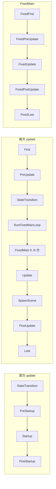
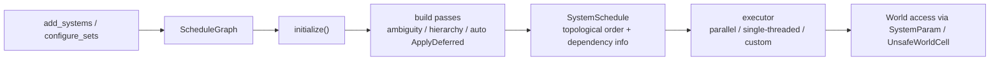

# Bevy 0.19 Schedule 系统深度教程

## 执行摘要

截至 2026 年 6 月，Bevy 0.19.0 已正式发布；本文基于官方 GitHub 仓库、bevy.org 迁移指南与 Learn 页面、以及 docs.rs 上的 0.19 API 文档整理，重点覆盖 `Schedule`、`System`、`SystemSet`、运行条件、顺序约束、歧义检测、独占系统与并行执行这几个最容易真正影响工程结构和性能的部分。Bevy 官方仓库也明确说明：Bevy 可以在稳定版 Rust 上正常构建，因此本文默认使用 `cargo + stable`。

如果你过去是从 0.9、0.10、0.11 甚至 Cheat Book 时代的资料学 Bevy，那么最重要的心智更新是：**在 Bevy 0.19 里，真正的一等公民是 `Schedule`、`SystemSet` 和 `run_if` 条件**。`Stage` 与 `run criteria` 更像历史术语：0.9→0.10 之后 Stage 已经被 sets / schedules 逐步替代，0.10→0.11 又把旧的 `CoreSet::Update` 一类 base sets 提升成了今天熟悉的顶层 schedules，例如 `Update`、`Startup`、`PostUpdate`。所以今天谈“自定义 Stage”，在 0.19 里通常应该理解成“自定义 `Schedule`，或者把自定义 `Schedule` 插入 `Main` / `FixedMain` 的调度顺序里”。

Bevy 的调度器默认会尽量并行执行系统；系统之间并不是按“添加顺序”稳定串行运行，而是按**显式依赖 + 数据访问冲突**综合决定执行时机。官方文档明确写到，系统会以“机会式”的方式并行运行，调度器会自动管理数据访问；如果你需要确定顺序，必须显式写出 `before`、`after`、`chain`，或者通过 `SystemSet` 建好依赖关系。

另外，Bevy 0.19 的一些细节非常值得工程上特别注意。比如：`before` / `after` 默认会把 deferred buffer 的效果也纳入顺序保证，这通常意味着 `Commands` 会在必要处通过 `ApplyDeferred` 被自动同步；如果你不想要这个隐式同步点，要改用 `before_ignore_deferred` / `after_ignore_deferred`。再比如，歧义检测默认并不是开启的；开发阶段最好把关键 schedule 的 `ambiguity_detection` 提升到 `Warn` 或 `Error`。这些细节常常决定了“为什么一段逻辑有时正确、有时怪异、或者为什么并行性莫名下降”。

## 调度模型与核心概念

### Schedule、System、World 与 SystemParam

`Schedule` 是一组系统以及执行这些系统所需元数据、构建图和执行器的集合；每个 schedule 都有自己的 `ScheduleLabel`，可以被放入 `World` 的 `Schedules` 资源中独立标识。官方文档把它定义为“在特定条件和顺序下运行系统的集合”，这一定义非常准确：**Schedule 不是简单列表，而是有图结构与执行策略的系统集合**。

`System` 在 Bevy 0.19 里本质上仍然是函数，但不是“任意函数”。官方文档强调：系统函数的参数必须实现 `SystemParam`；系统通常通过 `App::add_systems(Update, my_system)` 之类的接口加入某个 schedule。常见参数包括 `Res<T>`、`ResMut<T>`、`Query<...>`、`Commands`、`Local<T>` 等。`Query` 作为系统参数时，提供对 `World` 中组件数据的**选择性访问**，让你不必自己手动借用整个 `World`。

`World` 则是 ECS 数据本体：实体、组件、资源以及元数据都存放在里面。Bevy 文档特别说明，如果你需要复杂的世界级访问模式，可以考虑 `SystemState` 或 `World::resource_scope`；这对于理解独占系统非常关键，因为独占系统拿到的是 `&mut World`，它绕过了普通 `SystemParam` 的静态组合方式，直接进入“整座世界”的访问层级。

### Stage、run criteria、labels 在 0.19 中应该怎么理解

用户口中的 “Stage” 在 0.19 中通常要被翻译成两类东西。第一类是**内置 schedules**，例如 `Update`、`PostUpdate`、`FixedUpdate`。第二类是**通过 `MainScheduleOrder` / `FixedMainScheduleOrder` 插入的自定义 schedules**。旧资料里把“一个阶段接一个阶段执行”叫做 stages；而官方迁移指南明确指出，旧 stages 的两个核心特征是顺序执行与阶段尾命令刷写，这些能力今天分别被 `SystemSet` / `Schedule` 和 `ApplyDeferred` / deferred 同步机制接管了。

同理，旧术语 “run criteria” 在现在更准确的叫法是**运行条件**，也就是 `run_if` 背后的 `SystemCondition`。Bevy 0.19 把条件建模成真正的系统条件函数，它们可以挂在单个系统上，也可以挂在 `SystemSet` 上；而且“挂在 set 上”和“分发到每个系统上”这两种方式语义并不一样，这一点后面的例子会专门演示。

“labels” 这个词在 0.19 里也需要拆开理解。`ScheduleLabel` 用于标识 schedule；`SystemSet` 则是“标签式”的分组机制，用来给系统附着公共配置、建立概念层面的依赖顺序，或者作为插件对外暴露的扩展挂点。官方文档还特别强调：一个系统可以属于多个 sets，set 也可以嵌套进别的 sets，这让它既是组织工具，也是调度 API 的抽象边界。

### SystemSet、顺序约束、歧义与 deferred

`SystemSet` 是 Bevy 0.19 调度设计里最实用的抽象之一。你可以把它想成“概念层的标签组”：比如 `Input`、`Simulation`、`Presentation`。你不一定直接约束系统 A 先于系统 B，而是约束“输入集合在模拟集合之前”，这样系统结构更稳定，也更适合插件化。官方文档甚至建议：如果你想对外暴露稳定的调度接口，让依赖方可以“插在这里之前/之后”，那就应该暴露 set，而不是暴露若干内部系统实现。

顺序约束主要来自 `IntoScheduleConfigs` 提供的方法。`before` / `after` 建立先后关系；`chain()` 给同一元组中的系统自动串起依赖；`in_set()` 把系统放进一个 set；`configure_sets(... .chain())` 则能一次性定义一组 sets 的整体有序关系。需要特别注意两个官方文档明确写出的坑：其一，`before/after` **不会自动把目标 set 或目标系统排进 schedule**；其二，跨 schedule 写的 `before/after/chain` 会被**静默忽略**。这两点都是实际项目里最常见的“写了顺序但没生效”的来源。

deferred 机制是另一个必须吃透的点。`Commands` 本质上是 deferred buffer；官方文档说明，它们会在 `ApplyDeferred` 运行时被顺序应用。更关键的是，`before` / `after` 默认不仅约束系统本体顺序，还会确保前者系统产生的 deferred 副作用在后者可见；如果不需要这个同步点，才用 `before_ignore_deferred` / `after_ignore_deferred`。Bevy 还会通过 `AutoInsertApplyDeferredPass` 在需要的依赖边上自动插入 `ApplyDeferred`，默认开启。

歧义（ambiguity）是指两个系统存在冲突访问，但调度器又没得到足够顺序信息，因此**谁先谁后不确定**。这不意味着数据竞争——Bevy 不会让不安全并发发生——但这意味着结果可能依赖机会式顺序，从而变得不可预测。官方文档把这类问题建模成 `ScheduleBuildWarning::Ambiguity` / `ScheduleBuildError::Ambiguity`，而且明确说明：歧义检测默认关闭，建议开发时主动打开。

### 独占系统与并行执行的边界

独占系统，就是首个参数拿 `&mut World` 的系统。官方文档写得很直接：任何 `ExclusiveSystemParam` 都必须放在 `&mut World` 之后；这类系统让你获得对整个世界的独占访问。它非常强大，适合做跨资源/跨实体的大规模重组、统筹式初始化、或者把 ECS 参数访问嵌入 `SystemState` 中按需提取，但代价就是它天然压缩并行空间。与此同时，调度图里的“冲突系统列表”还有一个重要信号：如果冲突条目的组件列表为空，表示它们在更一般的 `World` 访问层次上冲突，典型例子就是独占系统或特别宽的查询模式。

### 排序原语对比表

下表把 0.19 最常用的顺序与相关配置原语放在一个视图里。表中行为依据 `IntoScheduleConfigs`、`SystemSet`、`ScheduleBuildSettings` 与 `ScheduleBuildWarning` 官方 API 文档整理。

| 原语 | 作用范围 | 是否真正建立顺序 | 是否默认同步 deferred | 典型用途 | 常见误区 |
|---|---|---:|---:|---|---|
| `in_set(MySet)` | 单个系统 | 否 | 否 | 把系统归类到某个概念集合 | 只分组，不排序 |
| `configure_sets(Update, (A, B, C).chain())` | 一组 sets | 是 | 是 | 建立大块逻辑的框架顺序 | 忘了把系统放进这些 sets |
| `before(target)` | 系统 / set 到目标系统 / set | 是 | 是 | 目标必须看到前者的 `Commands` / deferred 效果 | 目标未被实际调度时，这个约束不会“自动生效” |
| `after(target)` | 系统 / set 到目标系统 / set | 是 | 是 | 当前系统希望读取目标写入后的结果 | 跨 schedule 使用会被静默忽略 |
| `before_ignore_deferred(target)` | 同上 | 是 | 否 | 只要执行前后次序，不要额外同步点 | 如果随后真的依赖 `Commands` 结果，会读不到 |
| `after_ignore_deferred(target)` | 同上 | 是 | 否 | 避免不必要的 `ApplyDeferred` 插入 | 容易把“逻辑顺序”和“副作用可见性”混在一起 |
| `chain()` | 同一元组内多个系统 | 是 | 是 | 线性小流水线最省心的写法 | 过度使用会把本可并行的逻辑全串行化 |
| `chain_ignore_deferred()` | 同一元组内多个系统 | 是 | 否 | 只想确定执行顺序 | 同上，且更容易误读副作用时机 |
| `run_if(cond)` | 系统或 tuple / set | 不是排序原语 | 不适用 | 整组系统“一起跑或一起不跑” | 组内条件只评估一次，不保证整个组执行期间条件持续成立 |
| `distributive_run_if(cond)` | tuple 中每个系统 | 不是排序原语 | 不适用 | 每个系统在自己开跑前都重新判断 | 容易忘记每个系统看到的条件值可能不同 |
| `ambiguous_with(target)` | 系统 / set | 否 | 否 | 在你已知无害时静音歧义报告 | 它不会修复顺序，只是压制警告/错误 |
| `ScheduleBuildSettings { ambiguity_detection: ... }` | 整个 schedule | 否 | 否 | 开发 / CI 阶段抓歧义 | 只检测，不建立依赖 |

## 内置 Schedule 速查表

### Main 与 FixedMain 的默认执行流

`Main` 是 `App::update()` 每次推进时运行的总调度；官方文档列出了默认顺序：首次运行时会先经过 `StateTransition`、`PreStartup`、`Startup`、`PostStartup`，之后的每一帧则依次是 `First`、`PreUpdate`、`StateTransition`、`RunFixedMainLoop`、`Update`、`SpawnScene`、`PostUpdate`、`Last`。其中 `RunFixedMainLoop` 会把 `FixedMain` 跑 0 到多次，而 `FixedMain` 自己又由 `FixedFirst`、`FixedPreUpdate`、`FixedUpdate`、`FixedPostUpdate`、`FixedLast` 组成。渲染默认不在 `Main` 里跑，而是在专门的 `RenderApp` 子应用中执行。



### 内置 schedules 与使用场景表

下表把 0.19 里最常用的内置 schedules 按“主世界 / 固定步长 / 渲染子应用”分组。表中用途来自 `Main`、`FixedUpdate`、`SpawnScene`、`ExtractSchedule`、`Render` 等官方文档说明。

| schedule | 所属域 | 何时运行 | 什么时候用 |
|---|---|---|---|
| `PreStartup` | Main | 仅首次，早于 `Startup` | 启动前需要先注册或准备一些元信息 |
| `Startup` | Main | 仅首次 | 常规初始化、生成实体、加载初始资源 |
| `PostStartup` | Main | 仅首次，晚于 `Startup` | 依赖启动结果的收尾初始化 |
| `First` | Main | 每帧最早 | 极少数必须“最先执行”的逐帧逻辑 |
| `PreUpdate` | Main | 每帧，早于 `Update` | 输入预处理、状态准备、桥接系统 |
| `StateTransition` | Main | 每帧，若启用了 `bevy_state` | `OnEnter/OnExit/OnTransition` 相关逻辑 |
| `RunFixedMainLoop` | Main | 每帧，在 `Update` 前 | 需要环绕固定步长逻辑的每帧工作 |
| `Update` | Main | 每帧一次 | 可变步长逻辑；官方还提醒，多数 gameplay 逻辑可考虑放去 `FixedUpdate` |
| `SpawnScene` | Main | 每帧，`Update` 之后，`PostUpdate` 之前 | 场景实例化与场景树写回 |
| `PostUpdate` | Main | 每帧，晚于 `Update` | 依赖 `Update` 结果的同步与后处理，例如 transform 传播 |
| `Last` | Main | 每帧最后 | 清理、退出相关系统、最后收尾 |
| `FixedFirst` | FixedMain | 每次固定步开始 | 固定步上下文里的最早逻辑 |
| `FixedPreUpdate` | FixedMain | 每次固定步，早于 `FixedUpdate` | 固定步预处理 |
| `FixedUpdate` | FixedMain | 每次固定步主逻辑 | 物理、确定性模拟、定频 gameplay |
| `FixedPostUpdate` | FixedMain | 每次固定步，晚于 `FixedUpdate` | 固定步后反应逻辑 |
| `FixedLast` | FixedMain | 每次固定步最后 | 固定步清理 |
| `ExtractSchedule` | RenderApp | 渲染子应用中的抽取阶段 | 从主世界抽取渲染所需数据；应尽量短 |
| `RenderStartup` | RenderApp | 渲染子应用启动期 | 初始化渲染世界资源 |
| `Render` | RenderApp | 渲染主调度 | 准备 GPU 资源、队列、渲染前逻辑 |
| `RenderGraph` | RenderApp | 渲染图执行阶段 | 低层渲染图驱动、管线节点执行 |

一个非常实用的经验法则是：**可变步长交互逻辑放 `Update`，定频模拟放 `FixedUpdate`，依赖上一阶段结果的同步/收尾放 `PostUpdate` 或 `Last`**。而如果你的逻辑一定要围绕固定循环、但又必须每帧只跑一次，就应考虑 `RunFixedMainLoopSystems` 对应的前后 sets，而不是直接塞到 `FixedUpdate`。

## 可运行示例

下面所有示例都假设你使用如下最小 `Cargo.toml`。保存为 `src/main.rs` 后直接 `cargo run` 即可；若示例只使用 `World + Schedule`，甚至不需要启动窗口或完整 runner。官方仓库明确说明，Bevy 在稳定版 Rust 上可正常构建。

```toml
[package]
name = "bevy_schedule_tutorial"
version = "0.1.0"
edition = "2021"

[dependencies]
bevy = "0.19"
```

### 最小 Schedule 用法

这个例子不用 `App`，直接使用 `World + Schedule`。它最适合把“schedule 是系统集合，world 是数据本体，顺序是显式声明出来的”这件事看清楚。官方 `Schedule` 文档自己的最小示例也是这个模式。

```rust
use bevy::ecs::schedule::Schedule;
use bevy::prelude::*;

#[derive(Resource, Debug, Default)]
struct Counter(u32);

fn increment(mut counter: ResMut<Counter>) {
    counter.0 += 1;
    println!("increment -> {}", counter.0);
}

fn show(counter: Res<Counter>) {
    println!("show -> {}", counter.0);
}

fn main() {
    let mut world = World::new();
    world.insert_resource(Counter::default());

    let mut schedule = Schedule::default();
    schedule.add_systems((
        increment,
        show.after(increment),
    ));

    schedule.run(&mut world);
    schedule.run(&mut world);
}
```

**如何运行**：直接执行 `cargo run`。  
**预期输出**：

```text
increment -> 1
show -> 1
increment -> 2
show -> 2
```

这个例子里最值得注意的不是语法，而是调度语义：`show.after(increment)` 建立了**同一 schedule 内**的显式先后关系；如果你删掉这层关系，调度器就会依据访问冲突和机会式执行策略自行安排触发时机。

### 自定义 Schedule 并插入 Main 顺序

在 0.19 里，“自定义 Stage”的现代写法通常是：定义自定义 `ScheduleLabel`，把 `Schedule` 放进 app，然后通过 `MainScheduleOrder` 把它插到 `Main` 的执行顺序里。官方 `custom_schedule` 示例就是这个思路；而且文档明确提醒，**把 schedule 加进 app 本身并不会自动执行它**，真正让它参与主循环的是 `MainScheduleOrder`。

```rust
use bevy::{
    app::MainScheduleOrder,
    ecs::schedule::{Schedule, ScheduleLabel, SingleThreadedExecutor},
    prelude::*,
};

#[derive(ScheduleLabel, Debug, Hash, PartialEq, Eq, Clone)]
struct SingleThreadedUpdate;

#[derive(ScheduleLabel, Debug, Hash, PartialEq, Eq, Clone)]
struct CustomStartup;

#[derive(Resource, Default)]
struct Frame(u32);

fn pre_startup_system() {
    println!("PreStartup");
}

fn custom_startup_system() {
    println!("CustomStartup");
}

fn startup_system() {
    println!("Startup");
}

fn single_threaded_update_system(mut frame: ResMut<Frame>) {
    frame.0 += 1;
    println!("SingleThreadedUpdate frame={}", frame.0);
}

fn update_system(frame: Res<Frame>) {
    println!("Update sees frame={}", frame.0);
}

fn last_system() {
    println!("Last");
    println!("---");
}

fn main() {
    let mut app = App::new();
    app.add_plugins(MinimalPlugins);
    app.init_resource::<Frame>();

    // 自定义逐帧 schedule：这里用单线程执行器，方便观察顺序
    let mut custom_update_schedule = Schedule::new(SingleThreadedUpdate);
    custom_update_schedule.set_executor(SingleThreadedExecutor::new());
    app.add_schedule(custom_update_schedule);

    // 自定义启动 schedule
    app.add_schedule(Schedule::new(CustomStartup));

    // 注意：必须在 main 里改 MainScheduleOrder，而不是在 Main 调度内部系统中改
    {
        let mut order = app.world_mut().resource_mut::<MainScheduleOrder>();
        order.insert_before(Update, SingleThreadedUpdate);
        order.insert_startup_after(PreStartup, CustomStartup);
    }

    app.add_systems(CustomStartup, custom_startup_system)
        .add_systems(PreStartup, pre_startup_system)
        .add_systems(Startup, startup_system)
        .add_systems(SingleThreadedUpdate, single_threaded_update_system)
        .add_systems(Update, update_system)
        .add_systems(Last, last_system);

    // 手动推进两帧，方便观察
    app.update();
    app.update();
}
```

**如何运行**：`cargo run`。  
**预期输出**：

```text
PreStartup
CustomStartup
Startup
SingleThreadedUpdate frame=1
Update sees frame=1
Last
---
SingleThreadedUpdate frame=2
Update sees frame=2
Last
---
```

这个例子还顺手展示了另一个 0.19 很实用的点：执行器不再通过旧的 `ExecutorKind` 配置，而是直接 `schedule.set_executor(...)`。这是 0.18→0.19 的迁移变化之一。`SingleThreadedExecutor` 官方说明也很清楚：它适合单线程环境、或你想减少线程调度开销的情况。

### 用 SystemSet 搭出输入、模拟、表现三段式流水线

真正写项目时，不建议到处直接写“某系统 after 某系统”。更稳健的做法是先定义 sets，再把系统归类进去，再让 sets 建立全局框架顺序。这符合官方对 `SystemSet` 的定位：它既是组织手段，也是对外暴露稳定挂点的 API。

```rust
use bevy::prelude::*;

#[derive(SystemSet, Debug, Clone, PartialEq, Eq, Hash)]
enum GameplaySet {
    Input,
    Simulation,
    Presentation,
}

#[derive(Resource, Default, Debug)]
struct Player {
    x: i32,
    velocity: i32,
}

fn read_input(mut player: ResMut<Player>) {
    player.velocity = 2;
    println!("input -> velocity={}", player.velocity);
}

fn simulate(mut player: ResMut<Player>) {
    player.x += player.velocity;
    println!("simulation -> x={}", player.x);
}

fn render(player: Res<Player>) {
    println!("presentation -> x={}", player.x);
}

fn main() {
    let mut app = App::new();
    app.add_plugins(MinimalPlugins);
    app.init_resource::<Player>();

    app.configure_sets(
        Update,
        (
            GameplaySet::Input,
            GameplaySet::Simulation,
            GameplaySet::Presentation,
        )
            .chain(),
    );

    app.add_systems(Update, read_input.in_set(GameplaySet::Input))
        .add_systems(Update, simulate.in_set(GameplaySet::Simulation))
        .add_systems(Update, render.in_set(GameplaySet::Presentation));

    app.update();
}
```

**如何运行**：`cargo run`。  
**预期输出**：

```text
input -> velocity=2
simulation -> x=2
presentation -> x=2
```

这个模式在插件化工程里尤其重要，因为系统可以属于多个 sets，set 也可以嵌套。你完全可以把一个系统同时标成“ConsumesInput”和“GameplaySimulation”，而不是陷入单一线性顺序的耦合设计。

### `run_if` 与 `distributive_run_if` 的语义差异

这是 Bevy 0.19 里最容易“看起来差不多，实际语义差很多”的 API 对。官方文档明确说明：`run_if` 作用在一个包含多个系统的组合上时，**条件最多只评估一次**；而 `distributive_run_if` 会把条件分发到每个系统，各自开跑前单独判断。文档还明确指出：前者不能保证整个组执行期间条件一直成立，后者则不能保证所有系统看到的条件值相同。

```rust
use bevy::ecs::schedule::common_conditions::resource_exists_and_equals;
use bevy::ecs::schedule::Schedule;
use bevy::prelude::*;

#[derive(Resource, Debug, PartialEq, Eq)]
struct Gate(bool);

fn a(mut gate: ResMut<Gate>) {
    println!("A runs, then closes the gate");
    gate.0 = false;
}

fn b() {
    println!("B runs");
}

fn main() {
    // 情况 1：run_if 只评估一次 —— A 改了 Gate，B 仍然会继续执行
    let mut world_once = World::new();
    world_once.insert_resource(Gate(true));

    let mut schedule_once = Schedule::default();
    schedule_once.add_systems(
        (a, b)
            .chain()
            .run_if(resource_exists_and_equals(Gate(true))),
    );

    println!("-- set-level run_if --");
    schedule_once.run(&mut world_once);

    // 情况 2：distributive_run_if 每个系统都评估一次 —— A 改了 Gate，B 就不会执行
    let mut world_each = World::new();
    world_each.insert_resource(Gate(true));

    let mut schedule_each = Schedule::default();
    schedule_each.add_systems(
        (a, b)
            .chain()
            .distributive_run_if(resource_exists_and_equals(Gate(true))),
    );

    println!("-- distributive_run_if --");
    schedule_each.run(&mut world_each);
}
```

**如何运行**：`cargo run`。  
**预期输出**：

```text
-- set-level run_if --
A runs, then closes the gate
B runs
-- distributive_run_if --
A runs, then closes the gate
```

工程上可以把经验法则记成一句话：**想要“整组一起跑/一起不跑”，用 set 级 `run_if`；想要“每个系统临门一脚再判断”，用 `distributive_run_if`。** 官方文档正是这样区分两者的。

### 独占系统与 `SystemState`

独占系统的价值，不在于“我也能改资源”，而在于它能拿到**整个 `World`**，做普通系统参数组合不方便表达的逻辑。官方文档推荐，在独占上下文里如果还想像普通系统那样提参数，可以用 `SystemState`；它会帮你保存参数状态、处理借用与本地状态。

```rust
use bevy::ecs::system::SystemState;
use bevy::prelude::*;

#[derive(Component)]
struct Enemy;

#[derive(Resource, Default)]
struct EnemyCount(u32);

fn spawn(mut commands: Commands) {
    commands.spawn(Enemy);
    commands.spawn(Enemy);
}

fn recount_enemies(world: &mut World) {
    let mut state: SystemState<(Query<Entity, With<Enemy>>, ResMut<EnemyCount>)> =
        SystemState::new(world);

    let (enemies, mut count) = state.get_mut(world).unwrap();
    count.0 = enemies.iter().count() as u32;

    println!("exclusive recount -> {}", count.0);
}

fn print_count(count: Res<EnemyCount>) {
    println!("print_count -> {}", count.0);
}

fn main() {
    let mut app = App::new();
    app.add_plugins(MinimalPlugins);
    app.init_resource::<EnemyCount>();

    app.add_systems(Startup, spawn)
        .add_systems(Update, (recount_enemies, print_count.after(recount_enemies)));

    app.update();
}
```

**如何运行**：`cargo run`。  
**预期输出**：

```text
exclusive recount -> 2
print_count -> 2
```

这里 `recount_enemies` 之所以是独占系统，是因为首参是 `&mut World`。这意味着它会在更高层级上占用世界访问权，调度器必须把它当成强同步点看待；因此它很好用，但不能滥用。

### 歧义检测、可变访问冲突与修复方式

Bevy 会自动阻止不安全并发，但**不会自动帮你决定“逻辑上谁先谁后”**。如果两个系统都 `ResMut<Score>`，那它们不会并行执行；但如果你没写顺序，谁先谁后可能仍然不确定。官方把这类“冲突访问 + 未指定顺序”的情况定义成 ambiguity，并允许你把它提升为构建错误。

```rust
use bevy::ecs::schedule::{LogLevel, Schedule, ScheduleBuildSettings};
use bevy::prelude::*;

#[derive(Resource, Debug, Default)]
struct Score(i32);

fn set_to_ten(mut score: ResMut<Score>) {
    score.0 = 10;
    println!("set_to_ten -> {}", score.0);
}

fn double(mut score: ResMut<Score>) {
    score.0 *= 2;
    println!("double -> {}", score.0);
}

fn main() {
    // 先演示：开启 ambiguity_detection，抓到“有冲突但没顺序”的问题
    let mut world_bad = World::new();
    world_bad.insert_resource(Score::default());

    let mut schedule_bad = Schedule::default();
    schedule_bad.set_build_settings(ScheduleBuildSettings {
        ambiguity_detection: LogLevel::Error,
        ..default()
    });
    schedule_bad.add_systems((set_to_ten, double));

    println!("-- ambiguity detection --");
    match schedule_bad.initialize(&mut world_bad) {
        Ok(_) => println!("unexpected: no ambiguity"),
        Err(err) => println!("build error: {err}"),
    }

    // 再演示：用 chain() 明确顺序，得到可预测结果
    let mut world_good = World::new();
    world_good.insert_resource(Score::default());

    let mut schedule_good = Schedule::default();
    schedule_good.add_systems((set_to_ten, double).chain());

    println!("-- fixed order --");
    schedule_good.run(&mut world_good);
    println!("final score = {}", world_good.resource::<Score>().0);
}
```

**如何运行**：`cargo run`。  
**预期输出**：第一段会打印一条与 `Ambiguity` 相关的构建错误；第二段会稳定输出：

```text
-- fixed order --
set_to_ten -> 10
double -> 20
final score = 20
```

这个例子同时说明了两件事。第一，**“不能并行”不等于“顺序稳定”**。第二，开发阶段把关键 schedule 的歧义检测打开，是非常值得的。官方文档明确说明：`ambiguity_detection` 默认是 `Ignore`，你可以把它改成 `Warn` 或 `Error`。

## 内部机制、并行与诊断

### Schedule 在内部是怎样变成可执行图的

从内部结构看，Bevy 0.19 的调度可以概括成这样一条链：**添加系统与 sets → 建立 `ScheduleGraph` → `initialize()` 构建图与执行器 → 形成拓扑排序后的 `SystemSchedule` → 交给执行器运行**。官方文档说明，`Schedule::initialize()` 会初始化新加的系统和条件、重建可执行 schedule，并重新初始化 executor；而 `SystemSchedule` 保存的是已经按拓扑序排好的系统与条件数组，还额外带着多线程执行所需的依赖信息。



`ScheduleGraph` 本身至少包含三块你应该知道的元信息：系统容器、set 容器、层级 DAG 与依赖 DAG。官方文档明确说，`hierarchy()` 反映“谁属于哪个 set”，`dependency()` 反映“谁必须先于谁执行”，`conflicting_systems()` 则反映基于访问分析得到的冲突对。也就是说，**set 归属图和执行依赖图是两张不同的图**，不要把它们混为一谈。

### 并行执行到底靠什么成立

Bevy 的并行并不是靠运行时碰运气，而是靠系统初始化阶段收集到的访问元信息。官方文档说明，默认的并行执行器会尽可能并行运行不冲突的系统；系统真正底层执行时依赖 `UnsafeWorldCell` 这类内部机制来安全地表达“我能在共享世界视图下访问互不重叠的数据”，而 `System::run_unsafe` 也是专门为这种由调度器保证安全的执行路径存在的。

这带来两个直接的性能结论。第一，**少写不必要的顺序约束**。每多一条 `before/after/chain`，都可能把本来可以并行的系统串成单线程流水线。第二，**减少过宽的访问范围**。如果一个系统用的是很宽的可变访问，它会与更多系统形成冲突，降低并行度。0.18→0.19 迁移指南甚至特别提醒：由于“资源现在也是组件”，某些“全量实体式”的 broad queries 现在可能与资源访问发生冲突。

### deferred、ApplyDeferred 与同步点成本

`Commands` 这类 deferred 参数的便利，背后一定伴随同步时机问题。官方文档明确指出：`Commands` 会在 `ApplyDeferred` 运行时按顺序应用；`AutoInsertApplyDeferredPass` 会在存在 deferred 且又建立了顺序依赖时，自动往图里插入 `ApplyDeferred`。这通常是正确且方便的，但它也意味着：**一个看似简单的 `after` 可能在图里额外制造同步点**。

如果你只需要“执行业务顺序”，不需要“前者的 deferred 副作用在后者中立即可见”，请考虑 `before_ignore_deferred` / `after_ignore_deferred`。如果你想完全自己掌控同步时机，可以把 `ScheduleBuildSettings::auto_insert_apply_deferred` 关掉，或者通过 `set_apply_final_deferred(false)` 改掉结束时的兜底应用。但官方文档也提醒，这么做以后很多默认假设就不再成立，必须由你自己保证逻辑安全。

### 诊断工具与调试建议

调 schedule 的第一层工具是**歧义检测**。第二层工具是**结构可视化**。第三层工具是**单步执行**。官方 API 已经提供前两层的核心数据：你可以通过 `Schedule::graph()` 拿到冲突对、依赖图等；而社区常用的 `bevy_mod_debugdump` 则可以把 schedule 图导出成 DOT 文本，便于肉眼审查依赖关系。需要强调的是，`bevy_mod_debugdump` 是社区工具，不是 Bevy 核心官方 crate，但它在 schedule 可视化方面非常常用。

单步执行方面，Bevy 提供了 `Stepping` 资源与对应功能；官方示例还特别说明，这需要启用 `bevy_debug_stepping` feature。`Stepping` 可以做到“某系统总是跑”“某系统永不跑”“打断点”“按 frame 单步”等能力，这对于复杂 schedule 的交互式排查很有帮助。

如果你调的是“结构问题”，优先看歧义、图、单步。若你调的是“运行时性能问题”，则看 `bevy::diagnostic` 体系，例如帧时间和 FPS 指标。官方诊断 crate 文档定位就很明确：它用于把诊断能力整合到 Bevy 应用中，帮助观察与优化运行时表现。

## 迁移到 0.19 与最佳实践

### 从旧版本迁移时，和 Schedule 最相关的变化

下表只挑真正会影响你调度代码习惯的变化。前两项来自较早版本迁移，后四项是 0.18→0.19 中最值得 schedule 使用者关心的更新。

| 旧写法 / 旧心智 | 0.19 的对应做法 | 迁移意义 |
|---|---|---|
| 自定义 `Stage` | 自定义 `Schedule` + `MainScheduleOrder` / `FixedMainScheduleOrder` | Stage 已不是现代调度主抽象 |
| `CoreSet::Update` / `StartupSet` 一类 base sets | 顶层 schedules，例如 `Update`、`Startup`、`PostUpdate` | 系统添加 API 与顺序表达更统一 |
| `ExecutorKind` | `schedule.set_executor(...)` | 执行器配置更直接 |
| 资源与 broad queries 冲突感知弱 | 0.19 要特别警惕 broad query 与资源访问冲突 | 会影响并行度与歧义检测 |
| `SystemParam` 校验时机旧模型 | 0.19 在 fetch 数据时校验 | 自定义参数 / executor / 多线程行为细节有变化 |
| 窗口退出系统位置更早 | 相关退出系统移到 `Last` | 对“最后一帧仍依赖窗口存在”的逻辑更安全 |

### 实战最佳实践

第一条最佳实践，是**用 sets 搭框架，用 systems 填细节**。项目稍微一大，就不要再用“几十个系统彼此 after/before”的方式维护全局顺序。更好的方法是：先定义 `Input`、`AI`、`Physics`、`Animation`、`Presentation` 等 sets，把系统贴进去，再让 sets 有序。官方 `SystemSet` 文档本来就把这当成对外 API 与内部组织的核心用法。

第二条，是**只有存在真实数据依赖或控制依赖时才加顺序**。Bevy 的默认并行执行是机会式的；多余的顺序约束会直接减少并行空间。一个非常实用的经验是：先让系统尽可能只依赖数据访问分析，再只在“读取前者结果”“必须观察前者副作用”“必须保证展示顺序”这些地方补显式依赖。

第三条，是**开发期把歧义检测开到至少 `Warn`**。因为 ambiguity 的危险不在于会崩，而在于它常常会“偶尔不对”。如果这类问题直到玩法复杂、插件增多、或者平台切换后才暴露，定位成本会非常高。官方 API 已经给了你 per-schedule 粒度的配置，完全值得在开发与 CI 中启用。

第四条，是**把 `run_if` 的粒度想清楚**。如果你希望“一组系统共享同一个时刻的判断结果”，就把条件挂在 set 或 tuple 上；如果你希望每个系统都按自己临执行前的现场状态判断，就用 `distributive_run_if`。别把这两者混用成“都差不多”的写法。官方文档对这点讲得非常明确。

第五条，是**尽量减少独占系统与过宽查询**。独占系统会把世界访问抬升到最高冲突层级，而 broad queries 在 0.19 又因为资源也是组件而更容易与资源访问发生冲突。独占逻辑不是不能写，而是应该写在真正值得为之牺牲并行性的地方。

第六条，是**理解 `Commands` 的可见性时机，而不是把它当“立即生效”**。如果后续系统必须立刻看到前面 `Commands` 带来的结构变化，靠 `before/after` 的默认 deferred 同步通常是正确的；如果不是，就用 `*_ignore_deferred` 或在适当位置手动同步，从而保住并行度。

### 主要参考来源

本文主要基于以下一手资料整理：Bevy 0.19 的 `Schedule`、`IntoScheduleConfigs`、`SystemSet`、`Main` / `MainScheduleOrder`、`FixedUpdate` 与相关 API 文档；Bevy 官方迁移指南；Bevy GitHub 0.19 发布页与官方示例索引。

中文补充材料方面，可以参考 LHM 的中文 BevyBook 页面做概念入门，但它更适合作为“概览辅助”而不是 0.19 的最终准绳；相对地，Cheat Book 作者自己也明确标注该书已过时，遇到新版本 API 时应以官方迁移指南和 API 文档为准。
