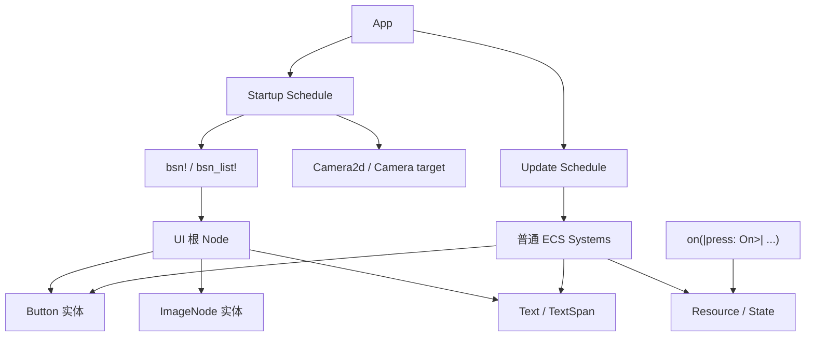
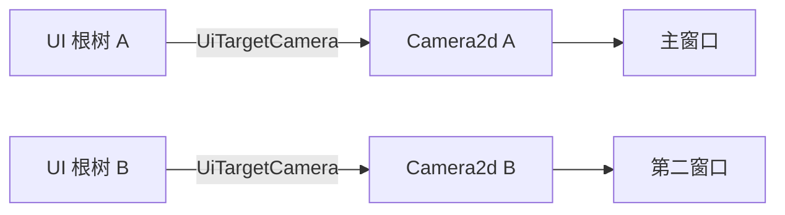

# Bevy 0.19 UI 与 BSN 实战深度教程

## 执行摘要

Bevy 0.19 已于 **2026 年 6 月 19 日**正式发布；这一版本对 UI 学习者最重要的变化，不是某个单独控件，而是 **Next Generation Scenes** 的落地：你现在可以用 `bsn!` 和 `bsn_list!` 以更接近 Rust 语义、但更适合声明式层级 UI 的方式来写场景与界面。官方明确把 BSN 描述为 **可组合、可 patch、依赖感知** 的场景系统，并特别指出这会让 Bevy UI 代码明显更易读、更易写。与此同时，Bevy 0.19 **还没有内置一方 `.bsn` 资产加载器**，因此现阶段最稳妥、最值得掌握的是“**代码驱动的 BSN UI**”工作流。

如果你只想抓住核心，请记住五件事。第一，**UI 还是 ECS**：`Node` 负责布局，`Text`/`ImageNode`/`Button` 负责表现与交互，逻辑仍然由普通 systems、resources、states 驱动。第二，**`bsn!` 负责声明结构**，而不是取代 ECS；你仍然会用 `Query`、`ResMut`、`NextState`、`OnEnter` 等 API 管理行为。第三，**多窗口 UI 的关键是 `UiTargetCamera`**：当有多个 camera / window 时，UI 根节点必须显式绑定渲染目标。第四，**文本 API 在 0.19 有实质变动**：`TextFont.font` 从 `Handle<Font>` 变成 `FontSource`，`font_size` 从 `f32` 变成 `FontSize`。第五，如果你使用 `default-features = false`，从 0.19 开始，`2d` / `3d` **不会再隐式启用 `ui`**，所以要自己把 `ui` feature 加回来。

本文的定位不是“把官网例子翻译一遍”，而是把 GitHub 仓库示例、bevy.org 示例、0.19 发布说明、0.18→0.19 迁移指南与 API 文档，整理成一份 **面向 0.19、实用优先、可直接上手** 的中文教程。所有完整示例都按 **Bevy 0.19 的 API 习惯**来写，并尽量贴近官方 `latest` / 0.19 系示例的写法。Bevy 官方仓库也明确提醒：如果你使用 crates.io 的发布版，应该看 `latest` 或相应的 release tag，而不是盲目照搬 `main` 分支示例。

## 研究范围与来源

按照你的要求，我的检索顺序先从 **`github.com`** 开始，再到 **`bevy.org`**，之后才补充 **`docs.rs`** 等 API 参考源。实际用于本文的高置信来源主要是下表这些域名与内容类型。Bevy 官方示例页与 GitHub 示例源码彼此互相链接，而 docs.rs 负责补足类型定义与迁移时的精确定义。

| 优先顺序 | 站点 | 本文用途 | 代表性证据 |
|---|---|---|---|
| 优先 | `github.com` | 官方仓库示例、`latest` release 示例、迁移草案、0.19 相关源码 | `examples/scene/bsn.rs`、`examples/window/multiple_windows.rs`、迁移草案与 `_release-content` 文档  |
| 优先 | `bevy.org` | 0.19 发布说明、官方 examples、Quick Start、正式 migration guide | `Bevy 0.19`、`button`、`text`、`image-node`、`flex-layout`、`ui-target-camera`、`0.18 to 0.19` 指南  |
| 补充 | `docs.rs` | 0.19 API 细节、类型/宏/trait 行为、scene / state / ui 类型说明 | `bevy::scene`、`Node`、`Button`、`UiTargetCamera`、`UiDebugOptions`、`bevy::state`  |
| 补充 | `crates.io` | 版本发布存在性与连通性佐证 | 0.19 发布公告引用 crates.io 发布信息  |

有两个研究边界需要先说清。其一，Bevy 0.19 的官方重点明显是 **代码内 `bsn!` 工作流**，而不是 `.bsn` 文件工作流；虽然官方已经谈到 scene assets 与未来 `.bsn` 资产格式，但当前版本不附带第一方 `.bsn` loader。其二，UI 文档体系仍在快速演进中：Quick Start、examples、迁移指南已经相当新，但和 0.19 同步的“长篇正式书籍式 UI 教材”还没有完全收敛，因此最稳妥的学习路径仍是：**发布说明 + examples + migration guide + rustdoc**。

## Bevy 0.19 UI 的心智模型

在 0.19 中，理解 UI 的最好方式是把它看成“**ECS + 布局树 + 声明式场景语法**”。`Node` 是布局节点，决定尺寸、布局方向、间距、边框、padding、定位等；`Text`、`ImageNode`、`Button` 等是附加在节点上的能力组件；而 `bsn!` 则把“**给实体加哪些组件、如何生成子节点层级**”这件事写得更短、更适合阅读。官方 `bevy::scene` 文档把 `World::spawn_scene(bsn! { ... })` 视为 0.19 的快速入口，并把 `Scene` / `SceneList` / 场景组合 / patch / observers 统一纳入一套模型中。

GitHub 官方 `latest` 示例 `examples/scene/bsn.rs` 非常能说明这套模型：它直接把 `Camera2d` 和一个 `ui()` scene 放进 `bsn_list!`，再用 `button("Ok")`、`button("Cancel")` 这样的函数式 scene 组合出可复用按钮；点击逻辑并不是写在“控件类”里，而是作为 `on(|_event: On<Pointer<Press>>| ...)` observer 挂在实体上。这说明 BSN 并没有引入一个独立于 ECS 的 UI 框架，它只是让“实体层级声明”更接近组件式 UI 的写法。

发布说明进一步强调了这一点：BSN 本质上就是“Rust-like scene syntax”，它首先等价于“给实体加一组组件”，但额外提供了 **可选字段、组合、patch、依赖跟踪、资产路径内联、观察器** 等能力。对 UI 开发者而言，最直接的收益是：以前需要 `commands.spawn(...).with_children(...)` 一层层展开的问题，现在可以用接近 JSX / SwiftUI / Flutter 层次感的写法表达，但底层仍旧是标准 Bevy ECS。



从 API 选型上，你可以把 0.19 UI 的三种常见写法区分成这样：

| 写法 | 适合场景 | 优点 | 不足 |
|---|---|---|---|
| `commands.spawn(...).with_children(...)` | 小型实验、需要最直接控制时 | 直白、完全 ECS 原生 | 层级一深就很啰嗦  |
| `children![...]` 宏 | 仍然是常规 ECS spawn，但想少写层级样板 | 比 `with_children` 更紧凑 | 仍偏“命令式”  |
| `bsn!` / `bsn_list!` | 0.19 推荐的代码驱动 UI / scene 组织方式 | 更适合复用、组合、observer、patch、场景化组织 | 新系统，仍有粗糙边缘；`.bsn` loader 尚未随 0.19 一起交付  |

一个特别重要、但容易忽略的点是：**`spawn_scene` 与 `queue_spawn_scene` 的差别**。官方 scene 文档说明，`spawn_scene` / `Commands::spawn_scene` 会“**立即解析并立即生成**”，如果依赖资产尚未加载完成会报错；而 `queue_spawn_scene` 会先登记依赖，等依赖就绪后再在 `SpawnScene` 调度中生成。对只写纯代码 UI 的场景，这两者区别不大；但一旦你的 UI scene 含有图片、字体、甚至未来的 scene asset 依赖，`queue_spawn_scene` 会更稳。

## 可运行示例一

下面先给一个**完整可运行**的基础项目：它同时覆盖 **文本、按钮、图片、Flex 布局、样式、按钮事件处理、Resource 状态同步、BSN 声明式结构**。这也是我建议你第一次在 Bevy 0.19 里真正手敲的例子。其风格来自官方 BSN scene 示例、button/text/image/flex-layout 示例的组合，但代码结构已经改造成更适合作为实际项目骨架。

### 共享 Cargo.toml

这一份 `Cargo.toml` 同时服务本文后续三个示例。Bevy 官方 examples README 也建议你在使用发布版时对齐到对应的 release 示例；这里直接按 `bevy = "0.19"` 给出。若你不主动关闭默认特性，那么 UI、窗口、渲染等常用部分都会随 `DefaultPlugins` 一起工作。

```toml
[package]
name = "bevy019-ui-bsn-tutorial"
version = "0.1.0"
edition = "2021"

[dependencies]
bevy = "0.19"

[[bin]]
name = "ui_basics_bsn"
path = "src/bin/ui_basics_bsn.rs"

[[bin]]
name = "ui_states_widgets"
path = "src/bin/ui_states_widgets.rs"

[[bin]]
name = "multi_window_ui"
path = "src/bin/multi_window_ui.rs"
```

### 资源准备

这个示例为了展示 `ImageNode`，约定你在项目根目录放一个 `assets/icon.png`。任意 PNG 都可以；如果你暂时没有图片，也可以把示例里的 `ImageNode` 那一段先注释掉，仅保留布局容器与背景色，代码其余部分仍然成立。Bevy 官方 image-node 示例同样是用 `ImageNode` + `Node` 容器来控制 UI 图像尺寸。

目录建议如下：

```text
bevy019-ui-bsn-tutorial/
├─ Cargo.toml
├─ assets/
│  └─ icon.png
└─ src/
   └─ bin/
      ├─ ui_basics_bsn.rs
      ├─ ui_states_widgets.rs
      └─ multi_window_ui.rs
```

### 完整源码

```rust
use bevy::{prelude::*, ui::widget::NodeImageMode};

fn main() {
    App::new()
        .init_resource::<UiModel>()
        .add_plugins(DefaultPlugins)
        .add_systems(Startup, app_scene.spawn())
        .add_systems(Update, (button_system, sync_texts))
        .run();
}

#[derive(Resource, Default, Debug)]
struct UiModel {
    count: i32,
    status: String,
}

#[derive(Clone, Copy, Debug, Eq, PartialEq, Default)]
enum ButtonKind {
    #[default]
    Increment,
    Reset,
}

#[derive(Component, Clone, Copy, Default)]
struct ActionButton(ButtonKind);

#[derive(Component, Clone, Default)]
struct CounterText;

#[derive(Component, Clone, Default)]
struct StatusText;

fn app_scene() -> impl SceneList {
    bsn_list![
        Camera2d,
        ui_root(),
    ]
}

fn ui_root() -> impl Scene {
    bsn! {
        Node {
            width: percent(100),
            height: percent(100),
            flex_direction: FlexDirection::Column,
            padding: UiRect::all(px(24.0)),
            row_gap: px(18.0),
        }
        BackgroundColor(Color::srgb(0.08, 0.09, 0.11))
        Children [
            (
                Text("Bevy 0.19 UI + BSN 基础示例"),
                TextFont {
                    font_size: px(30.0),
                },
                TextColor(Color::WHITE),
            ),
            (
                Text("同一个界面里演示 Text / Button / ImageNode / Flex / ECS 状态同步"),
                TextFont {
                    font_size: px(16.0),
                },
                TextColor(Color::srgb(0.75, 0.78, 0.84)),
            ),
            (
                Node {
                    width: percent(100),
                    flex_grow: 1.0,
                    flex_direction: FlexDirection::Row,
                    column_gap: px(20.0),
                    align_items: AlignItems::Stretch,
                }
                Children [
                    (
                        Node {
                            width: px(260.0),
                            padding: UiRect::all(px(12.0)),
                            border: px(2.0),
                            justify_content: JustifyContent::Center,
                            align_items: AlignItems::Center,
                        },
                        BorderColor::from(Color::srgb(0.30, 0.34, 0.40)),
                        BackgroundColor(Color::srgb(0.12, 0.13, 0.16)),
                        ImageNode {
                            image: "icon.png",
                            image_mode: NodeImageMode::Stretch,
                        },
                    ),
                    (
                        Node {
                            flex_grow: 1.0,
                            flex_direction: FlexDirection::Column,
                            row_gap: px(12.0),
                            padding: UiRect::all(px(16.0)),
                            border: px(2.0),
                        },
                        BorderColor::from(Color::srgb(0.30, 0.34, 0.40)),
                        BackgroundColor(Color::srgb(0.12, 0.13, 0.16)),
                        Children [
                            (
                                Text("计数器状态"),
                                TextFont {
                                    font_size: px(22.0),
                                },
                                TextColor(Color::WHITE),
                            ),
                            (
                                Text("0"),
                                CounterText,
                                TextFont {
                                    font_size: px(48.0),
                                },
                                TextColor(Color::srgb(0.45, 0.85, 0.60)),
                            ),
                            (
                                Text("尚未发生交互"),
                                StatusText,
                                TextFont {
                                    font_size: px(18.0),
                                },
                                TextColor(Color::srgb(0.85, 0.85, 0.88)),
                            ),
                            (
                                Node {
                                    flex_direction: FlexDirection::Row,
                                    column_gap: px(12.0),
                                    margin: UiRect::top(px(8.0)),
                                }
                                Children [
                                    basic_button("增加", ButtonKind::Increment),
                                    basic_button("重置", ButtonKind::Reset),
                                ]
                            ),
                            (
                                Text("左侧是 ImageNode；右侧是典型 Flex 布局容器。按钮的点击由 ECS system 处理。"),
                                TextFont {
                                    font_size: px(15.0),
                                },
                                TextColor(Color::srgb(0.70, 0.73, 0.80)),
                            ),
                        ]
                    ),
                ]
            ),
        ]
    }
}

fn basic_button(label: &str, kind: ButtonKind) -> impl Scene {
    let base_color = match kind {
        ButtonKind::Increment => Color::srgb(0.18, 0.36, 0.24),
        ButtonKind::Reset => Color::srgb(0.36, 0.18, 0.18),
    };

    bsn! {
        Button
        ActionButton(kind)
        Node {
            width: px(150.0),
            height: px(52.0),
            padding: UiRect::axes(px(14.0), px(8.0)),
            border: px(2.0),
            border_radius: BorderRadius::MAX,
            justify_content: JustifyContent::Center,
            align_items: AlignItems::Center,
        }
        BorderColor::from(Color::BLACK)
        BackgroundColor(base_color)
        Children [(
            Text(label),
            TextFont {
                font_size: px(20.0),
            },
            TextColor(Color::WHITE),
        )]
    }
}

fn button_system(
    mut model: ResMut<UiModel>,
    mut query: Query<
        (&Interaction, &mut BackgroundColor, &ActionButton),
        (Changed<Interaction>, With<Button>),
    >,
) {
    for (interaction, mut background, action) in &mut query {
        match *interaction {
            Interaction::Pressed => {
                match action.0 {
                    ButtonKind::Increment => {
                        model.count += 1;
                        model.status = format!("点击了“增加”，count = {}", model.count);
                    }
                    ButtonKind::Reset => {
                        model.count = 0;
                        model.status = "点击了“重置”，count 已清零".to_string();
                    }
                }

                *background = BackgroundColor(Color::srgb(0.85, 0.72, 0.20));
            }
            Interaction::Hovered => {
                *background = BackgroundColor(Color::srgb(0.35, 0.35, 0.40));
            }
            Interaction::None => {
                *background = match action.0 {
                    ButtonKind::Increment => BackgroundColor(Color::srgb(0.18, 0.36, 0.24)),
                    ButtonKind::Reset => BackgroundColor(Color::srgb(0.36, 0.18, 0.18)),
                };
            }
        }
    }
}

fn sync_texts(
    model: Res<UiModel>,
    mut counter_query: Query<&mut Text, With<CounterText>>,
    mut status_query: Query<&mut Text, (With<StatusText>, Without<CounterText>)>,
) {
    if !model.is_changed() {
        return;
    }

    for mut text in &mut counter_query {
        **text = model.count.to_string();
    }

    for mut text in &mut status_query {
        **text = model.status.clone();
    }
}
```

运行命令：

```bash
cargo run --bin ui_basics_bsn
```

### 代码拆解

这个示例的关键不是“按钮能点”，而是你能看清 **BSN 负责声明，systems 负责行为** 的分界线。`app_scene()` 返回 `impl SceneList`，并由 `.add_systems(Startup, app_scene.spawn())` 一次性生成；这正是官方 `latest/examples/scene/bsn.rs` 的典型模式。

UI 根节点本身就是一个 `Node`。Bevy 官方 `Node` 文档与 Flex Layout 示例都表明：宽高、`flex_direction`、`align_items`、`justify_content`、`padding`、`row_gap`、`column_gap` 等布局属性全部都放在 `Node` 上，而不是某个单独的“Style 对象”里；从旧版教程迁移过来时，这个认知非常重要。

左侧图片面板之所以能工作，是因为 `ImageNode` 本身就是“能把图像渲染到 UI 节点上的组件”，而图像的最终尺寸由同实体上的 `Node` 约束。官方 image-node 示例也是相同思路：根容器负责居中，带 `ImageNode` 的子节点负责具体图像显示。对于纹理拉伸 / 九宫格 / 平铺，0.19 统一由 `NodeImageMode` 控制。

按钮部分刻意没用 observer，而是用了 `Query<..., (Changed<Interaction>, With<Button>)>`。原因不是 observer 不好，而是这更能体现“**BSN 只是声明视图树；事件处理仍然完全可以走传统 ECS**”。官方 button 示例就是这样处理 `Interaction`、`BackgroundColor`、`BorderColor` 与子文本的。另一方面，官方 BSN 示例又展示了 `on(|_: On<Pointer<Press>>| ...)` 这种更贴近组件式 UI 的写法；两种方式在 0.19 都是合法的、值得掌握的。

状态同步部分则体现了最实用的 Resource 模式：系统修改 `UiModel`，`sync_texts` 再依据 change detection 更新 `Text`。Bevy Quick Start 对 resources 的描述很明确：`Res` / `ResMut` 用于全局单例数据，而 systems 则是操作资源与组件的普通 Rust 函数。这也是为什么 UI 状态管理在 Bevy 里通常不是“某控件内置 setState”，而是 **resource / state + systems + queries**。

## 可运行示例二

如果示例一回答的是“怎么在 0.19 里写出一个像样的界面”，那么示例二回答的是“**怎么把界面组织成可维护的 widget 与 screen**”。这一节重点展示两件事：其一，**可复用 widget 最低风险的做法是“函数返回 `impl Scene` / `impl SceneList`”**；其二，真正的屏幕切换应该用 Bevy 内建的 `States`、`NextState`、`in_state`、`OnEnter` / `OnExit` 思维来组织，而不是把整个 UI 逻辑塞进一个巨大的 update system。Bevy 官方状态系统文档明确把它推荐给菜单、加载页、暂停态等场景。

### 完整源码

```rust
use bevy::prelude::*;

fn main() {
    App::new()
        .init_resource::<ThemeSettings>()
        .init_state::<AppScreen>()
        .add_plugins(DefaultPlugins)
        .add_systems(Startup, setup_camera_and_ui)
        .add_systems(
            Update,
            (
                apply_screen_visibility,
                nav_button_system,
                apply_theme,
            ),
        )
        .run();
}

#[derive(States, Debug, Clone, Copy, Eq, PartialEq, Hash, Default)]
enum AppScreen {
    #[default]
    Menu,
    Settings,
    Playing,
}

#[derive(Resource, Debug)]
struct ThemeSettings {
    dark_mode: bool,
}

impl Default for ThemeSettings {
    fn default() -> Self {
        Self { dark_mode: true }
    }
}

#[derive(Component, Clone, Copy)]
struct ScreenPanel(AppScreen);

#[derive(Component, Clone, Copy)]
struct NavButton(AppScreen);

#[derive(Component, Clone, Copy, Default)]
struct ToggleThemeButton;

#[derive(Component, Clone, Copy, Default)]
struct ThemePreview;

fn setup_camera_and_ui(mut commands: Commands) {
    commands.spawn(Camera2d);
    commands.spawn_scene(app_ui());
}

fn app_ui() -> impl Scene {
    bsn! {
        Node {
            width: percent(100),
            height: percent(100),
            justify_content: JustifyContent::Center,
            align_items: AlignItems::Center,
        }
        BackgroundColor(Color::srgb(0.08, 0.09, 0.11))
        Children [
            menu_panel(),
            settings_panel(),
            playing_panel(),
        ]
    }
}

fn panel_shell(screen: AppScreen, title: &str, body: impl SceneList) -> impl Scene {
    bsn! {
        ScreenPanel(screen)
        Node {
            width: px(520.0),
            padding: UiRect::all(px(20.0)),
            border: px(2.0),
            flex_direction: FlexDirection::Column,
            row_gap: px(12.0),
        }
        BorderColor::from(Color::srgb(0.30, 0.34, 0.40))
        BackgroundColor(Color::srgb(0.14, 0.16, 0.20))
        Children [
            (
                Text(title),
                TextFont {
                    font_size: px(28.0),
                },
                TextColor(Color::WHITE),
            ),
            {body},
        ]
    }
}

fn menu_panel() -> impl Scene {
    panel_shell(
        AppScreen::Menu,
        "主菜单",
        bsn_list![
            (
                Text("这里演示“可复用 widget + 内建 States”组合。"),
                TextFont {
                    font_size: px(16.0),
                },
                TextColor(Color::srgb(0.78, 0.80, 0.86)),
            ),
            nav_button("开始游戏", AppScreen::Playing),
            nav_button("打开设置", AppScreen::Settings),
        ],
    )
}

fn settings_panel() -> impl Scene {
    panel_shell(
        AppScreen::Settings,
        "设置",
        bsn_list![
            (
                Text("点击按钮可切换主题色；这部分状态放在 Resource 里。"),
                TextFont {
                    font_size: px(16.0),
                },
                TextColor(Color::srgb(0.78, 0.80, 0.86)),
            ),
            (
                Node {
                    width: percent(100),
                    height: px(80.0),
                    border: px(2.0),
                    justify_content: JustifyContent::Center,
                    align_items: AlignItems::Center,
                },
                ThemePreview,
                BorderColor::from(Color::BLACK),
                BackgroundColor(Color::srgb(0.20, 0.22, 0.26)),
                Children [(
                    Text("主题预览"),
                    TextFont {
                        font_size: px(20.0),
                    },
                    TextColor(Color::WHITE),
                )]
            ),
            toggle_theme_button("切换明暗主题"),
            nav_button("返回主菜单", AppScreen::Menu),
        ],
    )
}

fn playing_panel() -> impl Scene {
    panel_shell(
        AppScreen::Playing,
        "游戏中",
        bsn_list![
            (
                Text("真实项目里，这里通常会换成 HUD / 暂停菜单 / 游戏内面板。"),
                TextFont {
                    font_size: px(16.0),
                },
                TextColor(Color::srgb(0.78, 0.80, 0.86)),
            ),
            nav_button("返回主菜单", AppScreen::Menu),
            nav_button("进入设置", AppScreen::Settings),
        ],
    )
}

fn nav_button(label: &str, target: AppScreen) -> impl Scene {
    bsn! {
        Button
        NavButton(target)
        Node {
            width: percent(100),
            height: px(46.0),
            border: px(2.0),
            border_radius: BorderRadius::MAX,
            justify_content: JustifyContent::Center,
            align_items: AlignItems::Center,
        }
        BorderColor::from(Color::BLACK)
        BackgroundColor(Color::srgb(0.20, 0.32, 0.46))
        Children [(
            Text(label),
            TextFont {
                font_size: px(18.0),
            },
            TextColor(Color::WHITE),
        )]
    }
}

fn toggle_theme_button(label: &str) -> impl Scene {
    bsn! {
        Button
        ToggleThemeButton
        Node {
            width: percent(100),
            height: px(46.0),
            border: px(2.0),
            border_radius: BorderRadius::MAX,
            justify_content: JustifyContent::Center,
            align_items: AlignItems::Center,
        }
        BorderColor::from(Color::BLACK)
        BackgroundColor(Color::srgb(0.36, 0.24, 0.16))
        Children [(
            Text(label),
            TextFont {
                font_size: px(18.0),
            },
            TextColor(Color::WHITE),
        )]
    }
}

fn apply_screen_visibility(
    current: Res<State<AppScreen>>,
    mut panels: Query<(&ScreenPanel, &mut Node)>,
) {
    let active = *current.get();

    for (screen_panel, mut node) in &mut panels {
        node.display = if screen_panel.0 == active {
            Display::Flex
        } else {
            Display::None
        };
    }
}

fn nav_button_system(
    mut next_state: ResMut<NextState<AppScreen>>,
    mut theme: ResMut<ThemeSettings>,
    mut query: Query<
        (
            &Interaction,
            &mut BackgroundColor,
            Option<&NavButton>,
            Option<&ToggleThemeButton>,
        ),
        (Changed<Interaction>, With<Button>),
    >,
) {
    for (interaction, mut color, nav, toggle_theme) in &mut query {
        match *interaction {
            Interaction::Pressed => {
                if let Some(nav) = nav {
                    next_state.set(nav.0);
                }
                if toggle_theme.is_some() {
                    theme.dark_mode = !theme.dark_mode;
                }
                *color = BackgroundColor(Color::srgb(0.82, 0.70, 0.22));
            }
            Interaction::Hovered => {
                *color = BackgroundColor(Color::srgb(0.38, 0.38, 0.42));
            }
            Interaction::None => {
                *color = if toggle_theme.is_some() {
                    BackgroundColor(Color::srgb(0.36, 0.24, 0.16))
                } else {
                    BackgroundColor(Color::srgb(0.20, 0.32, 0.46))
                };
            }
        }
    }
}

fn apply_theme(
    theme: Res<ThemeSettings>,
    mut previews: Query<&mut BackgroundColor, With<ThemePreview>>,
) {
    if !theme.is_changed() {
        return;
    }

    let new_color = if theme.dark_mode {
        Color::srgb(0.18, 0.20, 0.24)
    } else {
        Color::srgb(0.85, 0.86, 0.90)
    };

    for mut background in &mut previews {
        *background = BackgroundColor(new_color);
    }
}
```

运行命令：

```bash
cargo run --bin ui_states_widgets
```

### 为什么这是 Bevy 风格的可复用 UI

这个例子最值得你模仿的不是具体颜色或布局，而是 **`panel_shell` / `nav_button` / `toggle_theme_button` 这些函数式 widget**。Bevy 官方 scene 文档明确说明：你可以把普通 Rust 函数当成 scene constructor，用参数化函数返回 `impl Scene` 或 `impl SceneList`；还可以把 `SceneList` 通过 `{contents}` 插入另一个 scene 中，这使得“用函数封装可复用控件”在 0.19 成为天然写法。

另一个关键点是状态管理分层。这里把“当前屏幕”放在 `State<AppScreen>` / `NextState<AppScreen>`，把“主题是否深色”放在普通 `Resource`，这样你能清晰地区分：**screen 切换**属于调度与生命周期层，**主题**属于全局 UI 配置层。Bevy 状态系统提供 `OnEnter`、`OnExit`、`OnTransition` 与 `in_state` 等调度能力，本质上就是为了菜单、暂停、加载页这类切换而设计的。这里为了把示例控制在最小复杂度，我选择了“预先生成所有 panel，再按 state 切换 `Node.display`”的方式；实际项目里也完全可以改成 `OnEnter` 生成、`OnExit` 销毁。

需要特别提醒的是：对于“正式 widget 类型”，Bevy 0.19 还引入了更强的 `SceneComponent` 机制，适合做层级更复杂、需要 patch / props / asset path 的组件；但 scene 文档本身也强调，`SceneComponent` 更重、更动态、层级能力更强，而 required components 更适合扁平初始化。因此在应用层 UI 中，**先学会函数式 widget，再逐步进阶到 `SceneComponent`**，通常是风险最低的路径。

## 可运行示例三

多窗口是 Bevy UI 真正开始“工程化”时很容易踩坑的主题。官方 `multiple_windows.rs` 示例已经把最核心的事实说得很清楚：一旦你有多个 camera / window，就要在 UI 根节点上用 **`UiTargetCamera(camera_entity)`** 明确指定“这棵 UI 树渲染到哪个 camera”，否则 UI 会按默认规则绑定到默认 UI camera。官方 rustdoc 也进一步说明了这一点：`UiTargetCamera` 只对根节点生效；没有显式 `UiTargetCamera` 的根节点，会发往默认 UI camera，而默认 camera 可能是带 `IsDefaultUiCamera` 标记的相机，或者是“指向主窗口的最高 order 相机”。

### 完整源码

```rust
use bevy::{camera::RenderTarget, prelude::*, window::WindowRef};

fn main() {
    App::new()
        .add_plugins(DefaultPlugins)
        .add_systems(Startup, setup)
        .add_systems(Update, update_window_titles_on_resize)
        .run();
}

fn setup(mut commands: Commands) {
    // 主窗口的 2D 相机
    let primary_camera = commands.spawn(Camera2d).id();

    // 创建第二个窗口
    let second_window = commands
        .spawn(Window {
            title: "工具窗口".to_owned(),
            ..default()
        })
        .id();

    // 第二个窗口对应的 2D 相机
    let second_camera = commands
        .spawn((
            Camera2d,
            RenderTarget::Window(WindowRef::Entity(second_window)),
        ))
        .id();

    // 绑定到主窗口相机的 UI
    commands.spawn_scene(window_overlay(
        "主窗口 UI",
        "这棵 UI 树显式绑定到主窗口相机",
        primary_camera,
        Color::srgb(0.16, 0.22, 0.34),
    ));

    // 绑定到第二窗口相机的 UI
    commands.spawn_scene(window_overlay(
        "工具窗口 UI",
        "这棵 UI 树显式绑定到第二窗口相机",
        second_camera,
        Color::srgb(0.34, 0.22, 0.16),
    ));
}

fn window_overlay(
    title: &str,
    subtitle: &str,
    target_camera: Entity,
    color: Color,
) -> impl Scene {
    bsn! {
        UiTargetCamera(target_camera)
        Node {
            position_type: PositionType::Absolute,
            top: px(12.0),
            left: px(12.0),
            width: px(340.0),
            padding: UiRect::all(px(14.0)),
            border: px(2.0),
            flex_direction: FlexDirection::Column,
            row_gap: px(8.0),
        }
        BorderColor::from(Color::BLACK)
        BackgroundColor(color)
        Children [
            (
                Text(title),
                TextFont {
                    font_size: px(24.0),
                },
                TextColor(Color::WHITE),
            ),
            (
                Text(subtitle),
                TextFont {
                    font_size: px(15.0),
                },
                TextColor(Color::srgb(0.92, 0.92, 0.94)),
            ),
            (
                Text("拖动、缩放任意窗口，标题会自动更新。"),
                TextFont {
                    font_size: px(14.0),
                },
                TextColor(Color::srgb(0.86, 0.86, 0.90)),
            ),
        ]
    }
}

fn update_window_titles_on_resize(
    mut resize_reader: MessageReader<WindowResized>,
    mut windows: Query<&mut Window>,
) {
    for event in resize_reader.read() {
        if let Ok(mut window) = windows.get_mut(event.window) {
            window.title = format!(
                "{} - {:.0} x {:.0}",
                window.title,
                event.width,
                event.height
            );
        }
    }
}
```

运行命令：

```bash
cargo run --bin multi_window_ui
```

### 多窗口 UI 的真正关键

这个例子最重要的一行就是：

```rust
UiTargetCamera(target_camera)
```

官方 `UiTargetCamera` 文档已经说得很明确：它告诉 **根 `Node`** 这棵 UI 应该按哪台 camera 的 viewport / scale factor / render target 做布局和渲染；如果你把它加在非根节点上，是不会生效的。换句话说，多窗口 UI 的本质不是“给窗口加个 panel”，而是“**给目标 camera 绑定一棵 UI 根树**”。

官方 `multiple_windows.rs` 示例还说明了另一半：第二窗口本身只是一个带 `Window` 组件的实体，而真正把内容送进去的是渲染目标为 `RenderTarget::Window(WindowRef::Entity(second_window))` 的相机。你要把这两个实体——**Window 实体**与**Camera 实体**——分开理解。UI 绑定的是 camera，不是 window；camera 再绑定到 window。



如果你的项目里有多个 camera 但只想给其中某一个设为默认 UI camera，那么 `IsDefaultUiCamera` 就很有用；官方文档明确指出，这是在存在多个 camera 时避免每棵 UI 根都手写 `UiTargetCamera` 的一种办法。不过在多窗口项目里，我仍然建议优先显式写 `UiTargetCamera`，因为它更不容易让后续维护者产生歧义。

## ECS 集成与工程结构

Bevy 官方 Quick Start 对 `App`、`ECS`、`Resources`、`Plugins` 的定义非常朴素，但正是 UI 工程化最稳定的基础：`App` 负责装配世界与调度，`World` 储存实体/组件/资源，systems 是普通 Rust 函数，plugins 是可组合的应用模块。UI 项目一旦超过单文件，最推荐的结构不是“按控件名胡乱拆”，而是沿着 **插件、屏幕、widget、状态、窗口** 这几个维度分层。

一个适合 0.19 UI 项目的目录，大致可以长这样：

```text
src/
├─ main.rs                # 只做 App 装配
├─ app.rs                 # 顶层插件注册
├─ state.rs               # AppScreen / 主题 / 全局 settings
├─ ui/
│  ├─ mod.rs              # UiPlugin
│  ├─ widgets.rs          # 通用 scene/widget 函数
│  ├─ screens.rs          # Menu / Settings / HUD 等 screen 组装
│  ├─ systems.rs          # Interaction / sync / visibility 更新
│  └─ theme.rs            # 颜色、间距、字号常量
└─ windows/
   ├─ mod.rs              # 多窗口逻辑插件
   └─ systems.rs          # 创建窗口、camera、UI target 绑定
```

这种结构的好处在于：`widgets.rs` 专注“**用 `bsn!` 描述一个可复用部件**”，`systems.rs` 专注“**如何用 Query / Res / Events 驱动它**”，而 `screens.rs` 才负责“**把多个 widget 组合成完整页面**”。这和官方 scene 文档中的组合思想完全一致：scene 本来就应该是可组合的，函数返回 `impl Scene` / `impl SceneList` 就是最自然的复用单元。

关于状态与事件的分工，一个很实用的经验是：

| 问题类型 | 更适合放哪里 | 原因 |
|---|---|---|
| 当前屏幕是菜单还是游戏内 | `State<T>` / `NextState<T>` | 它影响调度、可见性、生命周期  |
| 当前主题、语言、设置值 | `Resource` | 它是全局单例配置，多个系统都要读写  |
| 某个按钮正在 Hover / Pressed | 组件查询：`Interaction` / `Button` / `BackgroundColor` | 它是实体局部状态，适合 Query 驱动  |
| 点击后要触发局部逻辑 | <code>on(&#124;press: On&lt;Pointer&lt;Press&gt;&gt;&#124; ...)</code> observer | 非常适合 scene 内联逻辑与局部行为封装  |
| 点击后要影响全局状态 | ordinary system + `ResMut` / `NextState` | 便于测试、日志、扩展与串联更多逻辑  |

这里还要补一个经常被误解的点：**BSN 不是“取代 plugin / system / resource 的第四套抽象”**。官方 scene 文档把 BSN 放进的是 scene 系统，而不是 app 层本身；它让“生成与组合实体层级”更强大，但不会让调度、状态机、资源、窗口管理这些事情消失。真正成熟的 Bevy UI 项目，通常恰恰是把这些界限分得更清楚。

## 常见坑、调试、性能与迁移

### 常见坑

**第一坑：把 0.18 或更早版本的文本代码直接粘到 0.19。** 官方 0.18→0.19 指南明确写到，`TextFont.font` 从 `Handle<Font>` 变成了 `FontSource`，`font_size` 从 `f32` 变成了 `FontSize`；旧代码要么显式 `.into()`，要么改成 `FontSize::Px(...)`。同时，`TextLayout::new_with_justify` 这一类构造器也改成了 `TextLayout::justify` / `linebreak` / `no_wrap`。

**第二坑：关闭默认特性以后忘记手动启用 `ui`。** 0.19 官方迁移指南单列了一条：`ui` feature 不再由 `2d` 或 `3d` 隐式带出。如果你用 `default-features = false`，又只手动开了 `2d` 或 `3d`，那 UI 相关类型和插件行为就可能直接缺失。默认特性用户不受影响，但裁剪 feature 的项目必须特别注意。

**第三坑：误以为 0.19 已经具备完整 `.bsn` 文件工作流。** 发布说明和 scene 文档都反复强调：0.19 的重点是代码中的 `bsn!`，虽然 scene asset 方向已经铺路，但**官方尚未随 0.19 提供第一方 `.bsn` loader**。所以当前教程、项目模板、团队规范，最好都以代码驱动 BSN 为基础。

**第四坑：多窗口场景没有给 UI 根写 `UiTargetCamera`。** 官方 multiple windows 示例与 `UiTargetCamera` 文档都说明了，这是多窗口 UI 不显示、显示错窗、缩放不对的首要原因之一。对多 camera / 多 viewport 项目尤其如此。

### 调试建议

Bevy 0.19 已经给了比很多人想象中更好的 UI 调试工具。`UiDebugOptions` 可以开启 UI debug overlay，并能分别显示 border box / padding box / content box / scrollbar 区域，还能控制线宽、显示被裁剪节点、忽略圆角等；0.19 迁移指南还特别提到它新增了一批字段，所以从旧版迁移时要注意默认行为变化。

如果你更想看“布局树到底被解算成什么样子”，官方还在 `bevy::ui::debug` 模块中提供了 `print_ui_layout_tree` 这类调试函数；而如果你想从更宏观角度看 UI 帧时问题，则可以配合官方的 FPS / diagnostics overlay 工具。这里一个务实建议是：**先用 `UiDebugOptions` 看盒模型，再用日志/FPS overlay 看性能，再回头检查是否某个系统在高频重建文本或重建整棵 UI 树。**

### 性能建议

最实用的性能原则只有三条。第一，**不要每帧重建 UI 实体树**；应当在 `Startup`、`OnEnter` 或“某次结构性变化时”生成，然后只更新必要组件。第二，**把“结构变化”和“数据变化”分开**：结构尽量用 `bsn!` / scene 函数稳定生成，数据显示靠 resources / states / queries 小范围更新。第三，**一旦 scene 含有资产依赖，就考虑 `queue_spawn_scene`**，因为 scene 系统本身是依赖感知的，硬用立即 spawn 在复杂项目里更容易踩加载时序问题。前两条是基于 Bevy ECS 与 scene 模型的工程推论，第三条则直接来自官方 scene 文档。

更进一步地说，官方 scene 文档把 “required components” 与 “scene components” 的取舍也讲得很清楚：前者更轻、更适合扁平初始化与高性能场景；后者更适合层级、依赖、可 patch 的复杂对象。对 UI 而言，这给出一条很重要的经验法则：**越像“控件树”的东西，越适合 scene / BSN；越像“扁平样式标签”的东西，越适合普通组件。** 这也是避免 UI 抽象过重、抽象过早的关键。

### 从旧版迁移到 0.19 的重点清单

下面这张表，基本覆盖了 Bevy UI 用户从旧版迁移到 0.19 时最值得先检查的点：

| 旧认知 / 旧写法 | 0.19 新写法 / 新认知 | 影响面 |
|---|---|---|
| `TextFont { font: Handle<Font>, font_size: 35.0 }` | `TextFont { font: handle.into(), font_size: FontSize::Px(35.0) }` | 所有文本 UI  |
| `TextLayout::new_with_justify(...)` | `TextLayout::justify(...)` | 文本布局代码  |
| 旧 `bevy_scene` 指向旧场景序列化系统 | 新 `bevy::scene` / `bevy_scene` 主要承载 BSN；旧系统改名为 `bevy_world_serialization` | scene / GLTF / world serialization 相关代码  |
| 复杂 UI 主要靠 `spawn + with_children` | 0.19 新推荐是代码驱动 `bsn!` / `bsn_list!` | 新项目 UI 架构  |
| 多窗口 UI 常靠默认行为“碰运气” | 用 `UiTargetCamera` 显式指定根 UI 的目标 camera | 多窗口 / 多 camera UI  |
| `2d` / `3d` 会自动带出 `ui` | `ui` 不再由 `2d` / `3d` 隐式启用 | `default-features = false` 项目  |
| `UiDebugOptions` 字段较少 | 0.19 新增盒模型相关布尔字段 | 调试 overlay 行为  |
| `Node` 没有 inline direction | `Node::direction` 新增，默认 `InlineDirection::Ltr` | 国际化 / inline 布局细节  |
| Feathers widget 主要用旧 spawning 函数 | 迁移中明确提出 **BSN 将成为 Feathers 的主要创建方式** | 编辑器/工具型 UI  |

### 开放问题与局限

有两点我建议你在实际项目里保持“已知未完全定型”的心理预期。第一，**BSN 方向是 0.19 的大主线，但仍然年轻**；发布说明自己就说了，未来几个版本还会继续打磨体验，因此你在抽象 widget API 时应保持适度保守。第二，本文所有完整示例都优先选择了“**函数式 widget + 普通 ECS state/resource/system**”这条高稳定路线，而没有把 `SceneComponent` 作为主角，因为这更容易落地，也更接近今天 Bevy 官方 examples 的学习曲线。前者是官方明示，后者是本文的教学取舍。

## API 速查表

最后给你一张 0.19 UI / BSN 常用 API 的速查表。它不是 rustdoc 的替代品，但足够做“写代码时的桌边索引”。

| API / 宏 / 类型 | 0.19 中的角色 | 你通常把它放在哪里 | 与旧习惯相比最重要的变化 |
|---|---|---|---|
| `bsn!` | 声明单个 entity scene | widget、panel、HUD、小型 UI 树 | 0.19 核心新增能力；代码驱动 UI 的首选入口  |
| `bsn_list!` | 声明多个根实体 | app 根 scene、screen 组合 | 适合一次生成 camera + UI 多根实体  |
| `Scene` / `SceneList` | 场景抽象 | `fn widget() -> impl Scene` 等 | UI 复用从 bundle/helper function 升级到 scene function 思维  |
| `.spawn()` | 把 scene 函数变成 system | `add_systems(Startup, my_scene.spawn())` | 0.19 官方推荐的 scene 启动方式之一  |
| `spawn_scene` | 立即生成 scene | startup / enter-state / 命令响应 | 依赖未就绪会失败  |
| `queue_spawn_scene` | 排队等待依赖后生成 | 含图片/字体/scene asset 依赖的 scene | 更稳妥的带依赖生成方式  |
| `Node` | UI 布局与盒模型核心 | 几乎所有 UI 实体 | 直接承载 Flex / 盒模型字段，新加 `direction` 字段  |
| `Text` / `TextSpan` | 文本与子 span | 标题、标签、多段文本 | `TextSpan` 仍然是多段文本的重要手段  |
| `TextFont` | 字体来源与字号 | 所有文本 UI | `font`→`FontSource`，`font_size`→`FontSize`  |
| `TextLayout` | 对齐、换行等排版 | 多行文本、标题等 | 构造器改名为 `justify` / `linebreak` / `no_wrap`  |
| `Button` | 无头按钮 widget | 可点击 UI 实体 | 负责 pressed 状态与 activate 语义，样式仍靠 `Node` / `BackgroundColor` 等  |
| `Interaction` | hover / press / none 状态 | ECS 按钮 system | 仍然是最实用的 system 驱动交互入口  |
| <code>on()</code> + <code>On&lt;Pointer&lt;Press&gt;&gt;</code> | entity observer | 局部点击逻辑、scene 内联行为 | 0.19 BSN 场景写法的亮点之一  |
| `ImageNode` | 在 UI 节点上显示图像 | 图标、面板、装饰图片 | `Node` 控制尺寸，`NodeImageMode` 控制缩放策略  |
| `UiTargetCamera` | 指定根 UI 渲染到哪个 camera | 多窗口 / 多 viewport UI 根节点 | 多窗口 UI 的关键组件；只对根节点有效  |
| `IsDefaultUiCamera` | 指定默认 UI camera | 多 camera 但不想处处写 `UiTargetCamera` 时 | 适合替换默认规则，但不如显式绑定直观  |
| `States` / `NextState` / `in_state` | 内建状态机 | 菜单、暂停、设置页、加载页 | 是 Bevy 屏幕切换的标准方案，不是外挂模式  |
| `UiDebugOptions` | UI 调试 overlay | 调试节点 / 全局 UI overlay | 0.19 新增多项盒模型相关字段  |

如果你要把上面的内容压缩成一句实践建议，那就是：**在 Bevy 0.19 里，把 UI 当成 ECS，把结构写成 `bsn!`，把交互写成 systems / observers，把屏幕切换交给 States，把多窗口绑定交给 `UiTargetCamera`。** 这是当前官方资料能支持的、最稳、也最能长期迁移的工作流。
